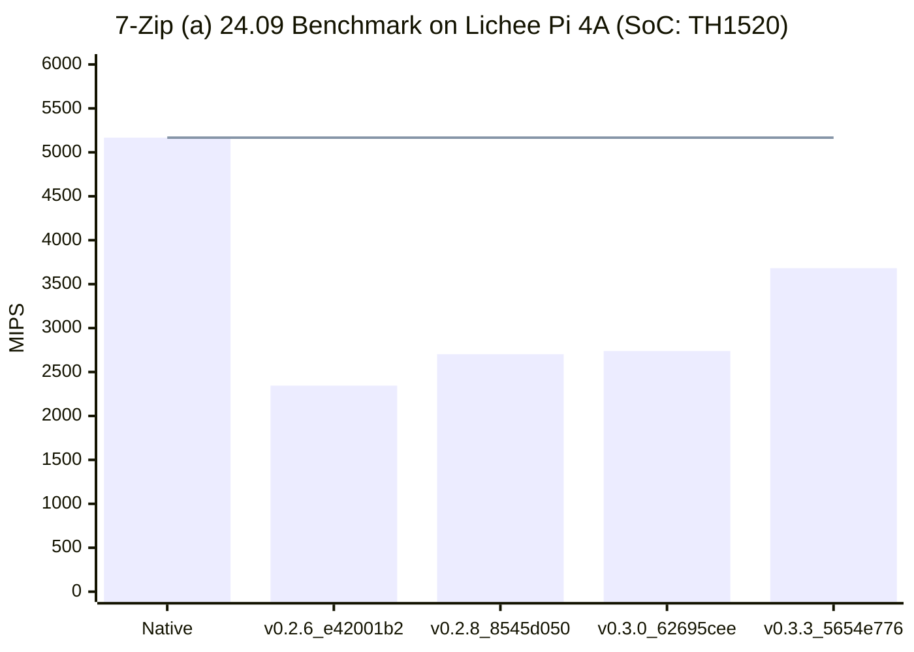

# `7z b` on Lichee Pi 4A

Hardware: [Lichee Pi 4A](/docs/hardwares#lichee-pi-4a-soc-th1520)



## Running Log

### Native
```shell
debian@revyos-lpi4a:~$ ./7z_risc-v/7z b

7-Zip (a) 24.09 (riscv64) : Copyright (c) 1999-2024 Igor Pavlov : 2024-11-29
 64-bit locale=zh_CN.UTF-8 Threads:4 OPEN_MAX:1024

Compiler:  ver:14.2.0 GCC 14.2.0
Linux : 6.6.66-th1520 : #2025.01.10.02.53+1c6721ec2 SMP Fri Jan 10 03:09:24 UTC 2025 : riscv64
PageSize:4KB THP:always hwcap:112D
riscv64

1T CPU Freq (MHz):  1834  1842  1841  1841  1836  1841  1840
2T CPU Freq (MHz): 197% 1818   199% 1838
4T CPU Freq (MHz): 385% 1769   394% 1807

RAM size:   15814 MB,  # CPU hardware threads:   4
RAM usage:    889 MB,  # Benchmark threads:      4

                       Compressing  |                  Decompressing
Dict     Speed Usage    R/U Rating  |      Speed Usage    R/U Rating
         KiB/s     %   MIPS   MIPS  |      KiB/s     %   MIPS   MIPS

22:       3741   290   1254   3640  |      76701   386   1697   6544
23:       3635   291   1271   3704  |      75307   386   1689   6516
24:       3544   293   1302   3811  |      75886   394   1691   6660
25:       3447   290   1358   3937  |      73337   389   1678   6527
----------------------------------  | ------------------------------
Avr:      3592   291   1296   3773  |      75307   389   1689   6562
Tot:             340   1492   5167
```

### Box64-v0.2.6_e42001b2

```shell
debian@revyos-lpi4a:~$ ./7z_x64/7z b
Dynarec for RISC-V With extension: I M A F D C XTheadBa XTheadBb XTheadBs XTheadCondMov XTheadMemIdx XTheadMemPair XTheadFMemIdx XTheadMac PageSize:4096 Running on unknown riscv64 cpu with 4 Cores
Params database has 38 entries
Box64 with Dynarec v0.2.6 e42001b2 built on Jan 20 2025 01:01:18
BOX64: Didn't detect 48bits of address space, considering it's 39bits
Counted 24 Env var
BOX64 LIB PATH: ./:lib/:lib64/:x86_64/:bin64/:libs64/:/lib/x86_64-linux-gnu/:/usr/lib/x86_64-linux-gnu/
BOX64 BIN PATH: ./:bin/:/usr/local/bin/:/usr/bin/:/bin/:/usr/local/games/:/usr/games/
Looking for ./7z_x64/7z
Apply RC params for 7z
Applying BOX64_DYNAREC_BIGBLOCK=2
Applying BOX64_DYNAREC_SAFEFLAGS=0
Applying BOX64_DYNAREC_CALLRET=1
Applying BOX64_DYNAREC_ALIGNED_ATOMICS=1
Appling BOX64_DYNAREC_FORWARD=512
argv[1]="b"
Rename process to "7z"
Using emulated /lib/x86_64-linux-gnu/libstdc++.so.6
Using emulated /lib/x86_64-linux-gnu/libgcc_s.so.1
Using native(wrapped) libc.so.6
Using native(wrapped) ld-linux-x86-64.so.2
Using native(wrapped) libpthread.so.0
Using native(wrapped) libdl.so.2
Using native(wrapped) libutil.so.1
Using native(wrapped) libresolv.so.2
Using native(wrapped) librt.so.1
Using native(wrapped) libbsd.so.0
Using native(wrapped) libm.so.6
Warning: Global Symbol _ZN9__gnu_cxx21zoneinfo_dir_overrideEv not found, cannot apply R_X86_64_GLOB_DAT @0x3f0024e268 ((nil)) in /lib/x86_64-linux-gnu/libstdc++.so.6

7-Zip (a) 24.09 (x64) : Copyright (c) 1999-2024 Igor Pavlov : 2024-11-29
 64-bit locale=zh_CN.UTF-8 Threads:4 OPEN_MAX:1024

Compiler:  ver:13.3.0 GCC 13.3.0 : SSE2
Warning, CPUID command 40000000 unsupported (ECX=00000000)
Linux : 6.6.66-th1520 : #2025.01.10.02.53+1c6721ec2 SMP Fri Jan 10 03:09:24 UTC 2025 : x86_64
PageSize:4KB THP:always hwcap:57888911
Box64 on unknown riscv64 cpu @1.85 GHz
(601)

1T CPU Freq (MHz):   911   919   920   920   919   916   920
2T CPU Freq (MHz): 199% 914   199% 918
4T CPU Freq (MHz): 392% 901   395% 908

RAM size:   15814 MB,  # CPU hardware threads:   4
RAM usage:    889 MB,  # Benchmark threads:      4

                       Compressing  |                  Decompressing
Dict     Speed Usage    R/U Rating  |      Speed Usage    R/U Rating
         KiB/s     %   MIPS   MIPS  |      KiB/s     %   MIPS   MIPS

22:       1286   230    543   1251  |      38289   393    832   3267
23:       1361   240    579   1387  |      37516   390    833   3246
24:       1361   241    608   1464  |      37500   393    837   3291
25:       1352   241    640   1544  |      37206   393    844   3311
----------------------------------  | ------------------------------
Avr:      1340   238    593   1412  |      37628   392    836   3279
Tot:             315    714   2345
```

### Box64-v0.2.8_8545d050

```shell
debian@revyos-lpi4a:~$ box64 -v
Dynarec for RISC-V With extension: I M A F D C XTheadBa XTheadBb XTheadBs XTheadCondMov XTheadMemIdx XTheadMemPair XTheadFMemIdx XTheadMac PageSize:4096 Running on unknown riscv64 cpu with 4 Cores
Will use Hardware counter measured at 3.0 MHz emulating 3.0 GHz
Params database has 69 entries
Box64 with Dynarec v0.2.8 8545d050 built on Jan 20 2025 00:00:18
debian@revyos-lpi4a:~$ ./7z_x64/7z b
Dynarec for RISC-V With extension: I M A F D C XTheadBa XTheadBb XTheadBs XTheadCondMov XTheadMemIdx XTheadMemPair XTheadFMemIdx XTheadMac PageSize:4096 Running on unknown riscv64 cpu with 4 Cores
Will use Hardware counter measured at 3.0 MHz emulating 3.0 GHz
Params database has 69 entries
Box64 with Dynarec v0.2.8 8545d050 built on Jan 20 2025 00:00:18
BOX64: Didn't detect 48bits of address space, considering it's 39bits
Counted 24 Env var
BOX64 LIB PATH: ./:lib/:lib64/:x86_64/:bin64/:libs64/:/lib/x86_64-linux-gnu/:/usr/lib/x86_64-linux-gnu/
BOX64 BIN PATH: ./:bin/:/usr/local/bin/:/usr/bin/:/bin/:/usr/local/games/:/usr/games/
Looking for ./7z_x64/7z
Apply RC params for 7z
Applying BOX64_DYNAREC_BIGBLOCK=2
Applying BOX64_DYNAREC_SAFEFLAGS=0
Applying BOX64_DYNAREC_CALLRET=1
Applying BOX64_DYNAREC_ALIGNED_ATOMICS=1
Appling BOX64_DYNAREC_FORWARD=512
argv[1]="b"
Rename process to "7z"
Using emulated /lib/x86_64-linux-gnu/libstdc++.so.6
Using emulated /lib/x86_64-linux-gnu/libgcc_s.so.1
Using native(wrapped) libc.so.6
Using native(wrapped) ld-linux-x86-64.so.2
Using native(wrapped) libpthread.so.0
Using native(wrapped) libdl.so.2
Using native(wrapped) libutil.so.1
Using native(wrapped) libresolv.so.2
Using native(wrapped) librt.so.1
Using native(wrapped) libbsd.so.0
Using native(wrapped) libm.so.6

7-Zip (a) 24.09 (x64) : Copyright (c) 1999-2024 Igor Pavlov : 2024-11-29
 64-bit locale=zh_CN.UTF-8 Threads:4 OPEN_MAX:1024

Compiler:  ver:13.3.0 GCC 13.3.0 : SSE2
Warning, CPUID command 40000000 unsupported (ECX=00000000)
Linux : 6.6.66-th1520 : #2025.01.10.02.53+1c6721ec2 SMP Fri Jan 10 03:09:24 UTC 2025 : x86_64
PageSize:4KB THP:always hwcap:57888911
Box64 on unknown riscv64 cpu @1.85 GHz
(601)

1T CPU Freq (MHz):   913   919   919   919   918   920   919
2T CPU Freq (MHz): 199% 911   199% 916
4T CPU Freq (MHz): 384% 884   395% 905

RAM size:   15814 MB,  # CPU hardware threads:   4
RAM usage:    889 MB,  # Benchmark threads:      4

                       Compressing  |                  Decompressing
Dict     Speed Usage    R/U Rating  |      Speed Usage    R/U Rating
         KiB/s     %   MIPS   MIPS  |      KiB/s     %   MIPS   MIPS

22:       2032   260    762   1977  |      38884   392    845   3317
23:       1995   260    781   2033  |      38504   393    847   3332
24:       1968   260    813   2116  |      38151   393    851   3348
25:       1960   262    855   2239  |      36679   382    855   3264
----------------------------------  | ------------------------------
Avr:      1989   261    803   2091  |      38054   390    850   3315
Tot:             325    826   2703
```

### Box64-v0.3.0_62695cee

```shell
debian@revyos-lpi4a:~$ ./7z_x64/7z b
Dynarec for RISC-V With extension: I M A F D C XTheadBa XTheadBb XTheadBs XTheadCondMov XTheadMemIdx XTheadMemPair XTheadFMemIdx XTheadMac PageSize:4096 Running on unknown riscv64 cpu with 4 Cores
Will use Hardware counter measured at 3.0 MHz emulating 3.0 GHz
Params database has 80 entries
Box64 with Dynarec v0.3.0 62695cee built on Jan 19 2025 23:23:53
BOX64: Didn't detect 48bits of address space, considering it's 39bits
Counted 24 Env var
BOX64 LIB PATH: ./:lib/:lib64/:x86_64/:bin64/:libs64/:/lib/x86_64-linux-gnu/:/usr/lib/x86_64-linux-gnu/
BOX64 BIN PATH: ./:bin/:/usr/local/bin/:/usr/bin/:/bin/:/usr/local/games/:/usr/games/
Looking for ./7z_x64/7z
Apply RC params for 7z
Applying BOX64_DYNAREC_BIGBLOCK=2
Applying BOX64_DYNAREC_SAFEFLAGS=0
Applying BOX64_DYNAREC_CALLRET=1
Applying BOX64_DYNAREC_ALIGNED_ATOMICS=1
Appling BOX64_DYNAREC_FORWARD=512
argv[1]="b"
Rename process to "7z"
Using emulated /lib/x86_64-linux-gnu/libstdc++.so.6
Using emulated /lib/x86_64-linux-gnu/libgcc_s.so.1
Using native(wrapped) libc.so.6
Using native(wrapped) ld-linux-x86-64.so.2
Using native(wrapped) libpthread.so.0
Using native(wrapped) libdl.so.2
Using native(wrapped) libutil.so.1
Using native(wrapped) libresolv.so.2
Using native(wrapped) librt.so.1
Using native(wrapped) libbsd.so.0
Using native(wrapped) libm.so.6

7-Zip (a) 24.09 (x64) : Copyright (c) 1999-2024 Igor Pavlov : 2024-11-29
 64-bit locale=zh_CN.UTF-8 Threads:4 OPEN_MAX:1024

Compiler:  ver:13.3.0 GCC 13.3.0 : SSE2
Warning, CPUID command 40000000 unsupported (ECX=00000000)
Linux : 6.6.66-th1520 : #2025.01.10.02.53+1c6721ec2 SMP Fri Jan 10 03:09:24 UTC 2025 : x86_64
PageSize:4KB THP:always hwcap:57888911
Box64 on unknown riscv64 cpu @1.85 GHz
(40661)

1T CPU Freq (MHz):   911   919   920   920   919   920   920
2T CPU Freq (MHz): 197% 910   199% 914
4T CPU Freq (MHz): 393% 904   394% 904

RAM size:   15814 MB,  # CPU hardware threads:   4
RAM usage:    889 MB,  # Benchmark threads:      4

                       Compressing  |                  Decompressing
Dict     Speed Usage    R/U Rating  |      Speed Usage    R/U Rating
         KiB/s     %   MIPS   MIPS  |      KiB/s     %   MIPS   MIPS

22:       1991   257    755   1938  |      39711   391    866   3388
23:       1942   256    772   1979  |      39563   393    870   3423
24:       1942   258    809   2089  |      39074   393    873   3429
25:       1943   260    853   2219  |      38716   394    875   3446
----------------------------------  | ------------------------------
Avr:      1955   258    797   2056  |      39266   393    871   3422
Tot:             325    834   2739
```

### Box64-v0.3.3_5654e776
```shell
debian@revyos-lpi4a:~$ ./7z_x64/7z b
Dynarec for rv64g_xtheadba_xtheadbb_xtheadbs_xtheadmempair_xtheadcondmov_xtheadmemidx_xthvector
Running on unknown riscv64 cpu with 4 cores, pagesize: 4096
Will use hardware counter measured at 3.0 MHz emulating 3.0 GHz
Params database has 103 entries
Box64 with Dynarec v0.3.3 5654e776 built on Jan 19 2025 22:30:37
BOX64: Didn't detect 48bits of address space, considering it's 39bits
Counted 23 Env var
BOX64 LIB PATH: BOX64 BIN PATH: ./:bin/:/usr/local/bin/:/usr/bin/:/bin/:/usr/local/games/:/usr/games/
Looking for ./7z_x64/7z
Apply RC params for 7z
Applying BOX64_DYNAREC_BIGBLOCK=2
Applying BOX64_DYNAREC_SAFEFLAGS=0
Applying BOX64_DYNAREC_CALLRET=1
Applying BOX64_DYNAREC_ALIGNED_ATOMICS=1
Appling BOX64_DYNAREC_FORWARD=128
argv[1]="b"
Rename process to "7z"
Using emulated /lib/x86_64-linux-gnu/libstdc++.so.6
Using emulated /lib/x86_64-linux-gnu/libgcc_s.so.1
Using native(wrapped) libc.so.6
Using native(wrapped) ld-linux-x86-64.so.2
Using native(wrapped) libpthread.so.0
Using native(wrapped) libdl.so.2
Using native(wrapped) libutil.so.1
Using native(wrapped) libresolv.so.2
Using native(wrapped) librt.so.1
Using native(wrapped) libbsd.so.0
Using native(wrapped) libm.so.6

7-Zip (a) 24.09 (x64) : Copyright (c) 1999-2024 Igor Pavlov : 2024-11-29
 64-bit locale=zh_CN.UTF-8 Threads:4 OPEN_MAX:1024

Compiler:  ver:13.3.0 GCC 13.3.0 : SSE2
Warning, CPUID command 40000000 unsupported (ECX=00000000)
Linux : 6.6.66-th1520 : #2025.01.10.02.53+1c6721ec2 SMP Fri Jan 10 03:09:24 UTC 2025 : x86_64
PageSize:4KB THP:always hwcap:57888911
Box64 on unknown riscv64 cpu @1.85 GHz
(40661)

1T CPU Freq (MHz):   915   919   919   919   920   920   920
2T CPU Freq (MHz): 197% 905   200% 918
4T CPU Freq (MHz): 391% 897   394% 904

RAM size:   15814 MB,  # CPU hardware threads:   4
RAM usage:    889 MB,  # Benchmark threads:      4

                       Compressing  |                  Decompressing
Dict     Speed Usage    R/U Rating  |      Speed Usage    R/U Rating
         KiB/s     %   MIPS   MIPS  |      KiB/s     %   MIPS   MIPS

22:       2336   259    879   2273  |      58304   393   1267   4974
23:       2308   261    900   2352  |      57507   393   1266   4976
24:       2281   260    943   2453  |      56599   393   1263   4967
25:       2203   255    986   2516  |      55570   392   1262   4946
----------------------------------  | ------------------------------
Avr:      2282   259    927   2399  |      56995   393   1264   4966
Tot:             326   1096   3682
```
