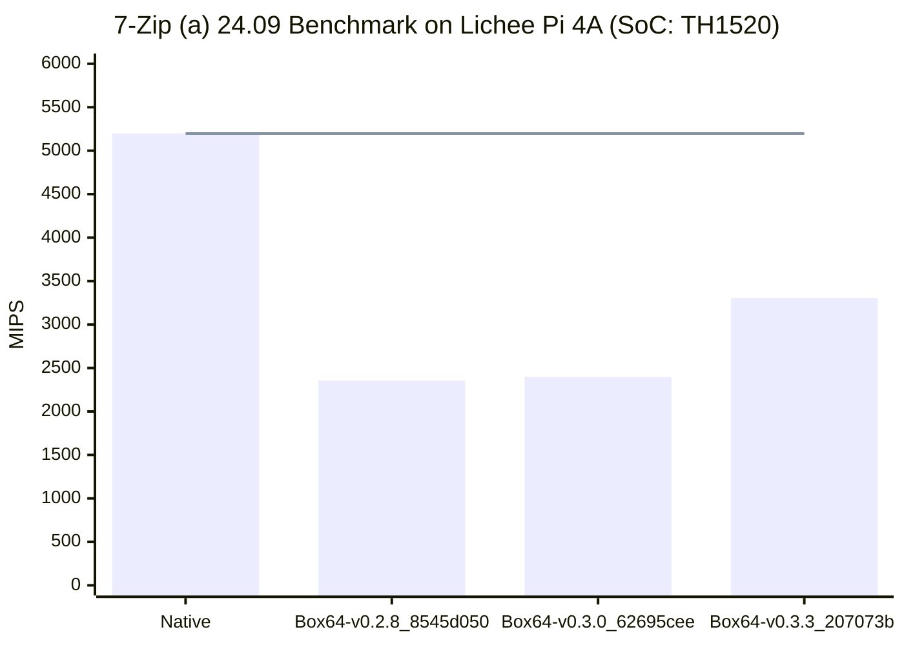

# Tested Box64's `7z b` Performance on [Lichee Pi 4A (SoC: TH1520)](/docs/hardwares#lichee-pi-4a-soc-th1520)



## Running Log
### Native
```shell
debian@revyos-lpi4a:~$ ./7za_risc-v b

7-Zip (a) 24.09 (riscv64) : Copyright (c) 1999-2024 Igor Pavlov : 2024-11-29
 64-bit locale=zh_CN.UTF-8 Threads:4 OPEN_MAX:1024

Compiler:  ver:14.2.0 GCC 14.2.0
Linux : 6.6.66-th1520 : #2025.01.01.02.56+b7113e5cd SMP Wed Jan  1 03:19:42 UTC 2025 : riscv64
PageSize:4KB THP:always hwcap:112D
riscv64

1T CPU Freq (MHz):  1831  1841  1840  1842  1836  1842  1840
2T CPU Freq (MHz): 199% 1834   199% 1838
4T CPU Freq (MHz): 392% 1807   396% 1818

RAM size:   15814 MB,  # CPU hardware threads:   4
RAM usage:    889 MB,  # Benchmark threads:      4

                       Compressing  |                  Decompressing
Dict     Speed Usage    R/U Rating  |      Speed Usage    R/U Rating
         KiB/s     %   MIPS   MIPS  |      KiB/s     %   MIPS   MIPS

22:       3763   289   1267   3661  |      77604   389   1700   6621
23:       3614   290   1269   3683  |      77521   395   1698   6708
24:       3559   293   1307   3827  |      74600   389   1682   6547
25:       3496   290   1376   3992  |      73504   390   1678   6542
----------------------------------  | ------------------------------
Avr:      3608   291   1305   3791  |      75807   391   1689   6604
Tot:             341   1497   5197
```

### Box64-v0.2.8_8545d050

```shell
debian@revyos-lpi4a:~$ ./7za_x64 b
Dynarec for RISC-V With extension: I M A F D C XTheadBa XTheadBb XTheadBs XTheadCondMov XTheadMemIdx XTheadMemPair XTheadFMemIdx XTheadMac PageSize:4096 Running on unknown riscv64 cpu with 4 Cores
Will use Hardware counter measured at 3.0 MHz emulating 3.0 GHz
Params database has 69 entries
Box64 with Dynarec v0.2.8 8545d050 built on Jan 10 2025 23:42:04
BOX64: Didn't detect 48bits of address space, considering it's 39bits
Counted 24 Env var
BOX64 LIB PATH: ./:lib/:lib64/:x86_64/:bin64/:libs64/:/lib/x86_64-linux-gnu/:/usr/lib/x86_64-linux-gnu/
BOX64 BIN PATH: ./:bin/:/usr/local/bin/:/usr/bin/:/bin/:/usr/local/games/:/usr/games/
Looking for ./7za_x64
argv[1]="b"
Rename process to "7za_x64"
Using emulated /lib/x86_64-linux-gnu/libstdc++.so.6
Using emulated /lib/x86_64-linux-gnu/libgcc_s.so.1
Using native(wrapped) libc.so.6
Using native(wrapped) ld-linux-x86-64.so.2
Using native(wrapped) libpthread.so.0
Using native(wrapped) libdl.so.2
Using native(wrapped) libutil.so.1
Using native(wrapped) libresolv.so.2
Using native(wrapped) librt.so.1
Using native(wrapped) libbsd.so.0
Using native(wrapped) libm.so.6

7-Zip (a) 24.09 (x64) : Copyright (c) 1999-2024 Igor Pavlov : 2024-11-29
 64-bit locale=zh_CN.UTF-8 Threads:4 OPEN_MAX:1024

Compiler:  ver:13.3.0 GCC 13.3.0 : SSE2
Warning, CPUID command 40000000 unsupported (ECX=00000000)
Linux : 6.6.66-th1520 : #2025.01.01.02.56+b7113e5cd SMP Wed Jan  1 03:19:42 UTC 2025 : x86_64
PageSize:4KB THP:always hwcap:57888911
Box64 on unknown riscv64 cpu @1.85 GHz
(601)

1T CPU Freq (MHz):   911   919   920   919   920   920   920
2T CPU Freq (MHz): 200% 916   199% 919
4T CPU Freq (MHz): 395% 908   396% 910

RAM size:   15814 MB,  # CPU hardware threads:   4
RAM usage:    889 MB,  # Benchmark threads:      4

                       Compressing  |                  Decompressing
Dict     Speed Usage    R/U Rating  |      Speed Usage    R/U Rating
         KiB/s     %   MIPS   MIPS  |      KiB/s     %   MIPS   MIPS

22:       1334   240    541   1298  |      39201   394    850   3344
23:       1282   237    552   1306  |      38696   395    849   3348
24:       1281   238    579   1377  |      38184   395    849   3351
25:       1290   240    614   1474  |      37633   394    850   3349
----------------------------------  | ------------------------------
Avr:      1297   239    572   1364  |      38428   394    849   3348
Tot:             316    711   2356
```

### Box64-v0.3.0_62695cee

```shell
debian@revyos-lpi4a:~$ ./7za_x64 b
Dynarec for RISC-V With extension: I M A F D C XTheadBa XTheadBb XTheadBs XTheadCondMov XTheadMemIdx XTheadMemPair XTheadFMemIdx XTheadMac PageSize:4096 Running on unknown riscv64 cpu with 4 Cores
Will use Hardware counter measured at 3.0 MHz emulating 3.0 GHz
Params database has 80 entries
Box64 with Dynarec v0.3.0 62695cee built on Jan  9 2025 23:11:49
BOX64: Didn't detect 48bits of address space, considering it's 39bits
Counted 24 Env var
BOX64 LIB PATH: ./:lib/:lib64/:x86_64/:bin64/:libs64/:/lib/x86_64-linux-gnu/:/usr/lib/x86_64-linux-gnu/
BOX64 BIN PATH: ./:bin/:/usr/local/bin/:/usr/bin/:/bin/:/usr/local/games/:/usr/games/
Looking for ./7za_x64
argv[1]="b"
Rename process to "7za_x64"
Using emulated /lib/x86_64-linux-gnu/libstdc++.so.6
Using emulated /lib/x86_64-linux-gnu/libgcc_s.so.1
Using native(wrapped) libc.so.6
Using native(wrapped) ld-linux-x86-64.so.2
Using native(wrapped) libpthread.so.0
Using native(wrapped) libdl.so.2
Using native(wrapped) libutil.so.1
Using native(wrapped) libresolv.so.2
Using native(wrapped) librt.so.1
Using native(wrapped) libbsd.so.0
Using native(wrapped) libm.so.6

7-Zip (a) 24.09 (x64) : Copyright (c) 1999-2024 Igor Pavlov : 2024-11-29
 64-bit locale=zh_CN.UTF-8 Threads:4 OPEN_MAX:1024

Compiler:  ver:13.3.0 GCC 13.3.0 : SSE2
Warning, CPUID command 40000000 unsupported (ECX=00000000)
Linux : 6.6.66-th1520 : #2025.01.01.02.56+b7113e5cd SMP Wed Jan  1 03:19:42 UTC 2025 : x86_64
PageSize:4KB THP:always hwcap:57888911
Box64 on unknown riscv64 cpu @1.85 GHz
(40661)

1T CPU Freq (MHz):   906   920   920   921   919   920   920
2T CPU Freq (MHz): 200% 916   200% 917
4T CPU Freq (MHz): 394% 907   396% 910

RAM size:   15814 MB,  # CPU hardware threads:   4
RAM usage:    889 MB,  # Benchmark threads:      4

                       Compressing  |                  Decompressing
Dict     Speed Usage    R/U Rating  |      Speed Usage    R/U Rating
         KiB/s     %   MIPS   MIPS  |      KiB/s     %   MIPS   MIPS

22:       1321   239    538   1286  |      39864   395    861   3401
23:       1303   239    555   1328  |      39498   396    863   3418
24:       1298   240    581   1397  |      39117   396    867   3433
25:       1295   240    615   1479  |      38749   396    872   3449
----------------------------------  | ------------------------------
Avr:      1304   240    572   1372  |      39307   396    866   3425
Tot:             318    719   2399
```

### Box64-v0.3.3_207073bf
```shell
debian@revyos-lpi4a:~$ ./7za_x64 b
Dynarec for RISC-V With extension: I M A F D C XTheadVector (vlen: 128) XTheadBa XTheadBb XTheadBs XTheadMemPair XTheadCondMov XTheadMemIdx PageSize:4096 Running on unknown riscv64 cpu with 4 cores
Will use hardware counter measured at 3.0 MHz emulating 3.0 GHz
Params database has 98 entries
Box64 with Dynarec v0.3.3 207073bf built on Jan  9 2025 20:33:23
BOX64: Didn't detect 48bits of address space, considering it's 39bits
Counted 23 Env var
BOX64 LIB PATH: BOX64 BIN PATH: ./:bin/:/usr/local/bin/:/usr/bin/:/bin/:/usr/local/games/:/usr/games/
Looking for ./7za_x64
argv[1]="b"
Rename process to "7za_x64"
Using emulated /usr/lib/box64-x86_64-linux-gnu/libstdc++.so.6
Using emulated /usr/lib/box64-x86_64-linux-gnu/libgcc_s.so.1
Using native(wrapped) libc.so.6
Using native(wrapped) ld-linux-x86-64.so.2
Using native(wrapped) libpthread.so.0
Using native(wrapped) libdl.so.2
Using native(wrapped) libutil.so.1
Using native(wrapped) libresolv.so.2
Using native(wrapped) librt.so.1
Using native(wrapped) libbsd.so.0
Using native(wrapped) libm.so.6

7-Zip (a) 24.09 (x64) : Copyright (c) 1999-2024 Igor Pavlov : 2024-11-29
 64-bit locale=zh_CN.UTF-8 Threads:4 OPEN_MAX:1024

Compiler:  ver:13.3.0 GCC 13.3.0 : SSE2
Warning, CPUID command 40000000 unsupported (ECX=00000000)
Linux : 6.6.66-th1520 : #2025.01.01.02.56+b7113e5cd SMP Wed Jan  1 03:19:42 UTC 2025 : x86_64
PageSize:4KB THP:always hwcap:57888911
Box64 on unknown riscv64 cpu @1.85 GHz
(40661)

1T CPU Freq (MHz):   912   919   920   916   920   920   920
2T CPU Freq (MHz): 200% 914   200% 919
4T CPU Freq (MHz): 396% 908   396% 909

RAM size:   15814 MB,  # CPU hardware threads:   4
RAM usage:    889 MB,  # Benchmark threads:      4

                       Compressing  |                  Decompressing
Dict     Speed Usage    R/U Rating  |      Speed Usage    R/U Rating
         KiB/s     %   MIPS   MIPS  |      KiB/s     %   MIPS   MIPS

22:       1389   230    587   1352  |      60348   395   1303   5149
23:       1394   234    608   1420  |      59376   396   1298   5138
24:       1465   241    653   1575  |      58371   396   1294   5123
25:       1372   233    671   1567  |      57488   396   1291   5116
----------------------------------  | ------------------------------
Avr:      1405   235    630   1479  |      58896   396   1296   5131
Tot:             315    963   3305
```

> TBD
