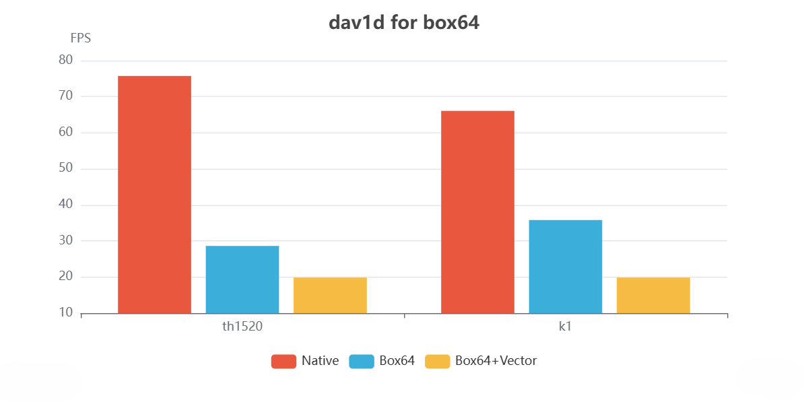

---

sidebar_position: 2

---

Hardware: [Lichee Pi 4A](/docs/hardwares#lichee-pi-4a-soc-th1520) and [Milk-V Jupiter](/docs/hardwares#milk-v-jupiter-soc-spacemit-m1)
Test Video:[City Hall 854x480](https://www.elecard.com/storage/video/CityHall_854x480.webm)
Box64 version (commit):[ptitSeb/box64@c2d0297](https://github.com/ptitSeb/box64/commit/c2d02977f8565b0ba19149a7c283af5680c065e7)


## Running Log
### Th1520 Native
```shell
dav1d 1.5.1 - by VideoLAN
Decoded 600/600 frames (100.0%) - 75.74/60.01 fps (1.26x)

real    0m7.916s
user    0m13.644s
sys     0m0.615s
```
### Th1520 Box64
```shell
unset BOX64_DYNAREC_RV64NOEXT
time box64 ./dav1d_x86_64 -i CityHall_854x480.ivf -o /dev/null
[BOX64] Box64 with Dynarec v0.3.3 c2d02977 built on Mar  8 2025 14:06:32
[BOX64] Dynarec for rv64g_xtheadba_xtheadbb_xtheadbs_xtheadmempair_xtheadcondmov_xtheadmemidx_xthvector
[BOX64] Running on unknown riscv64 cpu with 4 cores, pagesize: 4096
[BOX64] Will use hardware counter measured at 3.0 MHz emulating 3.0 GHz
[BOX64] Didn't detect 48bits of address space, considering it's 39bits
[BOX64] Counted 24 Env var
[BOX64] Library search path:
[BOX64] Binary search path: ./:bin/:/usr/bin/:/bin/:/usr/local/bin/:/home/debian/Desktop/environment/wine-10.1-amd64-wow64/bin/:/home/debian/Desktop/environment/gl4es/lib/
[BOX64] Looking for ./dav1d_x86_64
[BOX64] argv[1]="-i"
[BOX64] argv[2]="CityHall_854x480.ivf"
[BOX64] argv[3]="-o"
[BOX64] argv[4]="/dev/null"
[BOX64] Rename process to "dav1d_x86_64"
[BOX64] Using emulated /home/debian/Desktop/j104/usr/lib/libdav1d.so.7
[BOX64] Using native(wrapped) libm.so.6
[BOX64] Using native(wrapped) libc.so.6
[BOX64] Using native(wrapped) ld-linux-x86-64.so.2
[BOX64] Using native(wrapped) libpthread.so.0
[BOX64] Using native(wrapped) libdl.so.2
[BOX64] Using native(wrapped) libutil.so.1
[BOX64] Using native(wrapped) libresolv.so.2
[BOX64] Using native(wrapped) librt.so.1
[BOX64] Using native(wrapped) libbsd.so.0
dav1d 1.5.1 - by VideoLAN
Decoded 600/600 frames (100.0%) - 28.62/60.01 fps (0.48x)

real    0m21.085s
user    0m42.405s
sys     0m0.603s
```
### Th1520 Box64 Vector
```shell
export BOX64_DYNAREC_RV64NOEXT=vector
time box64 ./dav1d_x86_64 -i CityHall_854x480.ivf -o /dev/null
[BOX64] Box64 with Dynarec v0.3.3 c2d02977 built on Mar  8 2025 14:06:32
[BOX64] Dynarec for rv64g_xtheadba_xtheadbb_xtheadbs_xtheadmempair_xtheadcondmov_xtheadmemidx
[BOX64] Running on unknown riscv64 cpu with 4 cores, pagesize: 4096
[BOX64] Will use hardware counter measured at 3.0 MHz emulating 3.0 GHz
[BOX64] Didn't detect 48bits of address space, considering it's 39bits
[BOX64] Counted 25 Env var
[BOX64] Library search path:
[BOX64] Binary search path: ./:bin/:/usr/bin/:/bin/:/usr/local/bin/:/home/debian/Desktop/environment/wine-10.1-amd64-wow64/bin/:/home/debian/Desktop/environment/gl4es/lib/
[BOX64] Looking for ./dav1d_x86_64
[BOX64] argv[1]="-i"
[BOX64] argv[2]="CityHall_854x480.ivf"
[BOX64] argv[3]="-o"
[BOX64] argv[4]="/dev/null"
[BOX64] Rename process to "dav1d_x86_64"
[BOX64] Using emulated /home/debian/Desktop/j104/usr/lib/libdav1d.so.7
[BOX64] Using native(wrapped) libm.so.6
[BOX64] Using native(wrapped) libc.so.6
[BOX64] Using native(wrapped) ld-linux-x86-64.so.2
[BOX64] Using native(wrapped) libpthread.so.0
[BOX64] Using native(wrapped) libdl.so.2
[BOX64] Using native(wrapped) libutil.so.1
[BOX64] Using native(wrapped) libresolv.so.2
[BOX64] Using native(wrapped) librt.so.1
[BOX64] Using native(wrapped) libbsd.so.0
dav1d 1.5.1 - by VideoLAN
Decoded 600/600 frames (100.0%) - 19.84/60.01 fps (0.33x)

real    0m30.373s
user    1m5.299s
sys     0m0.676s
```
### K1 Native
```shell
time ./dav1d-riscv -i CityHall_854x480.ivf -o /dev/null
dav1d 1.5.1 - by VideoLAN
Decoded 600/600 frames (100.0%) - 66.06/1000.00 fps (0.07x)

real    0m9.105s
user    0m22.273s
sys     0m0.736s
```
### K1 Box64
```shell
unset BOX64_DYNAREC_RV64NOEXT
time box64 ./dav1d-x86_64 -i CityHall_854x480.ivf -o /dev/null
[BOX64] Box64 with Dynarec v0.3.3 c2d02977 built on Mar  8 2025 13:55:36
[BOX64] Dynarec for rv64gv_zba_zbb_zbc_zbs_zvl256
[BOX64] Running on Spacemit(R) X60 with 8 cores, pagesize: 4096
[BOX64] Will use hardware counter measured at 24.0 MHz emulating 3.0 GHz
[BOX64] Didn't detect 48bits of address space, considering it's 39bits
[BOX64] Counted 43 Env var
[BOX64] Library search path:
[BOX64] Binary search path: ./:bin/:/home/lilil/桌面/j104/wine-9.22-amd64-wow64/bin/:/home/lilil/wine-9.22/bin/:/usr/local/sbin/:/usr/local/bin/:/usr/sbin/:/usr/bin/:/sbin/:/bin/:/usr/games/:/usr/local/games/:/snap/bin/
[BOX64] Looking for ./dav1d-x86_64
[BOX64] argv[1]="-i"
[BOX64] argv[2]="CityHall_854x480.ivf"
[BOX64] argv[3]="-o"
[BOX64] argv[4]="/dev/null"
[BOX64] Rename process to "dav1d-x86_64"
[BOX64] Using emulated /home/lilil/桌面/benchmark/dav1d_x86_64/usr/lib/libdav1d.so.7
[BOX64] Using native(wrapped) libm.so.6
[BOX64] Using native(wrapped) libc.so.6
[BOX64] Using native(wrapped) ld-linux-x86-64.so.2
[BOX64] Using native(wrapped) libpthread.so.0
[BOX64] Using native(wrapped) libdl.so.2
[BOX64] Using native(wrapped) libutil.so.1
[BOX64] Using native(wrapped) libresolv.so.2
[BOX64] Using native(wrapped) librt.so.1
[BOX64] Using native(wrapped) libbsd.so.0
dav1d 1.5.1 - by VideoLAN
Decoded 600/600 frames (100.0%) - 35.80/1000.00 fps (0.04x)

real    0m16.903s
user    0m40.418s
sys     0m1.182s
```
### K1 Box64 Vector
```shell
export BOX64_DYNAREC_RV64NOEXT=vector
time box64 ./dav1d_x86_64 -i CityHall_854x480.ivf -o /dev/null
[BOX64] Box64 with Dynarec v0.3.3 c2d02977 built on Mar  8 2025 14:06:32
[BOX64] Dynarec for rv64g_xtheadba_xtheadbb_xtheadbs_xtheadmempair_xtheadcondmov_xtheadmemidx
[BOX64] Running on unknown riscv64 cpu with 4 cores, pagesize: 4096
[BOX64] Will use hardware counter measured at 3.0 MHz emulating 3.0 GHz
[BOX64] Didn't detect 48bits of address space, considering it's 39bits
[BOX64] Counted 25 Env var
[BOX64] Library search path:
[BOX64] Binary search path: ./:bin/:/usr/bin/:/bin/:/usr/local/bin/:/home/debian/Desktop/environment/wine-10.1-amd64-wow64/bin/:/home/debian/Desktop/environment/gl4es/lib/
[BOX64] Looking for ./dav1d_x86_64
[BOX64] argv[1]="-i"
[BOX64] argv[2]="CityHall_854x480.ivf"
[BOX64] argv[3]="-o"
[BOX64] argv[4]="/dev/null"
[BOX64] Rename process to "dav1d_x86_64"
[BOX64] Using emulated /home/debian/Desktop/j104/usr/lib/libdav1d.so.7
[BOX64] Using native(wrapped) libm.so.6
[BOX64] Using native(wrapped) libc.so.6
[BOX64] Using native(wrapped) ld-linux-x86-64.so.2
[BOX64] Using native(wrapped) libpthread.so.0
[BOX64] Using native(wrapped) libdl.so.2
[BOX64] Using native(wrapped) libutil.so.1
[BOX64] Using native(wrapped) libresolv.so.2
[BOX64] Using native(wrapped) librt.so.1
[BOX64] Using native(wrapped) libbsd.so.0
dav1d 1.5.1 - by VideoLAN
Decoded 600/600 frames (100.0%) - 19.84/60.01 fps (0.33x)

real    0m30.373s
user    1m5.299s
sys     0m0.676s
```