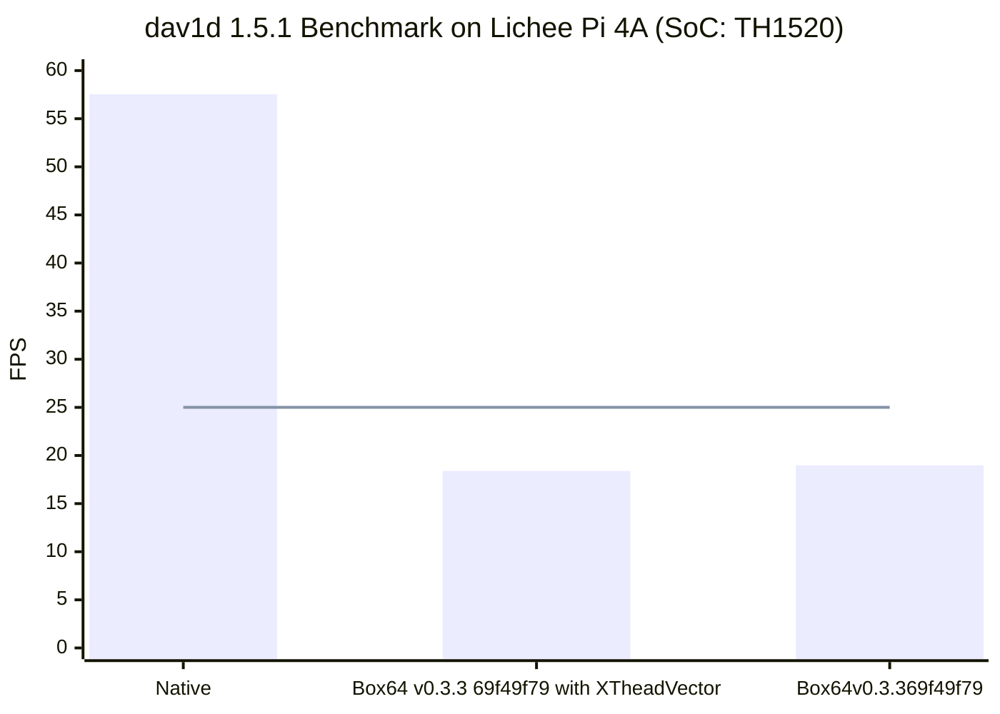
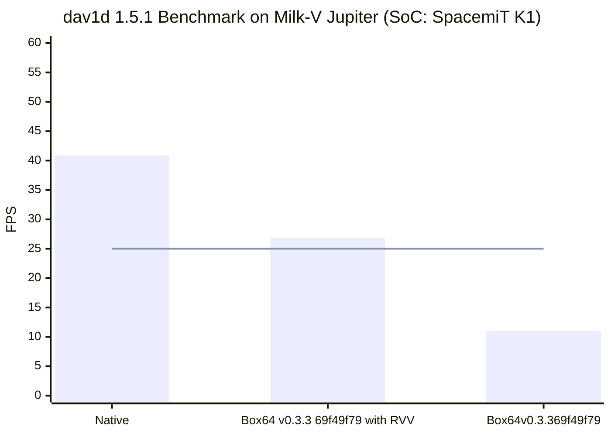

# `dav1d`

Test data: [Sparks-5994fps-AV1-10bit-960x540-film-grain-synthesis-854kbps.obu](http://download.opencontent.netflix.com.s3.amazonaws.com/AV1/Sparks/Sparks-5994fps-AV1-10bit-960x540-film-grain-synthesis-854kbps.obu)

## `dav1d` on Lichee Pi 4A

Hardware: [Lichee Pi 4A](/docs/hardwares#lichee-pi-4a-soc-th1520)



### Native

#### Running Log

```shell
time ./dav1d -i ../../../../Sparks-5994fps-AV1-10bit-960x540-film-grain-synthesis-854kbps.obu -o /dev/null
dav1d 1.5.1-5-g8d95618 - by VideoLAN
Decoded 13775/13775 frames (100.0%) - 57.55/25.00 fps (2.30x)

real    3m59.438s
user    13m7.494s
sys     0m11.275s
```

### Box64 with XTheadVector

#### Running Log

```shell
time ./dav1d -i ../Sparks-5994fps-AV1-10bit-960x540-film-grain-synthesis-854kbps.obu -o /dev/null
[BOX64] Dynarec for rv64g_xtheadba_xtheadbb_xtheadbs_xtheadmempair_xtheadcondmov_xtheadmemidx_xthvector
[BOX64] Running on unknown riscv64 cpu with 4 cores, pagesize: 4096
[BOX64] Will use hardware counter measured at 3.0 MHz emulating 3.0 GHz
[BOX64] Using bash "/home/sipeed/ourstorybegin/box64/box64_/tests/box64-bash"
[BOX64] Box64 with Dynarec v0.3.3 69f49f79 built on Feb  6 2025 13:52:28
[BOX64] Didn't detect 48bits of address space, considering it's 39bits
[BOX64] Counted 24 Env var
[BOX64] BOX64 LIB PATH: 
[BOX64] BOX64 BIN PATH: ./:bin/:/home/sipeed/ourstorybegin/wine/wine-9.22-amd64-wow64/bin/:/home/sipeed/ourstorybegin/wine/wine-9.22-amd64-wow64/bin/:/usr/local/bin/:/usr/bin/:/bin/:/usr/local/games/:/usr/games/
[BOX64] Looking for ./dav1d
[BOX64] BOX64ENV: Variables overridden via env and/or RC file:
        BOX64_BASH=/home/sipeed/ourstorybegin/box64/box64_/tests/box64-bash
[BOX64] argv[1]="-i"
[BOX64] argv[2]="../Sparks-5994fps-AV1-10bit-960x540-film-grain-synthesis-854kbps.obu"
[BOX64] argv[3]="-o"
[BOX64] argv[4]="/dev/null"
[BOX64] Rename process to "dav1d"
[BOX64] Using native(wrapped) libc.so.6
[BOX64] Using native(wrapped) ld-linux-x86-64.so.2
[BOX64] Using native(wrapped) libpthread.so.0
[BOX64] Using native(wrapped) libdl.so.2
[BOX64] Using native(wrapped) libutil.so.1
[BOX64] Using native(wrapped) libresolv.so.2
[BOX64] Using native(wrapped) librt.so.1
[BOX64] Using native(wrapped) libbsd.so.0
dav1d 1.5.1-5-g8d95618 - by VideoLAN
Decoded 13775/13775 frames (100.0%) - 18.39/25.00 fps (0.74x)

real    12m29.166s
user    41m49.666s
sys     0m9.274s
```

### Box64

#### Running Log

```shell
time ./dav1d -i ../Sparks-5994fps-AV1-10bit-960x540-film-grain-synthesis-854kbps.obu -o /dev/null
[BOX64] Dynarec for rv64g_xtheadba_xtheadbb_xtheadbs_xtheadmempair_xtheadcondmov_xtheadmemidx
[BOX64] Running on unknown riscv64 cpu with 4 cores, pagesize: 4096
[BOX64] Will use hardware counter measured at 3.0 MHz emulating 3.0 GHz
[BOX64] Using bash "/home/sipeed/ourstorybegin/box64/box64_/tests/box64-bash"
[BOX64] Box64 with Dynarec v0.3.3 69f49f79 built on Feb  6 2025 13:52:28
[BOX64] Didn't detect 48bits of address space, considering it's 39bits
[BOX64] Counted 25 Env var
[BOX64] BOX64 LIB PATH: 
[BOX64] BOX64 BIN PATH: ./:bin/:/home/sipeed/ourstorybegin/wine/wine-9.22-amd64-wow64/bin/:/home/sipeed/ourstorybegin/wine/wine-9.22-amd64-wow64/bin/:/usr/local/bin/:/usr/bin/:/bin/:/usr/local/games/:/usr/games/
[BOX64] Looking for ./dav1d
[BOX64] BOX64ENV: Variables overridden via env and/or RC file:
        BOX64_BASH=/home/sipeed/ourstorybegin/box64/box64_/tests/box64-bash
[BOX64] argv[1]="-i"
[BOX64] argv[2]="../Sparks-5994fps-AV1-10bit-960x540-film-grain-synthesis-854kbps.obu"
[BOX64] argv[3]="-o"
[BOX64] argv[4]="/dev/null"
[BOX64] Rename process to "dav1d"
[BOX64] Using native(wrapped) libc.so.6
[BOX64] Using native(wrapped) ld-linux-x86-64.so.2
[BOX64] Using native(wrapped) libpthread.so.0
[BOX64] Using native(wrapped) libdl.so.2
[BOX64] Using native(wrapped) libutil.so.1
[BOX64] Using native(wrapped) libresolv.so.2
[BOX64] Using native(wrapped) librt.so.1
[BOX64] Using native(wrapped) libbsd.so.0
dav1d 1.5.1-5-g8d95618 - by VideoLAN
Decoded 13775/13775 frames (100.0%) - 18.97/25.00 fps (0.76x)

real    12m6.184s
user    39m31.080s
sys     0m11.092s
```


## `dav1d` on Milk-V Jupiter

Hardware: [Milk-V Jupiter](/docs/hardwares#milk-v-jupiter-soc-spacemit-m1)



### Native

#### Running Log

```shell
time ./dav1d-riscv/dav1d -i Sparks-5994fps-AV1-10bit-960x540-film-grain-synthesis-854kbps.obu -o /dev/null
dav1d 1.5.1 - by VideoLAN
Decoded 13775/13775 frames (100.0%) - 40.87/25.00 fps (1.63x)

real	5m37.088s
user	22m34.808s
sys	    0m45.575s
```

### Box64 with RVV

#### Running Log

```shell
time ./box64/box64 ./dav1d-x86_64/dav1d -i ./Sparks
[BOX64] Box64 with Dynarec v0.3.3 2636e7e8 built on Mar  4 2025 14:58:49 ./Sparks-
[BOX64] Dynarec for rv64gv_zba_zbb_zbc_zbs_zvl256/dav1d-x86_64/dav1d -i ./Sparks-5
[BOX64] Running on Spacemit(R) X60 with 8 cores, pagesize: 4096av1d -i ./Sparks-5 9
[BOX64] Will use hardware counter measured at 24.0 MHz emulating 3.0 GHzSparks-5994fps-AV1-10bit-960x540-film-gr[BOX64] Didn't detect 48bits of address space, considering it's 39bits
[BOX64] Counted 65 Env var
[BOX64] Library search path: 
[BOX64] Binary search path: ./:bin/:/usr/local/sbin/:/usr/local/bin/:/usr/sbin/:/usr/bin/:/sbin/:/bin/:/usr/games/:/usr/local/games/:/snap/bin/
[BOX64] Looking for ./dav1d-x86_64/dav1d
[BOX64] argv[1]="-i"
[BOX64] argv[2]="./Sparks-5994fps-AV1-10bit-960x540-film-grain-synthesis-854kbps.obu"
[BOX64] argv[3]="-o"
[BOX64] argv[4]="/dev/null"
[BOX64] Rename process to "dav1d"
[BOX64] Using native(wrapped) libc.so.6
[BOX64] Using native(wrapped) ld-linux-x86-64.so.2
[BOX64] Using native(wrapped) libpthread.so.0
[BOX64] Using native(wrapped) libdl.so.2
[BOX64] Using native(wrapped) libutil.so.1
[BOX64] Using native(wrapped) libresolv.so.2
[BOX64] Using native(wrapped) librt.so.1
[BOX64] Using native(wrapped) libbsd.so.0
dav1d 1.5.1-5-g8d95618 - by VideoLAN
Decoded 13775/13775 frames (100.0%) - 26.90/25.00 fps (1.08x)

real    8m32.328s
user    36m18.695s
sys     0m55.365s
```

### Box64

#### Running Log

```shell
time ./box64/box64 ./dav1d-x86_64/dav1d -i ./Sparks-5994fps-AV1-10bit-960x540-film-grain-synthesis-854kbps.obu -o /dev/null
[BOX64] Box64 with Dynarec v0.3.3 2636e7e8 built on Mar  4 2025 14:58:49
[BOX64] Dynarec for rv64g_zba_zbb_zbc_zbs
[BOX64] Running on Spacemit(R) X60 with 8 cores, pagesize: 4096
[BOX64] Will use hardware counter measured at 24.0 MHz emulating 3.0 GHz
[BOX64] Didn't detect 48bits of address space, considering it's 39bits
[BOX64] Counted 66 Env var
[BOX64] Library search path: 
[BOX64] Binary search path: ./:bin/:/usr/local/sbin/:/usr/local/bin/:/usr/sbin/:/usr/bin/:/sbin/:/bin/:/usr/games/:/usr/local/games/:/snap/bin/
[BOX64] Looking for ./dav1d-x86_64/dav1d
[BOX64] argv[1]="-i"
[BOX64] argv[2]="./Sparks-5994fps-AV1-10bit-960x540-film-grain-synthesis-854kbps.obu"
[BOX64] argv[3]="-o"
[BOX64] argv[4]="/dev/null"
[BOX64] Rename process to "dav1d"
[BOX64] Using native(wrapped) libc.so.6
[BOX64] Using native(wrapped) ld-linux-x86-64.so.2
[BOX64] Using native(wrapped) libpthread.so.0
[BOX64] Using native(wrapped) libdl.so.2
[BOX64] Using native(wrapped) libutil.so.1
[BOX64] Using native(wrapped) libresolv.so.2
[BOX64] Using native(wrapped) librt.so.1
[BOX64] Using native(wrapped) libbsd.so.0
dav1d 1.5.1-5-g8d95618 - by VideoLAN
Decoded 13775/13775 frames (100.0%) - 11.04/25.00 fps (0.44x)

real    20m48.032s
user    85m14.949s
sys     1m1.954s
```