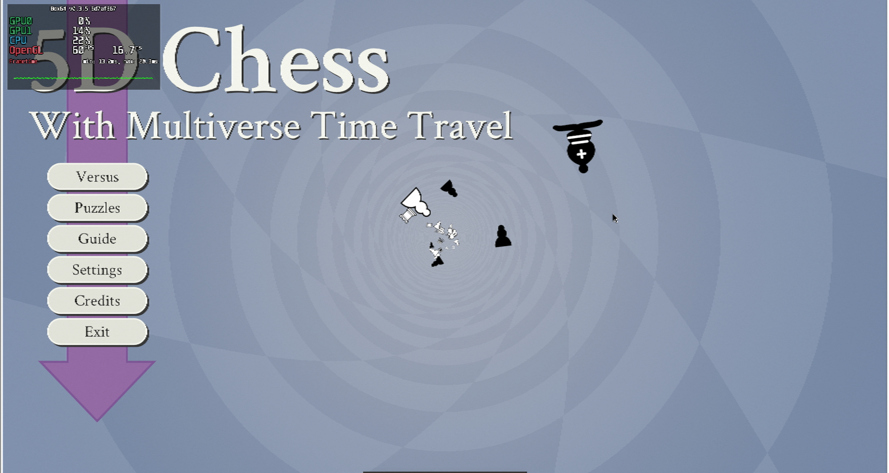
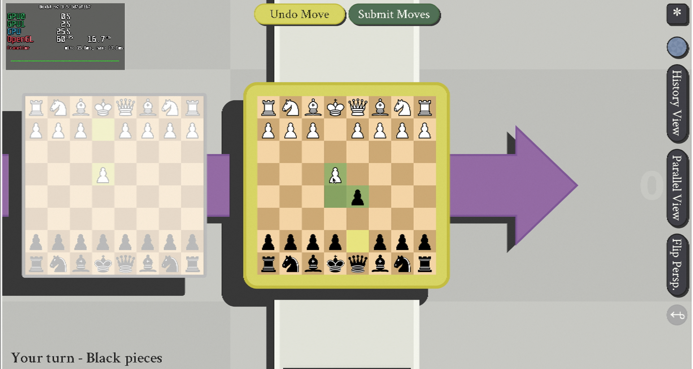

# 5D Chess With Multiverse Time Travel

## Compatibility report

### Tested on

[Milk-V Jupiter](/docs/hardwares#milk-v-jupiter-soc-spacemit-m1)
 with AMD Radeon RX 550

### Box64 version (commit)

Box64 [ptitSeb/box64@6d7af867](https://github.com/ptitSeb/box64/tree/6d7af867)

### Game screenshot




### Game running log

```shell
[BOX64] Box64 with Dynarec v0.3.5 6d7af867 built on Apr  6 2025 20:28:41
[BOX64] Dynarec for rv64gv_zba_zbb_zbc_zbs_zvl256
[BOX64] Running on Spacemit(R) X60 with 8 cores, pagesize: 4096
[BOX64] Will use hardware counter measured at 24.0 MHz emulating 3.0 GHz
[BOX64] Using bash "/home/rurumuri/ourstorybegin/box64/tests/box64-bash"
[BOX64] Didn't detect 48bits of address space, considering it's 39bits
[BOX64] Counted 48 Env var
[BOX64] Library search path: 
[BOX64] Binary search path: ./:bin/:/home/rurumuri/ourstorybegin/wine/wine-10.3-amd64-wow64/bin/:/home/rurumuri/ourstorybegin/wine/wine-10.3-amd64-wow64/bin/:/home/rurumuri/ourstorybegin/wine/wine-10.3-amd64-wow64/bin/:/usr/local/bin/:/usr/bin/:/bin/:/usr/local/sbin/:/usr/lib/jvm/default/bin/:/usr/bin/site_perl/:/usr/bin/vendor_perl/:/usr/bin/core_perl/:/usr/lib/rustup/bin/
[BOX64] Looking for ./5dchesswithmultiversetimetravel
[BOX64] BOX64ENV: Variables overridden via env and/or RC file:
        BOX64_BASH=/home/rurumuri/ourstorybegin/box64/tests/box64-bash
[BOX64] Rename process to "5dchesswithmultiversetimetravel"
[BOX64] Using native(wrapped) libSDL2-2.0.so.0
[BOX64] Using native(wrapped) libdl.so.2
[BOX64] Using native(wrapped) libm.so.6
[BOX64] Using native(wrapped) librt.so.1
[BOX64] Using native(wrapped) libpthread.so.0
[BOX64] Error initializing native libSDL2_mixer-2.0.so.0 (last dlerror is libSDL2_mixer-2.0.so.0: cannot open shared object file: No such file or directory)
[BOX64] Using emulated /home/rurumuri/games/5dchesswithmultiversetimetravel/lib64/libSDL2_mixer-2.0.so.0
[BOX64] Using emulated /home/rurumuri/ourstorybegin/box64/x64lib/libgcc_s.so.1
[BOX64] Using native(wrapped) libc.so.6
[BOX64] Using native(wrapped) ld-linux-x86-64.so.2
[BOX64] Using native(wrapped) libutil.so.1
[BOX64] Using native(wrapped) libbsd.so.0
[src/client_main.cpp:163] SDL_Init okay
[src/client_main.cpp:172] Mix_OpenAudio() okay
[src/client_main.cpp:221] SDL_GL_LoadLibrary() okay
[src/client_main.cpp:263] SDL_CreateWindow okay
[src/client_main.cpp:299] SDL_GL_CreateContext() okay
[BOX64] Using native(wrapped) libGL.so.1
[src/client_main.cpp:308] gladLoaderGLLoader() okay
[src/client_main.cpp:312] GL_VERSION 4.6 (Core Profile) Mesa 24.3.4-arch1.1
[src/client_main.cpp:313] GL_VENDOR AMD
[src/client_main.cpp:314] GL_RENDERER AMD Radeon RX 550 Series (radeonsi, polaris11, LLVM 19.1.7, DRM 3.49, 6.1.15+)
[src/client_main.cpp:418] SDL_GL_SetSwapInterval succeeded in setting vsync.
[BOX64] Using native(wrapped) libvorbisfile.so.3
[src/client_main.cpp:493] Initialization successful.
[src/client_main.cpp:494] 11-16-1.1.0.0f
```

### Rendering methods

```shell
OpenGL
```

### Extra information

[Offical Website](https://www.5dchesswithmultiversetimetravel.com/)

[Steam](https://store.steampowered.com/app/1349230/5D_Chess_With_Multiverse_Time_Travel/)

[PCGameWiki](https://www.pcgamingwiki.com/wiki/5D_Chess_With_Multiverse_Time_Travel)

### Advanced Tips

> TBD