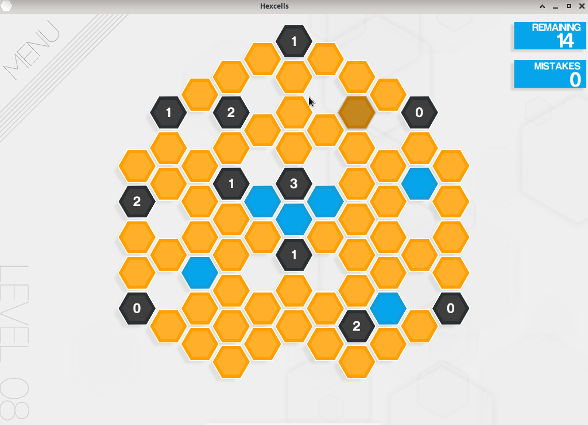

# Hexcells

## Compatibility report

### Tested on

[Lichee Pi 4A](/docs/hardwares#lichee-pi-4a-soc-th1520)

### Box64 version (commit)

Box64 [ptitSeb/box64@69f49f79](https://github.com/ptitSeb/box64/tree/69f49f79)

### Game screenshot



### Game running log

```shell
[BOX64] Dynarec for rv64g_xtheadba_xtheadbb_xtheadbs_xtheadmempair_xtheadcondmov_xtheadmemidx_xthvector
[BOX64] Running on unknown riscv64 cpu with 4 cores, pagesize: 4096
[BOX64] Will use hardware counter measured at 3.0 MHz emulating 3.0 GHz
[BOX64] Box64 with Dynarec v0.3.3 49cba432 built on Feb 19 2025 13:36:05
[BOX64] Didn't detect 48bits of address space, considering it's 39bits
[BOX64] Counted 28 Env var
[BOX64] BOX64 LIB PATH:
[BOX64] BOX64 BIN PATH: ./:bin/:/usr/bin/:/bin/:/usr/local/bin/:/home/debian/Desktop/environment/wine-10.1-amd64-wow64/bin/:/home/debian/Desktop/environment/gl4es-master/lib/:/home/debian/Desktop/environment/gl4es-master/lib/
[BOX64] Looking for Hexcells.x86_64
[BOX64] Rename process to "Hexcells.x86_64"
[BOX64] Using emulated /usr/lib/box64-x86_64-linux-gnu/libstdc++.so.6
[BOX64] Using native(wrapped) libGLU.so.1
LIBGL: Initialising gl4es
LIBGL: v1.1.7 built on Feb 19 2025 13:46:30
LIBGL: Using GLES 2.0 backend
LIBGL: loaded: libGLESv2.so
LIBGL: loaded: libEGL.so
LIBGL: Using GLES 2.0 backend
libGL: Can't open configuration file /etc/drirc: No such file or directory.
libGL: Can't open configuration file /home/debian/.drirc: No such file or directory.
libGL: Can't open configuration file /etc/drirc: No such file or directory.
libGL: Can't open configuration file /home/debian/.drirc: No such file or directory.
libGL: Can't open configuration file /etc/drirc: No such file or directory.
libGL: Can't open configuration file /home/debian/.drirc: No such file or directory.
LibGL: Loaded libpvr_dri_support.so
LibGL: Supported screen extensions:
LibGL:  DRI_TexBuffer (supported version: 3 - max version: 3)
LibGL:  DRI2_Flush (supported version: 4 - max version: 4)
LibGL:  DRI_IMAGE (supported version: 17 - max version: 19)
LibGL:  DRI_Robustness (supported version: 1 - max version: 1)
LibGL:  DRI_RENDERER_QUERY (supported version: 1 - max version: 1)
LibGL:  DRI2_Fence (supported version: 2 - max version: 2)
LibGL:  DRI2_BufferDamage (supported version: 1 - max version: 1)
LibGL:  DRI_CONFIG_QUERY (supported version: 2 - max version: 2)
LIBGL: Hardware Full NPOT detected and used
LIBGL: Extension GL_EXT_blend_minmax  detected and used
LIBGL: Extension GL_EXT_draw_buffers  detected and used
LIBGL: FBO are in core, and so used
LIBGL: PointSprite are in core, and so used
LIBGL: CubeMap are in core, and so used
LIBGL: BlendColor is in core, and so used
LIBGL: Blend Subtract is in core, and so used
LIBGL: Blend Function and Equation Separation is in core, and so used
LIBGL: Texture Mirrored Repeat is in core, and so used
LIBGL: Extension GL_OES_mapbuffer  detected
LIBGL: Extension GL_OES_element_index_uint  detected and used
LIBGL: Extension GL_OES_packed_depth_stencil  detected and used
LIBGL: Extension GL_OES_depth24  detected and used
LIBGL: Extension GL_OES_rgb8_rgba8  detected and used
LIBGL: Extension GL_EXT_multi_draw_arrays  detected
LIBGL: Extension GL_EXT_texture_format_BGRA8888  detected and used
LIBGL: Extension GL_OES_depth_texture  detected and used
LIBGL: Extension GL_OES_texture_stencil8  detected and used
LIBGL: Extension GL_EXT_texture_rg  detected and used
LIBGL: Extension GL_OES_texture_float  detected and used
LIBGL: Extension GL_OES_texture_half_float  detected and used
LIBGL: Extension GL_EXT_color_buffer_float  detected and used
LIBGL: Extension GL_EXT_color_buffer_half_float  detected and used
LIBGL: Extension GL_OES_fragment_precision_high  detected and used
LIBGL: Extension GL_EXT_shader_texture_lod detected and used
3755.639699 (5081) PVR:(Error): DoCompileShader:  Failed to compile shader [ shadercompile.c:10866 ]
LIBGL: Max vertex attrib: 16
LIBGL: Extension GL_OES_standard_derivatives  detected and used
LIBGL: Extension GL_OES_get_program_binary  detected and used
LIBGL: Number of supported Program Binary Format: 1
LIBGL: Max texture size: 8192
LIBGL: Max Varying Vector: 15
LIBGL: Texture Units: 16/16 (hardware: 16), Max lights: 8, Max planes: 6
LIBGL: Max Color Attachments: 8 / Draw buffers: 8
LIBGL: Hardware vendor is Imagination Technologies
3755.640679 (5081) PVR:(Error): DoCompileShader:  Failed to compile shader [ shadercompile.c:10866 ]
3755.640975 (5081) PVR:(Error): DoCompileShader:  Failed to compile shader [ shadercompile.c:10866 ]
3755.641248 (5081) PVR:(Error): DoCompileShader:  Failed to compile shader [ shadercompile.c:10866 ]
LIBGL: sRGB surface supported
LIBGL: EGLImage from Pixmap supported
LIBGL: EGLImage to Texture2D supported
LIBGL: EGLImage to RenderBuffer supported
LibGL: Unloaded libpvr_dri_support.so
LIBGL: Targeting OpenGL 2.1
LIBGL: Not trying to batch small subsequent glDrawXXXX
LIBGL: Trying to use VBO
LIBGL: FBO workaround for using binded texture enabled
LIBGL: Force texture for Attachment color0 on FBO
LIBGL: Hack to trigger a SwapBuffers when a Full Framebuffer Blit on default FBO is done
LIBGL: glX Will try to recycle EGL Surface
LIBGL: Current folder is:/home/debian/Desktop/game/hexcells
LIBGL: Loaded a PSA with 1 Precompiled Programs
[BOX64] Using native(wrapped) libGL.so.1
[BOX64] Using native(wrapped) libX11.so.6
[BOX64] Using native(wrapped) libxcb.so.1
[BOX64] Using native(wrapped) libXau.so.6
[BOX64] Using native(wrapped) libXdmcp.so.6
[BOX64] Using native(wrapped) libXext.so.6
[BOX64] Using native(wrapped) libdl.so.2
[BOX64] Using native(wrapped) libXcursor.so.1
[BOX64] Using native(wrapped) libXfixes.so.3
[BOX64] Using native(wrapped) libXrender.so.1
[BOX64] Using native(wrapped) libpthread.so.0
[BOX64] Using native(wrapped) librt.so.1
[BOX64] Using native(wrapped) libm.so.6
[BOX64] Using emulated /usr/lib/box64-x86_64-linux-gnu/libgcc_s.so.1
[BOX64] Using native(wrapped) libc.so.6
[BOX64] Using native(wrapped) ld-linux-x86-64.so.2
[BOX64] Using native(wrapped) libutil.so.1
[BOX64] Using native(wrapped) libbsd.so.0
Found path: /home/debian/Desktop/game/hexcells/./Hexcells.x86_64
[BOX64] Using emulated /home/debian/Desktop/game/hexcells/Hexcells_Data/Mono/x86_64/libmono.so
Mono path[0] = '/home/debian/Desktop/game/hexcells/Hexcells_Data/Managed'
Mono path[1] = '/home/debian/Desktop/game/hexcells/Hexcells_Data/Mono'
Mono config path = '/home/debian/Desktop/game/hexcells/Hexcells_Data/Mono/etc'
```

### Rendering methods

```shell
 OpenGL ES + gl4es
```

[Read more: What is OpenGL ES? »](/docs/faq#what-is-opengl-es)

[Read more: What is gl4es? »](/docs/faq#what-is-gl4es)

### Extra information


[Steam](https://store.steampowered.com/app/265890/Hexcells/)

[PCGameWiki](https://www.pcgamingwiki.com/wiki/Hexcells)

[ThinkyGames](https://thinkygames.com/games/hexcells/)
### Advanced Tips

> TBD
