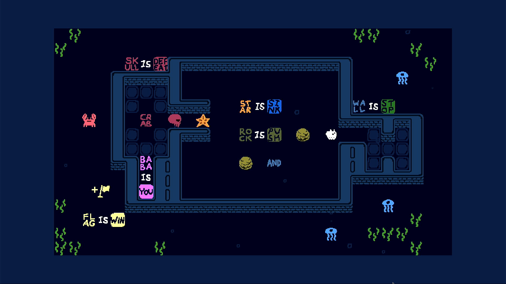

# Baba Is You

## Compatibility report

### Tested on

[Lichee Pi 4A](/docs/hardwares#lichee-pi-4a-soc-th1520)

### Box64 version (commit)

Box64 [ptitSeb/box64@b79ba11d](https://github.com/ptitSeb/box64/tree/b79ba11d)

### Game screenshot



### Game running log

```shell
debian@revyos-lpi4a:~$ export LD_LIBRARY_PATH=~/gl4es/lib:$LD_LIBRARY_PATH
debian@revyos-lpi4a:~$ ./Games/BabaIsYou/BabaIsYou/run.sh 
Dynarec for RISC-V With extension: I M A F D C XTheadVector (vlen: 128) XTheadBa XTheadBb XTheadBs XTheadMemPair XTheadCondMov XTheadMemIdx PageSize:4096 Running on unknown riscv64 cpu with 4 cores
Will use hardware counter measured at 3.0 MHz emulating 3.0 GHz
Params database has 98 entries
Box64 with Dynarec v0.3.3 b79ba11d built on Jan  6 2025 00:43:03
BOX64: Didn't detect 48bits of address space, considering it's 39bits
Counted 39 Env var
BOX64 LIB PATH: BOX64 BIN PATH: ./:bin/:/usr/local/bin/:/usr/bin/:/bin/:/usr/local/games/:/usr/games/
Looking for ./bin64/Chowdren
Rename process to "Chowdren"
LIBGL: Initialising gl4es
LIBGL: v1.1.7 built on Jan  6 2025 01:19:14
LIBGL: Using GLES 2.0 backend
LIBGL: loaded: libGLESv2.so
LIBGL: loaded: libEGL.so
LIBGL: Using GLES 2.0 backend
LIBGL: Hardware Full NPOT detected and used
LIBGL: Extension GL_EXT_blend_minmax  detected and used
LIBGL: Extension GL_EXT_draw_buffers  detected and used
LIBGL: FBO are in core, and so used
LIBGL: PointSprite are in core, and so used
LIBGL: CubeMap are in core, and so used
LIBGL: BlendColor is in core, and so used
LIBGL: Blend Subtract is in core, and so used
LIBGL: Blend Function and Equation Separation is in core, and so used
LIBGL: Texture Mirrored Repeat is in core, and so used
LIBGL: Extension GL_OES_mapbuffer  detected
LIBGL: Extension GL_OES_element_index_uint  detected and used
LIBGL: Extension GL_OES_packed_depth_stencil  detected and used
LIBGL: Extension GL_OES_depth24  detected and used
LIBGL: Extension GL_OES_rgb8_rgba8  detected and used
LIBGL: Extension GL_EXT_multi_draw_arrays  detected
LIBGL: Extension GL_EXT_texture_format_BGRA8888  detected and used
LIBGL: Extension GL_OES_depth_texture  detected and used
LIBGL: Extension GL_OES_texture_stencil8  detected and used
LIBGL: Extension GL_EXT_texture_rg  detected and used
LIBGL: Extension GL_OES_texture_float  detected and used
LIBGL: Extension GL_OES_texture_half_float  detected and used
LIBGL: Extension GL_EXT_color_buffer_float  detected and used
LIBGL: Extension GL_EXT_color_buffer_half_float  detected and used
LIBGL: Extension GL_OES_fragment_precision_high  detected and used
LIBGL: Extension GL_EXT_shader_texture_lod detected and used
2677.031431 (15793) PVR:(Error): DoCompileShader:  Failed to compile shader [ shadercompile.c:10866 ]
LIBGL: Max vertex attrib: 16
LIBGL: Extension GL_OES_standard_derivatives  detected and used
LIBGL: Extension GL_OES_get_program_binary  detected and used
LIBGL: Number of supported Program Binary Format: 1
LIBGL: Max texture size: 8192
LIBGL: Max Varying Vector: 15
LIBGL: Texture Units: 16/16 (hardware: 16), Max lights: 8, Max planes: 6
LIBGL: Max Color Attachments: 8 / Draw buffers: 8
LIBGL: Hardware vendor is Imagination Technologies
2677.031800 (15793) PVR:(Error): DoCompileShader:  Failed to compile shader [ shadercompile.c:10866 ]
2677.032005 (15793) PVR:(Error): DoCompileShader:  Failed to compile shader [ shadercompile.c:10866 ]
2677.032217 (15793) PVR:(Error): DoCompileShader:  Failed to compile shader [ shadercompile.c:10866 ]
LIBGL: sRGB surface supported
LIBGL: EGLImage from Pixmap supported
LIBGL: EGLImage to Texture2D supported
LIBGL: EGLImage to RenderBuffer supported
LIBGL: Targeting OpenGL 2.1
LIBGL: Not trying to batch small subsequent glDrawXXXX
LIBGL: Trying to use VBO
LIBGL: FBO workaround for using binded texture enabled
LIBGL: Force texture for Attachment color0 on FBO
LIBGL: Hack to trigger a SwapBuffers when a Full Framebuffer Blit on default FBO is done
LIBGL: glX Will try to recycle EGL Surface
LIBGL: Current folder is:/home/debian/Games/BabaIsYou/BabaIsYou
Using native(wrapped) libGL.so.1
Using native(wrapped) libm.so.6
Using native(wrapped) libpthread.so.0
Using native(wrapped) libc.so.6
Using native(wrapped) ld-linux-x86-64.so.2
Using native(wrapped) libdl.so.2
Using native(wrapped) libutil.so.1
Using native(wrapped) librt.so.1
Using native(wrapped) libbsd.so.0
Using emulated /home/debian/Games/BabaIsYou/BabaIsYou/bin64/libsteam_api.so
Using emulated /usr/lib/box64-x86_64-linux-gnu/libstdc++.so.6
Using emulated /usr/lib/box64-x86_64-linux-gnu/libgcc_s.so.1
[S_API FAIL] SteamAPI_Init() failed; SteamAPI_IsSteamRunning() failed.
[S_API FAIL] SteamAPI_Init() failed; unable to locate a running instance of Steam, or a local steamclient.so.
Could not initialize Steam API
Using native(wrapped) libdbus-1.so.3
Using native(wrapped) libX11.so.6
Using native(wrapped) libxcb.so.1
Using native(wrapped) libXau.so.6
Using native(wrapped) libXdmcp.so.6
Using native(wrapped) libXext.so.6
Using native(wrapped) libXcursor.so.1
Using native(wrapped) libXfixes.so.3
Using native(wrapped) libXrender.so.1
Using native(wrapped) libXi.so.6
Using native(wrapped) libXrandr.so.2
Using native(wrapped) libXss.so.1
Using native(wrapped) libudev.so.1
Opening audio device
Using native(wrapped) libpulse-simple.so.0
Using native(wrapped) libpulse.so.0
Audio: pulseaudio 44100 33056 2 1024
Preload audio took 0.02315
Sound bank took 10.1444
Set window
Create window: 854 480 8226
Renderer: GL4ES wrapper - ptitSeb - 
Set window done
Image read took 0.005522
Full decompressed image bank: 61MB
Image preload took 1.11559
Setting frame: 0
Frame set
ListObject::dehighlight
ListObject::dehighlight
fopen nx: ./Data/load.lua
fopen nx: ./Data/syntax.lua
fopen nx: ./Data/clears.lua
fopen nx: ./Data/map.lua
fopen nx: ./Data/movement.lua
fopen nx: ./Data/blocks.lua
fopen nx: ./Data/rules.lua
fopen nx: ./Data/tools.lua
fopen nx: ./Data/features.lua
fopen nx: ./Data/undo.lua
fopen nx: ./Data/values.lua
fopen nx: ./Data/constants.lua
fopen nx: ./Data/effects.lua
fopen nx: ./Data/convert.lua
fopen nx: ./Data/dynamictiling.lua
fopen nx: ./Data/conditions.lua
fopen nx: ./Data/changes.lua
fopen nx: ./Data/colours.lua
fopen nx: ./Data/metadata.lua
fopen nx: ./Data/menu.lua
fopen nx: ./Data/update.lua
fopen nx: ./Data/ending.lua
fopen nx: ./Data/mapcursor.lua
fopen nx: ./Data/letterunits.lua
fopen nx: ./Data/vision.lua
fopen nx: ./Data/utf_decoder.lua
fopen nx: ./Data/modsupport.lua
fopen nx: ./Data/Editor/editor.lua
fopen nx: ./Data/Editor/editor_constants.lua
fopen nx: ./Data/Editor/editor_menudata.lua
fopen nx: ./Data/Editor/editor_objectlist.lua
fopen nx: ./Data/Editor/editor_objectlist_func.lua
fopen nx: ./Data/Editor/editor_undo.lua
fopen nx: ./Data/Editor/editor_tutorial.lua
fopen nx: ./Data/Editor/Tutorials/tutodata.lua
fopen nx: ./Data/Editor/Tutorials/tuto1.lua
fopen nx: ./Data/Editor/Tutorials/tuto2.lua
fopen nx: ./Data/Editor/Tutorials/tuto3.lua
fopen nx: ./Data/Editor/Tutorials/tuto4.lua
fopen nx: ./Data/Editor/Tutorials/tuto5.lua
fopen nx: ./Data/Editor/Tutorials/tuto6.lua
fopen nx: ./Data/Editor/Tutorials/tuto7.lua
fopen nx: ./Data/Editor/Tutorials/tuto8.lua
fopen nx: ./Data/Editor/Tutorials/tuto9.lua
fopen nx: ./Data/Editor/Tutorials/tuto10.lua
fopen nx: ./Data/debug.lua
TileMap::delete_all_tilesets
TileMap::set_tile_size: 24 24
TileMap::set_tile_size: 24 24
Loading ./Data/map0.m (Unspecified)
Loading ./Data/levels.m (Unspecified)
Loading ./Data/Languages/lang_en.txt (Unspecified)
Loading /home/debian/.local/share/Baba_Is_You/SettingsC.txt (Unspecified)
Loading /home/debian/.local/share/Baba_Is_You/ba.ba (Unspecified)
Baba commandline: lang_en
Loading ./Data/Languages/lang_zhcn.txt (Unspecified)
Loading ./data.txt (Unspecified)
Could not load file ./data.txt
arg: ./Data/Lua/ .lua ./Data/Lua/*.lua
Set window visible: 1
set fullscreen: 1
Swap interval causing slowdown, turning off vsync
Loading ./Data/Worlds/baba/world_data.txt (Unspecified)
Loading /home/debian/.local/share/Baba_Is_You/0ba.ba (Unspecified)
clearunits
clearunits
Load Tilemap: ./Data\Worlds\baba\177level.l
Loading ./Data/Worlds/baba/177level.ld (Unspecified)
Loading ./Data/Worlds/baba/314level.ld (Unspecified)
Loading ./Data/Worlds/baba/236level.ld (Unspecified)
Loading ./Data/Worlds/baba/30level.ld (Unspecified)
Loading ./Data/Worlds/baba/136level.ld (Unspecified)
Loading ./Data/Worlds/baba/8level.ld (Unspecified)
Loading ./Data/Worlds/baba/166level.ld (Unspecified)
Loading ./Data/Worlds/baba/15level.ld (Unspecified)
Loading ./Data/Worlds/baba/209level.ld (Unspecified)
Loading ./Data/Worlds/baba/210level.ld (Unspecified)
Loading ./Data/Worlds/baba/211level.ld (Unspecified)
Loading ./Data/Worlds/baba/4level.ld (Unspecified)
Loading ./Data/Worlds/baba/10level.ld (Unspecified)
Loading ./Data/Worlds/baba/212level.ld (Unspecified)
Loading ./Data/Worlds/baba/20level.ld (Unspecified)
Loading ./Data/Worlds/baba/106level.ld (Unspecified)
Loading ./Data/Worlds/baba/93level.ld (Unspecified)
Saving: /home/debian/.local/share/Baba_Is_You/SettingsC.txt
Saving: /home/debian/.local/share/Baba_Is_You/0ba.ba
Saving: /home/debian/.local/share/Baba_Is_You/0ba.ba
clearunits
clearunits
Load Tilemap: ./Data\Worlds\baba\212level.l
Saving: /home/debian/.local/share/Baba_Is_You/0ba.ba
clearunits
```

### Rendering methods

```shell
OpenGL ES + gl4es
```

[Read more: What is OpenGL ES? »](/docs/faq#what-is-opengl-es)

[Read more: What is gl4es? »](/docs/faq#what-is-gl4es)

### Extra information

[Official Game Website](https://hempuli.com/baba/)

[Steam](https://store.steampowered.com/app/736260/Baba_Is_You/)

[PCGameWiki](https://www.pcgamingwiki.com/wiki/Baba_Is_You)

### Advanced Tips

> TBD
