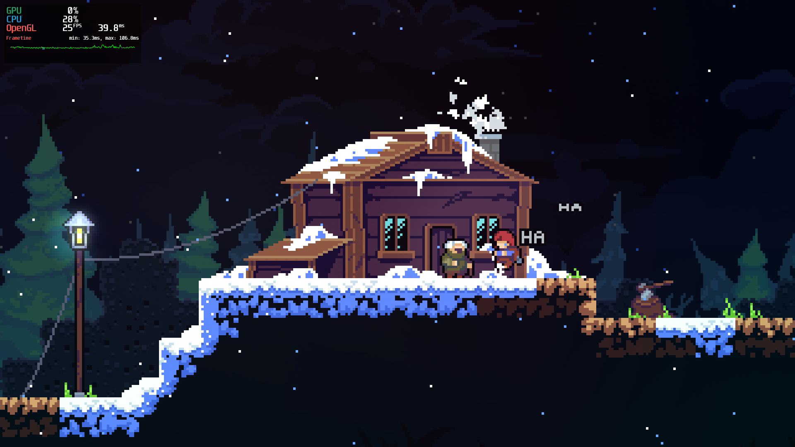

# Celeste

## Compatibility report

### Tested on

[Milk-V Jupiter](/docs/hardwares#milk-v-jupiter-soc-spacemit-m1)

### Box64 version (commit)

Box64 [ptitSeb/box64@91a8fef1](https://github.com/ptitSeb/box64/tree/91a8fef1bba2b5e398efcfab6c94ba757b34c32c)

### Game screenshot



### Game running log

```shell
Error initializing native libFAudio.so.0 (last dlerror is libFAudio.so.0: Cannot open shared object file: No such file or directory)
Error initializing native libFAudio.so.0 (last dlerror is libFAudio.so.0: Cannot open shared object file: No such file or directory)
Error initializing native libFAudio.so.0 (last dlerror is libFAudio.so.0: Cannot open shared object file: No such file or directory)
Warning, of_unconvert(...) left over 0x8000, converted 0x8001
Warning, of_unconvert(...) left over 0x8000, converted 0x8001
CELESTE : 1.4.0.0
Using EXT_swap_control_tear VSync!
FNA3D Driver: OpenGL
OpenGL Renderer: PowerVR B-Series BXE-2-32
OpenGL Driver: OpenGL ES 3.2 build 24.2@6603887
OpenGL Vendor: Imagination Technologies
MojoShader Profile: glsles
BEGIN LOAD
 - GFX LOAD: 7167ms
 - MTN LOAD: 3018ms
Using EXT_swap_control_tear VSync!
FULLSCREEN
GAME DISPLAYED (in 14386ms)
 - AUDIO LOAD: 3667ms
 - GFX DATA LOAD: 2708ms
 - MTN DATA LOAD: 1119ms
 - DIA/FONT LOAD: 6178ms
 - LEVELS LOAD: 11614ms
DONE LOADING (in 41170ms)
[ERROR] FATAL UNHANDLED EXCEPTION: System.NullReferenceException: Object reference not set to an instance of an object
  at Celeste.LevelLoader.LoadingThread () [0x001f4] in <d7b2abb405ec4c97954549f0a02e4a41>:0
```

### Rendering methods

```shell
OpenGL ES
```

[Read more: What is OpenGL ES? »](/docs/faq#what-is-opengl-es)

### Extra information

[Official Game Website](https://www.celestegame.com/)

[Steam](https://store.steampowered.com/app/504230/Celeste/)

[PCGameWiki](https://www.pcgamingwiki.com/wiki/Celeste)

### Advanced Tips

> TBD
