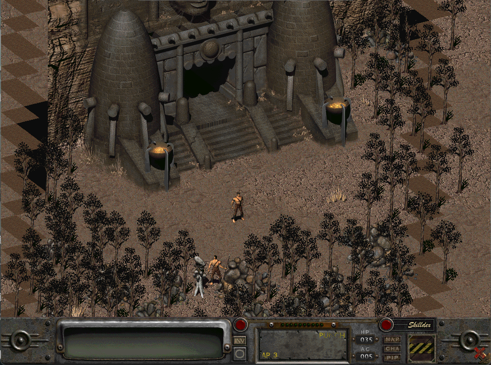

# Fallout2

## Compatibility report

### Tested on

[Lichee Pi 4A](/docs/hardwares#lichee-pi-4a-soc-th1520)

### Box64 version (commit)

Box64 [ptitSeb/box64@48f51bd](https://github.com/ptitSeb/box64/tree/48f51bd)
### Game screenshot



### Game running log

```shell
[BOX64] Box64 v0.3.3 48f51bd5 built on Feb 25 2025 12:29:00
[BOX64] Running on unknown riscv64 cpu with 4 cores, pagesize: 4096
[BOX64] Will use time-based emulation for RDTSC, even if hardware counters are available
[BOX64] Will use software counter measured at 1.0 GHz emulating 2.0 GHz
[BOX64] Didn't detect 48bits of address space, considering it's 39bits
[BOX64] Counted 25 Env var
[BOX64] Library search path:
[BOX64] Binary search path: ./:bin/:/usr/bin/:/bin/:/usr/local/bin/:/home/debian/Desktop/environment/wine-10.1-amd64-wow64/bin/:/home/debian/Desktop/environment/gl4es/lib/
[BOX64] Looking for ./start.sh
[BOX64] Not an ELF file (sign=#!/b)
[BOX64] Error: Reading elf header of /home/debian/Desktop/game/fallout2/start.sh, Try to launch using bash instead
[BOX64] Box64 v0.3.3 48f51bd5 built on Feb 25 2025 12:29:00
[BOX64] Running on unknown riscv64 cpu with 4 cores, pagesize: 4096
[BOX64] Will use time-based emulation for RDTSC, even if hardware counters are available
[BOX64] Will use software counter measured at 1.0 GHz emulating 2.0 GHz
[BOX64] Didn't detect 48bits of address space, considering it's 39bits
[BOX64] Counted 25 Env var
[BOX64] Library search path:
[BOX64] Binary search path: ./:bin/:/usr/bin/:/bin/:/usr/local/bin/:/home/debian/Desktop/environment/wine-10.1-amd64-wow64/bin/:/home/debian/Desktop/environment/gl4es/lib/
[BOX64] Looking for /usr/local/bin/box64-bash
[BOX64] Bash detected, disabling banner
[BOX64] Warning, of_unconvert(...) left over 0x8000, converted 0x8000
[BOX64] Box64 v0.3.3 48f51bd5 built on Feb 25 2025 12:29:00
[BOX64] Running on unknown riscv64 cpu with 4 cores, pagesize: 4096
[BOX64] Will use time-based emulation for RDTSC, even if hardware counters are available
[BOX64] Will use software counter measured at 1.0 GHz emulating 2.0 GHz
[BOX64] Didn't detect 48bits of address space, considering it's 39bits
[BOX64] Counted 25 Env var
[BOX64] Library search path:
[BOX64] Binary search path: ./:bin/:/usr/bin/:/bin/:/usr/local/bin/:/home/debian/Desktop/environment/wine-10.1-amd64-wow64/bin/:/home/debian/Desktop/environment/gl4es/lib/
[BOX64] Looking for ./fallout2-ce
[BOX64] Rename process to "fallout2-ce"
[BOX64] Using native(wrapped) libz.so.1
[BOX64] Using native(wrapped) libSDL2-2.0.so.0
[BOX64] Using native(wrapped) libdl.so.2
[BOX64] Using native(wrapped) libm.so.6
[BOX64] Using native(wrapped) librt.so.1
[BOX64] Using native(wrapped) libpthread.so.0
[BOX64] Using emulated /usr/lib/box64-x86_64-linux-gnu/libstdc++.so.6
[BOX64] Using emulated /usr/lib/box64-x86_64-linux-gnu/libgcc_s.so.1
[BOX64] Using native(wrapped) libc.so.6
[BOX64] Using native(wrapped) ld-linux-x86-64.so.2
[BOX64] Using native(wrapped) libutil.so.1
[BOX64] Using native(wrapped) libbsd.so.0
[BOX64] Error: Symbol gzvprintf not found, cannot apply R_X86_64_JUMP_SLOT @0x10013ed30 (0x77a0) in /home/debian/Desktop/game/fallout2/Assets-Fallout_2/fallout2-ce
```

### Rendering methods

```shell
 OpenGL ES 
```

[Read more: What is OpenGL ES? »](/docs/faq#what-is-opengl-es)

### Extra information

[Fandom](https://fallout.fandom.com/wiki/Fallout_2)

[Steam](https://store.steampowered.com/app/38410/Fallout_2_A_Post_Nuclear_Role_Playing_Game/)

[Wikipedia](https://en.wikipedia.org/wiki/Fallout_2)

### Advanced Tips

> TBD
