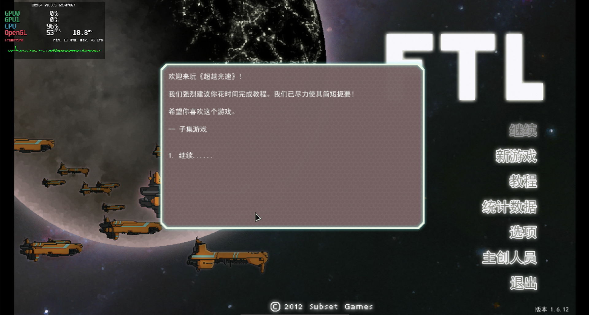
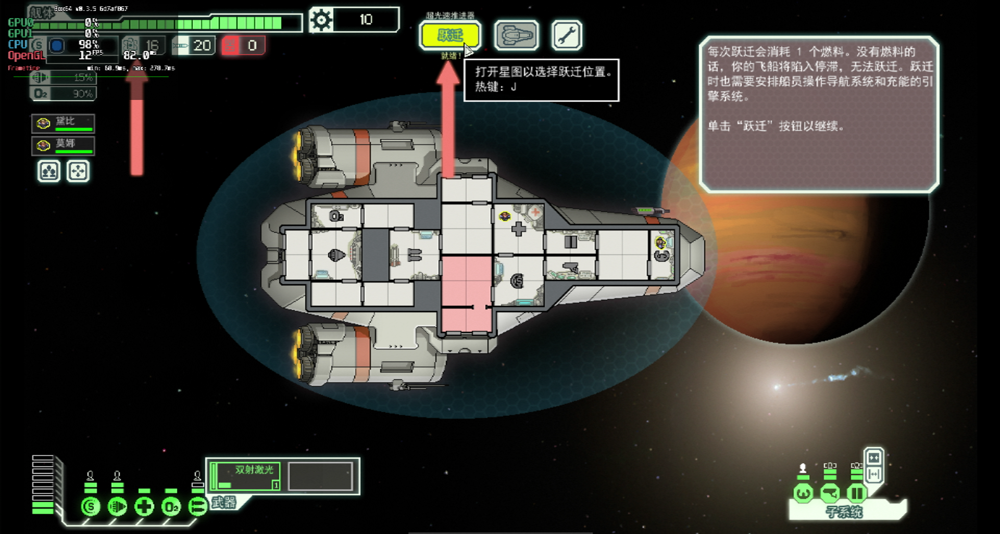

# Faster Than Light

## Compatibility report

### Tested on

[Milk-V Jupiter](/docs/hardwares#milk-v-jupiter-soc-spacemit-m1)
 with AMD Radeon RX 550

### Box64 version (commit)

Box64 [ptitSeb/box64@6d7af867](https://github.com/ptitSeb/box64/tree/6d7af867)

### Game screenshot




### Game running log

```shell
[BOX64] Box64 with Dynarec v0.3.5 6d7af867 built on Apr  6 2025 20:28:41
[BOX64] Dynarec for rv64gv_zba_zbb_zbc_zbs_zvl256
[BOX64] Running on Spacemit(R) X60 with 8 cores, pagesize: 4096
[BOX64] Will use hardware counter measured at 24.0 MHz emulating 3.0 GHz
[BOX64] Using bash "/home/rurumuri/ourstorybegin/box64/tests/box64-bash"
[BOX64] Didn't detect 48bits of address space, considering it's 39bits
[BOX64] Counted 49 Env var
[BOX64] BOX64 trying to Preload /usr/local/$LIB/mangohud/libMangoHud_shim.so 
[BOX64] Library search path: 
[BOX64] Binary search path: ./:bin/:/home/rurumuri/ourstorybegin/wine/wine-10.3-amd64-wow64/bin/:/home/rurumuri/ourstorybegin/wine/wine-10.3-amd64-wow64/bin/:/usr/local/bin/:/usr/bin/:/bin/:/usr/local/sbin/:/usr/lib/jvm/default/bin/:/usr/bin/site_perl/:/usr/bin/vendor_perl/:/usr/bin/core_perl/:/usr/lib/rustup/bin/
[BOX64] Looking for ./start.sh
[BOX64] BOX64ENV: Variables overridden via env and/or RC file:
        BOX64_BASH=/home/rurumuri/ourstorybegin/box64/tests/box64-bash
[BOX64] Not an ELF file (sign=#!/b)
[BOX64] Error: Reading elf header of /home/rurumuri/GOG Games/FTL Advanced Edition/start.sh, Try to launch using bash instead
[BOX64] Box64 with Dynarec v0.3.5 6d7af867 built on Apr  6 2025 20:28:41
[BOX64] Dynarec for rv64gv_zba_zbb_zbc_zbs_zvl256
[BOX64] Running on Spacemit(R) X60 with 8 cores, pagesize: 4096
[BOX64] Will use hardware counter measured at 24.0 MHz emulating 3.0 GHz
[BOX64] Using bash "/home/rurumuri/ourstorybegin/box64/tests/box64-bash"
[BOX64] Didn't detect 48bits of address space, considering it's 39bits
[BOX64] Counted 49 Env var
[BOX64] BOX64 trying to Preload /usr/local/$LIB/mangohud/libMangoHud_shim.so 
[BOX64] Library search path: 
[BOX64] Binary search path: ./:bin/:/home/rurumuri/ourstorybegin/wine/wine-10.3-amd64-wow64/bin/:/home/rurumuri/ourstorybegin/wine/wine-10.3-amd64-wow64/bin/:/usr/local/bin/:/usr/bin/:/bin/:/usr/local/sbin/:/usr/lib/jvm/default/bin/:/usr/bin/site_perl/:/usr/bin/vendor_perl/:/usr/bin/core_perl/:/usr/lib/rustup/bin/
[BOX64] Looking for /home/rurumuri/ourstorybegin/box64/tests/box64-bash
[BOX64] Bash detected, disabling banner
[BOX64] BOX64ENV: Variables overridden via env and/or RC file:
        BOX64_BASH=/home/rurumuri/ourstorybegin/box64/tests/box64-bash
[BOX64] argv[1]="./start.sh"
[BOX64] Rename process to "box64-bash"
[BOX64] Warning, cannot pre-load /usr/local/$LIB/mangohud/libMangoHud_shim.so
[BOX64] Using native(wrapped) libtinfo.so.6
[BOX64] Using native(wrapped) libdl.so.2
[BOX64] Using native(wrapped) libc.so.6
[BOX64] Using native(wrapped) ld-linux-x86-64.so.2
[BOX64] Using native(wrapped) libpthread.so.0
[BOX64] Using native(wrapped) libutil.so.1
[BOX64] Using native(wrapped) librt.so.1
[BOX64] Using native(wrapped) libbsd.so.0
[BOX64] Warning, of_unconvert(...) left over 0x8000, converted 0x8000
Running FTL: Advanced Edition
[BOX64] Box64 with Dynarec v0.3.5 6d7af867 built on Apr  6 2025 20:28:41
[BOX64] Dynarec for rv64gv_zba_zbb_zbc_zbs_zvl256
[BOX64] Running on Spacemit(R) X60 with 8 cores, pagesize: 4096
[BOX64] Will use hardware counter measured at 24.0 MHz emulating 3.0 GHz
[BOX64] Using bash "/home/rurumuri/ourstorybegin/box64/tests/box64-bash"
[BOX64] Didn't detect 48bits of address space, considering it's 39bits
[BOX64] Counted 50 Env var
[BOX64] BOX64 trying to Preload /usr/local/$LIB/mangohud/libMangoHud_shim.so 
[BOX64] Library search path: 
[BOX64] Binary search path: ./:bin/:/home/rurumuri/ourstorybegin/wine/wine-10.3-amd64-wow64/bin/:/home/rurumuri/ourstorybegin/wine/wine-10.3-amd64-wow64/bin/:/usr/local/bin/:/usr/bin/:/bin/:/usr/local/sbin/:/usr/lib/jvm/default/bin/:/usr/bin/site_perl/:/usr/bin/vendor_perl/:/usr/bin/core_perl/:/usr/lib/rustup/bin/
[BOX64] Looking for /home/rurumuri/ourstorybegin/box64/tests/box64-bash
[BOX64] Bash detected, disabling banner
[BOX64] BOX64ENV: Variables overridden via env and/or RC file:
        BOX64_BASH=/home/rurumuri/ourstorybegin/box64/tests/box64-bash
[BOX64] argv[1]="./FTL"
[BOX64] Rename process to "box64-bash"
[BOX64] Warning, cannot pre-load /usr/local/$LIB/mangohud/libMangoHud_shim.so
[BOX64] Using native(wrapped) libtinfo.so.6
[BOX64] Using native(wrapped) libdl.so.2
[BOX64] Using native(wrapped) libc.so.6
[BOX64] Using native(wrapped) ld-linux-x86-64.so.2
[BOX64] Using native(wrapped) libpthread.so.0
[BOX64] Using native(wrapped) libutil.so.1
[BOX64] Using native(wrapped) librt.so.1
[BOX64] Using native(wrapped) libbsd.so.0
[BOX64] Warning, of_unconvert(...) left over 0x8000, converted 0x8000
[BOX64] Box64 with Dynarec v0.3.5 6d7af867 built on Apr  6 2025 20:28:41
[BOX64] Dynarec for rv64gv_zba_zbb_zbc_zbs_zvl256
[BOX64] Running on Spacemit(R) X60 with 8 cores, pagesize: 4096
[BOX64] Will use hardware counter measured at 24.0 MHz emulating 3.0 GHz
[BOX64] Using bash "/home/rurumuri/ourstorybegin/box64/tests/box64-bash"
[BOX64] Didn't detect 48bits of address space, considering it's 39bits
[BOX64] Counted 49 Env var
[BOX64] BOX64 trying to Preload /usr/local/$LIB/mangohud/libMangoHud_shim.so 
[BOX64] Library search path: 
[BOX64] Binary search path: ./:bin/:/home/rurumuri/ourstorybegin/wine/wine-10.3-amd64-wow64/bin/:/home/rurumuri/ourstorybegin/wine/wine-10.3-amd64-wow64/bin/:/usr/local/bin/:/usr/bin/:/bin/:/usr/local/sbin/:/usr/lib/jvm/default/bin/:/usr/bin/site_perl/:/usr/bin/vendor_perl/:/usr/bin/core_perl/:/usr/lib/rustup/bin/
[BOX64] Looking for /home/rurumuri/ourstorybegin/box64/tests/box64-bash
[BOX64] Bash detected, disabling banner
[BOX64] BOX64ENV: Variables overridden via env and/or RC file:
        BOX64_BASH=/home/rurumuri/ourstorybegin/box64/tests/box64-bash
[BOX64] argv[1]="/home/rurumuri/GOG Games/FTL Advanced Edition/game/data/FTL"
[BOX64] Rename process to "box64-bash"
[BOX64] Warning, cannot pre-load /usr/local/$LIB/mangohud/libMangoHud_shim.so
[BOX64] Using native(wrapped) libtinfo.so.6
[BOX64] Using native(wrapped) libdl.so.2
[BOX64] Using native(wrapped) libc.so.6
[BOX64] Using native(wrapped) ld-linux-x86-64.so.2
[BOX64] Using native(wrapped) libpthread.so.0
[BOX64] Using native(wrapped) libutil.so.1
[BOX64] Using native(wrapped) librt.so.1
[BOX64] Using native(wrapped) libbsd.so.0
[BOX64] Warning, of_unconvert(...) left over 0x8000, converted 0x8000
Loading Arch = amd64
[BOX64] Box64 with Dynarec v0.3.5 6d7af867 built on Apr  6 2025 20:28:41
[BOX64] Dynarec for rv64gv_zba_zbb_zbc_zbs_zvl256
[BOX64] Running on Spacemit(R) X60 with 8 cores, pagesize: 4096
[BOX64] Will use hardware counter measured at 24.0 MHz emulating 3.0 GHz
[BOX64] Using bash "/home/rurumuri/ourstorybegin/box64/tests/box64-bash"
[BOX64] Didn't detect 48bits of address space, considering it's 39bits
[BOX64] Counted 51 Env var
[BOX64] BOX64 trying to Preload /usr/local/$LIB/mangohud/libMangoHud_shim.so 
[BOX64] Library search path: 
[BOX64] Binary search path: ./:bin/:/home/rurumuri/ourstorybegin/wine/wine-10.3-amd64-wow64/bin/:/home/rurumuri/ourstorybegin/wine/wine-10.3-amd64-wow64/bin/:/usr/local/bin/:/usr/bin/:/bin/:/usr/local/sbin/:/usr/lib/jvm/default/bin/:/usr/bin/site_perl/:/usr/bin/vendor_perl/:/usr/bin/core_perl/:/usr/lib/rustup/bin/
[BOX64] Looking for /home/rurumuri/GOG Games/FTL Advanced Edition/game/data/FTL.amd64
[BOX64] BOX64ENV: Variables overridden via env and/or RC file:
        BOX64_BASH=/home/rurumuri/ourstorybegin/box64/tests/box64-bash
[BOX64] Rename process to "FTL.amd64"
[BOX64] Warning, cannot pre-load /usr/local/$LIB/mangohud/libMangoHud_shim.so
[BOX64] Using native(wrapped) libGL.so.1
[BOX64] Using native(wrapped) libX11.so.6
[BOX64] Using native(wrapped) libxcb.so.1
[BOX64] Using native(wrapped) libXau.so.6
[BOX64] Using native(wrapped) libXdmcp.so.6
[BOX64] Using native(wrapped) libasound.so.2
[BOX64] Using native(wrapped) libdl.so.2
[BOX64] Using native(wrapped) libpthread.so.0
[BOX64] Using native(wrapped) librt.so.1
[BOX64] Using native(wrapped) libm.so.6
[BOX64] Using native(wrapped) libc.so.6
[BOX64] Using native(wrapped) ld-linux-x86-64.so.2
[BOX64] Using native(wrapped) libutil.so.1
[BOX64] Using native(wrapped) libbsd.so.0
[BOX64] Using native(wrapped) libXi.so.6
[BOX64] Using native(wrapped) libXext.so.6
[BOX64] Using native(wrapped) libXinerama.so.1
[BOX64] Using native(wrapped) libXrandr.so.2
[BOX64] Using native(wrapped) libXrender.so.1
[BOX64] Using native(wrapped) libXxf86vm.so.1
Version: 1.6.12
Loading settings
Failed to load settings file!
Initializing Crash Catcher...
Starting up
Loading text
Initializing Video
Video: 1280x720, windowed
Video Initialized
Renderer: OpenGL version 4.6 (GL_VERSION: 4.6 (Compatibility Profile) Mesa 24.3.4-arch1.1)
Creating FBO...
Starting audio library...
Audio Initialized!
[2025-04-17 12:57:11.565] [MANGOHUD] [error] [cpu.cpp:552] Could not find cpu temp sensor location
Resource Preload: 44.550
Initializing animations...
Animations Initialized!
Loading Ship Blueprints....
Blueprints Loaded!
Initializing Sound Data....
Generating world...
Loading achievements...
Loading score file...
Running Game!
./start.sh: line 16: 34252 Killed                  ./"FTL"
```

### Rendering methods

```shell
OpenGL
```

### Extra information

[Steam](https://store.steampowered.com/news/app/212680/view/2886200631335082270)

[PCGameWiki](https://www.pcgamingwiki.com/wiki/FTL:_Faster_Than_Light)

### Advanced Tips

> TBD