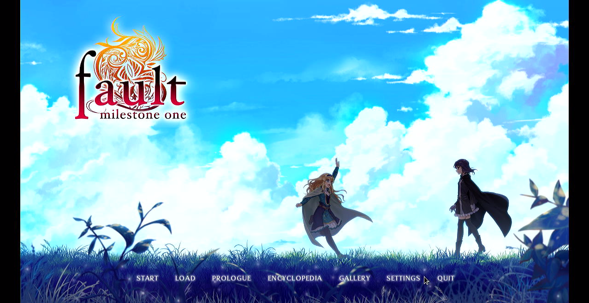
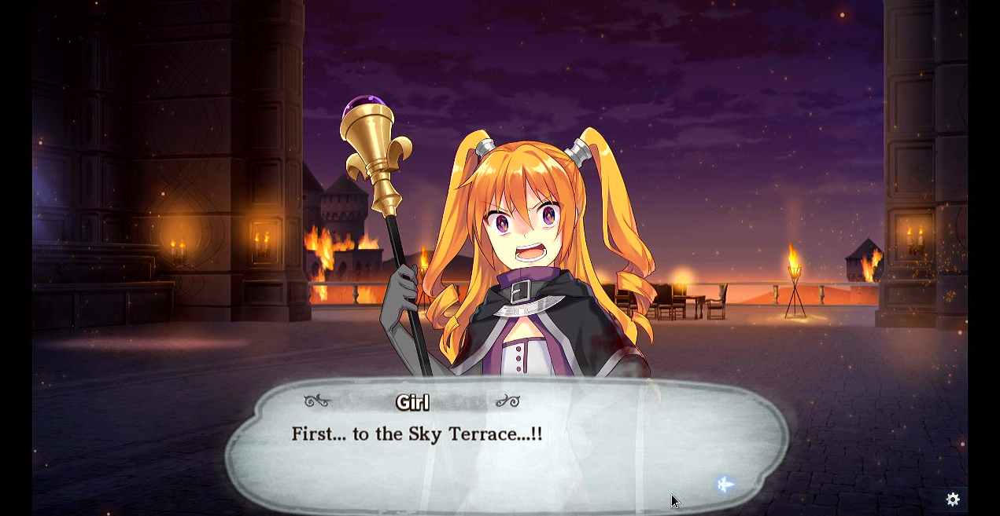

# fault - milestone one

## Compatibility report

### Tested on

[Lichee Pi 4A](/docs/hardwares#lichee-pi-4a-soc-th1520)

### Box64 version (commit)

Box64 [ptitSeb/box64@69f49f79](https://github.com/ptitSeb/box64/tree/69f49f79)

### Game screenshot




### Game running log

```shell
[BOX64] Dynarec for rv64g_xtheadba_xtheadbb_xtheadbs_xtheadmempair_xtheadcondmov_xtheadmemidx_xthvector
[BOX64] Running on unknown riscv64 cpu with 4 cores, pagesize: 4096
[BOX64] Will use hardware counter measured at 3.0 MHz emulating 3.0 GHz
[BOX64] Using bash "/home/sipeed/ourstorybegin/box64/box64_/tests/box64-bash"
[BOX64] Box64 with Dynarec v0.3.3 69f49f79 built on Feb  6 2025 13:52:28
[BOX64] Didn't detect 48bits of address space, considering it's 39bits
[BOX64] Counted 41 Env var
[BOX64] BOX64 LIB PATH: 
[BOX64] BOX64 BIN PATH: ./:bin/:/home/sipeed/ourstorybegin/wine/wine-9.22-amd64-wow64/bin/:/usr/local/bin/:/usr/bin/:/bin/:/usr/local/games/:/usr/games/
[BOX64] Looking for ./start.sh
[BOX64] BOX64ENV: Variables overridden via env and/or RC file:
        BOX64_BASH=/home/sipeed/ourstorybegin/box64/box64_/tests/box64-bash
[BOX64] Not an ELF file (sign=#!/b)
[BOX64] Error: Reading elf header of /home/sipeed/games/GOG Games/fault milestone one/start.sh, Try to launch using bash instead
[BOX64] Dynarec for rv64g_xtheadba_xtheadbb_xtheadbs_xtheadmempair_xtheadcondmov_xtheadmemidx_xthvector
[BOX64] Running on unknown riscv64 cpu with 4 cores, pagesize: 4096
[BOX64] Will use hardware counter measured at 3.0 MHz emulating 3.0 GHz
[BOX64] Using bash "/home/sipeed/ourstorybegin/box64/box64_/tests/box64-bash"
[BOX64] Box64 with Dynarec v0.3.3 69f49f79 built on Feb  6 2025 13:52:28
[BOX64] Didn't detect 48bits of address space, considering it's 39bits
[BOX64] Counted 41 Env var
[BOX64] BOX64 LIB PATH: 
[BOX64] BOX64 BIN PATH: ./:bin/:/home/sipeed/ourstorybegin/wine/wine-9.22-amd64-wow64/bin/:/usr/local/bin/:/usr/bin/:/bin/:/usr/local/games/:/usr/games/
[BOX64] Looking for /home/sipeed/ourstorybegin/box64/box64_/tests/box64-bash
[BOX64] Bash detected, disabling banner
[BOX64] BOX64ENV: Variables overridden via env and/or RC file:
        BOX64_BASH=/home/sipeed/ourstorybegin/box64/box64_/tests/box64-bash
[BOX64] argv[1]="./start.sh"
[BOX64] Rename process to "box64-bash"
[BOX64] Using native(wrapped) libtinfo.so.6
[BOX64] Using native(wrapped) libdl.so.2
[BOX64] Using native(wrapped) libc.so.6
[BOX64] Using native(wrapped) ld-linux-x86-64.so.2
[BOX64] Using native(wrapped) libpthread.so.0
[BOX64] Using native(wrapped) libutil.so.1
[BOX64] Using native(wrapped) librt.so.1
[BOX64] Using native(wrapped) libbsd.so.0
[BOX64] Warning, of_unconvert(...) left over 0x8000, converted 0x8000
Running fault - milestone one
[BOX64] Dynarec for rv64g_xtheadba_xtheadbb_xtheadbs_xtheadmempair_xtheadcondmov_xtheadmemidx_xthvector
[BOX64] Running on unknown riscv64 cpu with 4 cores, pagesize: 4096
[BOX64] Will use hardware counter measured at 3.0 MHz emulating 3.0 GHz
[BOX64] Using bash "/home/sipeed/ourstorybegin/box64/box64_/tests/box64-bash"
[BOX64] Box64 with Dynarec v0.3.3 69f49f79 built on Feb  6 2025 13:52:28
[BOX64] Didn't detect 48bits of address space, considering it's 39bits
[BOX64] Counted 41 Env var
[BOX64] BOX64 LIB PATH: 
[BOX64] BOX64 BIN PATH: ./:bin/:/home/sipeed/ourstorybegin/wine/wine-9.22-amd64-wow64/bin/:/usr/local/bin/:/usr/bin/:/bin/:/usr/local/games/:/usr/games/
[BOX64] Looking for /home/sipeed/ourstorybegin/box64/box64_/tests/box64-bash
[BOX64] Bash detected, disabling banner
[BOX64] BOX64ENV: Variables overridden via env and/or RC file:
        BOX64_BASH=/home/sipeed/ourstorybegin/box64/box64_/tests/box64-bash
[BOX64] argv[1]="./faultms1.sh"
[BOX64] Rename process to "box64-bash"
[BOX64] Using native(wrapped) libtinfo.so.6
[BOX64] Using native(wrapped) libdl.so.2
[BOX64] Using native(wrapped) libc.so.6
[BOX64] Using native(wrapped) ld-linux-x86-64.so.2
[BOX64] Using native(wrapped) libpthread.so.0
[BOX64] Using native(wrapped) libutil.so.1
[BOX64] Using native(wrapped) librt.so.1
[BOX64] Using native(wrapped) libbsd.so.0
[BOX64] Warning, of_unconvert(...) left over 0x8000, converted 0x8000
[BOX64] Dynarec for rv64g_xtheadba_xtheadbb_xtheadbs_xtheadmempair_xtheadcondmov_xtheadmemidx_xthvector
[BOX64] Running on unknown riscv64 cpu with 4 cores, pagesize: 4096
[BOX64] Will use hardware counter measured at 3.0 MHz emulating 3.0 GHz
[BOX64] Using bash "/home/sipeed/ourstorybegin/box64/box64_/tests/box64-bash"
[BOX64] Box64 with Dynarec v0.3.3 69f49f79 built on Feb  6 2025 13:52:28
[BOX64] Didn't detect 48bits of address space, considering it's 39bits
[BOX64] Counted 40 Env var
[BOX64] BOX64 LIB PATH: 
[BOX64] BOX64 BIN PATH: ./:bin/:/home/sipeed/ourstorybegin/wine/wine-9.22-amd64-wow64/bin/:/usr/local/bin/:/usr/bin/:/bin/:/usr/local/games/:/usr/games/
[BOX64] Looking for /home/sipeed/games/GOG Games/fault milestone one/game/lib/linux-x86_64/faultms1
[BOX64] BOX64ENV: Variables overridden via env and/or RC file:
        BOX64_BASH=/home/sipeed/ourstorybegin/box64/box64_/tests/box64-bash
[BOX64] argv[1]="-EO"
[BOX64] argv[2]="/home/sipeed/games/GOG Games/fault milestone one/game/faultms1.py"
[BOX64] Rename process to "faultms1"
[BOX64] Using emulated /home/sipeed/games/GOG Games/fault milestone one/game/lib/linux-x86_64/libpython2.7.so.1.0
[BOX64] Using native(wrapped) libpthread.so.0
[BOX64] Using native(wrapped) libdl.so.2
[BOX64] Using native(wrapped) libutil.so.1
[BOX64] Using native(wrapped) libm.so.6
[BOX64] Using native(wrapped) libc.so.6
[BOX64] Using native(wrapped) ld-linux-x86-64.so.2
[BOX64] Using native(wrapped) librt.so.1
[BOX64] Using native(wrapped) libbsd.so.0
[BOX64] Using emulated /home/sipeed/games/GOG Games/fault milestone one/game/lib/linux-x86_64/lib/python2.7/_locale.so
[BOX64] Using emulated /home/sipeed/games/GOG Games/fault milestone one/game/lib/linux-x86_64/lib/python2.7/strop.so
[BOX64] Using emulated /home/sipeed/games/GOG Games/fault milestone one/game/lib/linux-x86_64/lib/python2.7/time.so
[BOX64] Using emulated /home/sipeed/games/GOG Games/fault milestone one/game/lib/linux-x86_64/lib/python2.7/_ctypes.so
[BOX64] Using emulated /home/sipeed/games/GOG Games/fault milestone one/game/lib/linux-x86_64/lib/python2.7/_struct.so
[BOX64] Using emulated /home/sipeed/games/GOG Games/fault milestone one/game/lib/linux-x86_64/lib/python2.7/_collections.so
[BOX64] Using emulated /home/sipeed/games/GOG Games/fault milestone one/game/lib/linux-x86_64/lib/python2.7/operator.so
[BOX64] Using emulated /home/sipeed/games/GOG Games/fault milestone one/game/lib/linux-x86_64/lib/python2.7/itertools.so
[BOX64] Using emulated /home/sipeed/games/GOG Games/fault milestone one/game/lib/linux-x86_64/lib/python2.7/_heapq.so
[BOX64] Using emulated /home/sipeed/games/GOG Games/fault milestone one/game/lib/linux-x86_64/lib/python2.7/cPickle.so
[BOX64] Using emulated /home/sipeed/games/GOG Games/fault milestone one/game/lib/linux-x86_64/lib/python2.7/cStringIO.so
[BOX64] Using emulated /home/sipeed/games/GOG Games/fault milestone one/game/lib/linux-x86_64/lib/python2.7/select.so
[BOX64] Using emulated /home/sipeed/games/GOG Games/fault milestone one/game/lib/linux-x86_64/lib/python2.7/fcntl.so
[BOX64] Using emulated /home/sipeed/games/GOG Games/fault milestone one/game/lib/linux-x86_64/lib/python2.7/binascii.so
[BOX64] Using native(wrapped) libz.so.1
[BOX64] Using emulated /home/sipeed/games/GOG Games/fault milestone one/game/lib/linux-x86_64/lib/python2.7/_io.so
[BOX64] Using emulated /home/sipeed/games/GOG Games/fault milestone one/game/lib/linux-x86_64/lib/python2.7/math.so
[BOX64] Using emulated /home/sipeed/games/GOG Games/fault milestone one/game/lib/linux-x86_64/lib/python2.7/_md5.so
[BOX64] Using emulated /home/sipeed/games/GOG Games/fault milestone one/game/lib/linux-x86_64/lib/python2.7/_sha.so
[BOX64] Using emulated /home/sipeed/games/GOG Games/fault milestone one/game/lib/linux-x86_64/lib/python2.7/_sha256.so
[BOX64] Using emulated /home/sipeed/games/GOG Games/fault milestone one/game/lib/linux-x86_64/lib/python2.7/_sha512.so
[BOX64] Using emulated /home/sipeed/games/GOG Games/fault milestone one/game/lib/linux-x86_64/lib/python2.7/_random.so
[BOX64] Using emulated /home/sipeed/games/GOG Games/fault milestone one/game/lib/linux-x86_64/lib/python2.7/_functools.so
[BOX64] Using emulated /home/sipeed/games/GOG Games/fault milestone one/game/lib/linux-x86_64/lib/python2.7/pygame_sdl2/error.so
[BOX64] Using native(wrapped) libSDL2-2.0.so.0
[BOX64] Using emulated /home/sipeed/games/GOG Games/fault milestone one/game/lib/linux-x86_64/lib/python2.7/pygame_sdl2/surface.so
[BOX64] Using emulated /home/sipeed/games/GOG Games/fault milestone one/game/lib/linux-x86_64/lib/python2.7/pygame_sdl2/color.so
[BOX64] Using emulated /home/sipeed/games/GOG Games/fault milestone one/game/lib/linux-x86_64/lib/python2.7/pygame_sdl2/rect.so
[BOX64] Using emulated /home/sipeed/games/GOG Games/fault milestone one/game/lib/linux-x86_64/lib/python2.7/pygame_sdl2/locals.so
[BOX64] Using emulated /home/sipeed/games/GOG Games/fault milestone one/game/lib/linux-x86_64/lib/python2.7/pygame_sdl2/display.so
[BOX64] Using emulated /home/sipeed/games/GOG Games/fault milestone one/game/lib/linux-x86_64/lib/python2.7/pygame_sdl2/event.so
[BOX64] Using emulated /home/sipeed/games/GOG Games/fault milestone one/game/lib/linux-x86_64/lib/python2.7/pygame_sdl2/key.so
[BOX64] Using emulated /home/sipeed/games/GOG Games/fault milestone one/game/lib/linux-x86_64/lib/python2.7/pygame_sdl2/pygame_time.so
[BOX64] Using emulated /home/sipeed/games/GOG Games/fault milestone one/game/lib/linux-x86_64/lib/python2.7/pygame_sdl2/controller.so
[BOX64] Using emulated /home/sipeed/games/GOG Games/fault milestone one/game/lib/linux-x86_64/lib/python2.7/pygame_sdl2/rwobject.so
[BOX64] Using emulated /home/sipeed/games/GOG Games/fault milestone one/game/lib/linux-x86_64/lib/python2.7/pygame_sdl2/draw.so
[BOX64] Using emulated /home/sipeed/games/GOG Games/fault milestone one/game/lib/linux-x86_64/lib/python2.7/pygame_sdl2/gfxdraw.so
[BOX64] Using emulated /home/sipeed/games/GOG Games/fault milestone one/game/lib/linux-x86_64/lib/python2.7/pygame_sdl2/font.so
[BOX64] Error initializing native libSDL2_ttf-2.0.so.0 (last dlerror is libSDL2_ttf-2.0.so.0: cannot open shared object file: No such file or directory)
[BOX64] Using emulated /home/sipeed/games/GOG Games/fault milestone one/game/lib/linux-x86_64/lib/python2.7/pygame_sdl2/../../../libSDL2_ttf-2.0.so.0
[BOX64] Using native(wrapped) libfreetype.so.6
[BOX64] Using emulated /home/sipeed/games/GOG Games/fault milestone one/game/lib/linux-x86_64/lib/python2.7/pygame_sdl2/image.so
[BOX64] Error initializing native libSDL2_image-2.0.so.0 (last dlerror is libSDL2_image-2.0.so.0: cannot open shared object file: No such file or directory)
[BOX64] Using emulated /home/sipeed/games/GOG Games/fault milestone one/game/lib/linux-x86_64/lib/python2.7/pygame_sdl2/../../../libSDL2_image-2.0.so.0
[BOX64] Using emulated /home/sipeed/games/GOG Games/fault milestone one/game/lib/linux-x86_64/lib/python2.7/pygame_sdl2/../../../libjpeg.so.62
[BOX64] Using emulated /home/sipeed/games/GOG Games/fault milestone one/game/lib/linux-x86_64/lib/python2.7/pygame_sdl2/../../../libpng12.so.0
[BOX64] Using emulated /home/sipeed/games/GOG Games/fault milestone one/game/lib/linux-x86_64/lib/python2.7/pygame_sdl2/joystick.so
[BOX64] Using emulated /home/sipeed/games/GOG Games/fault milestone one/game/lib/linux-x86_64/lib/python2.7/pygame_sdl2/mouse.so
[BOX64] Using emulated /home/sipeed/games/GOG Games/fault milestone one/game/lib/linux-x86_64/lib/python2.7/pygame_sdl2/transform.so
[BOX64] Using emulated /home/sipeed/games/GOG Games/fault milestone one/game/lib/linux-x86_64/lib/python2.7/pygame_sdl2/scrap.so
[BOX64] Using emulated /home/sipeed/games/GOG Games/fault milestone one/game/lib/linux-x86_64/lib/python2.7/_renpy.so
[BOX64] Using emulated /home/sipeed/games/GOG Games/fault milestone one/game/lib/linux-x86_64/lib/python2.7/datetime.so
[BOX64] Using emulated /home/sipeed/games/GOG Games/fault milestone one/game/lib/linux-x86_64/lib/python2.7/zlib.so
[BOX64] Using emulated /home/sipeed/games/GOG Games/fault milestone one/game/lib/linux-x86_64/lib/python2.7/grp.so
[BOX64] Using emulated /home/sipeed/games/GOG Games/fault milestone one/game/lib/linux-x86_64/lib/python2.7/_json.so
[BOX64] Using emulated /home/sipeed/games/GOG Games/fault milestone one/game/lib/linux-x86_64/lib/python2.7/renpy/parsersupport.so
[BOX64] Using emulated /home/sipeed/games/GOG Games/fault milestone one/game/lib/linux-x86_64/lib/python2.7/renpy/style.so
[BOX64] Using emulated /home/sipeed/games/GOG Games/fault milestone one/game/lib/linux-x86_64/lib/python2.7/renpy/styledata/stylesets.so
[BOX64] Using emulated /home/sipeed/games/GOG Games/fault milestone one/game/lib/linux-x86_64/lib/python2.7/renpy/styledata/style_functions.so
[BOX64] Using emulated /home/sipeed/games/GOG Games/fault milestone one/game/lib/linux-x86_64/lib/python2.7/renpy/styledata/style_activate_functions.so
[BOX64] Using emulated /home/sipeed/games/GOG Games/fault milestone one/game/lib/linux-x86_64/lib/python2.7/renpy/styledata/style_hover_functions.so
[BOX64] Using emulated /home/sipeed/games/GOG Games/fault milestone one/game/lib/linux-x86_64/lib/python2.7/renpy/styledata/style_idle_functions.so
[BOX64] Using emulated /home/sipeed/games/GOG Games/fault milestone one/game/lib/linux-x86_64/lib/python2.7/renpy/styledata/style_insensitive_functions.so
[BOX64] Using emulated /home/sipeed/games/GOG Games/fault milestone one/game/lib/linux-x86_64/lib/python2.7/renpy/styledata/style_selected_functions.so
[BOX64] Using emulated /home/sipeed/games/GOG Games/fault milestone one/game/lib/linux-x86_64/lib/python2.7/renpy/styledata/style_selected_activate_functions.so
[BOX64] Using emulated /home/sipeed/games/GOG Games/fault milestone one/game/lib/linux-x86_64/lib/python2.7/renpy/styledata/style_selected_hover_functions.so
[BOX64] Using emulated /home/sipeed/games/GOG Games/fault milestone one/game/lib/linux-x86_64/lib/python2.7/renpy/styledata/style_selected_idle_functions.so
[BOX64] Using emulated /home/sipeed/games/GOG Games/fault milestone one/game/lib/linux-x86_64/lib/python2.7/renpy/styledata/style_selected_insensitive_functions.so
[BOX64] Using emulated /home/sipeed/games/GOG Games/fault milestone one/game/lib/linux-x86_64/lib/python2.7/renpy/styledata/styleclass.so
[BOX64] Using emulated /home/sipeed/games/GOG Games/fault milestone one/game/lib/linux-x86_64/lib/python2.7/renpy/display/render.so
[BOX64] Using emulated /home/sipeed/games/GOG Games/fault milestone one/game/lib/linux-x86_64/lib/python2.7/renpy/text/ftfont.so
[BOX64] Using emulated /home/sipeed/games/GOG Games/fault milestone one/game/lib/linux-x86_64/lib/python2.7/renpy/text/textsupport.so
[BOX64] Using emulated /home/sipeed/games/GOG Games/fault milestone one/game/lib/linux-x86_64/lib/python2.7/renpy/text/texwrap.so
[BOX64] Using emulated /home/sipeed/games/GOG Games/fault milestone one/game/lib/linux-x86_64/lib/python2.7/_renpybidi.so
[BOX64] Using emulated /home/sipeed/games/GOG Games/fault milestone one/game/lib/linux-x86_64/lib/python2.7/renpy/display/accelerator.so
[BOX64] Using emulated /home/sipeed/games/GOG Games/fault milestone one/game/lib/linux-x86_64/lib/python2.7/renpy/audio/renpysound.so
[BOX64] Using emulated /home/sipeed/games/GOG Games/fault milestone one/game/lib/linux-x86_64/lib/python2.7/renpy/audio/../../../../libswscale.so.4
[BOX64] Using emulated /home/sipeed/games/GOG Games/fault milestone one/game/lib/linux-x86_64/lib/python2.7/renpy/audio/../../../../libavresample.so.3
[BOX64] Using emulated /home/sipeed/games/GOG Games/fault milestone one/game/lib/linux-x86_64/lib/python2.7/renpy/audio/../../../../libavformat.so.57
[BOX64] Using emulated /home/sipeed/games/GOG Games/fault milestone one/game/lib/linux-x86_64/lib/python2.7/renpy/audio/../../../../libavcodec.so.57
[BOX64] Using emulated /home/sipeed/games/GOG Games/fault milestone one/game/lib/linux-x86_64/lib/python2.7/renpy/audio/../../../../libavutil.so.55
[BOX64] Using emulated /home/sipeed/games/GOG Games/fault milestone one/game/lib/linux-x86_64/lib/python2.7/renpy/audio/../../../../libswresample.so.2
[BOX64] Using emulated /home/sipeed/games/GOG Games/fault milestone one/game/lib/linux-x86_64/lib/python2.7/_socket.so
[BOX64] Using emulated /home/sipeed/games/GOG Games/fault milestone one/game/lib/linux-x86_64/lib/python2.7/array.so
[BOX64] Using emulated /home/sipeed/games/GOG Games/fault milestone one/game/lib/linux-x86_64/lib/python2.7/renpy/gl/gldraw.so
[BOX64] Using emulated /home/sipeed/games/GOG Games/fault milestone one/game/lib/linux-x86_64/lib/python2.7/renpy/gl/../../../../libGLEW.so.1.7
[BOX64] Using native(wrapped) libXmu.so.6
[BOX64] Using native(wrapped) libX11.so.6
[BOX64] Using native(wrapped) libxcb.so.1
[BOX64] Using native(wrapped) libXau.so.6
[BOX64] Using native(wrapped) libXdmcp.so.6
[BOX64] Using native(wrapped) libXext.so.6
[BOX64] Using native(wrapped) libXi.so.6
[BOX64] Using native(wrapped) libGLU.so.1
LIBGL: Initialising gl4es
LIBGL: v1.1.7 built on Feb  8 2025 20:56:51
LIBGL: Using GLES 2.0 backend
LIBGL: loaded: libGLESv2.so
LIBGL: loaded: libEGL.so
LIBGL: Using GLES 2.0 backend
LIBGL: Hardware Full NPOT detected and used
LIBGL: Extension GL_EXT_blend_minmax  detected and used
LIBGL: Extension GL_EXT_draw_buffers  detected and used
LIBGL: FBO are in core, and so used
LIBGL: PointSprite are in core, and so used
LIBGL: CubeMap are in core, and so used
LIBGL: BlendColor is in core, and so used
LIBGL: Blend Subtract is in core, and so used
LIBGL: Blend Function and Equation Separation is in core, and so used
LIBGL: Texture Mirrored Repeat is in core, and so used
LIBGL: Extension GL_OES_mapbuffer  detected
LIBGL: Extension GL_OES_element_index_uint  detected and used
LIBGL: Extension GL_OES_packed_depth_stencil  detected and used
LIBGL: Extension GL_OES_depth24  detected and used
LIBGL: Extension GL_OES_rgb8_rgba8  detected and used
LIBGL: Extension GL_EXT_multi_draw_arrays  detected
LIBGL: Extension GL_EXT_texture_format_BGRA8888  detected and used
LIBGL: Extension GL_OES_depth_texture  detected and used
LIBGL: Extension GL_OES_texture_stencil8  detected and used
LIBGL: Extension GL_EXT_texture_rg  detected and used
LIBGL: Extension GL_OES_texture_float  detected and used
LIBGL: Extension GL_OES_texture_half_float  detected and used
LIBGL: Extension GL_EXT_color_buffer_float  detected and used
LIBGL: Extension GL_EXT_color_buffer_half_float  detected and used
LIBGL: Extension GL_OES_fragment_precision_high  detected and used
LIBGL: Extension GL_EXT_shader_texture_lod detected and used
129.591342 (12889) PVR:(Error): DoCompileShader:  Failed to compile shader [ shadercompile.c:10866 ]
LIBGL: Max vertex attrib: 16
LIBGL: Extension GL_OES_standard_derivatives  detected and used
LIBGL: Extension GL_OES_get_program_binary  detected and used
LIBGL: Number of supported Program Binary Format: 1
LIBGL: Max texture size: 8192
LIBGL: Max Varying Vector: 15
LIBGL: Texture Units: 16/16 (hardware: 16), Max lights: 8, Max planes: 6
LIBGL: Max Color Attachments: 8 / Draw buffers: 8
LIBGL: Hardware vendor is Imagination Technologies
129.591783 (12889) PVR:(Error): DoCompileShader:  Failed to compile shader [ shadercompile.c:10866 ]
129.592041 (12889) PVR:(Error): DoCompileShader:  Failed to compile shader [ shadercompile.c:10866 ]
129.592296 (12889) PVR:(Error): DoCompileShader:  Failed to compile shader [ shadercompile.c:10866 ]
LIBGL: sRGB surface supported
LIBGL: EGLImage from Pixmap supported
LIBGL: EGLImage to Texture2D supported
LIBGL: EGLImage to RenderBuffer supported
LIBGL: Targeting OpenGL 2.1
LIBGL: Not trying to batch small subsequent glDrawXXXX
LIBGL: Trying to use VBO
LIBGL: FBO workaround for using binded texture enabled
LIBGL: Force texture for Attachment color0 on FBO
LIBGL: Hack to trigger a SwapBuffers when a Full Framebuffer Blit on default FBO is done
LIBGL: glX Will try to recycle EGL Surface
LIBGL: Current folder is:/home/sipeed/games/GOG Games/fault milestone one/game
LIBGL: Loaded a PSA with 2 Precompiled Programs
[BOX64] Using native(wrapped) libGL.so.1
[BOX64] Using emulated /home/sipeed/games/GOG Games/fault milestone one/game/lib/linux-x86_64/lib/python2.7/renpy/gl/gltexture.so
[BOX64] Using emulated /home/sipeed/games/GOG Games/fault milestone one/game/lib/linux-x86_64/lib/python2.7/renpy/gl/gl.so
[BOX64] Using emulated /home/sipeed/games/GOG Games/fault milestone one/game/lib/linux-x86_64/lib/python2.7/renpy/gl/glrtt_copy.so
[BOX64] Using emulated /home/sipeed/games/GOG Games/fault milestone one/game/lib/linux-x86_64/lib/python2.7/renpy/gl/glrtt_fbo.so
[BOX64] Using emulated /home/sipeed/games/GOG Games/fault milestone one/game/lib/linux-x86_64/lib/python2.7/renpy/gl/glenviron_fixed.so
[BOX64] Using emulated /home/sipeed/games/GOG Games/fault milestone one/game/lib/linux-x86_64/lib/python2.7/renpy/gl/gl1.so
[BOX64] Using emulated /home/sipeed/games/GOG Games/fault milestone one/game/lib/linux-x86_64/lib/python2.7/renpy/gl/glenviron_shader.so
[BOX64] Using emulated /home/sipeed/games/GOG Games/fault milestone one/game/lib/linux-x86_64/lib/python2.7/renpy/gl/glenviron_limited.so
[BOX64] 13583|Warning, calling Signal 11 function handler SIG_DFL
[BOX64] Unhandled signal caught, aborting
[BOX64] NativeBT: /home/sipeed/games/GOG Games/fault milestone one/game/lib/linux-x86_64/faultms1() [0x34e34266]
[BOX64] NativeBT: linux-vdso.so.1(__vdso_rt_sigreturn+0) [0x3fa1f8a800]
[BOX64] NativeBT: /lib/riscv64-linux-gnu/libc.so.6(+0x78812) [0x3fa1e69812]
[BOX64] NativeBT: /lib/riscv64-linux-gnu/libc.so.6(gsignal+0x12) [0x3fa1e28be8]
[BOX64] NativeBT: /lib/riscv64-linux-gnu/libc.so.6(abort+0x196) [0x3fa1e18612]
[BOX64] NativeBT: /home/sipeed/games/GOG Games/fault milestone one/game/lib/linux-x86_64/faultms1(my_sigaltstack+0) [0x34e32bbc]
[BOX64] NativeBT: /home/sipeed/games/GOG Games/fault milestone one/game/lib/linux-x86_64/faultms1() [0x34e3354a]
[BOX64] NativeBT: /home/sipeed/games/GOG Games/fault milestone one/game/lib/linux-x86_64/faultms1() [0x34e33bde]
[BOX64] NativeBT: /home/sipeed/games/GOG Games/fault milestone one/game/lib/linux-x86_64/faultms1() [0x34e35482]
[BOX64] NativeBT: /home/sipeed/games/GOG Games/fault milestone one/game/lib/linux-x86_64/faultms1() [0x34e356d8]
[BOX64] NativeBT: /home/sipeed/games/GOG Games/fault milestone one/game/lib/linux-x86_64/faultms1() [0x3540e7b2]
[BOX64] NativeBT: /home/sipeed/games/GOG Games/fault milestone one/game/lib/linux-x86_64/faultms1() [0x34e1225c]
[BOX64] NativeBT: /home/sipeed/games/GOG Games/fault milestone one/game/lib/linux-x86_64/faultms1() [0x34e1242a]
[BOX64] NativeBT: /home/sipeed/games/GOG Games/fault milestone one/game/lib/linux-x86_64/faultms1() [0x34e3b2fc]
[BOX64] NativeBT: /lib/riscv64-linux-gnu/libSDL2-2.0.so.0(+0x8aa6a) [0x3f9f7d7a6a]
[BOX64] NativeBT: /lib/riscv64-linux-gnu/libSDL2-2.0.so.0(+0x8a7b6) [0x3f9f7d77b6]
[BOX64] NativeBT: /lib/riscv64-linux-gnu/libSDL2-2.0.so.0(+0xfee40) [0x3f9f84be40]
[BOX64] NativeBT: /lib/riscv64-linux-gnu/libc.so.6(+0x75f90) [0x3fa1e66f90]
[BOX64] NativeBT: /lib/riscv64-linux-gnu/libc.so.6(+0xcd588) [0x3fa1ebe588]
[BOX64] EmulatedBT: box64(/home/sipeed/games/GOG Games/fault milestone one/game/lib/linux-x86_64/lib/python2.7/pygame_sdl2/pygame_time.so+4720) [0x3f1f004720]
[BOX64] 13583|SIGABRT @0x3fa1e69812 (???(/lib/riscv64-linux-gnu/libc.so.6+0x78812)) (x64pc=0x3f1f004720/"???", rsp=0x3f64e81668, stack=0x3f64e42000:0x3f64e82000 own=0x3f64e42000 fp=0x3f64e81ff8), for accessing 0x3e900003259 (code=-6/prot=0), db=(nil)((nil):(nil)/(nil):(nil)/???:clean, hash:0/0) handler=(nil)
RSP-0x20:0x0000000000000000 RSP-0x18:0x0000000000000000 RSP-0x10:0x0000000000000000 RSP-0x08:0x0000000000000000
RSP+0x00:0x0000000000000000 RSP+0x08:0x0000000000000000 RSP+0x10:0x0000000000000000 RSP+0x18:0x0000000000000002
RAX:0x0000000000000032 RCX:0x0000000000000001 RDX:0x0000000000000000 RBX:0x0000000000000000 
RSP:0x0000003f64e81668 RBP:0x0000003f64e81ff8 RSI:0x0000000000008002 RDI:0x0000000000000032 
 R8:0x0000000000000000  R9:0x0000000000000000 R10:0x0000000000000000 R11:0x0000000000000000 
R12:0x0000000000000000 R13:0x0000000000000000 R14:0x0000000000000000 R15:0x0000000000000000 
ES:0x002b CS:0x0033 SS:0x002b DS:0x002b FS:0x0043 GS:0x0053 
./start.sh: line 16: 12889 Aborted                 ./"faultms1.sh"
```

### Rendering methods

```shell
OpenGL ES + gl4es
```

[Read more: What is OpenGL ES? »](/docs/faq#what-is-opengl-es)

[Read more: What is gl4es? »](/docs/faq#what-is-gl4es)

### Extra information

[Official Game Website](https://www.projectwritten.com/en/ms1)

[Steam](https://store.steampowered.com/app/286260/fault__milestone_one/)

[PCGameWiki](https://www.pcgamingwiki.com/wiki/Fault_-_Milestone_One)

### Advanced Tips

> TBD
