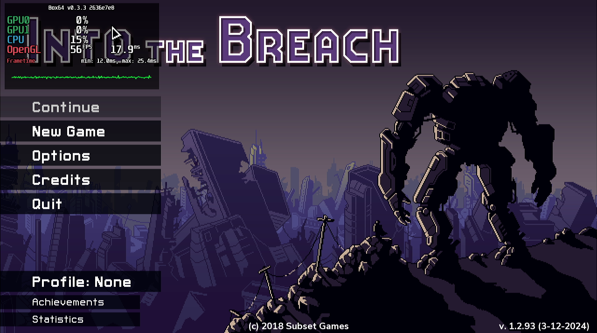
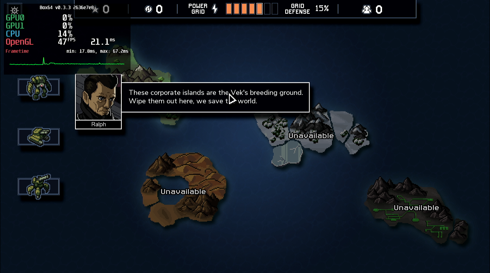
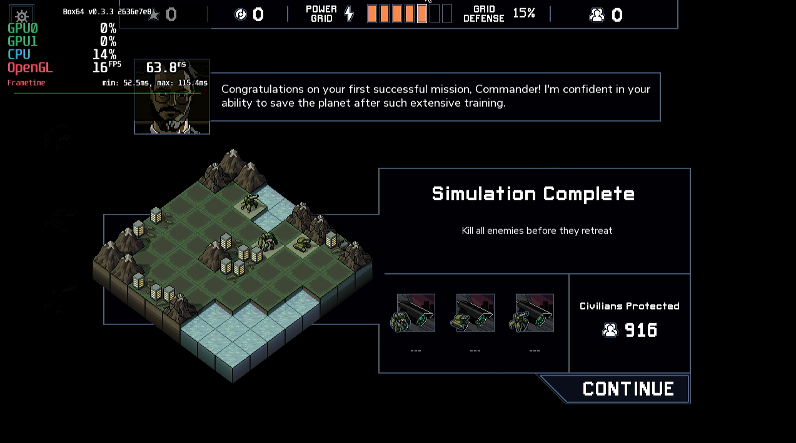

# Into the Breach

## Compatibility report

### Tested on

[Milk-V Jupiter](/docs/hardwares#milk-v-jupiter-soc-spacemit-m1)
 with AMD Radeon HD 6750

### Box64 version (commit)

Box64 [ptitSeb/box64@2636e7e8](https://github.com/ptitSeb/box64/tree/2636e7e8)

### Game screenshot





### Game running log

```shell
[BOX64] Box64 with Dynarec v0.3.3 2636e7e8 built on Mar  4 2025 14:58:49
[BOX64] Dynarec for rv64gv_zba_zbb_zbc_zbs_zvl256
[BOX64] Running on Spacemit(R) X60 with 8 cores, pagesize: 4096
[BOX64] Will use hardware counter measured at 24.0 MHz emulating 3.0 GHz
[BOX64] Using bash "/home/rurumuri/ourstorybegin/box64/tests/box64-bash"
[BOX64] Didn't detect 48bits of address space, considering it's 39bits
[BOX64] Counted 49 Env var
[BOX64] BOX64 trying to Preload /usr/local/$LIB/mangohud/libMangoHud_shim.so 
[BOX64] Library search path: 
[BOX64] Binary search path: ./:bin/:/home/rurumuri/ourstorybegin/wine/wine-10.0-amd64-wow64/bin/:/home/rurumuri/ourstorybegin/wine/wine-10.0-amd64-wow64/bin/:/usr/local/bin/:/usr/bin/:/bin/:/usr/local/sbin/:/usr/bin/site_perl/:/usr/bin/vendor_perl/:/usr/bin/core_perl/
[BOX64] Looking for ./start.sh
[BOX64] BOX64ENV: Variables overridden via env and/or RC file:
        BOX64_BASH=/home/rurumuri/ourstorybegin/box64/tests/box64-bash
[BOX64] Not an ELF file (sign=#!/b)
[BOX64] Error: Reading elf header of /home/rurumuri/GOG Games/Into the Breach/start.sh, Try to launch using bash instead
[BOX64] Box64 with Dynarec v0.3.3 2636e7e8 built on Mar  4 2025 14:58:49
[BOX64] Dynarec for rv64gv_zba_zbb_zbc_zbs_zvl256
[BOX64] Running on Spacemit(R) X60 with 8 cores, pagesize: 4096
[BOX64] Will use hardware counter measured at 24.0 MHz emulating 3.0 GHz
[BOX64] Using bash "/home/rurumuri/ourstorybegin/box64/tests/box64-bash"
[BOX64] Didn't detect 48bits of address space, considering it's 39bits
[BOX64] Counted 49 Env var
[BOX64] BOX64 trying to Preload /usr/local/$LIB/mangohud/libMangoHud_shim.so 
[BOX64] Library search path: 
[BOX64] Binary search path: ./:bin/:/home/rurumuri/ourstorybegin/wine/wine-10.0-amd64-wow64/bin/:/home/rurumuri/ourstorybegin/wine/wine-10.0-amd64-wow64/bin/:/usr/local/bin/:/usr/bin/:/bin/:/usr/local/sbin/:/usr/bin/site_perl/:/usr/bin/vendor_perl/:/usr/bin/core_perl/
[BOX64] Looking for /home/rurumuri/ourstorybegin/box64/tests/box64-bash
[BOX64] Bash detected, disabling banner
[BOX64] BOX64ENV: Variables overridden via env and/or RC file:
        BOX64_BASH=/home/rurumuri/ourstorybegin/box64/tests/box64-bash
[BOX64] argv[1]="./start.sh"
[BOX64] Rename process to "box64-bash"
[BOX64] Warning, cannot pre-load /usr/local/$LIB/mangohud/libMangoHud_shim.so
[BOX64] Using native(wrapped) libtinfo.so.6
[BOX64] Using native(wrapped) libdl.so.2
[BOX64] Using native(wrapped) libc.so.6
[BOX64] Using native(wrapped) ld-linux-x86-64.so.2
[BOX64] Using native(wrapped) libpthread.so.0
[BOX64] Using native(wrapped) libutil.so.1
[BOX64] Using native(wrapped) librt.so.1
[BOX64] Using native(wrapped) libbsd.so.0
[BOX64] Warning, of_unconvert(...) left over 0x8000, converted 0x8000
Running Into the Breach
[BOX64] Box64 with Dynarec v0.3.3 2636e7e8 built on Mar  4 2025 14:58:49
[BOX64] Dynarec for rv64gv_zba_zbb_zbc_zbs_zvl256
[BOX64] Running on Spacemit(R) X60 with 8 cores, pagesize: 4096
[BOX64] Will use hardware counter measured at 24.0 MHz emulating 3.0 GHz
[BOX64] Using bash "/home/rurumuri/ourstorybegin/box64/tests/box64-bash"
[BOX64] Didn't detect 48bits of address space, considering it's 39bits
[BOX64] Counted 50 Env var
[BOX64] BOX64 trying to Preload /usr/local/$LIB/mangohud/libMangoHud_shim.so 
[BOX64] Library search path: 
[BOX64] Binary search path: ./:bin/:/home/rurumuri/ourstorybegin/wine/wine-10.0-amd64-wow64/bin/:/home/rurumuri/ourstorybegin/wine/wine-10.0-amd64-wow64/bin/:/usr/local/bin/:/usr/bin/:/bin/:/usr/local/sbin/:/usr/bin/site_perl/:/usr/bin/vendor_perl/:/usr/bin/core_perl/
[BOX64] Looking for ./Breach
[BOX64] BOX64ENV: Variables overridden via env and/or RC file:
        BOX64_BASH=/home/rurumuri/ourstorybegin/box64/tests/box64-bash
[BOX64] Rename process to "Breach"
[BOX64] Warning, cannot pre-load /usr/local/$LIB/mangohud/libMangoHud_shim.so
[BOX64] Using native(wrapped) libSDL2-2.0.so.0
[BOX64] Using native(wrapped) libdl.so.2
[BOX64] Using native(wrapped) libm.so.6
[BOX64] Using native(wrapped) librt.so.1
[BOX64] Using native(wrapped) libpthread.so.0
[BOX64] Using native(wrapped) libGL.so.1
[BOX64] Using emulated ./linux_x64/libfmodstudio.so.10
[BOX64] Using emulated ./linux_x64/libfmod.so.10
[BOX64] Using emulated /usr/lib/box64-x86_64-linux-gnu/libstdc++.so.6
[BOX64] Using emulated /usr/lib/box64-x86_64-linux-gnu/libgcc_s.so.1
[BOX64] Using native(wrapped) libc.so.6
[BOX64] Using native(wrapped) ld-linux-x86-64.so.2
[BOX64] Using native(wrapped) libutil.so.1
[BOX64] Using native(wrapped) libbsd.so.0
Final location for profile file: /home/rurumuri/.local/share/IntoTheBreach/
Attempting file write check to /home/rurumuri/.local/share/IntoTheBreach/
File write successful
Save game cache: Cache file system:
No settings file found
```

### Rendering methods

```shell
OpenGL
```

### Extra information

[Steam](https://store.steampowered.com/app/590380/Into_the_Breach/)

[PCGameWiki](https://www.pcgamingwiki.com/wiki/Into_the_Breach)

### Advanced Tips

> TBD