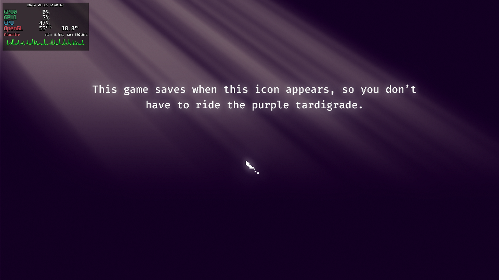
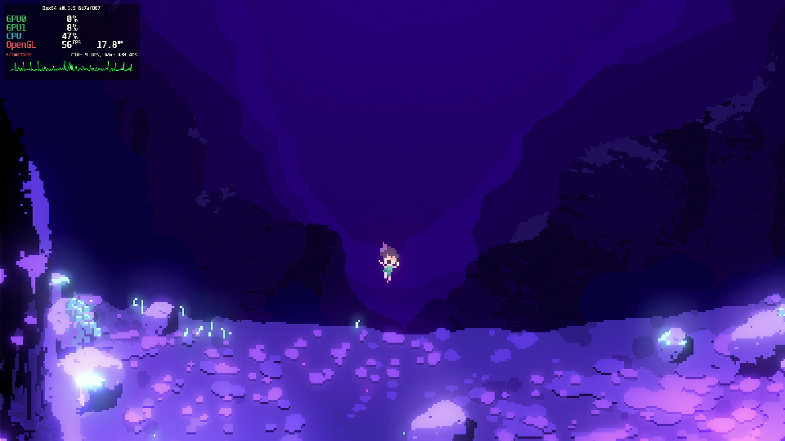
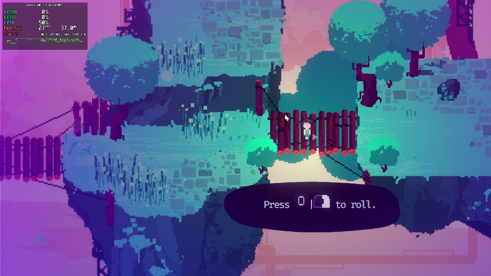

# Lila’s Sky Ark

## Compatibility report

### Tested on

[Milk-V Jupiter](/docs/hardwares#milk-v-jupiter-soc-spacemit-m1)
 with AMD Radeon RX 550

### Box64 version (commit)

Box64 [ptitSeb/box64@6d7af867](https://github.com/ptitSeb/box64/tree/6d7af867)

### Game screenshot





### Game running log

```shell
[BOX64] Box64 with Dynarec v0.3.5 6d7af867 built on Apr  6 2025 20:28:41
[BOX64] Dynarec for rv64gv_zba_zbb_zbc_zbs_zvl256
[BOX64] Running on Spacemit(R) X60 with 8 cores, pagesize: 4096
[BOX64] Will use hardware counter measured at 24.0 MHz emulating 3.0 GHz
[BOX64] Using bash "/home/rurumuri/ourstorybegin/box64/tests/box64-bash"
[BOX64] Didn't detect 48bits of address space, considering it's 39bits
[BOX64] Counted 49 Env var
[BOX64] BOX64 trying to Preload /usr/local/$LIB/mangohud/libMangoHud_shim.so 
[BOX64] Library search path: 
[BOX64] Binary search path: ./:bin/:/home/rurumuri/ourstorybegin/wine/wine-10.3-amd64-wow64/bin/:/home/rurumuri/ourstorybegin/wine/wine-10.3-amd64-wow64/bin/:/usr/local/bin/:/usr/bin/:/bin/:/usr/local/sbin/:/usr/lib/jvm/default/bin/:/usr/bin/site_perl/:/usr/bin/vendor_perl/:/usr/bin/core_perl/:/usr/lib/rustup/bin/
[BOX64] Looking for ./start.sh
[BOX64] BOX64ENV: Variables overridden via env and/or RC file:
        BOX64_BASH=/home/rurumuri/ourstorybegin/box64/tests/box64-bash
[BOX64] Not an ELF file (sign=#!/b)
[BOX64] Error: Reading elf header of /home/rurumuri/GOG Games/Lila s Sky Ark/start.sh, Try to launch using bash instead
[BOX64] Box64 with Dynarec v0.3.5 6d7af867 built on Apr  6 2025 20:28:41
[BOX64] Dynarec for rv64gv_zba_zbb_zbc_zbs_zvl256
[BOX64] Running on Spacemit(R) X60 with 8 cores, pagesize: 4096
[BOX64] Will use hardware counter measured at 24.0 MHz emulating 3.0 GHz
[BOX64] Using bash "/home/rurumuri/ourstorybegin/box64/tests/box64-bash"
[BOX64] Didn't detect 48bits of address space, considering it's 39bits
[BOX64] Counted 49 Env var
[BOX64] BOX64 trying to Preload /usr/local/$LIB/mangohud/libMangoHud_shim.so 
[BOX64] Library search path: 
[BOX64] Binary search path: ./:bin/:/home/rurumuri/ourstorybegin/wine/wine-10.3-amd64-wow64/bin/:/home/rurumuri/ourstorybegin/wine/wine-10.3-amd64-wow64/bin/:/usr/local/bin/:/usr/bin/:/bin/:/usr/local/sbin/:/usr/lib/jvm/default/bin/:/usr/bin/site_perl/:/usr/bin/vendor_perl/:/usr/bin/core_perl/:/usr/lib/rustup/bin/
[BOX64] Looking for /home/rurumuri/ourstorybegin/box64/tests/box64-bash
[BOX64] Bash detected, disabling banner
[BOX64] BOX64ENV: Variables overridden via env and/or RC file:
        BOX64_BASH=/home/rurumuri/ourstorybegin/box64/tests/box64-bash
[BOX64] argv[1]="./start.sh"
[BOX64] Rename process to "box64-bash"
[BOX64] Warning, cannot pre-load /usr/local/$LIB/mangohud/libMangoHud_shim.so
[BOX64] Using native(wrapped) libtinfo.so.6
[BOX64] Using native(wrapped) libdl.so.2
[BOX64] Using native(wrapped) libc.so.6
[BOX64] Using native(wrapped) ld-linux-x86-64.so.2
[BOX64] Using native(wrapped) libpthread.so.0
[BOX64] Using native(wrapped) libutil.so.1
[BOX64] Using native(wrapped) librt.so.1
[BOX64] Using native(wrapped) libbsd.so.0
[BOX64] Warning, of_unconvert(...) left over 0x8000, converted 0x8000
Running Lila’s Sky Ark
[BOX64] Box64 with Dynarec v0.3.5 6d7af867 built on Apr  6 2025 20:28:41
[BOX64] Dynarec for rv64gv_zba_zbb_zbc_zbs_zvl256
[BOX64] Running on Spacemit(R) X60 with 8 cores, pagesize: 4096
[BOX64] Will use hardware counter measured at 24.0 MHz emulating 3.0 GHz
[BOX64] Using bash "/home/rurumuri/ourstorybegin/box64/tests/box64-bash"
[BOX64] Didn't detect 48bits of address space, considering it's 39bits
[BOX64] Counted 50 Env var
[BOX64] BOX64 trying to Preload /usr/local/$LIB/mangohud/libMangoHud_shim.so 
[BOX64] Library search path: 
[BOX64] Binary search path: ./:bin/:/home/rurumuri/ourstorybegin/wine/wine-10.3-amd64-wow64/bin/:/home/rurumuri/ourstorybegin/wine/wine-10.3-amd64-wow64/bin/:/usr/local/bin/:/usr/bin/:/bin/:/usr/local/sbin/:/usr/lib/jvm/default/bin/:/usr/bin/site_perl/:/usr/bin/vendor_perl/:/usr/bin/core_perl/:/usr/lib/rustup/bin/
[BOX64] Looking for ./SkyArk.x86_64
[BOX64] BOX64ENV: Variables overridden via env and/or RC file:
        BOX64_BASH=/home/rurumuri/ourstorybegin/box64/tests/box64-bash
[BOX64] Rename process to "SkyArk.x86_64"
[BOX64] Warning, cannot pre-load /usr/local/$LIB/mangohud/libMangoHud_shim.so
[BOX64] Using native(wrapped) libc.so.6
[BOX64] Using native(wrapped) ld-linux-x86-64.so.2
[BOX64] Using native(wrapped) libpthread.so.0
[BOX64] Using native(wrapped) libdl.so.2
[BOX64] Using native(wrapped) libutil.so.1
[BOX64] Using native(wrapped) librt.so.1
[BOX64] Using native(wrapped) libbsd.so.0
[BOX64] Using native(wrapped) libXcursor.so.1
[BOX64] Using native(wrapped) libX11.so.6
[BOX64] Using native(wrapped) libxcb.so.1
[BOX64] Using native(wrapped) libXau.so.6
[BOX64] Using native(wrapped) libXdmcp.so.6
[BOX64] Using native(wrapped) libXfixes.so.3
[BOX64] Using native(wrapped) libXrender.so.1
[BOX64] Using native(wrapped) libXinerama.so.1
[BOX64] Using native(wrapped) libXext.so.6
[BOX64] Using native(wrapped) libXrandr.so.2
[BOX64] Using native(wrapped) libXi.so.6
[BOX64] Using native(wrapped) libGL.so.1
[BOX64] Using native(wrapped) libm.so.6
Godot Engine v3.3.4.stable.official.faf3f883d - https://godotengine.org
kmsro: driver missing
glx: failed to create dri3 screen
failed to load driver: pvr
OpenGL ES 3.0 Renderer: AMD Radeon RX 550 Series (radeonsi, polaris11, LLVM 19.1.7, DRM 3.49, 6.1.15+)
OpenGL ES Batching: ON
[BOX64] Using native(wrapped) libasound.so.2
[BOX64] Using native(wrapped) libpulse.so.0
[BOX64] Using native(wrapped) libudev.so.1
 
[2025-04-16 17:03:28.047] [MANGOHUD] [error] [cpu.cpp:552] Could not find cpu temp sensor location
ERROR: get_language_code: Condition "p_locale.length() < 2" is true. Returned: p_locale
   At: core/translation.cpp:964.
ERROR: set_locale: Unsupported locale 'C', falling back to 'en'.
   At: core/translation.cpp:988.

  _      _ _       _        _____ _                          _
 | |    (_) |     ( )      / ____| |              /\        | |
 | |     _| | __ _|/ ___  | (___ | | ___   _     /  \   _ __| | __
 | |    | | |/ _` | / __|  \___ \| |/ / | | |   / /\ \ | '__| |/ /
 | |____| | | (_| | \__ \  ____) |   <| |_| |  / ____ \| |  |   <
 |______|_|_|\__,_| |___/ |_____/|_|\_\__ | |_/ /    \_| |  | |\_\
                                                                                __/ |
                                                                           |___/

version         1.0.4.1
OS              X11
screen  (1920, 1080)
debug build     False
file logging    True
user directory  /home/rurumuri/.local/share/godot/app_userdata/SkyArk

----------init config----------
system
translation
display
accessibility
audio
key_input
joy_input
mouse_input
----------input map----------
---

loading parameter list
----------init save----------
---

----------integration is disabled----------
---

0        LOADING SAVEGAME 0
0        LOADING SAVEGAME 1
0        LOADING SAVEGAME 2
0        LOADING SAVEGAME 3
0        LOADING SAVEGAME 4
ERROR: get_language_code: Condition "p_locale.length() < 2" is true. Returned: p_locale
   At: core/translation.cpp:964.
ERROR: set_locale: Unsupported locale 'C', falling back to 'en'.
   At: core/translation.cpp:988.
ERROR: get_language_code: Condition "p_locale.length() < 2" is true. Returned: p_locale
   At: core/translation.cpp:964.
ERROR: set_locale: Unsupported locale 'C', falling back to 'en'.
   At: core/translation.cpp:988.
ERROR: get_language_code: Condition "p_locale.length() < 2" is true. Returned: p_locale
   At: core/translation.cpp:964.
ERROR: set_locale: Unsupported locale 'C', falling back to 'en'.
   At: core/translation.cpp:988.
ERROR: get_language_code: Condition "p_locale.length() < 2" is true. Returned: p_locale
   At: core/translation.cpp:964.
ERROR: set_locale: Unsupported locale 'C', falling back to 'en'.
```

### Rendering methods

```shell
OpenGL ES
```

### Extra information

[Steam](https://store.steampowered.com/app/1573390/Lilas_Sky_Ark/)

[PCGameWiki](https://www.pcgamingwiki.com/wiki/Lila%27s_Sky_Ark)

### Advanced Tips

> TBD