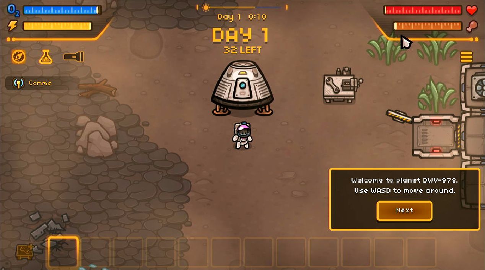
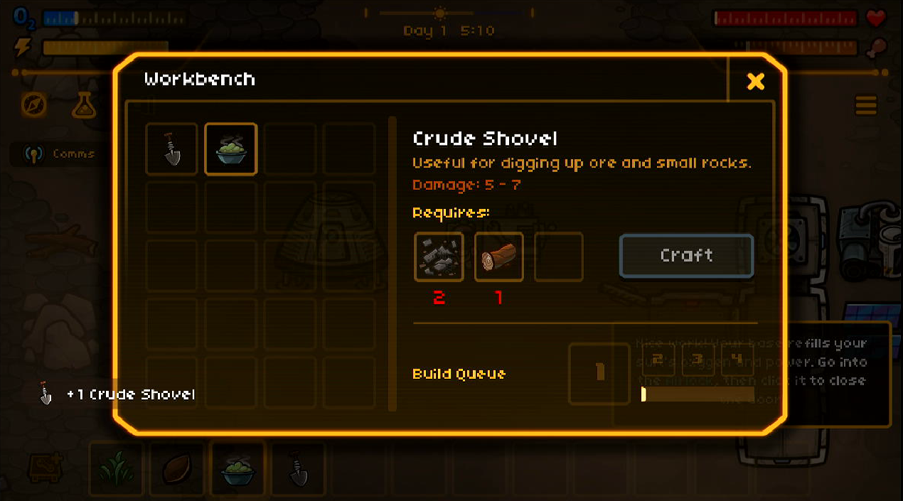

# MewnBase

## Compatibility report

### Tested on

[Lichee Pi 4A](/docs/hardwares#lichee-pi-4a-soc-th1520)

### Box64 version (commit)

Box64 [ptitSeb/box64@69f49f79](https://github.com/ptitSeb/box64/tree/69f49f79)

### Game screenshot




### Game running log

```shell
[BOX64] Dynarec for rv64g_xtheadba_xtheadbb_xtheadbs_xtheadmempair_xtheadcondmov_xtheadmemidx_xthvector
[BOX64] Running on unknown riscv64 cpu with 4 cores, pagesize: 4096
[BOX64] Will use hardware counter measured at 3.0 MHz emulating 3.0 GHz
[BOX64] Using bash "/home/sipeed/ourstorybegin/box64/box64_/tests/box64-bash"
[BOX64] Box64 with Dynarec v0.3.3 69f49f79 built on Feb  6 2025 13:52:28
[BOX64] Didn't detect 48bits of address space, considering it's 39bits
[BOX64] Counted 41 Env var
[BOX64] BOX64 LIB PATH: 
[BOX64] BOX64 BIN PATH: ./:bin/:/home/sipeed/ourstorybegin/wine/wine-9.22-amd64-wow64/bin/:/usr/local/bin/:/usr/bin/:/bin/:/usr/local/games/:/usr/games/
[BOX64] Looking for ./run.sh
[BOX64] BOX64ENV: Variables overridden via env and/or RC file:
        BOX64_BASH=/home/sipeed/ourstorybegin/box64/box64_/tests/box64-bash
[BOX64] Not an ELF file (sign=#!/u)
[BOX64] Error: Reading elf header of /home/sipeed/games/mewnbase/MewnBase/run.sh, Try to launch natively instead
[BOX64] Dynarec for rv64g_xtheadba_xtheadbb_xtheadbs_xtheadmempair_xtheadcondmov_xtheadmemidx_xthvector
[BOX64] Running on unknown riscv64 cpu with 4 cores, pagesize: 4096
[BOX64] Will use hardware counter measured at 3.0 MHz emulating 3.0 GHz
[BOX64] Using bash "/home/sipeed/ourstorybegin/box64/box64_/tests/box64-bash"
[BOX64] Box64 with Dynarec v0.3.3 69f49f79 built on Feb  6 2025 13:52:28
[BOX64] Didn't detect 48bits of address space, considering it's 39bits
[BOX64] Counted 41 Env var
[BOX64] BOX64 LIB PATH: 
[BOX64] BOX64 BIN PATH: ./:bin/:/home/sipeed/ourstorybegin/wine/wine-9.22-amd64-wow64/bin/:/usr/local/bin/:/usr/bin/:/bin/:/usr/local/games/:/usr/games/
[BOX64] Looking for ./jre/bin/java
[BOX64] BOX64ENV: Variables overridden via env and/or RC file:
        BOX64_BASH=/home/sipeed/ourstorybegin/box64/box64_/tests/box64-bash
[BOX64] argv[1]="-Xmx2G"
[BOX64] argv[2]="-jar"
[BOX64] argv[3]="./desktop-1.0.jar"
[BOX64] Rename process to "java"
[BOX64] Using native(wrapped) libpthread.so.0
[BOX64] Using emulated /home/sipeed/games/mewnbase/MewnBase/jre/bin/../lib/amd64/jli/libjli.so
[BOX64] Using native(wrapped) libdl.so.2
[BOX64] Using native(wrapped) libc.so.6
[BOX64] Using native(wrapped) ld-linux-x86-64.so.2
[BOX64] Using native(wrapped) libutil.so.1
[BOX64] Using native(wrapped) librt.so.1
[BOX64] Using native(wrapped) libbsd.so.0
[BOX64] Using emulated /home/sipeed/games/mewnbase/MewnBase/jre/lib/amd64/server/libjvm.so
[BOX64] libjvm detected, disable Dynarec BigBlock and enable Dynarec StrongMem, hide SSE 4.2
[BOX64] Using native(wrapped) libm.so.6
[BOX64] Warning: Weak Symbol collector_func_load not found, cannot apply R_X86_64_JUMP_SLOT @0x3f01ee8b70 (0x2121f6)
[BOX64] Using emulated /home/sipeed/games/mewnbase/MewnBase/jre/lib/amd64/libverify.so
[BOX64] Using emulated /home/sipeed/games/mewnbase/MewnBase/jre/lib/amd64/libjava.so
[BOX64] Using emulated /home/sipeed/games/mewnbase/MewnBase/jre/lib/amd64/libzip.so
MewnBase v0.54.2 | OS: Linux
MewnBase launch args: 
[BOX64] Using emulated /tmp/libgdxsipeed/2d27742a/libgdx64.so
[BOX64] Using emulated /home/sipeed/games/mewnbase/MewnBase/jre/lib/amd64/libnio.so
[BOX64] Using emulated /home/sipeed/games/mewnbase/MewnBase/jre/lib/amd64/libnet.so
[BOX64] Using emulated /tmp/lwjglsipeed/3.3.1-SNAPSHOT/liblwjgl.so
[BOX64] Using emulated /tmp/lwjglsipeed/3.3.1-SNAPSHOT/libjemalloc.so
[BOX64] Using emulated /tmp/lwjglsipeed/3.3.1-SNAPSHOT/libglfw.so
[BOX64] Using native(wrapped) libX11.so.6
[BOX64] Using native(wrapped) libxcb.so.1
[BOX64] Using native(wrapped) libXau.so.6
[BOX64] Using native(wrapped) libXdmcp.so.6
[BOX64] Using native(wrapped) libXxf86vm.so.1
[BOX64] Using native(wrapped) libXext.so.6
[BOX64] Using native(wrapped) libXi.so.6
[BOX64] Using native(wrapped) libXrandr.so.2
[BOX64] Using native(wrapped) libXrender.so.1
[BOX64] Using native(wrapped) libXcursor.so.1
[BOX64] Using native(wrapped) libXfixes.so.3
[BOX64] Using native(wrapped) libXinerama.so.1
[BOX64] Using native(wrapped) libX11-xcb.so.1
[BOX64] Using emulated /tmp/lwjglsipeed/3.3.1-SNAPSHOT/libopenal.so
[BOX64] Using emulated /usr/lib/box64-x86_64-linux-gnu/libstdc++.so.6
[BOX64] Using emulated /usr/lib/box64-x86_64-linux-gnu/libgcc_s.so.1
[BOX64] Error loading needed lib libjack.so.0
[BOX64] Warning: Cannot dlopen("libjack.so.0"/0x3f0c0d71a6, 2)
[BOX64] Using native(wrapped) libpulse.so.0
[ALSOFT] (EE) Failed to set real-time priority for thread: Operation not permitted (1)
[ALSOFT] (EE) Failed to set real-time priority for thread: Operation not permitted (1)
LIBGL: Initialising gl4es
LIBGL: v1.1.7 built on Feb  8 2025 20:56:51
LIBGL: Using GLES 2.0 backend
LIBGL: loaded: libGLESv2.so
LIBGL: loaded: libEGL.so
LIBGL: Using GLES 2.0 backend
LIBGL: Hardware Full NPOT detected and used
LIBGL: Extension GL_EXT_blend_minmax  detected and used
LIBGL: Extension GL_EXT_draw_buffers  detected and used
LIBGL: FBO are in core, and so used
LIBGL: PointSprite are in core, and so used
LIBGL: CubeMap are in core, and so used
LIBGL: BlendColor is in core, and so used
LIBGL: Blend Subtract is in core, and so used
LIBGL: Blend Function and Equation Separation is in core, and so used
LIBGL: Texture Mirrored Repeat is in core, and so used
LIBGL: Extension GL_OES_mapbuffer  detected
LIBGL: Extension GL_OES_element_index_uint  detected and used
LIBGL: Extension GL_OES_packed_depth_stencil  detected and used
LIBGL: Extension GL_OES_depth24  detected and used
LIBGL: Extension GL_OES_rgb8_rgba8  detected and used
LIBGL: Extension GL_EXT_multi_draw_arrays  detected
LIBGL: Extension GL_EXT_texture_format_BGRA8888  detected and used
LIBGL: Extension GL_OES_depth_texture  detected and used
LIBGL: Extension GL_OES_texture_stencil8  detected and used
LIBGL: Extension GL_EXT_texture_rg  detected and used
LIBGL: Extension GL_OES_texture_float  detected and used
LIBGL: Extension GL_OES_texture_half_float  detected and used
LIBGL: Extension GL_EXT_color_buffer_float  detected and used
LIBGL: Extension GL_EXT_color_buffer_half_float  detected and used
LIBGL: Extension GL_OES_fragment_precision_high  detected and used
LIBGL: Extension GL_EXT_shader_texture_lod detected and used
1416.112151 (4380) PVR:(Error): DoCompileShader:  Failed to compile shader [ shadercompile.c:10866 ]
LIBGL: Max vertex attrib: 16
LIBGL: Extension GL_OES_standard_derivatives  detected and used
LIBGL: Extension GL_OES_get_program_binary  detected and used
LIBGL: Number of supported Program Binary Format: 1
LIBGL: Max texture size: 8192
LIBGL: Max Varying Vector: 15
LIBGL: Texture Units: 16/16 (hardware: 16), Max lights: 8, Max planes: 6
LIBGL: Max Color Attachments: 8 / Draw buffers: 8
LIBGL: Hardware vendor is Imagination Technologies
1416.113065 (4380) PVR:(Error): DoCompileShader:  Failed to compile shader [ shadercompile.c:10866 ]
1416.113400 (4380) PVR:(Error): DoCompileShader:  Failed to compile shader [ shadercompile.c:10866 ]
1416.113715 (4380) PVR:(Error): DoCompileShader:  Failed to compile shader [ shadercompile.c:10866 ]
LIBGL: sRGB surface supported
LIBGL: EGLImage from Pixmap supported
LIBGL: EGLImage to Texture2D supported
LIBGL: EGLImage to RenderBuffer supported
LIBGL: Targeting OpenGL 2.1
LIBGL: Not trying to batch small subsequent glDrawXXXX
LIBGL: Trying to use VBO
LIBGL: FBO workaround for using binded texture enabled
LIBGL: Force texture for Attachment color0 on FBO
LIBGL: Hack to trigger a SwapBuffers when a Full Framebuffer Blit on default FBO is done
LIBGL: glX Will try to recycle EGL Surface
LIBGL: Current folder is:/home/sipeed/games/mewnbase/MewnBase
LIBGL: Loaded a PSA with 21 Precompiled Programs
[BOX64] Using native(wrapped) libGL.so.1
[BOX64] Using emulated /tmp/lwjglsipeed/3.3.1-SNAPSHOT/liblwjgl_opengl.so
[BOX64] Look for glProgramParameteri in loaded elfs
[BOX64] Warning, function glProgramParameteri not found in lib libGL.so.1
[BOX64] Look for glProgramParameteri in loaded elfs
[BOX64] Warning, function glProgramParameteri not found in lib libGL.so.1
[BOX64] Look for glProgramParameteri in loaded elfs
[BOX64] Warning, function glProgramParameteri not found in lib libGL.so.1
[BOX64] Look for glProgramParameteri in loaded elfs
[BOX64] Warning, function glProgramParameteri not found in lib libGL.so.1
[BOX64] Look for glNamedProgramStringEXT in loaded elfs
[BOX64] Warning, function glNamedProgramStringEXT not found in lib libGL.so.1
[BOX64] Look for glNamedProgramStringEXT in loaded elfs
[BOX64] Warning, function glNamedProgramStringEXT not found in lib libGL.so.1
[BOX64] Look for glNamedProgramStringEXT in loaded elfs
[BOX64] Warning, function glNamedProgramStringEXT not found in lib libGL.so.1
[BOX64] Look for glNamedProgramStringEXT in loaded elfs
[BOX64] Warning, function glNamedProgramStringEXT not found in lib libGL.so.1
[BOX64] Look for glNamedProgramLocalParameter4dEXT in loaded elfs
[BOX64] Warning, function glNamedProgramLocalParameter4dEXT not found in lib libGL.so.1
[BOX64] Look for glNamedProgramLocalParameter4dEXT in loaded elfs
[BOX64] Warning, function glNamedProgramLocalParameter4dEXT not found in lib libGL.so.1
[BOX64] Look for glNamedProgramLocalParameter4dEXT in loaded elfs
[BOX64] Warning, function glNamedProgramLocalParameter4dEXT not found in lib libGL.so.1
[BOX64] Look for glNamedProgramLocalParameter4dEXT in loaded elfs
[BOX64] Warning, function glNamedProgramLocalParameter4dEXT not found in lib libGL.so.1
[BOX64] Look for glNamedProgramLocalParameter4dvEXT in loaded elfs
[BOX64] Warning, function glNamedProgramLocalParameter4dvEXT not found in lib libGL.so.1
[BOX64] Look for glNamedProgramLocalParameter4dvEXT in loaded elfs
[BOX64] Warning, function glNamedProgramLocalParameter4dvEXT not found in lib libGL.so.1
[BOX64] Look for glNamedProgramLocalParameter4dvEXT in loaded elfs
[BOX64] Warning, function glNamedProgramLocalParameter4dvEXT not found in lib libGL.so.1
[BOX64] Look for glNamedProgramLocalParameter4dvEXT in loaded elfs
[BOX64] Warning, function glNamedProgramLocalParameter4dvEXT not found in lib libGL.so.1
[BOX64] Look for glNamedProgramLocalParameter4fEXT in loaded elfs
[BOX64] Warning, function glNamedProgramLocalParameter4fEXT not found in lib libGL.so.1
[BOX64] Look for glNamedProgramLocalParameter4fEXT in loaded elfs
[BOX64] Warning, function glNamedProgramLocalParameter4fEXT not found in lib libGL.so.1
[BOX64] Look for glNamedProgramLocalParameter4fEXT in loaded elfs
[BOX64] Warning, function glNamedProgramLocalParameter4fEXT not found in lib libGL.so.1
[BOX64] Look for glNamedProgramLocalParameter4fEXT in loaded elfs
[BOX64] Warning, function glNamedProgramLocalParameter4fEXT not found in lib libGL.so.1
[BOX64] Look for glNamedProgramLocalParameter4fvEXT in loaded elfs
[BOX64] Warning, function glNamedProgramLocalParameter4fvEXT not found in lib libGL.so.1
[BOX64] Look for glNamedProgramLocalParameter4fvEXT in loaded elfs
[BOX64] Warning, function glNamedProgramLocalParameter4fvEXT not found in lib libGL.so.1
[BOX64] Look for glNamedProgramLocalParameter4fvEXT in loaded elfs
[BOX64] Warning, function glNamedProgramLocalParameter4fvEXT not found in lib libGL.so.1
[BOX64] Look for glNamedProgramLocalParameter4fvEXT in loaded elfs
[BOX64] Warning, function glNamedProgramLocalParameter4fvEXT not found in lib libGL.so.1
[BOX64] Look for glGetNamedProgramLocalParameterdvEXT in loaded elfs
[BOX64] Warning, function glGetNamedProgramLocalParameterdvEXT not found in lib libGL.so.1
[BOX64] Look for glGetNamedProgramLocalParameterdvEXT in loaded elfs
[BOX64] Warning, function glGetNamedProgramLocalParameterdvEXT not found in lib libGL.so.1
[BOX64] Look for glGetNamedProgramLocalParameterdvEXT in loaded elfs
[BOX64] Warning, function glGetNamedProgramLocalParameterdvEXT not found in lib libGL.so.1
[BOX64] Look for glGetNamedProgramLocalParameterdvEXT in loaded elfs
[BOX64] Warning, function glGetNamedProgramLocalParameterdvEXT not found in lib libGL.so.1
[BOX64] Look for glGetNamedProgramLocalParameterfvEXT in loaded elfs
[BOX64] Warning, function glGetNamedProgramLocalParameterfvEXT not found in lib libGL.so.1
[BOX64] Look for glGetNamedProgramLocalParameterfvEXT in loaded elfs
[BOX64] Warning, function glGetNamedProgramLocalParameterfvEXT not found in lib libGL.so.1
[BOX64] Look for glGetNamedProgramLocalParameterfvEXT in loaded elfs
[BOX64] Warning, function glGetNamedProgramLocalParameterfvEXT not found in lib libGL.so.1
[BOX64] Look for glGetNamedProgramLocalParameterfvEXT in loaded elfs
[BOX64] Warning, function glGetNamedProgramLocalParameterfvEXT not found in lib libGL.so.1
[BOX64] Look for glGetNamedProgramivEXT in loaded elfs
[BOX64] Warning, function glGetNamedProgramivEXT not found in lib libGL.so.1
[BOX64] Look for glGetNamedProgramivEXT in loaded elfs
[BOX64] Warning, function glGetNamedProgramivEXT not found in lib libGL.so.1
[BOX64] Look for glGetNamedProgramivEXT in loaded elfs
[BOX64] Warning, function glGetNamedProgramivEXT not found in lib libGL.so.1
[BOX64] Look for glGetNamedProgramivEXT in loaded elfs
[BOX64] Warning, function glGetNamedProgramivEXT not found in lib libGL.so.1
[BOX64] Look for glGetNamedProgramStringEXT in loaded elfs
[BOX64] Warning, function glGetNamedProgramStringEXT not found in lib libGL.so.1
[BOX64] Look for glGetNamedProgramStringEXT in loaded elfs
[BOX64] Warning, function glGetNamedProgramStringEXT not found in lib libGL.so.1
[BOX64] Look for glGetNamedProgramStringEXT in loaded elfs
[BOX64] Warning, function glGetNamedProgramStringEXT not found in lib libGL.so.1
[BOX64] Look for glGetNamedProgramStringEXT in loaded elfs
[BOX64] Warning, function glGetNamedProgramStringEXT not found in lib libGL.so.1
[BOX64] Look for glProgramUniformMatrix2x3fvEXT in loaded elfs
[BOX64] Warning, function glProgramUniformMatrix2x3fvEXT not found in lib libGL.so.1
[BOX64] Look for glProgramUniformMatrix2x3fvEXT in loaded elfs
[BOX64] Warning, function glProgramUniformMatrix2x3fvEXT not found in lib libGL.so.1
[BOX64] Look for glProgramUniformMatrix2x3fvEXT in loaded elfs
[BOX64] Warning, function glProgramUniformMatrix2x3fvEXT not found in lib libGL.so.1
[BOX64] Look for glProgramUniformMatrix2x3fvEXT in loaded elfs
[BOX64] Warning, function glProgramUniformMatrix2x3fvEXT not found in lib libGL.so.1
[BOX64] Look for glProgramUniformMatrix3x2fvEXT in loaded elfs
[BOX64] Warning, function glProgramUniformMatrix3x2fvEXT not found in lib libGL.so.1
[BOX64] Look for glProgramUniformMatrix3x2fvEXT in loaded elfs
[BOX64] Warning, function glProgramUniformMatrix3x2fvEXT not found in lib libGL.so.1
[BOX64] Look for glProgramUniformMatrix3x2fvEXT in loaded elfs
[BOX64] Warning, function glProgramUniformMatrix3x2fvEXT not found in lib libGL.so.1
[BOX64] Look for glProgramUniformMatrix3x2fvEXT in loaded elfs
[BOX64] Warning, function glProgramUniformMatrix3x2fvEXT not found in lib libGL.so.1
[BOX64] Look for glProgramUniformMatrix2x4fvEXT in loaded elfs
[BOX64] Warning, function glProgramUniformMatrix2x4fvEXT not found in lib libGL.so.1
[BOX64] Look for glProgramUniformMatrix2x4fvEXT in loaded elfs
[BOX64] Warning, function glProgramUniformMatrix2x4fvEXT not found in lib libGL.so.1
[BOX64] Look for glProgramUniformMatrix2x4fvEXT in loaded elfs
[BOX64] Warning, function glProgramUniformMatrix2x4fvEXT not found in lib libGL.so.1
[BOX64] Look for glProgramUniformMatrix2x4fvEXT in loaded elfs
[BOX64] Warning, function glProgramUniformMatrix2x4fvEXT not found in lib libGL.so.1
[BOX64] Look for glProgramUniformMatrix4x2fvEXT in loaded elfs
[BOX64] Warning, function glProgramUniformMatrix4x2fvEXT not found in lib libGL.so.1
[BOX64] Look for glProgramUniformMatrix4x2fvEXT in loaded elfs
[BOX64] Warning, function glProgramUniformMatrix4x2fvEXT not found in lib libGL.so.1
[BOX64] Look for glProgramUniformMatrix4x2fvEXT in loaded elfs
[BOX64] Warning, function glProgramUniformMatrix4x2fvEXT not found in lib libGL.so.1
[BOX64] Look for glProgramUniformMatrix4x2fvEXT in loaded elfs
[BOX64] Warning, function glProgramUniformMatrix4x2fvEXT not found in lib libGL.so.1
[BOX64] Look for glProgramUniformMatrix3x4fvEXT in loaded elfs
[BOX64] Warning, function glProgramUniformMatrix3x4fvEXT not found in lib libGL.so.1
[BOX64] Look for glProgramUniformMatrix3x4fvEXT in loaded elfs
[BOX64] Warning, function glProgramUniformMatrix3x4fvEXT not found in lib libGL.so.1
[BOX64] Look for glProgramUniformMatrix3x4fvEXT in loaded elfs
[BOX64] Warning, function glProgramUniformMatrix3x4fvEXT not found in lib libGL.so.1
[BOX64] Look for glProgramUniformMatrix3x4fvEXT in loaded elfs
[BOX64] Warning, function glProgramUniformMatrix3x4fvEXT not found in lib libGL.so.1
[BOX64] Look for glProgramUniformMatrix4x3fvEXT in loaded elfs
[BOX64] Warning, function glProgramUniformMatrix4x3fvEXT not found in lib libGL.so.1
[BOX64] Look for glProgramUniformMatrix4x3fvEXT in loaded elfs
[BOX64] Warning, function glProgramUniformMatrix4x3fvEXT not found in lib libGL.so.1
[BOX64] Look for glProgramUniformMatrix4x3fvEXT in loaded elfs
[BOX64] Warning, function glProgramUniformMatrix4x3fvEXT not found in lib libGL.so.1
[BOX64] Look for glProgramUniformMatrix4x3fvEXT in loaded elfs
[BOX64] Warning, function glProgramUniformMatrix4x3fvEXT not found in lib libGL.so.1
[MewnBase] MoonBase.coreFolder = data/
[MewnBase] SettingsLoader: Creating default settings file
[MewnBase] SettingsLoader: Writing settings to disk.
[MewnBase] SettingsLoader: validating settings file
[MewnBase] Vsync: true
[MewnBase] SettingsLoader: Writing settings to disk.
[MewnBase] SettingsLoader: Writing settings to disk.
[MewnBase] Compiling shaders...
[MewnBase] Found no save files with errors.
[MewnBase] -----------------
[MewnBase] SaveFixer: Testing entity fix for 0 saves.
[BOX64] Using emulated /tmp/steamworks4j/1.8.0/libsteam_api.so
[BOX64] Using emulated /tmp/steamworks4j/1.8.0/libsteamworks4j.so
[S_API] SteamAPI_Init(): SteamAPI_IsSteamRunning() did not locate a running instance of Steam.
[S_API FAIL] SteamAPI_Init() failed
  Steam API initialized: false
  Steam client active: false
[MewnBase] Linux
[MewnBase] System Language: en_US
[MewnBase] Setting language to: en
[MewnBase] Locale: en
[MewnBase] Showing menu: MainMenu
[MewnBase] SettingsLoader: Writing settings to disk.
[MewnBase] Saving LAST_WHATSNEW_VERSION to 0.54.2
[MewnBase] Showing menu: WhatsNewPopup
[MewnBase] prev screen now : Splash
[MewnBase] finished showing main menu
[MewnBase] Back
[MewnBase] Showing menu: MoreMenu
[BOX64] Using emulated /home/sipeed/games/mewnbase/MewnBase/jre/lib/amd64/libawt.so
[BOX64] Using emulated /home/sipeed/games/mewnbase/MewnBase/jre/lib/amd64/libawt_xawt.so
[BOX64] Using native(wrapped) libXtst.so.6
[BOX64] Using emulated /home/sipeed/games/mewnbase/MewnBase/jre/lib/amd64/libfontmanager.so
[BOX64] Using native(wrapped) libfreetype.so.6
[BOX64] Using native(wrapped) libgtk-x11-2.0.so.0
[BOX64] Using native(wrapped) libgdk-x11-2.0.so.0
[BOX64] Using native(wrapped) libgobject-2.0.so.0
[BOX64] Using native(wrapped) libglib-2.0.so.0
[BOX64] Using native(wrapped) libgio-2.0.so.0
[BOX64] Using native(wrapped) libgmodule-2.0.so.0
[BOX64] Using native(wrapped) libgdk_pixbuf-2.0.so.0
[BOX64] Using native(wrapped) libpangocairo-1.0.so.0
[BOX64] Using native(wrapped) libpango-1.0.so.0
[BOX64] Using native(wrapped) libgthread-2.0.so.0
[BOX64] Error loading needed lib libgnomevfs-2.so.0
[BOX64] Warning: Cannot dlopen("libgnomevfs-2.so.0"/0x3f1304dc90, 1)
[BOX64] Error loading needed lib libgnomevfs-2.so
[BOX64] Warning: Cannot dlopen("libgnomevfs-2.so"/0x3f1304dca3, 1)
can not load libgnomevfs-2.so
[MewnBase] Showing menu: SettingsPopup
[Localization] Can't find bundle key game
[MewnBase] Showing menu: LanguagePopup
[MewnBase] Back
returned to settings popup
[MewnBase] Showing menu: ControlMapPopup
[MewnBase] Back
returned to settings popup
[MewnBase] SettingsLoader: Writing settings to disk.
[MewnBase] Back
[MewnBase] Back
[MewnBase] Showing menu: NewGameScreen
[MewnBase] Showing menu: CreatePlayerScreen
[MewnBase] Back
[MewnBase] NewGameScreen:returned with settings:
 -- Creature mode: hostile
 -- Day cycle: defaultDay
 -- water mode: defaultWater
 -- Tech tree mode: defaultTech
 -- Weather mode: normal
[MewnBase] Showing menu: CreatePlayerScreen
[MewnBase] CreatureManager: Reading creature data
[MewnBase] Loading assets for crab
[MewnBase] Loading assets for firecrab
[MewnBase] Loading assets for slug
[MewnBase] Loading assets for fireslug
[MewnBase] prev screen now : FrontendScreen
[MewnBase] Done loading game assets.

----------

[ShaderLoader] Compiling "screenspace/heat"...
[MewnBase] ItemFactory: 115 items loaded.
[BOX64] Warning: Mmap64 for (@0x3f18000000 0x24cda0) for elf "/tmp/libgdxsipeed/b16ccbaa/libgdx-box2d64.so" returned 0x3f13800000(0x3f1364e000/0x200000) instead
[BOX64] Using emulated /tmp/libgdxsipeed/b16ccbaa/libgdx-box2d64.so
[MewnBase] DayCycle: Period is now: day
[ShaderLoader] Compiling "screenspace/convolve-1d" w/ (#define LENGTH 3)...
[ShaderLoader] Compiling "screenspace/convolve-1d" w/ (#define LENGTH 3)...
[ShaderLoader] Compiling "screenspace/convolve-1d" w/ (#define LENGTH 5)...
[ShaderLoader] Compiling "screenspace/convolve-1d" w/ (#define LENGTH 5)...
[ShaderLoader] Compiling "screenspace/threshold"...
[ShaderLoader] Compiling "screenspace/combine"...
[MewnBase] change weather :clear
[MewnBase] TechManager: techTree.json does not exist
[MewnBase] TechManager: Loaded 18 tech upgrades
[MewnBase] World: Generating random seed
[MewnBase] TerrainGen: Setting terrain seed to 9495
[MewnBase] TerrainGen: Setting terrain wet seed to 9496
[MewnBase] FeatureTileFactory: Loading...
[MewnBase] FeatureTileFactory loaded 1 items
[MoonBase] ItemDropperFactory: Loading Item Droppers
[MewnBase] ChunkLoader: Creating new chunk: 50,51
[MewnBase] ChunkLoader: Creating new chunk: 51,51
[MewnBase] ChunkLoader: Creating new chunk: 51,50
[MewnBase] ChunkLoader: Creating new chunk: 51,49
[MewnBase] ChunkLoader: Creating new chunk: 50,49
[MewnBase] ChunkLoader: Creating new chunk: 49,49
[MewnBase] ChunkLoader: Creating new chunk: 49,50
[MewnBase] ChunkLoader: Creating new chunk: 49,51
[MewnBase] ItemCrafter: crafting-station (35)
[MewnBase] hab : 5, 5
[MewnBase] variation 2
[MewnBase] hab : 5, 4
[MewnBase] variation 1 mod 0
[MewnBase] hab : 5, 6
[MewnBase] variation 1 mod 0
[MewnBase] Setting dayCycle to : defaultDay
[MewnBase] DayCycle: Period is now: day
[MewnBase] creating resource bar
[MewnBase] creating resource bar
[MewnBase] creating resource bar
[MewnBase] creating resource bar
[MewnBase] DialogController: Reading data
[MewnBase] DialogController: List size: 0
[MewnBase] prev screen now : LoadingScreen
[MoonBase] Player: Playing exit lander anim
[MewnBase] GameLoader: Loading game from folder rurumuri
[MewnBase] GameLoader: can't find save data for folder rurumuri
[MewnBase] path1destfolder doesn't exist, creating
[MewnBase] GameLoader: Writing gameSaveData: rurumuri
Tutorial: changeState -> movement
[MoonBase] Player: changed chunks!: 50, 50
[MewnBase] ----------------
Hit a ui thing! Label
Tutorial: changeState -> oxygen
[MoonBase] Player: changed chunks!: 49, 50
[MewnBase] ChunkLoader: Creating new chunk: 48,49
[MewnBase] ChunkLoader: Creating new chunk: 48,50
[MewnBase] ChunkLoader: Creating new chunk: 48,51
[MewnBase] ----------------
Hit a ui thing! Label
Tutorial: changeState -> hunger
[MewnBase] ----------------
Hit a ui thing! TextButton
Tutorial: changeState -> collectResources
[MoonBase] Player: changed chunks!: 50, 50
[MewnBase] ChunkLoader: loading ground tiles for 51, 51
[MewnBase] ChunkLoader: loading ground tiles for 51, 50
[MewnBase] ChunkLoader: loading ground tiles for 51, 49
starting interaction
starting interaction
[MewnBase] ItemDropper: Dropping loot action
[MewnBase] RegrowthManager: adding new respawnable - plant-sprout
[MewnBase] Updating Bases!
[MewnBase] collected into existing stacks: 0
[MewnBase] newStack size remaining: 1
[MewnBase] new stack has 1
[MewnBase] Added plant (1) to player inventory
starting interaction
[MewnBase] ItemDropper: Dropping loot action
[MewnBase] RegrowthManager: adding new respawnable - plant-sprout
[MewnBase] Updating Bases!
[MewnBase] newStack size: 1
[MewnBase] collected into existing stacks: 1
[MewnBase] newStack size remaining: 0
[MewnBase] Added plant (1) to player inventory
[MewnBase] collected into existing stacks: 0
[MewnBase] newStack size remaining: 1
[MewnBase] new stack has 1
[MewnBase] Added seed (1) to player inventory
[MewnBase] newStack size: 1
[MewnBase] collected into existing stacks: 1
[MewnBase] newStack size remaining: 0
Tutorial: changeState -> craftFood
[MewnBase] Added plant (1) to player inventory
starting interaction
[MewnBase] ItemDropper: Dropping loot action
[MewnBase] RegrowthManager: adding new respawnable - plant-sprout
[MewnBase] Updating Bases!
[MewnBase] newStack size: 1
[MewnBase] collected into existing stacks: 1
[MewnBase] newStack size remaining: 0
[MewnBase] Added plant (1) to player inventory
starting interaction
[MewnBase] ItemCrafter: consolidated 0
starting interaction
[MewnBase] ItemCrafter: consolidated 0
[MewnBase] focus: right
Start crafting Plant Slop
[MewnBase] ItemCrafter: Spending resources...
[MewnBase] ItemCrafter: Done building Plant Slop
[MewnBase] ItemCrafter: Queue empty
[MewnBase] ItemCrafter: consolidated 0
ItemCrafter: trying to collect item: Plant Slop
[MewnBase] -----------------
[MewnBase] room to hold = 100
[MewnBase] collected into existing stacks: 0
[MewnBase] newStack size remaining: 2
[MewnBase] new stack has 2
Tutorial: changeState -> eatFood
[MewnBase] Added food (2) to player inventory
[MewnBase] ItemCrafter: consolidated 0
[MewnBase] Back
[MewnBase] Back
boost: 50.0 + hunger 182.61172 = 0.9692155
[MewnBase] ----------------
Hit a ui thing! Button
boost: 50.0 + hunger 182.41046 = 0.96837693
[MewnBase] ----------------
Hit a ui thing! Button
boost: 50.0 + hunger 181.79549 = 0.96581453
[MewnBase] ----------------
Hit a ui thing! Button
boost: 50.0 + hunger 181.09964 = 0.9629152
[MewnBase] ----------------
Hit a ui thing! Button
boost: 50.0 + hunger 181.00887 = 0.96253693
[MewnBase] ----------------
Hit a ui thing! Button
boost: 50.0 + hunger 179.6392 = 0.95683
[MewnBase] Using item: Plant Slop: action: eat - 50
[MewnBase] collected into existing stacks: 0
[MewnBase] newStack size remaining: 2
[MewnBase] new stack has 2
[MewnBase] Added scrap (2) to player inventory
[MewnBase] collected into existing stacks: 0
[MewnBase] newStack size remaining: 1
[MewnBase] new stack has 1
[MewnBase] Added wood (1) to player inventory
Tutorial: changeState -> craftShovel
boost: 50.0 + hunger 222.5483 = 1.1356179
starting interaction
[MewnBase] ItemCrafter: consolidated 0
Start crafting Crude Shovel
[MewnBase] ItemCrafter: Spending resources...
[MewnBase] ItemCrafter: Done building Crude Shovel
[MewnBase] ItemCrafter: Queue empty
[MewnBase] ItemCrafter: consolidated 0
ItemCrafter: trying to collect item: Crude Shovel
[MewnBase] -----------------
[MewnBase] room to hold = 891
[MewnBase] collected into existing stacks: 0
[MewnBase] newStack size remaining: 1
[MewnBase] new stack has 1
[MewnBase] Tutorial: Found airlock where it should be.
Tutorial: changeState -> goIntoBase
[MewnBase] Added shovel (1) to player inventory
[MewnBase] Back
starting interaction
starting interaction
starting interaction
AIRLOCK STATE CHANGED
Tutorial: changeState -> airCleaners
[MewnBase] ----------------
Hit a ui thing! Label
Tutorial: changeState -> supplyPowerGen
Tutorial: changeState -> pickupBaseModules
[MewnBase] ----------------
Hit a ui thing! Label
[MewnBase] ----------------
Hit a ui thing! Label
Tutorial: changeState -> pickupBaseModules2
[MewnBase] Updating Bases!
[MewnBase] Updating Bases!
[MewnBase] collected into existing stacks: 0
[MewnBase] newStack size remaining: 1
[MewnBase] new stack has 1
Tutorial: changeState -> placeBaseModules
[MewnBase] Added aircleaner-builder (1) to player inventory
[MewnBase] DayCycle: Period is now: dusk
[MewnBase] Using item: Air Cleaner: action: createBuilding - AirCleaner
Tutorial: changeState -> basePower
[MewnBase] change weather :rain
[MewnBase] Weather changed, now: rain
[MewnBase] ----------------
Hit a ui thing! TextButton
[MewnBase] collected into existing stacks: 0
[MewnBase] newStack size remaining: 1
[MewnBase] new stack has 1
[MewnBase] Added scrap (1) to player inventory
Tutorial: changeState -> droppingItems
[MewnBase] Updating Bases!
[MewnBase] hab : 5, 6
[MewnBase] variation 1 mod 0
[MewnBase] Updating Bases!
Creating new base module at 5, 6
[MewnBase] DayCycle: Period is now: night
[MewnBase] ----------------
Hit a ui thing! Button
Tutorial: changeState -> research1
[MewnBase] ----------------
Hit a ui thing! Label
Tutorial: changeState -> research2
[MewnBase] ----------------
Hit a ui thing! Button
[MewnBase] Back
[MewnBase] ----------------
Hit a ui thing! Label
Tutorial: changeState -> end
[MewnBase] ----------------
Hit a ui thing! Label
[MewnBase] ----------------
Hit a ui thing! Image
starting interaction
AIRLOCK STATE CHANGED
[MewnBase] change weather :clear
[MewnBase] Weather changed, now: clear
[MoonBase] Player: changed chunks!: 51, 50
[MewnBase] ChunkLoader: Creating new chunk: 52,51
[MewnBase] ChunkLoader: Creating new chunk: 52,50
[MewnBase] ChunkLoader: Creating new chunk: 52,49
[MoonBase] Player: changed chunks!: 50, 50
[MewnBase] ChunkLoader: loading ground tiles for 49, 49
[MewnBase] ChunkLoader: loading ground tiles for 49, 50
[MewnBase] ChunkLoader: loading ground tiles for 49, 51
[MewnBase] DayCycle: Period is now: dawn
HUD: looseHudPower()
[MewnBase] DayCycle: Period is now: day
[MewnBase] ----------------------

DayCycle: Day: 2
[MewnBase] GameLoader: Loading game from folder rurumuri
[MewnBase] path1destfolder is a directory and exists.
[MewnBase] Moving save file: worldData.json to prevSave1 folder
[MewnBase] Moving save file: gameSave.json to prevSave1 folder
[MewnBase] GameLoader: Writing gameSaveData: rurumuri
[MewnBase] Saved screenshot
[PerformanceCounter] Invalid data, check if you called PerformanceCounter#stop()
[PerformanceCounter] Invalid data, check if you called PerformanceCounter#stop()
starting interaction
AIRLOCK STATE CHANGED
starting interaction
AIRLOCK STATE CHANGED
[MoonBase] Player: changed chunks!: 51, 50
[MewnBase] ChunkLoader: loading ground tiles for 52, 51
[MewnBase] ChunkLoader: loading ground tiles for 52, 50
[MewnBase] ChunkLoader: loading ground tiles for 52, 49
starting interaction
starting interaction
[MewnBase] ItemDropper: Dropping loot action
[MewnBase] RegrowthManager: adding new respawnable - plant-sprout
[MewnBase] Updating Bases!
[MewnBase] newStack size: 1
[MewnBase] collected into existing stacks: 1
[MewnBase] newStack size remaining: 0
[MewnBase] Added plant (1) to player inventory
starting interaction
[MewnBase] Item durability now: 79
[MewnBase] Item durability now: 78
[MewnBase] Item durability now: 77
[MewnBase] Spawning: crab
[MewnBase] Item durability now: 76
[MewnBase] ItemDropper: Dropping loot action
[MewnBase] Updating Bases!
[MewnBase] collected into existing stacks: 0
[MewnBase] newStack size remaining: 1
[MewnBase] new stack has 1
[MewnBase] Added ore (1) to player inventory
[MewnBase] newStack size: 1
[MewnBase] collected into existing stacks: 1
[MewnBase] newStack size remaining: 0
[MewnBase] Added ore (1) to player inventory
starting interaction
[MewnBase] ItemDropper: Dropping loot action
[MewnBase] Updating Bases!
[MewnBase] collected into existing stacks: 0
[MewnBase] newStack size remaining: 1
[MewnBase] new stack has 1
[MewnBase] Added scrap (1) to player inventory
[MewnBase] newStack size: 1
[MewnBase] collected into existing stacks: 1
[MewnBase] newStack size remaining: 0
[MewnBase] Added scrap (1) to player inventory
starting interaction
[MewnBase] ItemDropper: Dropping loot action
[MewnBase] RegrowthManager: adding new respawnable - wood
[MewnBase] Updating Bases!
starting interaction
[MewnBase] ItemDropper: Dropping loot action
[MewnBase] RegrowthManager: adding new respawnable - wood
[MewnBase] Updating Bases!
[MewnBase] collected into existing stacks: 0
[MewnBase] newStack size remaining: 1
[MewnBase] new stack has 1
[MewnBase] Added wood (1) to player inventory
[MewnBase] newStack size: 1
[MewnBase] collected into existing stacks: 1
[MewnBase] newStack size remaining: 0
[MewnBase] Added wood (1) to player inventory
[MoonBase] Player: changed chunks!: 52, 50
[MewnBase] ChunkLoader: Creating new chunk: 53,51
[MewnBase] ChunkLoader: Creating new chunk: 53,50
[MewnBase] ChunkLoader: Creating new chunk: 53,49
[MewnBase] Spawning: crab
starting interaction
[MewnBase] ItemDropper: Dropping loot action
[MewnBase] RegrowthManager: adding new respawnable - ice
[MewnBase] Updating Bases!
[MewnBase] collected into existing stacks: 0
[MewnBase] newStack size remaining: 1
[MewnBase] new stack has 1
[MewnBase] Added ice (1) to player inventory
[MewnBase] newStack size: 1
[MewnBase] collected into existing stacks: 1
[MewnBase] newStack size remaining: 0
[MewnBase] Added ice (1) to player inventory
[MoonBase] Player: changed chunks!: 52, 51
[MewnBase] ChunkLoader: Creating new chunk: 52,52
[MewnBase] ChunkLoader: Creating new chunk: 53,52
[MewnBase] ChunkLoader: Creating new chunk: 51,52
starting interaction
starting interaction
[MewnBase] ItemDropper: Dropping loot action
[MewnBase] RegrowthManager: adding new respawnable - ice
[MewnBase] Updating Bases!
[MewnBase] newStack size: 1
[MewnBase] collected into existing stacks: 1
[MewnBase] newStack size remaining: 0
[MewnBase] Added ice (1) to player inventory
starting interaction
[MewnBase] Spawning: crab
[MewnBase] ItemDropper: Dropping loot action
[MewnBase] Updating Bases!
[MewnBase] newStack size: 1
[MewnBase] collected into existing stacks: 1
[MewnBase] newStack size remaining: 0
[MewnBase] Added scrap (1) to player inventory
[MewnBase] newStack size: 1
[MewnBase] collected into existing stacks: 1
[MewnBase] newStack size remaining: 0
[MewnBase] Added scrap (1) to player inventory
[MewnBase] newStack size: 1
[MewnBase] collected into existing stacks: 1
[MewnBase] newStack size remaining: 0
[MewnBase] Added scrap (1) to player inventory
[MoonBase] Player: changed chunks!: 51, 51
[MewnBase] ChunkLoader: loading ground tiles for 50, 50
[MewnBase] ChunkLoader: loading ground tiles for 50, 51
[MewnBase] ChunkLoader: Creating new chunk: 50,52
[MewnBase] Creature slept for 10sec, removing
[MewnBase] ----------------
Hit a ui thing! Image
[MewnBase] ----------------
Hit a ui thing! Image
[MoonBase] Player: changed chunks!: 50, 51
[MewnBase] ChunkLoader: loading ground tiles for 49, 50
[MewnBase] ChunkLoader: loading ground tiles for 49, 51
[MewnBase] ChunkLoader: Creating new chunk: 49,52
[MoonBase] Player: changed chunks!: 50, 50
[MewnBase] ChunkLoader: loading ground tiles for 51, 49
[MewnBase] ChunkLoader: loading ground tiles for 50, 49
[MewnBase] ChunkLoader: loading ground tiles for 49, 49
[MoonBase] Player: changed chunks!: 50, 51
[MewnBase] ChunkLoader: loading ground tiles for 50, 52
[MewnBase] ChunkLoader: loading ground tiles for 51, 52
[MewnBase] ChunkLoader: loading ground tiles for 49, 52
starting interaction
[MewnBase] Item durability now: 75
[MewnBase] Item durability now: 74
[MewnBase] Creature slept for 10sec, removing
[MewnBase] Item durability now: 73
[MewnBase] Item durability now: 72
[MewnBase] ItemDropper: Dropping loot action
[MewnBase] Updating Bases!
[MewnBase] newStack size: 1
[MewnBase] collected into existing stacks: 1
[MewnBase] newStack size remaining: 0
[MewnBase] Added ore (1) to player inventory
starting interaction
[MewnBase] ItemDropper: Dropping loot action
[MewnBase] RegrowthManager: adding new respawnable - ice
[MewnBase] Updating Bases!
[MewnBase] newStack size: 1
[MewnBase] collected into existing stacks: 1
[MewnBase] newStack size remaining: 0
[MewnBase] Added ice (1) to player inventory
[MewnBase] newStack size: 1
[MewnBase] collected into existing stacks: 1
[MewnBase] newStack size remaining: 0
[MewnBase] Added ice (1) to player inventory
[MewnBase] newStack size: 1
[MewnBase] collected into existing stacks: 1
[MewnBase] newStack size remaining: 0
[MewnBase] Added ice (1) to player inventory
[MoonBase] Player: changed chunks!: 50, 50
[MewnBase] ChunkLoader: loading ground tiles for 51, 49
[MewnBase] ChunkLoader: loading ground tiles for 50, 49
[MewnBase] ChunkLoader: loading ground tiles for 49, 49
[MewnBase] Creature slept for 10sec, removing
starting interaction
AIRLOCK STATE CHANGED
[MewnBase] World: pauseSimulation -> true
[MewnBase] GameLoader: Loading game from folder rurumuri
[MewnBase] path1destfolder is a directory and exists.
[MewnBase] Moving save file: screenshot.png to prevSave1 folder
[MewnBase] Moving save file: worldData.json to prevSave1 folder
[MewnBase] Moving save file: gameSave.json to prevSave1 folder
[MewnBase] GameLoader: Writing gameSaveData: rurumuri
[MewnBase] Saved screenshot
[MewnBase] Showing menu: MainMenu
[MewnBase] GameScreen:hide
[MewnBase] prev screen now : GameScreen
[MewnBase] finished showing main menu
PlatformAdapter:dispose()
true
[MewnBase] SteamAPI.shutdown
LIBGL: Shutting down
```

### Rendering methods

```shell
OpenGL ES + gl4es
```

[Read more: What is OpenGL ES? »](/docs/faq#what-is-opengl-es)

[Read more: What is gl4es? »](/docs/faq#what-is-gl4es)

### Extra information

[Official Game Website](https://cairn4.itch.io/mewnbase)

[Steam](https://store.steampowered.com/app/743130/MewnBase/)

[PCGameWiki](https://www.pcgamingwiki.com/wiki/MewnBase)

[FandomWiki](https://mewnbase.fandom.com/wiki/Mewnbase_Wiki)

### Advanced Tips

Game may crash like this:

```shell
[BOX64] Dynarec for rv64g_xtheadba_xtheadbb_xtheadbs_xtheadmempair_xtheadcondmov_xtheadmemidx_xthvector
[BOX64] Running on unknown riscv64 cpu with 4 cores, pagesize: 4096
[BOX64] Will use hardware counter measured at 3.0 MHz emulating 3.0 GHz
[BOX64] Using bash "/home/sipeed/ourstorybegin/box64/box64_/tests/box64-bash"
[BOX64] Box64 with Dynarec v0.3.3 69f49f79 built on Feb  6 2025 13:52:28
[BOX64] Didn't detect 48bits of address space, considering it's 39bits
[BOX64] Counted 41 Env var
[BOX64] BOX64 LIB PATH: 
[BOX64] BOX64 BIN PATH: ./:bin/:/home/sipeed/ourstorybegin/wine/wine-9.22-amd64-wow64/bin/:/usr/local/bin/:/usr/bin/:/bin/:/usr/local/games/:/usr/games/
[BOX64] Looking for ./run.sh
[BOX64] BOX64ENV: Variables overridden via env and/or RC file:
        BOX64_BASH=/home/sipeed/ourstorybegin/box64/box64_/tests/box64-bash
[BOX64] Not an ELF file (sign=#!/u)
[BOX64] Error: Reading elf header of /home/sipeed/games/mewnbase/MewnBase/run.sh, Try to launch natively instead
[BOX64] Dynarec for rv64g_xtheadba_xtheadbb_xtheadbs_xtheadmempair_xtheadcondmov_xtheadmemidx_xthvector
[BOX64] Running on unknown riscv64 cpu with 4 cores, pagesize: 4096
[BOX64] Will use hardware counter measured at 3.0 MHz emulating 3.0 GHz
[BOX64] Using bash "/home/sipeed/ourstorybegin/box64/box64_/tests/box64-bash"
[BOX64] Box64 with Dynarec v0.3.3 69f49f79 built on Feb  6 2025 13:52:28
[BOX64] Didn't detect 48bits of address space, considering it's 39bits
[BOX64] Counted 41 Env var
[BOX64] BOX64 LIB PATH: 
[BOX64] BOX64 BIN PATH: ./:bin/:/home/sipeed/ourstorybegin/wine/wine-9.22-amd64-wow64/bin/:/usr/local/bin/:/usr/bin/:/bin/:/usr/local/games/:/usr/games/
[BOX64] Looking for ./jre/bin/java
[BOX64] BOX64ENV: Variables overridden via env and/or RC file:
        BOX64_BASH=/home/sipeed/ourstorybegin/box64/box64_/tests/box64-bash
[BOX64] argv[1]="-Xmx2G"
[BOX64] argv[2]="-jar"
[BOX64] argv[3]="./desktop-1.0.jar"
[BOX64] Rename process to "java"
[BOX64] Using native(wrapped) libpthread.so.0
[BOX64] Using emulated /home/sipeed/games/mewnbase/MewnBase/jre/bin/../lib/amd64/jli/libjli.so
[BOX64] Using native(wrapped) libdl.so.2
[BOX64] Using native(wrapped) libc.so.6
[BOX64] Using native(wrapped) ld-linux-x86-64.so.2
[BOX64] Using native(wrapped) libutil.so.1
[BOX64] Using native(wrapped) librt.so.1
[BOX64] Using native(wrapped) libbsd.so.0
[BOX64] Using emulated /home/sipeed/games/mewnbase/MewnBase/jre/lib/amd64/server/libjvm.so
[BOX64] libjvm detected, disable Dynarec BigBlock and enable Dynarec StrongMem, hide SSE 4.2
[BOX64] Using native(wrapped) libm.so.6
[BOX64] Warning: Weak Symbol collector_func_load not found, cannot apply R_X86_64_JUMP_SLOT @0x3f01ee8b70 (0x2121f6)
[BOX64] Using emulated /home/sipeed/games/mewnbase/MewnBase/jre/lib/amd64/libverify.so
[BOX64] Using emulated /home/sipeed/games/mewnbase/MewnBase/jre/lib/amd64/libjava.so
[BOX64] Using emulated /home/sipeed/games/mewnbase/MewnBase/jre/lib/amd64/libzip.so
MewnBase v0.54.2 | OS: Linux
MewnBase launch args: 
[BOX64] Using emulated /tmp/libgdxsipeed/2d27742a/libgdx64.so
[BOX64] Using emulated /home/sipeed/games/mewnbase/MewnBase/jre/lib/amd64/libnio.so
[BOX64] Using emulated /home/sipeed/games/mewnbase/MewnBase/jre/lib/amd64/libnet.so
library initialization failed - unable to allocate file descriptor table - out of memory[BOX64] NativeBT: ./jre/bin/java() [0x34e34266]
[BOX64] NativeBT: linux-vdso.so.1(__vdso_rt_sigreturn+0) [0x3f938cc800]
[BOX64] NativeBT: /lib/riscv64-linux-gnu/libc.so.6(+0x78812) [0x3f937ab812]
[BOX64] NativeBT: /lib/riscv64-linux-gnu/libc.so.6(gsignal+0x12) [0x3f9376abe8]
[BOX64] NativeBT: /lib/riscv64-linux-gnu/libc.so.6(abort+0x196) [0x3f9375a612]
[BOX64] NativeBT: [0x3f522d77f4]
[BOX64] EmulatedBT: box64(abort+0) [0x30030b80]
[BOX64] EmulatedBT: /home/sipeed/games/mewnbase/MewnBase/jre/lib/amd64/libnet.so+12a46 [0x3f08012a46]
[BOX64] EmulatedBT: /home/sipeed/games/mewnbase/MewnBase/jre/lib/amd64/libnet.so(+13) [0x3f0800437b]
[BOX64] EmulatedBT: /home/sipeed/games/mewnbase/MewnBase/jre/lib/amd64/server/libjvm.so+8aa3ee [0x3f018aa3ee]
[BOX64] EmulatedBT: /home/sipeed/games/mewnbase/MewnBase/jre/lib/amd64/server/libjvm.so(JVM_LoadLibrary+13e) [0x3f016ba67e]
[BOX64] EmulatedBT: ??? [0x3f921fbf60]
[BOX64] EmulatedBT: ??? [0x62c87d80]
[BOX64] EmulatedBT: ??? [0x61005690]
[BOX64] EmulatedBT: ??? [0x3f921fbc20]
[BOX64] EmulatedBT: ??? [0xb4200000ed]
[BOX64] 3756|SIGABRT @0x3f937ab812 (???(/lib/riscv64-linux-gnu/libc.so.6+0x78812)) (x64pc=0x30030b80/"???", rsp=0x3f921fb848, stack=0x3f92103000:0x3f92203000 own=0x3f92103000 fp=0x3f921fb990), for accessing 0x3e900000ea0 (code=-6/prot=0), db=(nil)((nil):(nil)/(nil):(nil)/???:clean, hash:0/0) handler=(nil)
RSP-0x20:0x0000000000000103 RSP-0x18:0x0000000000000007 RSP-0x10:0x0000003f8c2674e0 RSP-0x08:0x0000000000000008
RSP+0x00:0x0000003f0800f16e RSP+0x08:0x0000003f921fb8b0 RSP+0x10:0x0000003f0189fe57 RSP+0x18:0x0000000000000000
RAX:0x0000000000000058 RCX:0x0000003f938a7320 RDX:0x0000000000000058 RBX:0x0000003f08216060 
RSP:0x0000003f921fb848 RBP:0x0000003f921fb990 RSI:0x0000000000000001 RDI:0x0000003f08013d78 
 R8:0x0000000000000001  R9:0x0000000000000001 R10:0x0000003f8c2a51a0 R11:0x0000000000000000 
R12:0x0000003f921fb9f0 R13:0x0000003f8c250880 R14:0x0000000000000400 R15:0x0000003f921fbf60 
ES:0x002b CS:0x0033 SS:0x002b DS:0x002b FS:0x0043 GS:0x0053 
Aborted
```

Game may crash primarily due to insufficient file descriptors, as indicated by the error message in the output:  
```shell
library initialization failed - unable to allocate file descriptor table - out of memory
```
Use `ulimit -n` to check the relevant system settings, and it may have a default value of `1024`, then use `ulimit -n <new_value>` to set a higher value.

Note: The changes made with `ulimit` are session-specific and won't persist after a reboot.