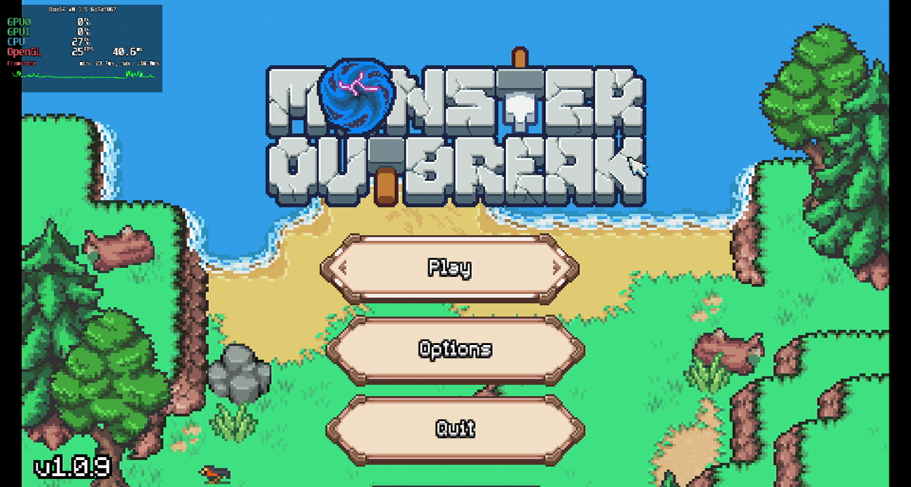
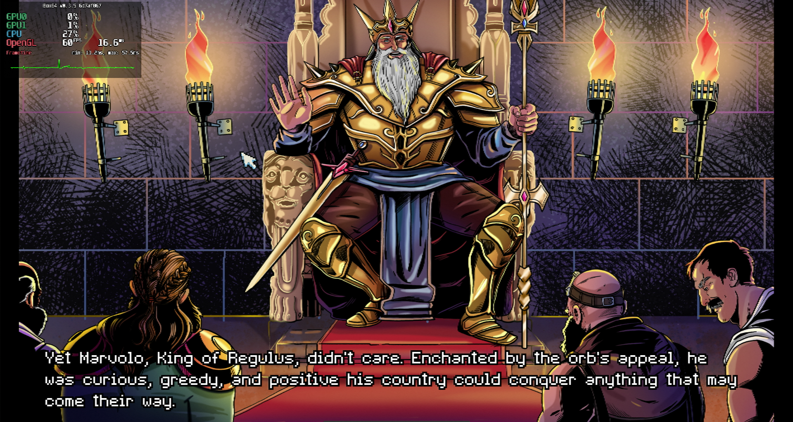

# Monster Outbreak

## Compatibility report

### Tested on

[Milk-V Jupiter](/docs/hardwares#milk-v-jupiter-soc-spacemit-m1)
 with AMD Radeon RX 550

### Box64 version (commit)

Box64 [ptitSeb/box64@6d7af867](https://github.com/ptitSeb/box64/tree/6d7af867)

### Game screenshot




### Game running log

```shell
[BOX64] Box64 with Dynarec v0.3.5 6d7af867 built on Apr  6 2025 20:28:41
[BOX64] Dynarec for rv64gv_zba_zbb_zbc_zbs_zvl256
[BOX64] Running on Spacemit(R) X60 with 8 cores, pagesize: 4096
[BOX64] Will use hardware counter measured at 24.0 MHz emulating 3.0 GHz
[BOX64] Using bash "/home/rurumuri/ourstorybegin/box64/tests/box64-bash"
[BOX64] Didn't detect 48bits of address space, considering it's 39bits
[BOX64] Counted 49 Env var
[BOX64] BOX64 trying to Preload /usr/local/$LIB/mangohud/libMangoHud_shim.so 
[BOX64] Library search path: 
[BOX64] Binary search path: ./:bin/:/home/rurumuri/ourstorybegin/wine/wine-10.3-amd64-wow64/bin/:/home/rurumuri/ourstorybegin/wine/wine-10.3-amd64-wow64/bin/:/usr/local/bin/:/usr/bin/:/bin/:/usr/local/sbin/:/usr/lib/jvm/default/bin/:/usr/bin/site_perl/:/usr/bin/vendor_perl/:/usr/bin/core_perl/:/usr/lib/rustup/bin/
[BOX64] Looking for ./MonsterOutbreak
[BOX64] BOX64ENV: Variables overridden via env and/or RC file:
        BOX64_BASH=/home/rurumuri/ourstorybegin/box64/tests/box64-bash
[BOX64] Rename process to "MonsterOutbreak"
[BOX64] Warning, cannot pre-load /usr/local/$LIB/mangohud/libMangoHud_shim.so
[BOX64] Using native(wrapped) libXcursor.so.1
[BOX64] Using native(wrapped) libX11.so.6
[BOX64] Using native(wrapped) libxcb.so.1
[BOX64] Using native(wrapped) libXau.so.6
[BOX64] Using native(wrapped) libXdmcp.so.6
[BOX64] Using native(wrapped) libXfixes.so.3
[BOX64] Using native(wrapped) libXrender.so.1
[BOX64] Using native(wrapped) libXinerama.so.1
[BOX64] Using native(wrapped) libXext.so.6
[BOX64] Using native(wrapped) libdl.so.2
[BOX64] Using native(wrapped) libXrandr.so.2
[BOX64] Using native(wrapped) libXi.so.6
[BOX64] Using native(wrapped) libGL.so.1
[BOX64] Using native(wrapped) libpthread.so.0
[BOX64] Using native(wrapped) libm.so.6
[BOX64] Using native(wrapped) libc.so.6
[BOX64] Using native(wrapped) ld-linux-x86-64.so.2
[BOX64] Using native(wrapped) libutil.so.1
[BOX64] Using native(wrapped) librt.so.1
[BOX64] Using native(wrapped) libbsd.so.0
Godot Engine v3.5.1.stable.official.6fed1ffa3 - https://godotengine.org
kmsro: driver missing
glx: failed to create dri3 screen
failed to load driver: pvr
OpenGL ES 3.0 Renderer: AMD Radeon RX 550 Series (radeonsi, polaris11, LLVM 19.1.7, DRM 3.49, 6.1.15+)
Async. shader compilation: OFF
[BOX64] Using native(wrapped) libasound.so.2
[BOX64] Using native(wrapped) libpulse.so.0
[BOX64] Using native(wrapped) libudev.so.1
 
[2025-04-18 13:00:33.259] [MANGOHUD] [error] [cpu.cpp:552] Could not find cpu temp sensor location
init_registry
init_registry_thread
Input scheme now 
Initiating Settings...
failed loading settings file. Error code 7
Changing Language to en
Translating to en
Ready1
current background is peaceful_soundtrack
SCENE Press<>ui_accept<to connect!
SCENE Press<>ui_accept<to connect!
disconnect_network()
SCENE Press<>ui_accept<to connect!
SCENE Press<>ui_accept<to connect!
ui_hover not found!
ui_selected not found!
ui_hover not found!
ui_hover not found!
ui_selected not found!
ui_hover not found!
ui_selected not found!
init_registry_thread finished in 57857ms
ui_selected not found!
Creating Game Data
current background is cutscene
queuing resource: res://scene/cutscenes/scene1.tscn
ERROR: Tween was not added to the SceneTree!
   at: start (scene/animation/tween.cpp:906)
ERROR: Tween was not added to the SceneTree!
   at: start (scene/animation/tween.cpp:906)
sending completed resources
Loading cutscene
current background is cutscene
ERROR: Condition "all_equal" is true.
   at: add_triangle (scene/animation/animation_blend_space_2d.cpp:199)
ERROR: Condition "all_equal" is true.
   at: add_triangle (scene/animation/animation_blend_space_2d.cpp:199)
queuing resource: res://scene/cutscenes/panels/panel1.tscn
sending completed resources
Loading cutscene panel
queuing resource: res://scene/cutscenes/panels/panel2.tscn
sending completed resources
Loading cutscene panel
queuing resource: res://scene/cutscenes/panels/panel3.tscn
sending completed resources
Loading cutscene panel
queuing resource: res://scene/cutscenes/panels/panel4.tscn
sending completed resources
Loading cutscene panel
queuing resource: res://scene/cutscenes/panels/panel5.tscn
sending completed resources
Loading cutscene panel
queuing resource: res://scene/cutscenes/panels/panel6.tscn
sending completed resources
Loading cutscene panel
queuing resource: res://scene/cutscenes/panels/panel7.tscn
sending completed resources
Loading cutscene panel
queuing resource: res://scene/cutscenes/panels/panel8.tscn
sending completed resources
Loading cutscene panel
queuing resource: res://scene/cutscenes/panels/panel9.tscn
sending completed resources
Loading cutscene panel
queuing resource: res://scene/map/world0.tscn
sending completed resources
Loading level
cur_game_mode: 0
Setting up viewport 1
current background is normal_no_wave
Initializing Level.
Changing on Change_tool 0/1
Tool: 6
Tool: 6
Custom Index = 1
Custom Index Printing
Starting Tutorial before
Starting Tutorial
Starting Tutorial  2222
removing load screen
```

### Rendering methods

```shell
OpenGL ES
```

### Extra information

[Steam](https://store.steampowered.com/app/1525190/Monster_Outbreak/)

### Advanced Tips

> TBD