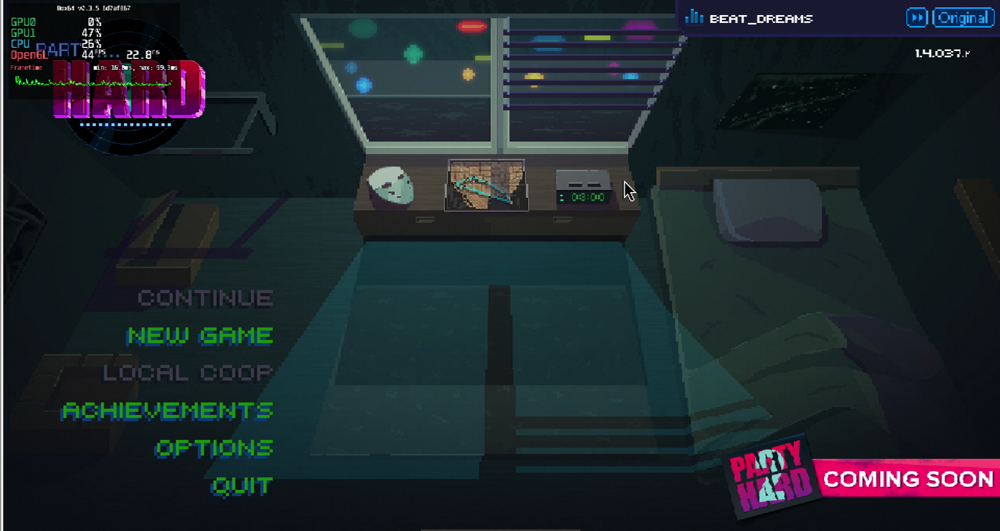
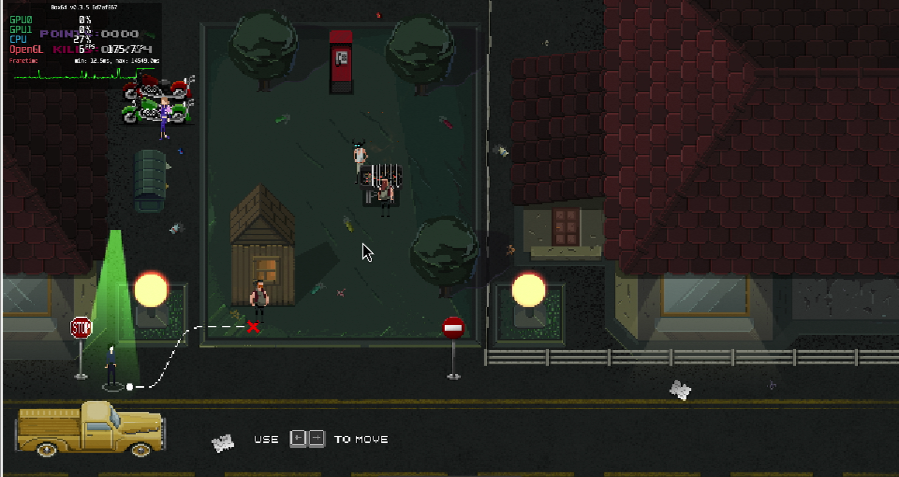

# Party Hard

## Compatibility report

### Tested on

[Milk-V Jupiter](/docs/hardwares#milk-v-jupiter-soc-spacemit-m1)
 with AMD Radeon RX 550

### Box64 version (commit)

Box64 [ptitSeb/box64@6d7af867](https://github.com/ptitSeb/box64/tree/6d7af867)

### Game screenshot




### Game running log

```shell
[BOX64] Box64 with Dynarec v0.3.5 6d7af867 built on Apr  6 2025 20:28:41
[BOX64] Dynarec for rv64gv_zba_zbb_zbc_zbs_zvl256
[BOX64] Running on Spacemit(R) X60 with 8 cores, pagesize: 4096
[BOX64] Will use hardware counter measured at 24.0 MHz emulating 3.0 GHz
[BOX64] Using bash "/home/rurumuri/ourstorybegin/box64/tests/box64-bash"
[BOX64] Didn't detect 48bits of address space, considering it's 39bits
[BOX64] Counted 49 Env var
[BOX64] BOX64 trying to Preload /usr/local/$LIB/mangohud/libMangoHud_shim.so 
[BOX64] Library search path: 
[BOX64] Binary search path: ./:bin/:/home/rurumuri/ourstorybegin/wine/wine-10.3-amd64-wow64/bin/:/home/rurumuri/ourstorybegin/wine/wine-10.3-amd64-wow64/bin/:/usr/local/bin/:/usr/bin/:/bin/:/usr/local/sbin/:/usr/lib/jvm/default/bin/:/usr/bin/site_perl/:/usr/bin/vendor_perl/:/usr/bin/core_perl/:/usr/lib/rustup/bin/
[BOX64] Looking for ./start.sh
[BOX64] BOX64ENV: Variables overridden via env and/or RC file:
        BOX64_BASH=/home/rurumuri/ourstorybegin/box64/tests/box64-bash
[BOX64] Not an ELF file (sign=#!/b)
[BOX64] Error: Reading elf header of /home/rurumuri/GOG Games/Party Hard/start.sh, Try to launch using bash instead
[BOX64] Box64 with Dynarec v0.3.5 6d7af867 built on Apr  6 2025 20:28:41
[BOX64] Dynarec for rv64gv_zba_zbb_zbc_zbs_zvl256
[BOX64] Running on Spacemit(R) X60 with 8 cores, pagesize: 4096
[BOX64] Will use hardware counter measured at 24.0 MHz emulating 3.0 GHz
[BOX64] Using bash "/home/rurumuri/ourstorybegin/box64/tests/box64-bash"
[BOX64] Didn't detect 48bits of address space, considering it's 39bits
[BOX64] Counted 49 Env var
[BOX64] BOX64 trying to Preload /usr/local/$LIB/mangohud/libMangoHud_shim.so 
[BOX64] Library search path: 
[BOX64] Binary search path: ./:bin/:/home/rurumuri/ourstorybegin/wine/wine-10.3-amd64-wow64/bin/:/home/rurumuri/ourstorybegin/wine/wine-10.3-amd64-wow64/bin/:/usr/local/bin/:/usr/bin/:/bin/:/usr/local/sbin/:/usr/lib/jvm/default/bin/:/usr/bin/site_perl/:/usr/bin/vendor_perl/:/usr/bin/core_perl/:/usr/lib/rustup/bin/
[BOX64] Looking for /home/rurumuri/ourstorybegin/box64/tests/box64-bash
[BOX64] Bash detected, disabling banner
[BOX64] BOX64ENV: Variables overridden via env and/or RC file:
        BOX64_BASH=/home/rurumuri/ourstorybegin/box64/tests/box64-bash
[BOX64] argv[1]="./start.sh"
[BOX64] Rename process to "box64-bash"
[BOX64] Warning, cannot pre-load /usr/local/$LIB/mangohud/libMangoHud_shim.so
[BOX64] Using native(wrapped) libtinfo.so.6
[BOX64] Using native(wrapped) libdl.so.2
[BOX64] Using native(wrapped) libc.so.6
[BOX64] Using native(wrapped) ld-linux-x86-64.so.2
[BOX64] Using native(wrapped) libpthread.so.0
[BOX64] Using native(wrapped) libutil.so.1
[BOX64] Using native(wrapped) librt.so.1
[BOX64] Using native(wrapped) libbsd.so.0
[BOX64] Warning, of_unconvert(...) left over 0x8000, converted 0x8000
Running Party Hard
[BOX64] Box64 with Dynarec v0.3.5 6d7af867 built on Apr  6 2025 20:28:41
[BOX64] Dynarec for rv64gv_zba_zbb_zbc_zbs_zvl256
[BOX64] Running on Spacemit(R) X60 with 8 cores, pagesize: 4096
[BOX64] Will use hardware counter measured at 24.0 MHz emulating 3.0 GHz
[BOX64] Using bash "/home/rurumuri/ourstorybegin/box64/tests/box64-bash"
[BOX64] Didn't detect 48bits of address space, considering it's 39bits
[BOX64] Counted 50 Env var
[BOX64] BOX64 trying to Preload /usr/local/$LIB/mangohud/libMangoHud_shim.so 
[BOX64] Library search path: 
[BOX64] Binary search path: ./:bin/:/home/rurumuri/ourstorybegin/wine/wine-10.3-amd64-wow64/bin/:/home/rurumuri/ourstorybegin/wine/wine-10.3-amd64-wow64/bin/:/usr/local/bin/:/usr/bin/:/bin/:/usr/local/sbin/:/usr/lib/jvm/default/bin/:/usr/bin/site_perl/:/usr/bin/vendor_perl/:/usr/bin/core_perl/:/usr/lib/rustup/bin/
[BOX64] Looking for ./PartyHardGame.x86_64
[BOX64] BOX64ENV: Variables overridden via env and/or RC file:
        BOX64_BASH=/home/rurumuri/ourstorybegin/box64/tests/box64-bash
[BOX64] Rename process to "PartyHardGame.x86_64"
[BOX64] Warning, cannot pre-load /usr/local/$LIB/mangohud/libMangoHud_shim.so
[BOX64] Using native(wrapped) libdl.so.2
[BOX64] Using native(wrapped) libpthread.so.0
[BOX64] Using native(wrapped) librt.so.1
[BOX64] Using emulated /home/rurumuri/ourstorybegin/box64/x64lib/libstdc++.so.6
[BOX64] Using native(wrapped) libm.so.6
[BOX64] Using emulated /home/rurumuri/ourstorybegin/box64/x64lib/libgcc_s.so.1
[BOX64] Using native(wrapped) libc.so.6
[BOX64] Using native(wrapped) ld-linux-x86-64.so.2
[BOX64] Using native(wrapped) libutil.so.1
[BOX64] Using native(wrapped) libbsd.so.0
[BOX64] Using native(wrapped) libX11.so.6
[BOX64] Using native(wrapped) libxcb.so.1
[BOX64] Using native(wrapped) libXau.so.6
[BOX64] Using native(wrapped) libXdmcp.so.6
[BOX64] Using native(wrapped) libXext.so.6
[BOX64] Using native(wrapped) libXcursor.so.1
[BOX64] Using native(wrapped) libXfixes.so.3
[BOX64] Using native(wrapped) libXrender.so.1
[BOX64] Using native(wrapped) libXinerama.so.1
[BOX64] Using native(wrapped) libXi.so.6
[BOX64] Using native(wrapped) libXrandr.so.2
[BOX64] Using native(wrapped) libXxf86vm.so.1
[BOX64] Using native(wrapped) libGL.so.1
[2025-04-15 13:15:23.639] [MANGOHUD] [error] [cpu.cpp:552] Could not find cpu temp sensor location
[BOX64] Using native(wrapped) libudev.so.1
Set current directory to /home/rurumuri/GOG Games/Party Hard/game
Found path: /home/rurumuri/GOG Games/Party Hard/game/PartyHardGame.x86_64
[BOX64] Using emulated /home/rurumuri/GOG Games/Party Hard/game/PartyHardGame_Data/Mono/x86_64/libmono.so
Mono path[0] = '/home/rurumuri/GOG Games/Party Hard/game/PartyHardGame_Data/Managed'
Mono path[1] = '/home/rurumuri/GOG Games/Party Hard/game/PartyHardGame_Data/Mono'
Mono config path = '/home/rurumuri/GOG Games/Party Hard/game/PartyHardGame_Data/Mono/etc'
[BOX64] Warning, block 0x3f6cd76680 not found in p_blocks for Free
[BOX64] Warning, block 0x3f6cd70980 not found in p_blocks for Free
[BOX64] Warning, block 0x3f6cd7cd00 not found in p_blocks for Free
[BOX64] Warning, block 0x3f6cd6fc00 not found in p_blocks for Free
[BOX64] Warning, block 0x3f6cd81200 not found in p_blocks for Free
[BOX64] Warning, block 0x3f6cd83e00 not found in p_blocks for Free
[BOX64] Warning, block 0x3f6cd87d00 not found in p_blocks for Free
[BOX64] Warning, block 0x3f6cd80580 not found in p_blocks for Free
[BOX64] Warning, block 0x3f6cd86400 not found in p_blocks for Free
[BOX64] Warning, block 0x3f6cd70e00 not found in p_blocks for Free
[BOX64] Warning, block 0x3f6cd81300 not found in p_blocks for Free
[BOX64] Warning, block 0x3f6cd7ca80 not found in p_blocks for Free
[BOX64] Warning, block 0x3f6cd7d400 not found in p_blocks for Free
[BOX64] Warning, block 0x3f6cd6d380 not found in p_blocks for Free
[BOX64] Warning, block 0x3f6cd6ad80 not found in p_blocks for Free
[BOX64] Warning, block 0x3f6cd85a80 not found in p_blocks for Free
[BOX64] Warning, block 0x3f6cd85b00 not found in p_blocks for Free
[BOX64] Warning, block 0x3f6cd76580 not found in p_blocks for Free
[BOX64] Using emulated /home/rurumuri/GOG Games/Party Hard/game/PartyHardGame_Data/Plugins/x86_64/ScreenSelector.so
[BOX64] Using native(wrapped) libgtk-x11-2.0.so.0
[BOX64] Using native(wrapped) libgdk-x11-2.0.so.0
[BOX64] Using native(wrapped) libgobject-2.0.so.0
[BOX64] Using native(wrapped) libglib-2.0.so.0
[BOX64] Using native(wrapped) libgio-2.0.so.0
[BOX64] Using native(wrapped) libgmodule-2.0.so.0
[BOX64] Using native(wrapped) libgdk_pixbuf-2.0.so.0
[BOX64] Using native(wrapped) libpangocairo-1.0.so.0
[BOX64] Using native(wrapped) libpango-1.0.so.0
Preloaded 'ScreenSelector.so'
[BOX64] Using emulated /home/rurumuri/GOG Games/Party Hard/game/PartyHardGame_Data/Plugins/x86_64/libCSteamworks.so
[BOX64] Using emulated /home/rurumuri/GOG Games/Party Hard/game/PartyHardGame_Data/Plugins/x86_64/libsteam_api.so
[BOX64] Warning, block 0x3f6cd87780 not found in p_blocks for Free
Preloaded 'libCSteamworks.so'
Preloaded 'libsteam_api.so'
[BOX64] Warning, block 0x3f6cd70800 not found in p_blocks for Free
[BOX64] Warning, block 0x3f6cd6b300 not found in p_blocks for Free
[BOX64] Warning, block 0x3f6cd84280 not found in p_blocks for Free
Player data archive not found at `/home/rurumuri/GOG Games/Party Hard/game/PartyHardGame_Data/data.unity3d`, using local filesystem[BOX64] Warning, block 0x3f6cd7bc80 not found in p_blocks for Free
```

### Rendering methods

```shell
OpenGL
```

### Extra information

[Steam](https://store.steampowered.com/app/356570/Party_Hard/)

[PCGameWiki](https://www.pcgamingwiki.com/wiki/Party_Hard)

### Advanced Tips

> TBD