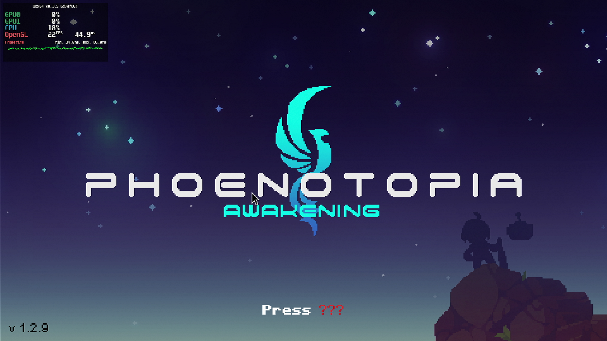
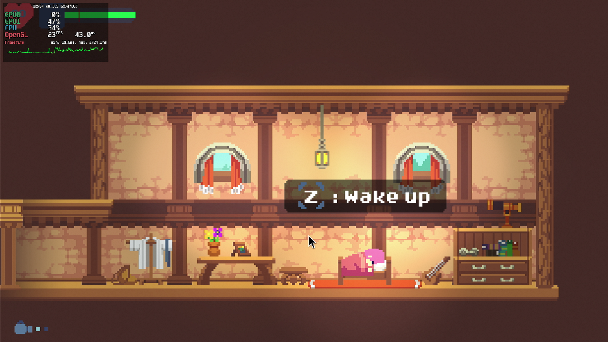
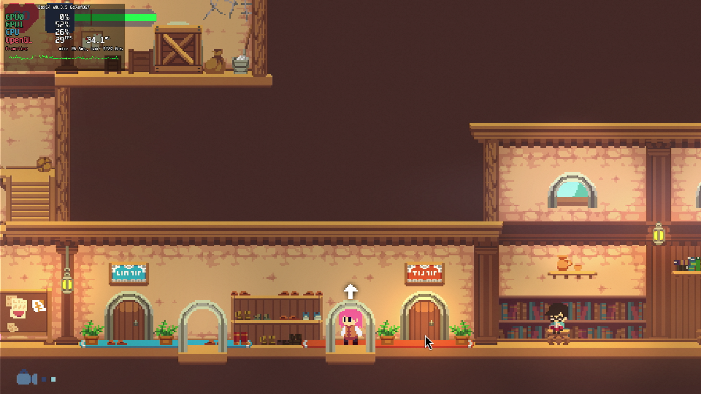

# Phoenotopia: Awakening

## Compatibility report

### Tested on

[Milk-V Jupiter](/docs/hardwares#milk-v-jupiter-soc-spacemit-m1)
 with AMD Radeon RX 550

### Box64 version (commit)

Box64 [ptitSeb/box64@6d7af867](https://github.com/ptitSeb/box64/tree/6d7af867)

### Game screenshot





### Game running log

```shell
[BOX64] Box64 with Dynarec v0.3.5 6d7af867 built on Apr  6 2025 20:28:41
[BOX64] Dynarec for rv64gv_zba_zbb_zbc_zbs_zvl256
[BOX64] Running on Spacemit(R) X60 with 8 cores, pagesize: 4096
[BOX64] Will use hardware counter measured at 24.0 MHz emulating 3.0 GHz
[BOX64] Using bash "/home/rurumuri/ourstorybegin/box64/tests/box64-bash"
[BOX64] Didn't detect 48bits of address space, considering it's 39bits
[BOX64] Counted 49 Env var
[BOX64] BOX64 trying to Preload /usr/local/$LIB/mangohud/libMangoHud_shim.so 
[BOX64] Library search path: 
[BOX64] Binary search path: ./:bin/:/home/rurumuri/ourstorybegin/wine/wine-10.3-amd64-wow64/bin/:/home/rurumuri/ourstorybegin/wine/wine-10.3-amd64-wow64/bin/:/usr/local/bin/:/usr/bin/:/bin/:/usr/local/sbin/:/usr/lib/jvm/default/bin/:/usr/bin/site_perl/:/usr/bin/vendor_perl/:/usr/bin/core_perl/:/usr/lib/rustup/bin/
[BOX64] Looking for ./Phoenotopia Awakening
[BOX64] BOX64ENV: Variables overridden via env and/or RC file:
        BOX64_BASH=/home/rurumuri/ourstorybegin/box64/tests/box64-bash
[BOX64] Rename process to "Phoenotopia Awakening"
[BOX64] Warning, cannot pre-load /usr/local/$LIB/mangohud/libMangoHud_shim.so
[BOX64] Using native(wrapped) libdl.so.2
[BOX64] Using native(wrapped) libpthread.so.0
[BOX64] Using native(wrapped) librt.so.1
[BOX64] Using emulated /home/rurumuri/ourstorybegin/box64/x64lib/libstdc++.so.6
[BOX64] Using native(wrapped) libm.so.6
[BOX64] Using emulated /home/rurumuri/ourstorybegin/box64/x64lib/libgcc_s.so.1
[BOX64] Using native(wrapped) libc.so.6
[BOX64] Using native(wrapped) ld-linux-x86-64.so.2
[BOX64] Using native(wrapped) libutil.so.1
[BOX64] Using native(wrapped) libbsd.so.0
[BOX64] Using native(wrapped) libX11.so.6
[BOX64] Using native(wrapped) libxcb.so.1
[BOX64] Using native(wrapped) libXau.so.6
[BOX64] Using native(wrapped) libXdmcp.so.6
[BOX64] Using native(wrapped) libXext.so.6
[BOX64] Using native(wrapped) libXcursor.so.1
[BOX64] Using native(wrapped) libXfixes.so.3
[BOX64] Using native(wrapped) libXrender.so.1
[BOX64] Using native(wrapped) libXinerama.so.1
[BOX64] Using native(wrapped) libXi.so.6
[BOX64] Using native(wrapped) libXrandr.so.2
[BOX64] Using native(wrapped) libXxf86vm.so.1
[BOX64] Using native(wrapped) libGL.so.1
[2025-04-17 14:50:34.290] [MANGOHUD] [error] [cpu.cpp:552] Could not find cpu temp sensor location
[BOX64] Using native(wrapped) libudev.so.1
Set current directory to /home/rurumuri/games/Phoenotopia - Awakening
Found path: /home/rurumuri/games/Phoenotopia - Awakening/Phoenotopia Awakening
[BOX64] Using emulated /home/rurumuri/games/Phoenotopia - Awakening/Phoenotopia Awakening_Data/Mono/x86_64/libmono.so
Mono path[0] = '/home/rurumuri/games/Phoenotopia - Awakening/Phoenotopia Awakening_Data/Managed'
Mono path[1] = '/home/rurumuri/games/Phoenotopia - Awakening/Phoenotopia Awakening_Data/Mono'
Mono config path = '/home/rurumuri/games/Phoenotopia - Awakening/Phoenotopia Awakening_Data/Mono/etc'
[BOX64] Using emulated /home/rurumuri/games/Phoenotopia - Awakening/Phoenotopia Awakening_Data/Plugins/x86_64/libGalaxy64.so
Preloaded 'libGalaxy64.so'
[BOX64] Using emulated /home/rurumuri/games/Phoenotopia - Awakening/Phoenotopia Awakening_Data/Plugins/x86_64/libGalaxyCSharpGlue.so
Preloaded 'libGalaxyCSharpGlue.so'
Player data archive not found at `/home/rurumuri/games/Phoenotopia - Awakening/Phoenotopia Awakening_Data/data.unity3d`, using local filesystemKilled
```

### Rendering methods

```shell
OpenGL
```

### Extra information

[Steam](https://store.steampowered.com/app/1436590/Phoenotopia_Awakening/)

[PCGameWiki](https://www.pcgamingwiki.com/wiki/Phoenotopia:_Awakening)

### Advanced Tips

> TBD