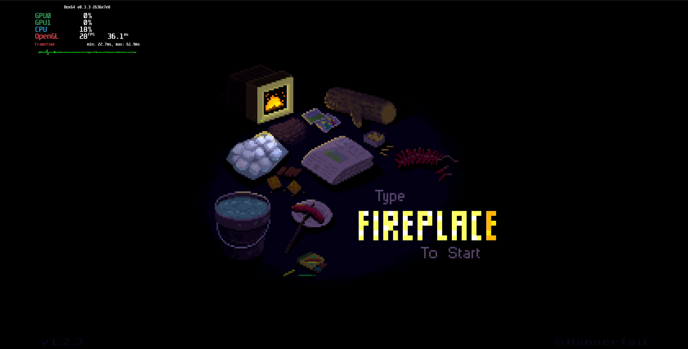
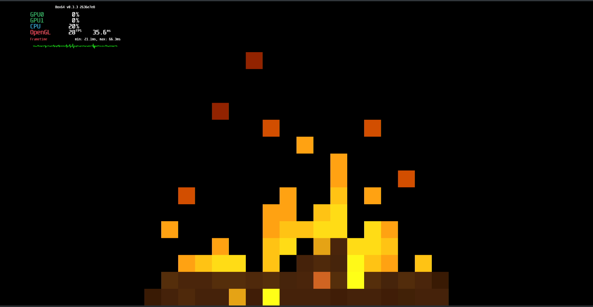
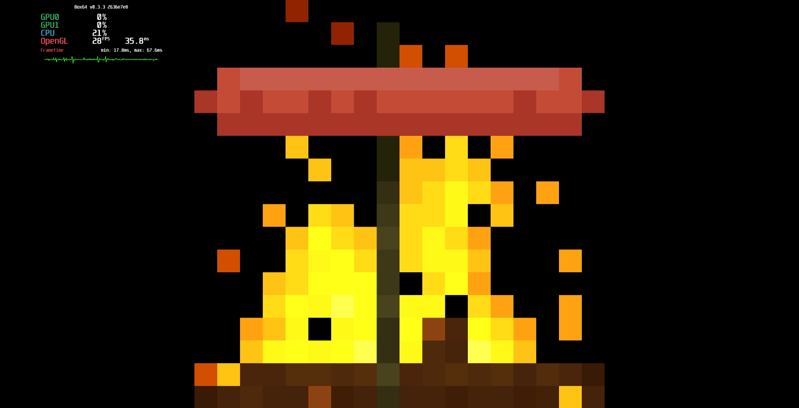
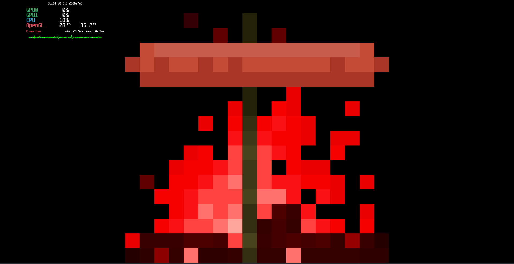

# Pixel Fireplace

## Compatibility report

### Tested on

[Milk-V Jupiter](/docs/hardwares#milk-v-jupiter-soc-spacemit-m1)
 with AMD Radeon HD 6750

### Box64 version (commit)

Box64 [ptitSeb/box64@2636e7e8](https://github.com/ptitSeb/box64/tree/2636e7e8)

### Game screenshot






### Game running log

```shell
[BOX64] Box64 with Dynarec v0.3.3 2636e7e8 built on Mar  4 2025 14:58:49
[BOX64] Dynarec for rv64gv_zba_zbb_zbc_zbs_zvl256
[BOX64] Running on Spacemit(R) X60 with 8 cores, pagesize: 4096
[BOX64] Will use hardware counter measured at 24.0 MHz emulating 3.0 GHz
[BOX64] Using bash "/home/rurumuri/ourstorybegin/box64/tests/box64-bash"
[BOX64] Didn't detect 48bits of address space, considering it's 39bits
[BOX64] Counted 49 Env var
[BOX64] BOX64 trying to Preload /usr/local/$LIB/mangohud/libMangoHud_shim.so 
[BOX64] Library search path: 
[BOX64] Binary search path: ./:bin/:/home/rurumuri/ourstorybegin/wine/wine-10.0-amd64-wow64/bin/:/home/rurumuri/ourstorybegin/wine/wine-10.0-amd64-wow64/bin/:/usr/local/bin/:/usr/bin/:/bin/:/usr/local/sbin/:/usr/bin/site_perl/:/usr/bin/vendor_perl/:/usr/bin/core_perl/
[BOX64] Looking for ./Pixel_Fireplace
[BOX64] BOX64ENV: Variables overridden via env and/or RC file:
        BOX64_BASH=/home/rurumuri/ourstorybegin/box64/tests/box64-bash
[BOX64] Rename process to "Pixel_Fireplace"
[BOX64] Warning, cannot pre-load /usr/local/$LIB/mangohud/libMangoHud_shim.so
[BOX64] Using emulated /usr/lib/box64-x86_64-linux-gnu/libstdc++.so.6
[BOX64] Using native(wrapped) libz.so.1
[BOX64] Using native(wrapped) libXxf86vm.so.1
[BOX64] Using native(wrapped) libX11.so.6
[BOX64] Using native(wrapped) libxcb.so.1
[BOX64] Using native(wrapped) libXau.so.6
[BOX64] Using native(wrapped) libXdmcp.so.6
[BOX64] Using native(wrapped) libXext.so.6
[BOX64] Using native(wrapped) libdl.so.2
[BOX64] Using native(wrapped) libGL.so.1
[BOX64] Using native(wrapped) libm.so.6
[BOX64] Using native(wrapped) librt.so.1
[BOX64] Using native(wrapped) libpthread.so.0
[BOX64] Using emulated /usr/lib/box64-x86_64-linux-gnu/libcrypto.so.1.1
[BOX64] Using native(wrapped) libXrandr.so.2
[BOX64] Using native(wrapped) libXrender.so.1
[BOX64] Using native(wrapped) libGLU.so.1
[BOX64] Using native(wrapped) libcurl.so.4
[BOX64] Using emulated /usr/lib/box64-x86_64-linux-gnu/libssl.so.1.1
[BOX64] Using emulated /usr/lib/box64-x86_64-linux-gnu/libgcc_s.so.1
[BOX64] Using native(wrapped) libc.so.6
[BOX64] Using native(wrapped) ld-linux-x86-64.so.2
[BOX64] Using native(wrapped) libutil.so.1
[BOX64] Using native(wrapped) libbsd.so.0

***************************************
*     YoYo Games Linux Runner V1.3    *
***************************************  
CommandLine: -game game.unx
ExeName= /home/rurumuri/games/pixelfire/Pixel_Fireplace
MemoryManager allocated: 52431
INI DisplayName=Pixel Fireplace
SavePrePend /home/rurumuri/.config/Pixel_Fireplace/ 
GAMEPAD: Initialising Ubuntu support
Attempting to set gamepadcount to 32
display=0x36b61770
Display Size(Pixels): 1920,1080
CreateDesktopWindow 64,48
Win #1
XF86VidModeExtension-Version 2.2
Got Doublebuffered Visual!
glX-Version 1.4
Icon: w=64 h=64
Creating window of width 64, height 48
sw=1920 wh=1080
WindowCentre: 928,516
Depth 24
Congrats, you have Direct Rendering!
sync = 0
**** GLX Extensions ***
GLX_ARB_context_flush_control GLX_ARB_create_context GLX_ARB_create_context_no_error GLX_ARB_create_context_profile GLX_ARB_create_context_robustness GLX_ARB_fbconfig_float GLX_ARB_framebuffer_sRGB GLX_ARB_get_proc_address GLX_ARB_multisample GLX_EXT_buffer_age GLX_EXT_create_context_es2_profile GLX_EXT_create_context_es_profile GLX_EXT_fbconfig_packed_float GLX_EXT_framebuffer_sRGB GLX_EXT_no_config_context GLX_EXT_swap_control GLX_EXT_swap_control_tear GLX_EXT_texture_from_pixmap GLX_EXT_visual_info GLX_EXT_visual_rating GLX_INTEL_swap_event GLX_MESA_copy_sub_buffer GLX_MESA_gl_interop GLX_MESA_query_renderer GLX_MESA_swap_control GLX_OML_sync_control GLX_SGIS_multisample GLX_SGIX_fbconfig GLX_SGIX_pbuffer GLX_SGIX_visual_select_group GLX_SGI_make_current_read GLX_SGI_swap_control GLX_SGI_video_sync 
Checking for GLX_EXT_swap_control
Vsync: GLX_EXT
DOUBLE BUFFERED
OpenGL: version string 4.5 (Compatibility Profile) Mesa 24.3.4-arch1.1
OpenGL: vendor string Mesa
OpenGL GLSL: version string 4.50
Extensions:
GL_ARB_multisample GL_EXT_abgr GL_EXT_bgra GL_EXT_blend_color GL_EXT_blend_minmax GL_EXT_blend_subtract GL_EXT_copy_texture GL_EXT_subtexture GL_EXT_texture_object GL_EXT_vertex_array GL_EXT_compiled_vertex_array GL_EXT_texture GL_EXT_texture3D GL_IBM_rasterpos_clip GL_ARB_point_parameters GL_EXT_draw_range_elements GL_EXT_packed_pixels GL_EXT_point_parameters GL_EXT_rescale_normal GL_EXT_separate_specular_color GL_EXT_texture_edge_clamp GL_SGIS_generate_mipmap GL_SGIS_texture_border_clamp GL_SGIS_texture_edge_clamp GL_SGIS_texture_lod GL_ARB_framebuffer_sRGB GL_ARB_multitexture GL_EXT_framebuffer_sRGB GL_IBM_multimode_draw_arrays GL_IBM_texture_mirrored_repeat GL_ARB_texture_cube_map GL_ARB_texture_env_add GL_ARB_transpose_matrix GL_EXT_blend_func_separate GL_EXT_fog_coord GL_EXT_multi_draw_arrays GL_EXT_secondary_color GL_EXT_texture_env_add GL_EXT_texture_filter_anisotropic GL_EXT_texture_lod_bias GL_INGR_blend_func_separate GL_NV_blend_square GL_NV_light_max_exponent GL_NV_texgen_reflection GL_NV_texture_env_combine4 GL_S3_s3tc GL_SUN_multi_draw_arrays GL_ARB_texture_border_clamp GL_ARB_texture_compression GL_EXT_framebuffer_object GL_EXT_texture_compression_s3tc GL_EXT_texture_env_combine GL_EXT_texture_env_dot3 GL_MESA_window_pos GL_NV_packed_depth_stencil GL_NV_texture_rectangle GL_ARB_depth_texture GL_ARB_occlusion_query GL_ARB_shadow GL_ARB_texture_env_combine GL_ARB_texture_env_crossbar GL_ARB_texture_env_dot3 GL_ARB_texture_mirrored_repeat GL_ARB_window_pos GL_ATI_fragment_shader GL_EXT_stencil_two_side GL_EXT_texture_cube_map GL_NV_depth_clamp GL_NV_fog_distance GL_NV_half_float GL_APPLE_packed_pixels GL_ARB_draw_buffers GL_ARB_fragment_program GL_ARB_fragment_shader GL_ARB_shader_objects GL_ARB_vertex_program GL_ARB_vertex_shader GL_ATI_draw_buffers GL_ATI_texture_env_combine3 GL_ATI_texture_float GL_EXT_shadow_funcs GL_EXT_stencil_wrap GL_MESA_pack_invert GL_NV_primitive_restart GL_ARB_depth_clamp GL_ARB_fragment_program_shadow GL_ARB_half_float_pixel GL_ARB_occlusion_query2 GL_ARB_point_sprite GL_ARB_shading_language_100 GL_ARB_sync GL_ARB_texture_non_power_of_two GL_ARB_vertex_buffer_object GL_ATI_blend_equation_separate GL_EXT_blend_equation_separate GL_OES_read_format GL_ARB_color_buffer_float GL_ARB_pixel_buffer_object GL_ARB_texture_compression_rgtc GL_ARB_texture_float GL_ARB_texture_rectangle GL_ATI_texture_compression_3dc GL_EXT_packed_float GL_EXT_pixel_buffer_object GL_EXT_texture_compression_dxt1 GL_EXT_texture_compression_rgtc GL_EXT_texture_mirror_clamp GL_EXT_texture_rectangle GL_EXT_texture_sRGB GL_EXT_texture_shared_exponent GL_ARB_framebuffer_object GL_EXT_framebuffer_blit GL_EXT_framebuffer_multisample GL_EXT_packed_depth_stencil GL_ARB_vertex_array_object GL_ATI_separate_stencil GL_ATI_texture_mirror_once GL_EXT_draw_buffers2 GL_EXT_draw_instanced GL_EXT_gpu_program_parameters GL_EXT_gpu_shader4 GL_EXT_texture_array GL_EXT_texture_compression_latc GL_EXT_texture_integer GL_EXT_texture_sRGB_decode GL_EXT_timer_query GL_OES_EGL_image GL_AMD_performance_monitor GL_EXT_texture_buffer_object GL_AMD_texture_texture4 GL_ARB_copy_buffer GL_ARB_depth_buffer_float GL_ARB_draw_instanced GL_ARB_half_float_vertex GL_ARB_instanced_arrays GL_ARB_map_buffer_range GL_ARB_texture_buffer_object GL_ARB_texture_rg GL_ARB_texture_swizzle GL_ARB_vertex_array_bgra GL_EXT_texture_swizzle GL_EXT_vertex_array_bgra GL_NV_conditional_render GL_AMD_conservative_depth GL_AMD_depth_clamp_separate GL_AMD_draw_buffers_blend GL_AMD_seamless_cubemap_per_texture GL_AMD_shader_stencil_export GL_ARB_ES2_compatibility GL_ARB_blend_func_extended GL_ARB_compatibility GL_ARB_debug_output GL_ARB_draw_buffers_blend GL_ARB_draw_elements_base_vertex GL_ARB_explicit_attrib_location GL_ARB_fragment_coord_conventions GL_ARB_provoking_vertex GL_ARB_sample_shading GL_ARB_sampler_objects GL_ARB_seamless_cube_map GL_ARB_shader_stencil_export GL_ARB_shader_texture_lod GL_ARB_tessellation_shader GL_ARB_texture_buffer_object_rgb32 GL_ARB_texture_cube_map_array GL_ARB_texture_gather GL_ARB_texture_multisample GL_ARB_texture_query_lod GL_ARB_texture_rgb10_a2ui GL_ARB_uniform_buffer_object GL_ARB_vertex_type_2_10_10_10_rev GL_ATI_meminfo GL_EXT_provoking_vertex GL_EXT_texture_snorm GL_EXT_texture_storage GL_MESA_texture_signed_rgba GL_NV_copy_image GL_NV_texture_barrier GL_ARB_draw_indirect GL_ARB_get_program_binary GL_ARB_gpu_shader5 GL_ARB_gpu_shader_fp64 GL_ARB_robustness GL_ARB_separate_shader_objects GL_ARB_shader_bit_encoding GL_ARB_shader_precision GL_ARB_shader_subroutine GL_ARB_texture_compression_bptc GL_ARB_timer_query GL_ARB_transform_feedback2 GL_ARB_transform_feedback3 GL_ARB_vertex_attrib_64bit GL_ARB_viewport_array GL_EXT_direct_state_access GL_EXT_vertex_attrib_64bit GL_NV_vdpau_interop GL_AMD_multi_draw_indirect GL_ANGLE_texture_compression_dxt3 GL_ANGLE_texture_compression_dxt5 GL_ARB_base_instance GL_ARB_compressed_texture_pixel_storage GL_ARB_conservative_depth GL_ARB_internalformat_query GL_ARB_map_buffer_alignment GL_ARB_shader_atomic_counters GL_ARB_shader_image_load_store GL_ARB_shading_language_420pack GL_ARB_shading_language_packing GL_ARB_texture_storage GL_ARB_transform_feedback_instanced GL_EXT_framebuffer_multisample_blit_scaled GL_EXT_transform_feedback GL_AMD_query_buffer_object GL_AMD_shader_trinary_minmax GL_AMD_vertex_shader_layer GL_AMD_vertex_shader_viewport_index GL_ARB_ES3_compatibility GL_ARB_arrays_of_arrays GL_ARB_clear_buffer_object GL_ARB_compute_shader GL_ARB_copy_image GL_ARB_explicit_uniform_location GL_ARB_fragment_layer_viewport GL_ARB_framebuffer_no_attachments GL_ARB_invalidate_subdata GL_ARB_multi_draw_indirect GL_ARB_program_interface_query GL_ARB_robust_buffer_access_behavior GL_ARB_shader_image_size GL_ARB_shader_storage_buffer_object GL_ARB_stencil_texturing GL_ARB_texture_buffer_range GL_ARB_texture_query_levels GL_ARB_texture_storage_multisample GL_ARB_texture_view GL_ARB_vertex_attrib_binding GL_KHR_debug GL_KHR_robustness GL_KHR_texture_compression_astc_ldr GL_AMD_pinned_memory GL_ARB_buffer_storage GL_ARB_clear_texture GL_ARB_enhanced_layouts GL_ARB_internalformat_query2 GL_ARB_multi_bind GL_ARB_query_buffer_object GL_ARB_seamless_cubemap_per_texture GL_ARB_shading_language_include GL_ARB_texture_mirror_clamp_to_edge GL_ARB_texture_stencil8 GL_ARB_vertex_type_10f_11f_11f_rev GL_EXT_debug_label GL_EXT_shader_integer_mix GL_NVX_gpu_memory_info GL_ARB_ES3_1_compatibility GL_ARB_clip_control GL_ARB_conditional_render_inverted GL_ARB_cull_distance GL_ARB_derivative_control GL_ARB_direct_state_access GL_ARB_get_texture_sub_image GL_ARB_pipeline_statistics_query GL_ARB_shader_texture_image_samples GL_ARB_texture_barrier GL_EXT_polygon_offset_clamp GL_KHR_context_flush_control GL_KHR_robust_buffer_access_behavior GL_ARB_ES3_2_compatibility GL_ARB_gpu_shader_int64 GL_ARB_parallel_shader_compile GL_ARB_shader_atomic_counter_ops GL_ARB_shader_clock GL_EXT_texture_sRGB_R8 GL_KHR_no_error GL_KHR_texture_compression_astc_sliced_3d GL_ARB_gl_spirv GL_ARB_spirv_extensions GL_MESA_shader_integer_functions GL_ARB_polygon_offset_clamp GL_ARB_texture_filter_anisotropic GL_EXT_memory_object GL_EXT_memory_object_fd GL_KHR_parallel_shader_compile GL_NV_alpha_to_coverage_dither_control GL_EXT_EGL_image_storage GL_MESA_framebuffer_flip_y GL_EXT_EGL_sync GL_EXT_EGL_image_storage_compression GL_NV_ES1_1_compatibility 
Anisotropic filtering supported, max aniso 16
This is where it would have set them fullscreen= 0, they are 64,48    displaywidth/h 1920,1080
Texture #1 16,16
Texture #2 16,16
Texture #1 16,16
Texture #2 16,16
finished(2)!!
Texture #1 1,1
Texture #2 1,1
finished(2)!!
Collision Event time(microsecs)=2558
[BOX64] Using native(wrapped) libopenal.so
Opened libopenal.so...
alcCreateContext : 0x30150000
alcOpenDevice : 0x30150020
alcMakeContextCurrent : 0x30150040
alGenBuffers : 0x30150060
alGenSources : 0x30150080
alGetError : 0x301500a0
alBufferData : 0x301500c0
alSourceQueueBuffers : 0x301500e0
alSourcePlay : 0x30150100
alSourceStop : 0x30150120
alGetSourcei : 0x30150140
alSourceUnqueueBuffers : 0x30150160
alDeleteSources : 0x30150180
alDeleteBuffers : 0x301501a0
alcDestroyContext : 0x301501c0
alcCloseDevice : 0x301501e0
alcGetString : 0x30150200
alcGetIntegerv : 0x30150220
alcCaptureOpenDevice : 0x30150240
alcCaptureCloseDevice : 0x30150260
alcCaptureStart : 0x30150280
alcCaptureStop : 0x301502a0
alcCaptureSamples : 0x301502c0
g_device is (nil)
Error generating sources + buffers
Total memory used = 12151968(0x00b96ca0) bytes
**********************************.
Entering main loop.
**********************************.
GraphicsResetM called with g_NewWindowWidth=960 g_NewWindowHeight=540 g_WindowWidth=64 g_WindowHeight=48 g_ClientWidth=64 g_ClientHeight=48
This is where it would have set them fullscreen= 0, they are 960,540    displaywidth/h 1920,1080
[2025-03-03 07:58:15.580] [MANGOHUD] [error] [cpu.cpp:552] Could not find cpu temp sensor location
Window Size w=960 h=540
Set Fullscreen 1
Window Size w=1920 h=1080
Texture #3 1024,2048
Set Fullscreen 0
Window Size w=960 h=540
Pause event has been registered for this frame
Pause event has been unregistered
Set Fullscreen 1
Window Size w=1920 h=1080
Set Fullscreen 0
Window Size w=960 h=540
Set Fullscreen 1
Window Size w=1920 h=1080
Set Fullscreen 0
Window Size w=960 h=540
Set Fullscreen 1
Window Size w=1920 h=1080
Set Fullscreen 0
Window Size w=960 h=540
Set Fullscreen 1
Window Size w=1920 h=1080
Set Fullscreen 0
Window Size w=960 h=540
Set Fullscreen 1
Window Size w=1920 h=1080
Pause event has been registered for this frame
Pause event has been unregistered
Attempting to set gamepadcount to 0
Not shutting down steam as it is not initialised
Script_Free called
Segmentation fault (core dumped)
```

### Rendering methods

```shell
OpenGL
```

### Extra information

[Steam](https://store.steampowered.com/app/2678480/Pixel_Fireplace/)

### Advanced Tips

> TBD