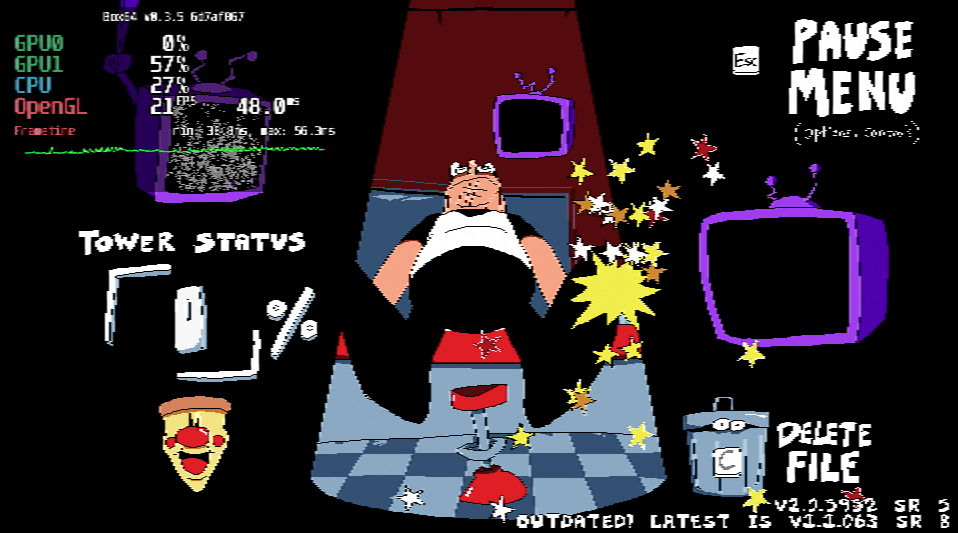
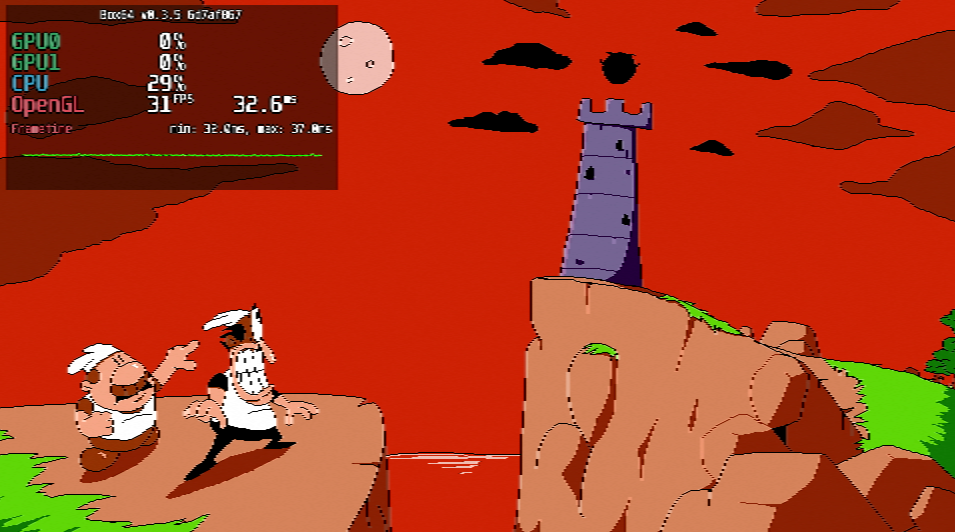
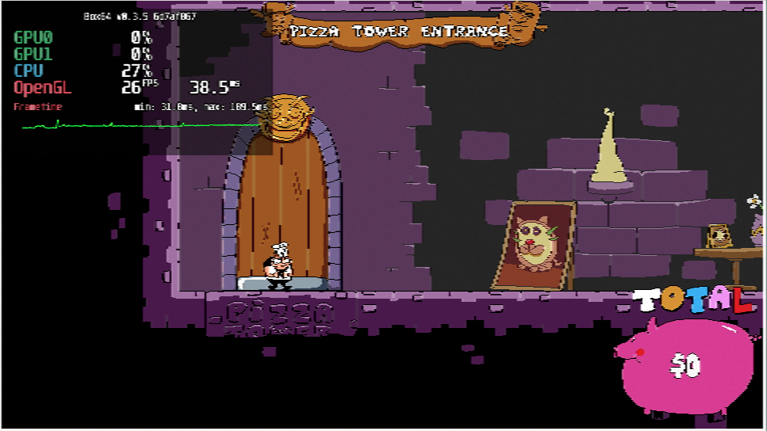

# Pizza Tower

## Compatibility report

### Tested on

[Milk-V Jupiter](/docs/hardwares#milk-v-jupiter-soc-spacemit-m1)
 with AMD Radeon RX 550

### Box64 version (commit)

Box64 [ptitSeb/box64@6d7af867](https://github.com/ptitSeb/box64/tree/6d7af867)

### Game screenshot





### Game running log

```shell
[BOX64] Box64 with Dynarec v0.3.5 6d7af867 built on Apr  6 2025 20:28:41
[BOX64] Dynarec for rv64gv_zba_zbb_zbc_zbs_zvl256
[BOX64] Running on Spacemit(R) X60 with 8 cores, pagesize: 4096
[BOX64] Will use hardware counter measured at 24.0 MHz emulating 3.0 GHz
[BOX64] Using bash "/home/rurumuri/ourstorybegin/box64/tests/box64-bash"
[BOX64] Didn't detect 48bits of address space, considering it's 39bits
[BOX64] Counted 49 Env var
[BOX64] BOX64 trying to Preload /usr/local/$LIB/mangohud/libMangoHud_shim.so 
[BOX64] Library search path: 
[BOX64] Binary search path: ./:bin/:/home/rurumuri/ourstorybegin/wine/wine-10.3-amd64-wow64/bin/:/home/rurumuri/ourstorybegin/wine/wine-10.3-amd64-wow64/bin/:/home/rurumuri/ourstorybegin/wine/wine-10.3-amd64-wow64/bin/:/usr/local/bin/:/usr/bin/:/bin/:/usr/local/sbin/:/usr/lib/jvm/default/bin/:/usr/bin/site_perl/:/usr/bin/vendor_perl/:/usr/bin/core_perl/:/usr/lib/rustup/bin/
[BOX64] Looking for ./pizza.x86_64
[BOX64] BOX64ENV: Variables overridden via env and/or RC file:
        BOX64_BASH=/home/rurumuri/ourstorybegin/box64/tests/box64-bash
[BOX64] Rename process to "pizza.x86_64"
[BOX64] Warning, cannot pre-load /usr/local/$LIB/mangohud/libMangoHud_shim.so
[BOX64] Using emulated /home/rurumuri/ourstorybegin/box64/x64lib/libstdc++.so.6
[BOX64] Using native(wrapped) libz.so.1
[BOX64] Using native(wrapped) libXxf86vm.so.1
[BOX64] Using native(wrapped) libX11.so.6
[BOX64] Using native(wrapped) libxcb.so.1
[BOX64] Using native(wrapped) libXau.so.6
[BOX64] Using native(wrapped) libXdmcp.so.6
[BOX64] Using native(wrapped) libXext.so.6
[BOX64] Using native(wrapped) libdl.so.2
[BOX64] Using native(wrapped) libGL.so.1
[BOX64] Using native(wrapped) libm.so.6
[BOX64] Using native(wrapped) librt.so.1
[BOX64] Using native(wrapped) libpthread.so.0
[BOX64] Using emulated /home/rurumuri/ourstorybegin/box64/x64lib/libcrypto.so.1.0.0
[BOX64] Using native(wrapped) libXrandr.so.2
[BOX64] Using native(wrapped) libXrender.so.1
[BOX64] Using native(wrapped) libGLU.so.1
[BOX64] Using native(wrapped) libcurl-gnutls.so.4
[BOX64] Using emulated /home/rurumuri/ourstorybegin/box64/x64lib/libssl.so.1.0.0
[BOX64] Using emulated /home/rurumuri/ourstorybegin/box64/x64lib/libgcc_s.so.1
[BOX64] Using native(wrapped) libc.so.6
[BOX64] Using native(wrapped) ld-linux-x86-64.so.2
[BOX64] Using native(wrapped) libutil.so.1
[BOX64] Using native(wrapped) libbsd.so.0

***************************************
*     YoYo Games Linux Runner V1.3    *
***************************************  
CommandLine: -game game.unx
ExeName= /home/rurumuri/games/Pizza Tower/Pizza Tower/pizza.x86_64
MemoryManager allocated: 56873
SavePrePend /home/rurumuri/.config/PizzaTowerLinux/ 
GAMEPAD: Initialising Ubuntu support
Attempting to set gamepadcount to 32
display=0x36b78520
Display Size(Pixels): 1920,1080
CreateDesktopWindow 1280,720
Win #1
XF86VidModeExtension-Version 2.2
Got Doublebuffered Visual!
glX-Version 1.4
Creating window of width 1280, height 720
sw=1920 wh=1080
WindowCentre: 320,180
Depth 24
Congrats, you have Direct Rendering!
sync = 0
**** GLX Extensions ***
GLX_ARB_context_flush_control GLX_ARB_create_context GLX_ARB_create_context_no_error GLX_ARB_create_context_profile GLX_ARB_create_context_robustness GLX_ARB_fbconfig_float GLX_ARB_framebuffer_sRGB GLX_ARB_get_proc_address GLX_ARB_multisample GLX_EXT_buffer_age GLX_EXT_create_context_es2_profile GLX_EXT_create_context_es_profile GLX_EXT_fbconfig_packed_float GLX_EXT_framebuffer_sRGB GLX_EXT_no_config_context GLX_EXT_swap_control GLX_EXT_swap_control_tear GLX_EXT_texture_from_pixmap GLX_EXT_visual_info GLX_EXT_visual_rating GLX_INTEL_swap_event GLX_MESA_copy_sub_buffer GLX_MESA_gl_interop GLX_MESA_query_renderer GLX_MESA_swap_control GLX_OML_sync_control GLX_SGIS_multisample GLX_SGIX_fbconfig GLX_SGIX_pbuffer GLX_SGIX_visual_select_group GLX_SGI_make_current_read GLX_SGI_swap_control GLX_SGI_video_sync 
Checking for GLX_EXT_swap_control
Vsync: GLX_EXT
DOUBLE BUFFERED
OpenGL: version string 4.6 (Compatibility Profile) Mesa 24.3.4-arch1.1
OpenGL: vendor string AMD
OpenGL GLSL: version string 4.60
OpenGL version - detected 4.6
OpenGL: VBOs supported
OpenGL: Non-power-of-two textures supported
Anisotropic filtering supported, max aniso 16
OpenGL: 1 and 2 channel integer surface formats supported
OpenGL: 4 channel half-float surface formats supported
OpenGL: 1 and 2 channel half-float surface formats supported
OpenGL: 4 channel float surface formats supported
OpenGL: 1 and 2 channel float surface formats supported
This is where it would have set them fullscreen= 0, they are 1280,720    displaywidth/h 1920,1080
Invalid shader (is it marked as incompatible type for this target?) "shader_whiten":
Invalid shader (is it marked as incompatible type for this target?) "shader_wave":
Invalid shader (is it marked as incompatible type for this target?) "__yy_sdf_shader":
Collision Event time(microsecs)=32380
Variable_Global_Init()
PrepareGame()
Audio_Init()
[BOX64] Using native(wrapped) libopenal.so
Opened libopenal.so...
alcCreateContext : 0x30150000
alcOpenDevice : 0x30150020
alcMakeContextCurrent : 0x30150040
alGenBuffers : 0x30150060
alGenSources : 0x30150080
alGetError : 0x301500a0
alBufferData : 0x301500c0
alSourceQueueBuffers : 0x301500e0
alSourcePlay : 0x30150100
alSourceStop : 0x30150120
alGetSourcei : 0x30150140
alSourceUnqueueBuffers : 0x30150160
alDeleteSources : 0x30150180
alDeleteBuffers : 0x301501a0
alcDestroyContext : 0x301501c0
alcCloseDevice : 0x301501e0
alcGetString : 0x30150200
alcGetIntegerv : 0x30150220
alcCaptureOpenDevice : 0x30150240
alcCaptureCloseDevice : 0x30150260
alcCaptureStart : 0x30150280
alcCaptureStop : 0x301502a0
alcCaptureSamples : 0x301502c0
g_device is 0x399dd7c0
g_context is 0x39a5b210
g_context is set as current
Game_Prepare()
Script_Prepare() 
TimeLine_Prepare() 
Object_Prepare() 
Room_Prepare() 
Finished PrepareGame() 
Run_Start
Done g_EffectsManager.Init()
Done RenderStateManager
CreateColPairs took 0.042000s 42648 usecs for 1158 object types obj_col_numb=0 physobjcount=471 resizes 0 final size 16817
Done ObjectLists
Done Extension_Initialize
About to startroom
sync = 0
**** GLX Extensions ***
GLX_ARB_context_flush_control GLX_ARB_create_context GLX_ARB_create_context_no_error GLX_ARB_create_context_profile GLX_ARB_create_context_robustness GLX_ARB_fbconfig_float GLX_ARB_framebuffer_sRGB GLX_ARB_get_proc_address GLX_ARB_multisample GLX_EXT_buffer_age GLX_EXT_create_context_es2_profile GLX_EXT_create_context_es_profile GLX_EXT_fbconfig_packed_float GLX_EXT_framebuffer_sRGB GLX_EXT_no_config_context GLX_EXT_swap_control GLX_EXT_swap_control_tear GLX_EXT_texture_from_pixmap GLX_EXT_visual_info GLX_EXT_visual_rating GLX_INTEL_swap_event GLX_MESA_copy_sub_buffer GLX_MESA_gl_interop GLX_MESA_query_renderer GLX_MESA_swap_control GLX_OML_sync_control GLX_SGIS_multisample GLX_SGIX_fbconfig GLX_SGIX_pbuffer GLX_SGIX_visual_select_group GLX_SGI_make_current_read GLX_SGI_swap_control GLX_SGI_video_sync 
Checking for GLX_EXT_swap_control
Vsync: GLX_EXT
Audio group 1 -> Loading...
Audio group 2 -> Loading...
Total memory used = 433918496 (0x19dd1220) bytes 413.82MB
Free memory = 15662560 (0x00eefde0) bytes 14.94MB
Peak memory used = 372736592 (0x16378250) bytes 355.47MB
**********************************.
Entering main loop.
**********************************.
Audio group 1 -> Loaded
Audio group 2 -> Loaded
GraphicsResetM called with g_NewWindowWidth=960 g_NewWindowHeight=540 g_WindowWidth=1280 g_WindowHeight=720 g_ClientWidth=1280 g_ClientHeight=720
This is where it would have set them fullscreen= 0, they are 960,540    displaywidth/h 1920,1080
[2025-04-17 14:25:07.104] [MANGOHUD] [error] [cpu.cpp:552] Could not find cpu temp sensor location
Window Size w=960 h=540
done 1
{ released : 0, actions : [ { disable_on_sideways : 0, released : 0, axis_value : 0, held : 0, pressed : 0, has_axis_value : 0, value : 38, type : 0 } ], axis_value : 0, held : 0, pressed : 0, name : "menu_up" }
{ released : 0, actions : [ { disable_on_sideways : 0, released : 0, axis_value : 0, held : 0, pressed : 0, has_axis_value : 0, value : 40, type : 0 } ], axis_value : 0, held : 0, pressed : 0, name : "menu_down" }
{ released : 0, actions : [ { disable_on_sideways : 0, released : 0, axis_value : 0, held : 0, pressed : 0, has_axis_value : 0, value : 37, type : 0 } ], axis_value : 0, held : 0, pressed : 0, name : "menu_left" }
{ released : 0, actions : [ { disable_on_sideways : 0, released : 0, axis_value : 0, held : 0, pressed : 0, has_axis_value : 0, value : 39, type : 0 } ], axis_value : 0, held : 0, pressed : 0, name : "menu_right" }
{ released : 0, actions : [ { disable_on_sideways : 0, released : 0, axis_value : 0, held : 0, pressed : 0, has_axis_value : 0, value : 27, type : 0 } ], axis_value : 0, held : 0, pressed : 0, name : "menu_start" }
{ released : 0, actions : [ { disable_on_sideways : 0, released : 0, axis_value : 0, held : 0, pressed : 0, has_axis_value : 0, value : 90, type : 0 },{ disable_on_sideways : 0, released : 0, axis_value : 0, held : 0, pressed : 0, has_axis_value : 0, value : 32, type : 0 } ], axis_value : 0, held : 0, pressed : 0, name : "menu_select" }
{ released : 0, actions : [ { disable_on_sideways : 0, released : 0, axis_value : 0, held : 0, pressed : 0, has_axis_value : 0, value : 88, type : 0 },{ disable_on_sideways : 0, released : 0, axis_value : 0, held : 0, pressed : 0, has_axis_value : 0, value : 27, type : 0 } ], axis_value : 0, held : 0, pressed : 0, name : "menu_back" }
{ released : 0, actions : [ { disable_on_sideways : 0, released : 0, axis_value : 0, held : 0, pressed : 0, has_axis_value : 0, value : 67, type : 0 } ], axis_value : 0, held : 0, pressed : 0, name : "menu_delete" }
{ released : 0, actions : [ { disable_on_sideways : 0, released : 0, axis_value : 0, held : 0, pressed : 0, has_axis_value : 0, value : 88, type : 0 } ], axis_value : 0, held : 0, pressed : 0, name : "menu_quit" }
{ released : 0, actions : [ { disable_on_sideways : 0, released : 0, held : 0, joystick_direction : -1, stickpressed : 0, custom_deadzone_horizontal : "input_controller_deadzone_deadzone", custom_deadzone_side : "input_controller_deadzone_side", type : 2, custom_deadzone : 0, axis_value : 0, custom_deadzone_press : "input_controller_deadzone_press", pressed : 0, custom_deadzone_vertical : "input_controller_deadzone_vertical", has_axis_value : 1, value : 32786 },{ disable_on_sideways : 1, released : 0, axis_value : 0, held : 0, pressed : 0, has_axis_value : 0, value : 32781, type : 1 } ], axis_value : 0, held : 0, pressed : 0, name : "menu_upC" }
{ released : 0, actions : [ { disable_on_sideways : 0, released : 0, held : 0, joystick_direction : 1, stickpressed : 0, custom_deadzone_horizontal : "input_controller_deadzone_deadzone", custom_deadzone_side : "input_controller_deadzone_side", type : 2, custom_deadzone : 0, axis_value : 0, custom_deadzone_press : "input_controller_deadzone_press", pressed : 0, custom_deadzone_vertical : "input_controller_deadzone_vertical", has_axis_value : 1, value : 32786 },{ disable_on_sideways : 1, released : 0, axis_value : 0, held : 0, pressed : 0, has_axis_value : 0, value : 32782, type : 1 } ], axis_value : 0, held : 0, pressed : 0, name : "menu_downC" }
{ released : 0, actions : [ { disable_on_sideways : 0, released : 0, held : 0, joystick_direction : -1, stickpressed : 0, custom_deadzone_horizontal : "input_controller_deadzone_deadzone", custom_deadzone_side : "input_controller_deadzone_side", type : 2, custom_deadzone : 0, axis_value : 0, custom_deadzone_press : "input_controller_deadzone_press", pressed : 0, custom_deadzone_vertical : "input_controller_deadzone_vertical", has_axis_value : 1, value : 32785 },{ disable_on_sideways : 1, released : 0, axis_value : 0, held : 0, pressed : 0, has_axis_value : 0, value : 32783, type : 1 } ], axis_value : 0, held : 0, pressed : 0, name : "menu_leftC" }
{ released : 0, actions : [ { disable_on_sideways : 0, released : 0, held : 0, joystick_direction : 1, stickpressed : 0, custom_deadzone_horizontal : "input_controller_deadzone_deadzone", custom_deadzone_side : "input_controller_deadzone_side", type : 2, custom_deadzone : 0, axis_value : 0, custom_deadzone_press : "input_controller_deadzone_press", pressed : 0, custom_deadzone_vertical : "input_controller_deadzone_vertical", has_axis_value : 1, value : 32785 },{ disable_on_sideways : 1, released : 0, axis_value : 0, held : 0, pressed : 0, has_axis_value : 0, value : 32784, type : 1 } ], axis_value : 0, held : 0, pressed : 0, name : "menu_rightC" }
{ released : 0, actions : [ { disable_on_sideways : 0, released : 0, axis_value : 0, held : 0, pressed : 0, has_axis_value : 0, value : 32778, type : 1 } ], axis_value : 0, held : 0, pressed : 0, name : "menu_startC" }
{ released : 0, actions : [ { disable_on_sideways : 0, released : 0, axis_value : 0, held : 0, pressed : 0, has_axis_value : 0, value : 32770, type : 1 } ], axis_value : 0, held : 0, pressed : 0, name : "menu_selectC" }
{ released : 0, actions : [ { disable_on_sideways : 0, released : 0, axis_value : 0, held : 0, pressed : 0, has_axis_value : 0, value : 32769, type : 1 } ], axis_value : 0, held : 0, pressed : 0, name : "menu_backC" }
{ released : 0, actions : [ { disable_on_sideways : 0, released : 0, axis_value : 0, held : 0, pressed : 0, has_axis_value : 0, value : 32772, type : 1 } ], axis_value : 0, held : 0, pressed : 0, name : "menu_deleteC" }
{ released : 0, actions : [ { disable_on_sideways : 0, released : 0, axis_value : 0, held : 0, pressed : 0, has_axis_value : 0, value : 32771, type : 1 } ], axis_value : 0, held : 0, pressed : 0, name : "menu_quitC" }
{ released : 0, actions : [ { disable_on_sideways : 0, released : 0, axis_value : 0, held : 0, pressed : 0, has_axis_value : 0, value : 38, type : 0 } ], axis_value : 0, held : 0, pressed : 0, name : "player_up" }
{ released : 0, actions : [ { disable_on_sideways : 0, released : 0, axis_value : 0, held : 0, pressed : 0, has_axis_value : 0, value : 39, type : 0 } ], axis_value : 0, held : 0, pressed : 0, name : "player_right" }
{ released : 0, actions : [ { disable_on_sideways : 0, released : 0, axis_value : 0, held : 0, pressed : 0, has_axis_value : 0, value : 37, type : 0 } ], axis_value : 0, held : 0, pressed : 0, name : "player_left" }
{ released : 0, actions : [ { disable_on_sideways : 0, released : 0, axis_value : 0, held : 0, pressed : 0, has_axis_value : 0, value : 40, type : 0 } ], axis_value : 0, held : 0, pressed : 0, name : "player_down" }
{ released : 0, actions : [ { disable_on_sideways : 0, released : 0, axis_value : 0, held : 0, pressed : 0, has_axis_value : 0, value : 90, type : 0 } ], axis_value : 0, held : 0, pressed : 0, name : "player_jump" }
{ released : 0, actions : [ { disable_on_sideways : 0, released : 0, axis_value : 0, held : 0, pressed : 0, has_axis_value : 0, value : 88, type : 0 } ], axis_value : 0, held : 0, pressed : 0, name : "player_slap" }
{ released : 0, actions : [ { disable_on_sideways : 0, released : 0, axis_value : 0, held : 0, pressed : 0, has_axis_value : 0, value : 67, type : 0 } ], axis_value : 0, held : 0, pressed : 0, name : "player_taunt" }
{ released : 0, actions : [ { disable_on_sideways : 0, released : 0, axis_value : 0, held : 0, pressed : 0, has_axis_value : 0, value : 65, type : 0 } ], axis_value : 0, held : 0, pressed : 0, name : "player_shoot" }
{ released : 0, actions : [ { disable_on_sideways : 0, released : 0, axis_value : 0, held : 0, pressed : 0, has_axis_value : 0, value : 16, type : 0 } ], axis_value : 0, held : 0, pressed : 0, name : "player_attack" }
{ released : 0, actions : [  ], axis_value : 0, held : 0, pressed : 0, name : "player_groundpound" }
{ released : 0, actions : [  ], axis_value : 0, held : 0, pressed : 0, name : "player_superjump" }
{ released : 0, actions : [ { disable_on_sideways : 0, released : 0, held : 0, joystick_direction : -1, stickpressed : 0, custom_deadzone_horizontal : "input_controller_deadzone_deadzone", custom_deadzone_side : "input_controller_deadzone_side", type : 2, custom_deadzone : 0, axis_value : 0, custom_deadzone_press : "input_controller_deadzone_press", pressed : 0, custom_deadzone_vertical : "input_controller_deadzone_vertical", has_axis_value : 1, value : 32786 },{ disable_on_sideways : 1, released : 0, axis_value : 0, held : 0, pressed : 0, has_axis_value : 0, value : 32781, type : 1 } ], axis_value : 0, held : 0, pressed : 0, name : "player_upC" }
{ released : 0, actions : [ { disable_on_sideways : 0, released : 0, held : 0, joystick_direction : 1, stickpressed : 0, custom_deadzone_horizontal : "input_controller_deadzone_deadzone", custom_deadzone_side : "input_controller_deadzone_side", type : 2, custom_deadzone : 0, axis_value : 0, custom_deadzone_press : "input_controller_deadzone_press", pressed : 0, custom_deadzone_vertical : "input_controller_deadzone_vertical", has_axis_value : 1, value : 32786 },{ disable_on_sideways : 1, released : 0, axis_value : 0, held : 0, pressed : 0, has_axis_value : 0, value : 32782, type : 1 } ], axis_value : 0, held : 0, pressed : 0, name : "player_downC" }
{ released : 0, actions : [ { disable_on_sideways : 0, released : 0, held : 0, joystick_direction : -1, stickpressed : 0, custom_deadzone_horizontal : "input_controller_deadzone_deadzone", custom_deadzone_side : "input_controller_deadzone_side", type : 2, custom_deadzone : 0, axis_value : 0, custom_deadzone_press : "input_controller_deadzone_press", pressed : 0, custom_deadzone_vertical : "input_controller_deadzone_vertical", has_axis_value : 1, value : 32785 },{ disable_on_sideways : 1, released : 0, axis_value : 0, held : 0, pressed : 0, has_axis_value : 0, value : 32783, type : 1 } ], axis_value : 0, held : 0, pressed : 0, name : "player_leftC" }
{ released : 0, actions : [ { disable_on_sideways : 0, released : 0, held : 0, joystick_direction : 1, stickpressed : 0, custom_deadzone_horizontal : "input_controller_deadzone_deadzone", custom_deadzone_side : "input_controller_deadzone_side", type : 2, custom_deadzone : 0, axis_value : 0, custom_deadzone_press : "input_controller_deadzone_press", pressed : 0, custom_deadzone_vertical : "input_controller_deadzone_vertical", has_axis_value : 1, value : 32785 },{ disable_on_sideways : 1, released : 0, axis_value : 0, held : 0, pressed : 0, has_axis_value : 0, value : 32784, type : 1 } ], axis_value : 0, held : 0, pressed : 0, name : "player_rightC" }
{ released : 0, actions : [ { disable_on_sideways : 0, released : 0, axis_value : 0, held : 0, pressed : 0, has_axis_value : 0, value : 32769, type : 1 } ], axis_value : 0, held : 0, pressed : 0, name : "player_jumpC" }
{ released : 0, actions : [ { disable_on_sideways : 0, released : 0, axis_value : 0, held : 0, pressed : 0, has_axis_value : 0, value : 32771, type : 1 } ], axis_value : 0, held : 0, pressed : 0, name : "player_slapC" }
{ released : 0, actions : [ { disable_on_sideways : 0, released : 0, axis_value : 0, held : 0, pressed : 0, has_axis_value : 0, value : 32772, type : 1 } ], axis_value : 0, held : 0, pressed : 0, name : "player_tauntC" }
{ released : 0, actions : [ { disable_on_sideways : 0, released : 0, axis_value : 0, held : 0, pressed : 0, has_axis_value : 0, value : 32770, type : 1 } ], axis_value : 0, held : 0, pressed : 0, name : "player_shootC" }
{ released : 0, actions : [ { disable_on_sideways : 0, released : 0, axis_value : 0, held : 0, pressed : 0, has_axis_value : 0, value : 32776, type : 1 },{ disable_on_sideways : 0, released : 0, axis_value : 0, held : 0, pressed : 0, has_axis_value : 0, value : 32774, type : 1 } ], axis_value : 0, held : 0, pressed : 0, name : "player_attackC" }
{ released : 0, actions : [  ], axis_value : 0, held : 0, pressed : 0, name : "player_groundpoundC" }
{ released : 0, actions : [  ], axis_value : 0, held : 0, pressed : 0, name : "player_superjumpC" }
layer_depth() - can't find specified layer
layer_depth() - can't find specified layer
layer_depth() - can't find specified layer
layer_depth() - can't find specified layer
layer_depth() - can't find specified layer
layer_depth() - can't find specified layer
layer_depth() - can't find specified layer
layer_depth() - can't find specified layer
layer_depth() - can't find specified layer
layer_depth() - can't find specified layer
layer_depth() - can't find specified layer
layer_depth() - can't find specified layer
layer_depth() - can't find specified layer
layer_depth() - can't find specified layer
layer_depth() - can't find specified layer
layer_depth() - can't find specified layer
layer_depth() - can't find specified layer
layer_depth() - can't find specified layer
layer_depth() - can't find specified layer
LOAD: numFiles 1, numBundleFiles 0
layer_depth() - can't find specified layer
layer_depth() - can't find specified layer
layer_depth() - can't find specified layer
layer_depth() - can't find specified layer
layer_depth() - can't find specified layer
layer_depth() - can't find specified layer
layer_depth() - can't find specified layer
layer_depth() - can't find specified layer
layer_depth() - can't find specified layer
layer_depth() - can't find specified layer
layer_depth() - can't find specified layer
layer_depth() - can't find specified layer
layer_depth() - can't find specified layer
layer_depth() - can't find specified layer
layer_depth() - can't find specified layer
layer_depth() - can't find specified layer
layer_depth() - can't find specified layer
layer_depth() - can't find specified layer
layer_depth() - can't find specified layer
layer_depth() - can't find specified layer
layer_depth() - can't find specified layer
layer_depth() - can't find specified layer
layer_depth() - can't find specified layer
layer_depth() - can't find specified layer
layer_depth() - can't find specified layer
layer_depth() - can't find specified layer
layer_depth() - can't find specified layer
layer_depth() - can't find specified layer
layer_depth() - can't find specified layer
layer_depth() - can't find specified layer
layer_depth() - can't find specified layer
layer_depth() - can't find specified layer
layer_depth() - can't find specified layer
layer_depth() - can't find specified layer
layer_depth() - can't find specified layer
layer_depth() - can't find specified layer
layer_depth() - can't find specified layer
layer_depth() - can't find specified layer
layer_depth() - can't find specified layer
layer_depth() - can't find specified layer
layer_depth() - can't find specified layer
layer_depth() - can't find specified layer
layer_depth() - can't find specified layer
layer_depth() - can't find specified layer
layer_depth() - can't find specified layer
layer_depth() - can't find specified layer
layer_depth() - can't find specified layer
layer_depth() - can't find specified layer
layer_depth() - can't find specified layer
layer_depth() - can't find specified layer
layer_depth() - can't find specified layer
layer_depth() - can't find specified layer
layer_depth() - can't find specified layer
Window closed
Attempting to set gamepadcount to 0
Script_Free called with 2451 and global 461
done 1
[BOX64] 51761|Warning, calling Signal 11 function handler SIG_DFL
[BOX64] Unhandled signal caught, aborting
[BOX64] 51757|Warning, calling Signal 11 function handler SIG_DFL
[BOX64] Unhandled signal caught, aborting
[BOX64] 51762|Warning, calling Signal 11 function handler SIG_DFL
[BOX64] Unhandled signal caught, aborting
[BOX64] 51760|Warning, calling Signal 11 function handler SIG_DFL
[BOX64] Unhandled signal caught, aborting
[BOX64] 51758|Warning, calling Signal 11 function handler SIG_DFL
[BOX64] Unhandled signal caught, aborting
[BOX64] 51759|Warning, calling Signal 11 function handler SIG_DFL
[BOX64] Unhandled signal caught, aborting
Segmentation fault (core dumped)
```

### Rendering methods

```shell
OpenGL
```

### Extra information

[Steam](https://store.steampowered.com/app/2231450/Pizza_Tower/)

[PCGameWiki](https://www.pcgamingwiki.com/wiki/Pizza_Tower)

### Advanced Tips

> TBD