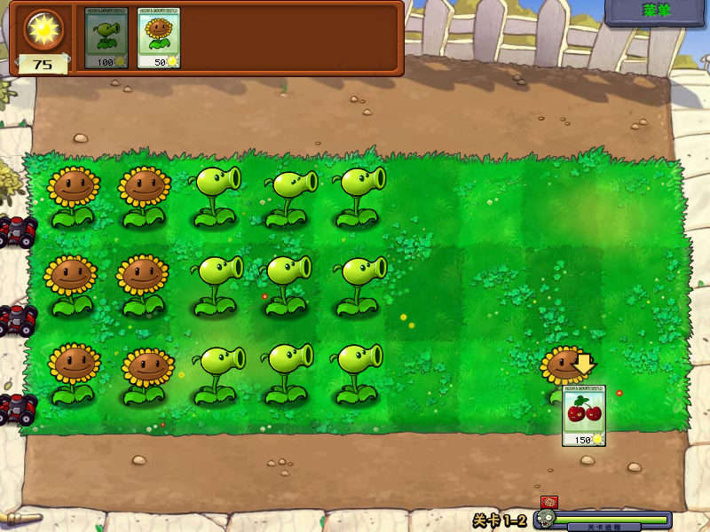

# Plants Vs. Zombies

## Compatibility report

### Tested on

[Lichee Pi 4A](/docs/hardwares#lichee-pi-4a-soc-th1520)

### Box64 version (commit)

Box64 [ptitSeb/box64@276191cd](https://github.com/ptitSeb/box64/tree/276191cd)

### Wine version (commit)

WOW64 [Kron4ek/Wine-Builds@82c6b2d](https://github.com/Kron4ek/Wine-Builds/tree/82c6b2d)

### Game screenshot



### Game running log

```shell
debian@revyos-lpi4a:~$ cd Games/PlantsVsZombies/
debian@revyos-lpi4a:~/Games/PlantsVsZombies$ wine PlantsVsZombies.exe 
[BOX64] Dynarec for rv64g_xtheadba_xtheadbb_xtheadbs_xtheadmempair_xtheadcondmov_xtheadmemidx_xthvector
[BOX64] Running on unknown riscv64 cpu with 4 cores, pagesize: 4096
[BOX64] Will use hardware counter measured at 3.0 MHz emulating 3.0 GHz
[BOX64] Box64 with Dynarec v0.3.3 276191cd built on Jan 23 2025 16:40:36
[BOX64] Wine64 detected, WINEPRELOADRESERVE=""
[BOX64] Didn't detect 48bits of address space, considering it's 39bits
[BOX64] WINE prereserve of 0x10000:0x8000 done
[BOX64] WINE prereserve of 0x110000:0x30000000 done
[BOX64] WINE prereserve of 0x7f000000:0x3000000 done
[BOX64] Detected running wine with "PlantsVsZombies.exe"
[BOX64] Counted 39 Env var
[BOX64] BOX64 LIB PATH: 
[BOX64] BOX64 BIN PATH: ./:bin/:/home/debian/wine-9.22-amd64-wow64/bin/:/usr/local/bin/:/usr/bin/:/bin/:/usr/local/games/:/usr/games/
[BOX64] Looking for /home/debian/wine-9.22-amd64-wow64/bin/wine
[BOX64] BOX64ENV: Variables overridden via env and/or RC file:
	BOX64_MAXCPU=64
[BOX64] argv[1]="PlantsVsZombies.exe"
[BOX64] Rename process to "wine"
[BOX64] Using native(wrapped) libdl.so.2
[BOX64] Using native(wrapped) libpthread.so.0
[BOX64] Using native(wrapped) libc.so.6
[BOX64] Using native(wrapped) ld-linux-x86-64.so.2
[BOX64] Using native(wrapped) libutil.so.1
[BOX64] Using native(wrapped) librt.so.1
[BOX64] Using native(wrapped) libbsd.so.0
[BOX64] Using emulated /home/debian/wine-9.22-amd64-wow64/bin/../lib/wine/x86_64-unix/ntdll.so
[BOX64] Using emulated /usr/lib/box64-x86_64-linux-gnu/libgcc_s.so.1
[BOX64] Dynarec for rv64g_xtheadba_xtheadbb_xtheadbs_xtheadmempair_xtheadcondmov_xtheadmemidx_xthvector
[BOX64] Running on unknown riscv64 cpu with 4 cores, pagesize: 4096
[BOX64] Will use hardware counter measured at 3.0 MHz emulating 3.0 GHz
[BOX64] Box64 with Dynarec v0.3.3 276191cd built on Jan 23 2025 16:40:36
[BOX64] Wine64 detected, WINEPRELOADRESERVE=""
[BOX64] Didn't detect 48bits of address space, considering it's 39bits
[BOX64] WINE prereserve of 0x10000:0x8000 done
[BOX64] WINE prereserve of 0x110000:0x30000000 done
[BOX64] WINE prereserve of 0x7f000000:0x3000000 done
[BOX64] Detected running wine with "PlantsVsZombies.exe"
[BOX64] Counted 42 Env var
[BOX64] BOX64 LIB PATH: 
[BOX64] BOX64 BIN PATH: ./:bin/:/home/debian/wine-9.22-amd64-wow64/bin/:/usr/local/bin/:/usr/bin/:/bin/:/usr/local/games/:/usr/games/
[BOX64] Looking for /home/debian/wine-9.22-amd64-wow64/bin/wine
[BOX64] BOX64ENV: Variables overridden via env and/or RC file:
	BOX64_MAXCPU=64
[BOX64] argv[1]="PlantsVsZombies.exe"
[BOX64] Rename process to "wine"
[BOX64] Using native(wrapped) libdl.so.2
[BOX64] Using native(wrapped) libpthread.so.0
[BOX64] Using native(wrapped) libc.so.6
[BOX64] Using native(wrapped) ld-linux-x86-64.so.2
[BOX64] Using native(wrapped) libutil.so.1
[BOX64] Using native(wrapped) librt.so.1
[BOX64] Using native(wrapped) libbsd.so.0
[BOX64] Using emulated /home/debian/wine-9.22-amd64-wow64/bin/../lib/wine/x86_64-unix/ntdll.so
[BOX64] Using emulated /usr/lib/box64-x86_64-linux-gnu/libgcc_s.so.1
[BOX64] posix_spawn(0x3fa450dd6c, "/home/debian/wine-9.22-amd64-wow64/bin/wineserver", (nil), (nil), 0x3fa450dd70["/home/debian/wine-9.22-amd64-wow64/bin/wineserver", "", ...], 0x3fa450e128), IsX64=1, IsX86=0 IsScript=0 envp is context->envv
[BOX64]  => posix_spawn(0x3fa450dd6c, "/usr/local/bin/box64", (nil), (nil), 0x3fd7f73830 ["/usr/local/bin/box64", "/home/debian/wine-9.22-amd64-wow64/bin/wineserver", ""...:1], 0x3fd7f74048)
[BOX64] posix_spawn returned 0
[BOX64] Dynarec for rv64g_xtheadba_xtheadbb_xtheadbs_xtheadmempair_xtheadcondmov_xtheadmemidx_xthvector
[BOX64] Running on unknown riscv64 cpu with 4 cores, pagesize: 4096
[BOX64] Will use hardware counter measured at 3.0 MHz emulating 3.0 GHz
[BOX64] Box64 with Dynarec v0.3.3 276191cd built on Jan 23 2025 16:40:36
[BOX64] Didn't detect 48bits of address space, considering it's 39bits
[BOX64] Counted 42 Env var
[BOX64] BOX64 LIB PATH: 
[BOX64] BOX64 BIN PATH: ./:bin/:/home/debian/wine-9.22-amd64-wow64/bin/:/usr/local/bin/:/usr/bin/:/bin/:/usr/local/games/:/usr/games/
[BOX64] Looking for /home/debian/wine-9.22-amd64-wow64/bin/wineserver
[BOX64] Rename process to "wineserver"
[BOX64] Using native(wrapped) libdl.so.2
[BOX64] Using native(wrapped) libc.so.6
[BOX64] Using native(wrapped) ld-linux-x86-64.so.2
[BOX64] Using native(wrapped) libpthread.so.0
[BOX64] Using native(wrapped) libutil.so.1
[BOX64] Using native(wrapped) librt.so.1
[BOX64] Using native(wrapped) libbsd.so.0
002c:err:wineboot:process_run_key Error running cmd L"C:\\windows\\system32\\winemenubuilder.exe -a -r" (2).
0024:err:environ:init_peb starting L"Z:\\home\\debian\\Games\\\4e2d\6587\5e74\5ea6\52a0\5f3a\7248\5b8c\6574\7248\\PlantsVsZombies.exe" in experimental wow64 mode
[BOX64] Using emulated /home/debian/wine-9.22-amd64-wow64/lib/wine/x86_64-unix/win32u.so
[BOX64] Using native(wrapped) libm.so.6
[BOX64] Using native(wrapped) libfreetype.so.6
[BOX64] Using native(wrapped) libfontconfig.so.1
[BOX64] Using native(wrapped) libexpat.so.1
[BOX64] Using emulated /home/debian/wine-9.22-amd64-wow64/lib/wine/x86_64-unix/ws2_32.so
[BOX64] Using emulated /home/debian/wine-9.22-amd64-wow64/lib/wine/x86_64-unix/dnsapi.so
[BOX64] Using native(wrapped) libresolv.so.2
[BOX64] Using emulated /home/debian/wine-9.22-amd64-wow64/lib/wine/x86_64-unix/netapi32.so
[BOX64] Using emulated /home/debian/wine-9.22-amd64-wow64/lib/wine/x86_64-unix/opengl32.so
[BOX64] Using emulated /home/debian/wine-9.22-amd64-wow64/lib/wine/x86_64-unix/winex11.so
[BOX64] Using native(wrapped) libXext.so.6
[BOX64] Using native(wrapped) libX11.so.6
[BOX64] Using native(wrapped) libxcb.so.1
[BOX64] Using native(wrapped) libXau.so.6
[BOX64] Using native(wrapped) libXdmcp.so.6
[BOX64] Using native(wrapped) libXinerama.so.1
[BOX64] Using native(wrapped) libXxf86vm.so.1
[BOX64] Using native(wrapped) libXrender.so.1
[BOX64] Using native(wrapped) libXrandr.so.2
[BOX64] Using native(wrapped) libXcomposite.so.1
[BOX64] Using native(wrapped) libXi.so.6
[BOX64] Using native(wrapped) libXcursor.so.1
[BOX64] Using native(wrapped) libXfixes.so.3
[BOX64] Using native(wrapped) libvulkan.so.1
[BOX64] Using native(wrapped) libGL.so.1
0024:err:d3d:wined3d_caps_gl_ctx_create Failed to find a suitable pixel format.
0024:err:d3d:wined3d_adapter_gl_init Failed to get a GL context for adapter 0169C220.
0024:fixme:ntdll:NtQuerySystemInformation info_class SYSTEM_PERFORMANCE_INFORMATION
[BOX64] Using emulated /home/debian/wine-9.22-amd64-wow64/lib/wine/x86_64-unix/winepulse.so
[BOX64] Using native(wrapped) libpulse.so.0
[BOX64] Using emulated /home/debian/wine-9.22-amd64-wow64/lib/wine/x86_64-unix/winealsa.so
[BOX64] Using native(wrapped) libasound.so.2
0120:fixme:winmm:MXD_GetControlDetails What should the sw-side mixer controls map to?
0120:fixme:winmm:MXD_SetControlDetails What should the sw-side mixer controls map to?
[BOX64] Using emulated /home/debian/wine-9.22-amd64-wow64/lib/wine/x86_64-unix/bcrypt.so
[BOX64] Using native(wrapped) libgnutls.so.30
[BOX64] Using emulated /home/debian/wine-9.22-amd64-wow64/lib/wine/x86_64-unix/crypt32.so
[BOX64] Using emulated /home/debian/wine-9.22-amd64-wow64/lib/wine/x86_64-unix/secur32.so
[BOX64] Using emulated /home/debian/wine-9.22-amd64-wow64/lib/wine/x86_64-unix/kerberos.so
[BOX64] Using native(wrapped) libkrb5.so.3
[BOX64] Using native(wrapped) libgssapi_krb5.so.2
[BOX64] Using emulated /home/debian/wine-9.22-amd64-wow64/lib/wine/x86_64-unix/msv1_0.so
[BOX64] posix_spawnp(0x10050f944, "ntlm_auth", 0x10050f720, (nil), 0x10050f7a0, 0x3fa450e128), IsX86=0 / fullpath="ntlm_auth"
0024:err:winediag:ntlm_check_version ntlm_auth was not found. Make sure that ntlm_auth >= 3.0.25 is in your path. Usually, you can find it in the winbind package of your distribution.
0024:err:ntlm:ntlm_LsaApInitializePackage no NTLM support, expect problems
[0124/011057:ERROR:proxy_resolver_winhttp.cc(94)] WinHttpGetProxyForUrl failed: 0
0024:fixme:d3d:surface_cpu_blt Filter WINED3D_TEXF_LINEAR not supported in software blit.
0024:fixme:d3d:surface_cpu_blt Filter WINED3D_TEXF_LINEAR not supported in software blit.
0024:fixme:d3d:surface_cpu_blt Filter WINED3D_TEXF_LINEAR not supported in software blit.
0024:fixme:d3d:surface_cpu_blt Filter WINED3D_TEXF_LINEAR not supported in software blit.
0024:fixme:d3d:surface_cpu_blt Filter WINED3D_TEXF_LINEAR not supported in software blit.
0024:fixme:d3d:surface_cpu_blt Filter WINED3D_TEXF_LINEAR not supported in software blit.
0024:fixme:d3d:surface_cpu_blt Filter WINED3D_TEXF_LINEAR not supported in software blit.
0024:fixme:d3d:surface_cpu_blt Filter WINED3D_TEXF_LINEAR not supported in software blit.
0024:fixme:d3d:surface_cpu_blt Filter WINED3D_TEXF_LINEAR not supported in software blit.
0024:fixme:d3d:surface_cpu_blt Filter WINED3D_TEXF_LINEAR not supported in software blit.
```

### Rendering methods

```shell
Software Renderer
```

### Extra information

[Official Game Website](https://www.ea.com/zh-cn/games/plants-vs-zombies/plants-vs-zombies)

[Steam](https://store.steampowered.com/app/3590/Plants_vs_Zombies_GOTY_Edition/)

[PCGameWiki](https://www.pcgamingwiki.com/wiki/Plants_vs._Zombies)

### Advanced Tips

3D acceleration is not available, full screen will cause screen tearing.
