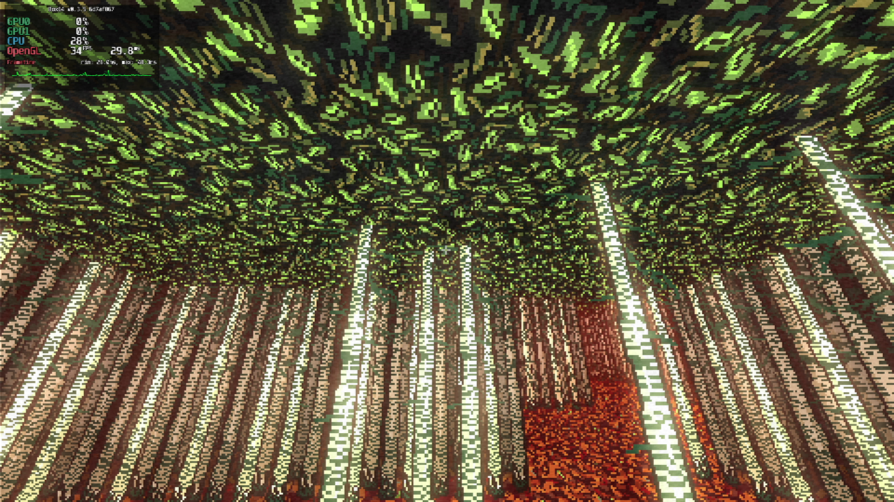
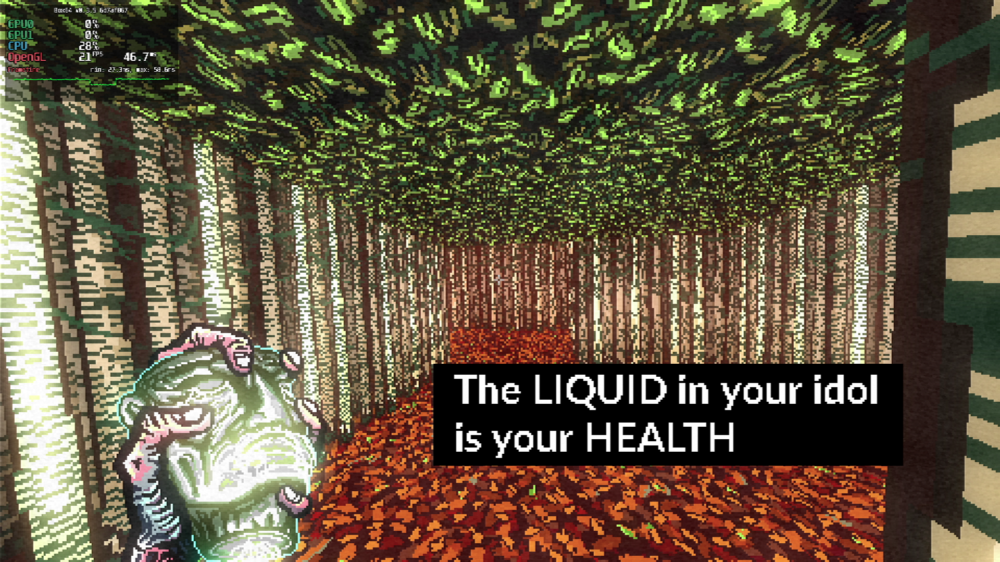

# Post Void

## Compatibility report

### Tested on

[Milk-V Jupiter](/docs/hardwares#milk-v-jupiter-soc-spacemit-m1)
 with AMD Radeon RX 550

### Box64 version (commit)

Box64 [ptitSeb/box64@6d7af867](https://github.com/ptitSeb/box64/tree/6d7af867)

### Game screenshot




### Game running log

```shell
[BOX64] Box64 with Dynarec v0.3.5 6d7af867 built on Apr  6 2025 20:28:41
[BOX64] Dynarec for rv64gv_zba_zbb_zbc_zbs_zvl256
[BOX64] Running on Spacemit(R) X60 with 8 cores, pagesize: 4096
[BOX64] Will use hardware counter measured at 24.0 MHz emulating 3.0 GHz
[BOX64] Using bash "/home/rurumuri/ourstorybegin/box64/tests/box64-bash"
[BOX64] Didn't detect 48bits of address space, considering it's 39bits
[BOX64] Counted 49 Env var
[BOX64] BOX64 trying to Preload /usr/local/$LIB/mangohud/libMangoHud_shim.so 
[BOX64] Library search path: 
[BOX64] Binary search path: ./:bin/:/home/rurumuri/ourstorybegin/wine/wine-10.3-amd64-wow64/bin/:/home/rurumuri/ourstorybegin/wine/wine-10.3-amd64-wow64/bin/:/home/rurumuri/ourstorybegin/wine/wine-10.3-amd64-wow64/bin/:/usr/local/bin/:/usr/bin/:/bin/:/usr/local/sbin/:/usr/lib/jvm/default/bin/:/usr/bin/site_perl/:/usr/bin/vendor_perl/:/usr/bin/core_perl/:/usr/lib/rustup/bin/
[BOX64] Looking for ./Post Void/postvoid.x86_64
[BOX64] BOX64ENV: Variables overridden via env and/or RC file:
	BOX64_BASH=/home/rurumuri/ourstorybegin/box64/tests/box64-bash
[BOX64] Rename process to "postvoid.x86_64"
[BOX64] Warning, cannot pre-load /usr/local/$LIB/mangohud/libMangoHud_shim.so
[BOX64] Using emulated /home/rurumuri/ourstorybegin/box64/x64lib/libstdc++.so.6
[BOX64] Using native(wrapped) libz.so.1
[BOX64] Using native(wrapped) libXxf86vm.so.1
[BOX64] Using native(wrapped) libX11.so.6
[BOX64] Using native(wrapped) libxcb.so.1
[BOX64] Using native(wrapped) libXau.so.6
[BOX64] Using native(wrapped) libXdmcp.so.6
[BOX64] Using native(wrapped) libXext.so.6
[BOX64] Using native(wrapped) libdl.so.2
[BOX64] Using native(wrapped) libGL.so.1
[BOX64] Using native(wrapped) libm.so.6
[BOX64] Using native(wrapped) librt.so.1
[BOX64] Using native(wrapped) libpthread.so.0
[BOX64] Using emulated /home/rurumuri/ourstorybegin/box64/x64lib/libcrypto.so.1.0.0
[BOX64] Using native(wrapped) libXrandr.so.2
[BOX64] Using native(wrapped) libXrender.so.1
[BOX64] Using native(wrapped) libGLU.so.1
[BOX64] Using native(wrapped) libcurl-gnutls.so.4
[BOX64] Using emulated /home/rurumuri/ourstorybegin/box64/x64lib/libssl.so.1.0.0
[BOX64] Using emulated /home/rurumuri/ourstorybegin/box64/x64lib/libgcc_s.so.1
[BOX64] Using native(wrapped) libc.so.6
[BOX64] Using native(wrapped) ld-linux-x86-64.so.2
[BOX64] Using native(wrapped) libutil.so.1
[BOX64] Using native(wrapped) libbsd.so.0

***************************************
*     YoYo Games Linux Runner V1.3    *
***************************************	 
CommandLine: -game game.unx
ExeName= /home/rurumuri/games/Post Void/Post Void/postvoid.x86_64
MemoryManager allocated: 56868
SavePrePend /home/rurumuri/.config/Post_Void/ 
GAMEPAD: Initialising Ubuntu support
Attempting to set gamepadcount to 32
[BOX64] Error loading needed lib Steamworks_x64.dll
[BOX64] Warning: Cannot dlopen("Steamworks_x64.dll"/0x3fa79d9e70, 1)
error trying to load Steamworks_x64.dll - Cannot dlopen("Steamworks_x64.dll"/0x3fa79d9e70, 1)

// omitted

[BOX64] Error loading needed lib libSteamworks_x64_linux_arm64-v8a.so
[BOX64] Warning: Cannot dlopen("libSteamworks_x64_linux_arm64-v8a.so"/0x3fa79d9e70, 1)
error trying to load libSteamworks_x64_linux_arm64-v8a.so - Cannot dlopen("libSteamworks_x64_linux_arm64-v8a.so"/0x3fa79d9e70, 1)

display=0x36cc1390
Display Size(Pixels): 1920,1080
CreateDesktopWindow 480,270
Win #1
XF86VidModeExtension-Version 2.2
Got Doublebuffered Visual!
glX-Version 1.4
Creating window of width 480, height 270
sw=1920 wh=1080
WindowCentre: 720,405
Depth 24
Congrats, you have Direct Rendering!
sync = 1
**** GLX Extensions ***
GLX_ARB_context_flush_control GLX_ARB_create_context GLX_ARB_create_context_no_error GLX_ARB_create_context_profile GLX_ARB_create_context_robustness GLX_ARB_fbconfig_float GLX_ARB_framebuffer_sRGB GLX_ARB_get_proc_address GLX_ARB_multisample GLX_EXT_buffer_age GLX_EXT_create_context_es2_profile GLX_EXT_create_context_es_profile GLX_EXT_fbconfig_packed_float GLX_EXT_framebuffer_sRGB GLX_EXT_no_config_context GLX_EXT_swap_control GLX_EXT_swap_control_tear GLX_EXT_texture_from_pixmap GLX_EXT_visual_info GLX_EXT_visual_rating GLX_INTEL_swap_event GLX_MESA_copy_sub_buffer GLX_MESA_gl_interop GLX_MESA_query_renderer GLX_MESA_swap_control GLX_OML_sync_control GLX_SGIS_multisample GLX_SGIX_fbconfig GLX_SGIX_pbuffer GLX_SGIX_visual_select_group GLX_SGI_make_current_read GLX_SGI_swap_control GLX_SGI_video_sync 
Checking for GLX_EXT_swap_control
Vsync: GLX_EXT
DOUBLE BUFFERED
OpenGL: version string 4.6 (Compatibility Profile) Mesa 24.3.4-arch1.1
OpenGL: vendor string AMD
OpenGL GLSL: version string 4.60
OpenGL version - detected 4.6
OpenGL: VBOs supported
OpenGL: Non-power-of-two textures supported
Anisotropic filtering supported, max aniso 16
OpenGL: 1 and 2 channel integer surface formats supported
OpenGL: 4 channel half-float surface formats supported
OpenGL: 1 and 2 channel half-float surface formats supported
OpenGL: 4 channel float surface formats supported
OpenGL: 1 and 2 channel float surface formats supported
This is where it would have set them fullscreen= 0, they are 480,270    displaywidth/h 1920,1080
Collision Event time(microsecs)=8227
Variable_Global_Init()
PrepareGame()
Audio_Init()
[BOX64] Using native(wrapped) libopenal.so
Opened libopenal.so...
alcCreateContext : 0x30150000
alcOpenDevice : 0x30150020
alcMakeContextCurrent : 0x30150040
alGenBuffers : 0x30150060
alGenSources : 0x30150080
alGetError : 0x301500a0
alBufferData : 0x301500c0
alSourceQueueBuffers : 0x301500e0
alSourcePlay : 0x30150100
alSourceStop : 0x30150120
alGetSourcei : 0x30150140
alSourceUnqueueBuffers : 0x30150160
alDeleteSources : 0x30150180
alDeleteBuffers : 0x301501a0
alcDestroyContext : 0x301501c0
alcCloseDevice : 0x301501e0
alcGetString : 0x30150200
alcGetIntegerv : 0x30150220
alcCaptureOpenDevice : 0x30150240
alcCaptureCloseDevice : 0x30150260
alcCaptureStart : 0x30150280
alcCaptureStop : 0x301502a0
alcCaptureSamples : 0x301502c0
g_device is 0x37f1f110
g_context is 0x37fa1550
g_context is set as current
Game_Prepare()
Script_Prepare() 
TimeLine_Prepare() 
Object_Prepare() 
Room_Prepare() 
Finished PrepareGame() 
Run_Start
Done g_EffectsManager.Init()
Done RenderStateManager
CreateColPairs took 0.006000s 6179 usecs for 118 object types obj_col_numb=0 physobjcount=15 resizes 0 final size 81
Done ObjectLists
Done Extension_Initialize
About to startroom
Set Fullscreen 1
Total memory used = 283584456 (0x10e727c8) bytes 270.45MB
Free memory = 9922616 (0x00976838) bytes 9.46MB
Peak memory used = 244354271 (0x0e908cdf) bytes 233.03MB
**********************************.
Entering main loop.
**********************************.
[2025-04-17 14:30:05.249] [MANGOHUD] [error] [cpu.cpp:552] Could not find cpu temp sensor location
Window Size w=1920 h=1080
LOAD: numFiles 1, numBundleFiles 0
ASYNCBUFF - settings.dat: Failure
keys_xinput standard gamepad_2 = undefined; def = 32770
keys_xinput standard gamepad_3 = undefined; def = 200000
keys_xinput standard gamepad_1 = undefined; def = 32769
keys_xinput standard gamepad_11 = undefined; def = 32777
keys_xinput standard gamepad_9 = undefined; def = 32769
keys_xinput standard gamepad_5 = undefined; def = 200002
keys_xinput standard gamepad_4 = undefined; def = 200001
keys_xinput standard gamepad_7 = undefined; def = 200004
keys_xinput standard gamepad_6 = undefined; def = 200003
keys_xinput standard gamepad_0 = undefined; def = 32778
keys_xinput standard gamepad_10 = undefined; def = 32771
keys_xinput standard gamepad_8 = undefined; def = 32775
keys_xinput standard gamepad_12 = undefined; def = 32776
keys_keyboard_2 = undefined; def = -1
keys_keyboard_3 = undefined; def = 87
keys_keyboard_1 = undefined; def = 1
keys_keyboard_11 = undefined; def = 75
keys_keyboard_9 = undefined; def = 32
keys_keyboard_5 = undefined; def = 65
keys_keyboard_4 = undefined; def = 83
keys_keyboard_7 = undefined; def = 0
keys_keyboard_6 = undefined; def = 68
keys_keyboard_0 = undefined; def = 27
keys_keyboard_10 = undefined; def = 82
keys_keyboard_8 = undefined; def = 16
keys_keyboard_12 = undefined; def = 1
keys_sony dualshock 4_2 = undefined; def = 32770
keys_sony dualshock 4_3 = undefined; def = 200000
keys_sony dualshock 4_1 = undefined; def = 32769
keys_sony dualshock 4_11 = undefined; def = 32777
keys_sony dualshock 4_9 = undefined; def = 32769
keys_sony dualshock 4_5 = undefined; def = 200002
keys_sony dualshock 4_4 = undefined; def = 200001
keys_sony dualshock 4_7 = undefined; def = 200004
keys_sony dualshock 4_6 = undefined; def = 200003
keys_sony dualshock 4_0 = undefined; def = 32777
keys_sony dualshock 4_10 = undefined; def = 32771
keys_sony dualshock 4_8 = undefined; def = 32775
keys_sony dualshock 4_12 = undefined; def = 32776
keys_gamepad_2 = undefined; def = 32770
keys_gamepad_3 = undefined; def = 200000
keys_gamepad_1 = undefined; def = 32769
keys_gamepad_11 = undefined; def = 32777
keys_gamepad_9 = undefined; def = 32769
keys_gamepad_5 = undefined; def = 200002
keys_gamepad_4 = undefined; def = 200001
keys_gamepad_7 = undefined; def = 200004
keys_gamepad_6 = undefined; def = 200003
keys_gamepad_0 = undefined; def = 32778
keys_gamepad_10 = undefined; def = 32771
keys_gamepad_8 = undefined; def = 32775
keys_gamepad_12 = undefined; def = 32776
keys_joy-con_2 = undefined; def = 32769
keys_joy-con_3 = undefined; def = 200000
keys_joy-con_1 = undefined; def = 32770
keys_joy-con_11 = undefined; def = 32777
keys_joy-con_9 = undefined; def = 32769
keys_joy-con_5 = undefined; def = 200002
keys_joy-con_4 = undefined; def = 200001
keys_joy-con_7 = undefined; def = 200004
keys_joy-con_6 = undefined; def = 200003
keys_joy-con_0 = undefined; def = 32778
keys_joy-con_10 = undefined; def = 32771
keys_joy-con_8 = undefined; def = 32775
keys_joy-con_12 = undefined; def = 32776
keys_sony dualshock 5_2 = undefined; def = 32770
keys_sony dualshock 5_3 = undefined; def = 200000
keys_sony dualshock 5_1 = undefined; def = 32769
keys_sony dualshock 5_11 = undefined; def = 32777
keys_sony dualshock 5_9 = undefined; def = 32769
keys_sony dualshock 5_5 = undefined; def = 200002
keys_sony dualshock 5_4 = undefined; def = 200001
keys_sony dualshock 5_7 = undefined; def = 200004
keys_sony dualshock 5_6 = undefined; def = 200003
keys_sony dualshock 5_0 = undefined; def = 32777
keys_sony dualshock 5_10 = undefined; def = 32771
keys_sony dualshock 5_8 = undefined; def = 32775
keys_sony dualshock 5_12 = undefined; def = 32776
keys_handheld_2 = undefined; def = 32769
keys_handheld_3 = undefined; def = 200000
keys_handheld_1 = undefined; def = 32770
keys_handheld_11 = undefined; def = 32777
keys_handheld_9 = undefined; def = 32769
keys_handheld_5 = undefined; def = 200002
keys_handheld_4 = undefined; def = 200001
keys_handheld_7 = undefined; def = 200004
keys_handheld_6 = undefined; def = 200003
keys_handheld_0 = undefined; def = 32778
keys_handheld_10 = undefined; def = 32771
keys_handheld_8 = undefined; def = 32775
keys_handheld_12 = undefined; def = 32776
keys_pro controller_2 = undefined; def = 32769
keys_pro controller_3 = undefined; def = 200000
keys_pro controller_1 = undefined; def = 32770
keys_pro controller_11 = undefined; def = 32777
keys_pro controller_9 = undefined; def = 32769
keys_pro controller_5 = undefined; def = 200002
keys_pro controller_4 = undefined; def = 200001
keys_pro controller_7 = undefined; def = 200004
keys_pro controller_6 = undefined; def = 200003
keys_pro controller_0 = undefined; def = 32778
keys_pro controller_10 = undefined; def = 32771
keys_pro controller_8 = undefined; def = 32775
keys_pro controller_12 = undefined; def = 32776
LOAD: numFiles 1, numBundleFiles 0
ASYNCBUFF - savedata.dat: Failure
-----loaded hiscore: 0
SYNCBUFF - localization_ar_test.json: Success
chosen lang: EN
sync = 1
**** GLX Extensions ***
GLX_ARB_context_flush_control GLX_ARB_create_context GLX_ARB_create_context_no_error GLX_ARB_create_context_profile GLX_ARB_create_context_robustness GLX_ARB_fbconfig_float GLX_ARB_framebuffer_sRGB GLX_ARB_get_proc_address GLX_ARB_multisample GLX_EXT_buffer_age GLX_EXT_create_context_es2_profile GLX_EXT_create_context_es_profile GLX_EXT_fbconfig_packed_float GLX_EXT_framebuffer_sRGB GLX_EXT_no_config_context GLX_EXT_swap_control GLX_EXT_swap_control_tear GLX_EXT_texture_from_pixmap GLX_EXT_visual_info GLX_EXT_visual_rating GLX_INTEL_swap_event GLX_MESA_copy_sub_buffer GLX_MESA_gl_interop GLX_MESA_query_renderer GLX_MESA_swap_control GLX_OML_sync_control GLX_SGIS_multisample GLX_SGIX_fbconfig GLX_SGIX_pbuffer GLX_SGIX_visual_select_group GLX_SGI_make_current_read GLX_SGI_swap_control GLX_SGI_video_sync 
Checking for GLX_EXT_swap_control
Vsync: GLX_EXT
GraphicsResetM called with g_NewWindowWidth=-1 g_NewWindowHeight=-1 g_WindowWidth=480 g_WindowHeight=270 g_ClientWidth=1920 g_ClientHeight=1080
-----saved hiscore: 0
ASYNCBUFF - savedata.dat: Success
XIO:  fatal IO error 13 (Permission denied) on X server ":0.0"

      after 20565 requests (20565 known processed) with 0 events remaining.

XIO:  fatal IO error 13 (Permission denied) on X server ":0.0"

      after 5437 requests (5437 known processed) with 0 events remaining.

[BOX64] 52472|Warning, calling Signal 11 function handler SIG_DFL
[BOX64] Unhandled signal caught, aborting
[BOX64] 52473|Warning, calling Signal 11 function handler SIG_DFL
[BOX64] Unhandled signal caught, aborting
[BOX64] 52475|Warning, calling Signal 11 function handler SIG_DFL
[BOX64] 52476|Warning, calling Signal 11 function handler SIG_DFL
[BOX64] Unhandled signal caught, aborting
[BOX64] 52474|Warning, calling Signal 11 function handler SIG_DFL
[BOX64] Unhandled signal caught, aborting
[BOX64] Unhandled signal caught, aborting
[BOX64] NativeBT: /home/rurumuri/ourstorybegin/box64/build/box64() [0x34e3eb50]
[BOX64] NativeBT: /home/rurumuri/ourstorybegin/box64/build/box64() [0x34e3f1dc]
[BOX64] NativeBT: linux-vdso.so.1(__vdso_rt_sigreturn+0) [0x3fa7c48800]
[BOX64] NativeBT: /usr/lib/libc.so.6(+0x78c4c) [0x3fa7b17c4c]
[BOX64] NativeBT: /usr/lib/libc.so.6(gsignal+0x16) [0x3fa7ad82e6]
[BOX64] NativeBT: /usr/lib/libc.so.6(abort+0x1e) [0x3fa7ac64ce]
[BOX64] NativeBT: /home/rurumuri/ourstorybegin/box64/build/box64(my_sigaltstack+0) [0x34e3c85e]
[BOX64] NativeBT: /home/rurumuri/ourstorybegin/box64/build/box64() [0x34e3d214]
[BOX64] NativeBT: /home/rurumuri/ourstorybegin/box64/build/box64() [0x34e3d940]
[BOX64] NativeBT: /home/rurumuri/ourstorybegin/box64/build/box64() [0x34e3db6e]
[BOX64] NativeBT: /home/rurumuri/ourstorybegin/box64/build/box64() [0x34e3ddce]
[BOX64] NativeBT: /home/rurumuri/ourstorybegin/box64/build/box64() [0x3541a710]
[BOX64] NativeBT: /home/rurumuri/ourstorybegin/box64/build/box64() [0x34e1b2ee]
[BOX64] NativeBT: /home/rurumuri/ourstorybegin/box64/build/box64() [0x34e415e6]
[BOX64] NativeBT: /usr/lib/libc.so.6(+0x7723a) [0x3fa7b1623a]
[BOX64] NativeBT: /usr/lib/libc.so.6(+0xcc4c0) [0x3fa7b6b4c0]
```

### Rendering methods

```shell
OpenGL
```

### Extra information

[Steam](https://store.steampowered.com/app/1285670/Post_Void/)

[PCGameWiki](https://www.pcgamingwiki.com/wiki/Post_Void)

### Advanced Tips

> TBD