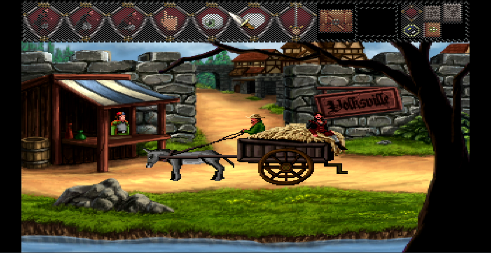

# Quest For Infamy

## Compatibility report

### Tested on

[Milk-V Jupiter](/docs/hardwares#milk-v-jupiter-soc-spacemit-m1)
 with AMD Radeon HD 6750

### Box64 version (commit)

Box64 [ptitSeb/box64@2636e7e8](https://github.com/ptitSeb/box64/tree/2636e7e8)

### Game screenshot



### Game running log

```shell
[BOX64] Box64 with Dynarec v0.3.3 2636e7e8 built on Mar  4 2025 14:58:49
[BOX64] Dynarec for rv64gv_zba_zbb_zbc_zbs_zvl256
[BOX64] Running on Spacemit(R) X60 with 8 cores, pagesize: 4096
[BOX64] Will use hardware counter measured at 24.0 MHz emulating 3.0 GHz
[BOX64] Using bash "/home/rurumuri/ourstorybegin/box64/tests/box64-bash"
[BOX64] Didn't detect 48bits of address space, considering it's 39bits
[BOX64] Counted 49 Env var
[BOX64] BOX64 trying to Preload /usr/local/$LIB/mangohud/libMangoHud_shim.so 
[BOX64] Library search path: 
[BOX64] Binary search path: ./:bin/:/home/rurumuri/ourstorybegin/wine/wine-10.0-amd64-wow64/bin/:/home/rurumuri/ourstorybegin/wine/wine-10.0-amd64-wow64/bin/:/usr/local/bin/:/usr/bin/:/bin/:/usr/local/sbin/:/usr/bin/site_perl/:/usr/bin/vendor_perl/:/usr/bin/core_perl/
[BOX64] Looking for ./start.sh
[BOX64] BOX64ENV: Variables overridden via env and/or RC file:
        BOX64_BASH=/home/rurumuri/ourstorybegin/box64/tests/box64-bash
[BOX64] Not an ELF file (sign=#!/b)
[BOX64] Error: Reading elf header of /home/rurumuri/games/Quest For Infamy/start.sh, Try to launch using bash instead
[BOX64] Box64 with Dynarec v0.3.3 2636e7e8 built on Mar  4 2025 14:58:49
[BOX64] Dynarec for rv64gv_zba_zbb_zbc_zbs_zvl256
[BOX64] Running on Spacemit(R) X60 with 8 cores, pagesize: 4096
[BOX64] Will use hardware counter measured at 24.0 MHz emulating 3.0 GHz
[BOX64] Using bash "/home/rurumuri/ourstorybegin/box64/tests/box64-bash"
[BOX64] Didn't detect 48bits of address space, considering it's 39bits
[BOX64] Counted 49 Env var
[BOX64] BOX64 trying to Preload /usr/local/$LIB/mangohud/libMangoHud_shim.so 
[BOX64] Library search path: 
[BOX64] Binary search path: ./:bin/:/home/rurumuri/ourstorybegin/wine/wine-10.0-amd64-wow64/bin/:/home/rurumuri/ourstorybegin/wine/wine-10.0-amd64-wow64/bin/:/usr/local/bin/:/usr/bin/:/bin/:/usr/local/sbin/:/usr/bin/site_perl/:/usr/bin/vendor_perl/:/usr/bin/core_perl/
[BOX64] Looking for /home/rurumuri/ourstorybegin/box64/tests/box64-bash
[BOX64] Bash detected, disabling banner
[BOX64] BOX64ENV: Variables overridden via env and/or RC file:
        BOX64_BASH=/home/rurumuri/ourstorybegin/box64/tests/box64-bash
[BOX64] argv[1]="./start.sh"
[BOX64] Rename process to "box64-bash"
[BOX64] Warning, cannot pre-load /usr/local/$LIB/mangohud/libMangoHud_shim.so
[BOX64] Using native(wrapped) libtinfo.so.6
[BOX64] Using native(wrapped) libdl.so.2
[BOX64] Using native(wrapped) libc.so.6
[BOX64] Using native(wrapped) ld-linux-x86-64.so.2
[BOX64] Using native(wrapped) libpthread.so.0
[BOX64] Using native(wrapped) libutil.so.1
[BOX64] Using native(wrapped) librt.so.1
[BOX64] Using native(wrapped) libbsd.so.0
[BOX64] Warning, of_unconvert(...) left over 0x8000, converted 0x8000
Running Quest For Infamy
[BOX64] Box64 with Dynarec v0.3.3 2636e7e8 built on Mar  4 2025 14:58:49
[BOX64] Dynarec for rv64gv_zba_zbb_zbc_zbs_zvl256
[BOX64] Running on Spacemit(R) X60 with 8 cores, pagesize: 4096
[BOX64] Will use hardware counter measured at 24.0 MHz emulating 3.0 GHz
[BOX64] Using bash "/home/rurumuri/ourstorybegin/box64/tests/box64-bash"
[BOX64] Didn't detect 48bits of address space, considering it's 39bits
[BOX64] Counted 50 Env var
[BOX64] BOX64 trying to Preload /usr/local/$LIB/mangohud/libMangoHud_shim.so 
[BOX64] Library search path: 
[BOX64] Binary search path: ./:bin/:/home/rurumuri/ourstorybegin/wine/wine-10.0-amd64-wow64/bin/:/home/rurumuri/ourstorybegin/wine/wine-10.0-amd64-wow64/bin/:/usr/local/bin/:/usr/bin/:/bin/:/usr/local/sbin/:/usr/bin/site_perl/:/usr/bin/vendor_perl/:/usr/bin/core_perl/
[BOX64] Looking for ./QFI.bin.x86_64
[BOX64] BOX64ENV: Variables overridden via env and/or RC file:
        BOX64_BASH=/home/rurumuri/ourstorybegin/box64/tests/box64-bash
[BOX64] Rename process to "QFI.bin.x86_64"
[BOX64] Warning, cannot pre-load /usr/local/$LIB/mangohud/libMangoHud_shim.so
[BOX64] Using emulated /home/rurumuri/games/Quest For Infamy/game/lib64/liballeg.so.4.4
[BOX64] Using emulated /home/rurumuri/games/Quest For Infamy/game/lib64/libtheoradec.so.1
[BOX64] Using native(wrapped) libogg.so.0
[BOX64] Using native(wrapped) libvorbis.so.0
[BOX64] Using native(wrapped) libvorbisfile.so.3
[BOX64] Using native(wrapped) libfreetype.so.6
[BOX64] Using native(wrapped) libdl.so.2
[BOX64] Using native(wrapped) libpthread.so.0
[BOX64] Using native(wrapped) libm.so.6
[BOX64] Using native(wrapped) libc.so.6
[BOX64] Using native(wrapped) ld-linux-x86-64.so.2
[BOX64] Using native(wrapped) libutil.so.1
[BOX64] Using native(wrapped) librt.so.1
[BOX64] Using native(wrapped) libbsd.so.0
[BOX64] Using emulated /usr/lib/box64-x86_64-linux-gnu/libstdc++.so.6
[BOX64] Using emulated /usr/lib/box64-x86_64-linux-gnu/libgcc_s.so.1
[BOX64] Using native(wrapped) libX11.so.6
[BOX64] Using native(wrapped) libxcb.so.1
[BOX64] Using native(wrapped) libXau.so.6
[BOX64] Using native(wrapped) libXdmcp.so.6
[BOX64] Using native(wrapped) libXext.so.6
[BOX64] Using native(wrapped) libXcursor.so.1
[BOX64] Using native(wrapped) libXfixes.so.3
[BOX64] Using native(wrapped) libXrender.so.1
[BOX64] Using native(wrapped) libXpm.so.4
[BOX64] Using native(wrapped) libXxf86vm.so.1
AGS: Adventure Game Studio v3.3 Interpreter
Copyright (c) 1999-2011 Chris Jones and 2011-2013 others
ACI version 3.3.0.1150

AGS: *** ENGINE STARTUP ***
AGS: Reading config file
AGS: Initializing allegro
[BOX64] Using emulated ./lib64/alleg-dga2.so
[BOX64] Error loading needed lib libXxf86dga.so.1
[BOX64] Using native(wrapped) libSM.so.6
[BOX64] Using native(wrapped) libICE.so.6
[BOX64] Error loading one of needed lib
[BOX64] Error initializing needed lib ./lib64/alleg-dga2.so
[BOX64] Using emulated ./lib64/alleg-alsadigi.so
[BOX64] Using native(wrapped) libasound.so.2
[BOX64] Using emulated ./lib64/alleg-alsamidi.so
[BOX64] Using emulated ./lib64/alleg-sdl2digi.so
[BOX64] Using native(wrapped) libSDL2-2.0.so.0
AGS: Setting up window
AGS: Initializing game data
AGS: Game data file: /home/rurumuri/games/Quest For Infamy/game/agsgame.dat

AGS: Initializing TTF renderer
AGS: Initializing mouse
AGS: Checking memory
AGS: Initializing speech vox
Speech sample file found and initialized.
AGS: Initializing audio vox
Audio vox found and initialized.
AGS: Initializing keyboard
AGS: Install timer
Checking sound inits.
AGS: Initialize sound drivers

Unable to initialize your audio hardware.
[Problem: Failed to open audio: ALSA: Couldn't open audio device: Device or resource busy]
AGS: Install exit handler
AGS: Initialize path finder library
AGS: Load game data
This game requires a newer version of AGS (3.3.0.1160). It may not run correctly.AGS: Quest for Infamy 
AGS: Checking for disk space
AGS: Init gfx driver
AGS: Created graphics driver: Allegro/DX5
AGS: Initializing screen settings
AGS: Init gfx filters
AGS: Detecting maximal supported scaling
AGS: Applying scaling filter: StdScale4
AGS: Switching to graphics mode
AGS: Widescreen side borders: game resolution: 320 x 240; desktop resolution: 1920 x 1080
AGS: Widescreen side borders: enabled, attempting resolution 320 x 240
AGS: Attempt to switch gfx mode to 320 x 240 (32-bit)
AGS: Succeeded. Using gfx mode 320 x 240 (32-bit)
AGS: Preparing graphics mode screen
AGS: Screen resolution: 320 x 240; game resolution 320 x 200
AGS: Initializing colour conversion
AGS: Check for preload image
AGS: Initialize sprites
AGS: Set up screen
AGS: Initialize game settings
AGS: Prepare to start game
AGS: Audio is processed on the main thread
AGS: Checking replay status
AGS: Engine initialization complete
AGS: Starting game
AGS: Loading room 309
AGS: Room change requested to room 315
AGS: Unloading room 309
AGS: Loading room 315
AGS: Room change requested to room 2
AGS: Unloading room 315
AGS: Loading room 2
AGS: ***** ENGINE HAS SHUTDOWN
```

### Rendering methods

```shell
Software Renderer
```

### Extra information

[Steam](https://store.steampowered.com/app/324740/The_Warlock_of_Firetop_Mountain/)

[PCGameWiki](https://www.pcgamingwiki.com/wiki/The_Warlock_of_Firetop_Mountain)

### Advanced Tips

> TBD