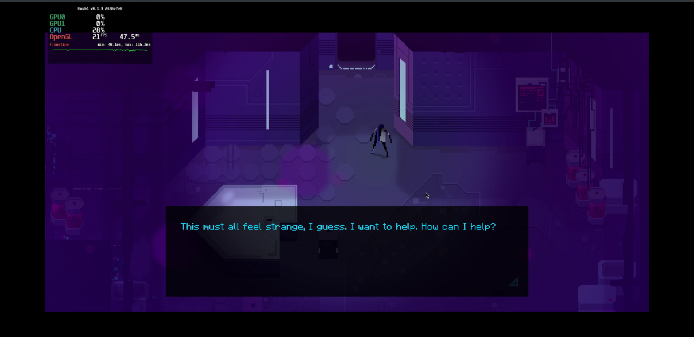
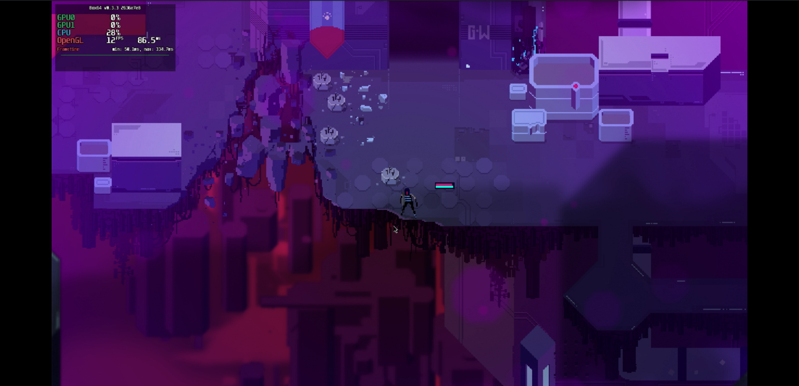

# Resolutiion

## Compatibility report

### Tested on

[Milk-V Jupiter](/docs/hardwares#milk-v-jupiter-soc-spacemit-m1) with AMD Radeon RX 550

### Box64 version (commit)

Box64 [ptitSeb/box64@2636e7e8](https://github.com/ptitSeb/box64/tree/2636e7e8)

### Game screenshot




### Game running log

```shell
[BOX64] Box64 with Dynarec v0.3.3 2636e7e8 built on Mar  4 2025 14:58:49
[BOX64] Dynarec for rv64gv_zba_zbb_zbc_zbs_zvl256
[BOX64] Running on Spacemit(R) X60 with 8 cores, pagesize: 4096
[BOX64] Will use hardware counter measured at 24.0 MHz emulating 3.0 GHz
[BOX64] Using bash "/home/rurumuri/ourstorybegin/box64/tests/box64-bash"
[BOX64] Didn't detect 48bits of address space, considering it's 39bits
[BOX64] Counted 49 Env var
[BOX64] BOX64 trying to Preload /usr/local/$LIB/mangohud/libMangoHud_shim.so 
[BOX64] Library search path: 
[BOX64] Binary search path: ./:bin/:/home/rurumuri/ourstorybegin/wine/wine-10.0-amd64-wow64/bin/:/home/rurumuri/ourstorybegin/wine/wine-10.0-amd64-wow64/bin/:/usr/local/bin/:/usr/bin/:/bin/:/usr/local/sbin/:/usr/lib/jvm/default/bin/:/usr/bin/site_perl/:/usr/bin/vendor_perl/:/usr/bin/core_perl/:/usr/lib/rustup/bin/
[BOX64] Looking for ./start.sh
[BOX64] BOX64ENV: Variables overridden via env and/or RC file:
	BOX64_BASH=/home/rurumuri/ourstorybegin/box64/tests/box64-bash
[BOX64] Not an ELF file (sign=#!/b)
[BOX64] Error: Reading elf header of /home/rurumuri/GOG Games/Resolutiion/start.sh, Try to launch using bash instead
[BOX64] Box64 with Dynarec v0.3.3 2636e7e8 built on Mar  4 2025 14:58:49
[BOX64] Dynarec for rv64gv_zba_zbb_zbc_zbs_zvl256
[BOX64] Running on Spacemit(R) X60 with 8 cores, pagesize: 4096
[BOX64] Will use hardware counter measured at 24.0 MHz emulating 3.0 GHz
[BOX64] Using bash "/home/rurumuri/ourstorybegin/box64/tests/box64-bash"
[BOX64] Didn't detect 48bits of address space, considering it's 39bits
[BOX64] Counted 49 Env var
[BOX64] BOX64 trying to Preload /usr/local/$LIB/mangohud/libMangoHud_shim.so 
[BOX64] Library search path: 
[BOX64] Binary search path: ./:bin/:/home/rurumuri/ourstorybegin/wine/wine-10.0-amd64-wow64/bin/:/home/rurumuri/ourstorybegin/wine/wine-10.0-amd64-wow64/bin/:/usr/local/bin/:/usr/bin/:/bin/:/usr/local/sbin/:/usr/lib/jvm/default/bin/:/usr/bin/site_perl/:/usr/bin/vendor_perl/:/usr/bin/core_perl/:/usr/lib/rustup/bin/
[BOX64] Looking for /home/rurumuri/ourstorybegin/box64/tests/box64-bash
[BOX64] Bash detected, disabling banner
[BOX64] BOX64ENV: Variables overridden via env and/or RC file:
	BOX64_BASH=/home/rurumuri/ourstorybegin/box64/tests/box64-bash
[BOX64] argv[1]="./start.sh"
[BOX64] Rename process to "box64-bash"
[BOX64] Warning, cannot pre-load /usr/local/$LIB/mangohud/libMangoHud_shim.so
[BOX64] Using native(wrapped) libtinfo.so.6
[BOX64] Using native(wrapped) libdl.so.2
[BOX64] Using native(wrapped) libc.so.6
[BOX64] Using native(wrapped) ld-linux-x86-64.so.2
[BOX64] Using native(wrapped) libpthread.so.0
[BOX64] Using native(wrapped) libutil.so.1
[BOX64] Using native(wrapped) librt.so.1
[BOX64] Using native(wrapped) libbsd.so.0
[BOX64] Warning, of_unconvert(...) left over 0x8000, converted 0x8000
Running Resolutiion
[BOX64] Box64 with Dynarec v0.3.3 2636e7e8 built on Mar  4 2025 14:58:49
[BOX64] Dynarec for rv64gv_zba_zbb_zbc_zbs_zvl256
[BOX64] Running on Spacemit(R) X60 with 8 cores, pagesize: 4096
[BOX64] Will use hardware counter measured at 24.0 MHz emulating 3.0 GHz
[BOX64] Using bash "/home/rurumuri/ourstorybegin/box64/tests/box64-bash"
[BOX64] Didn't detect 48bits of address space, considering it's 39bits
[BOX64] Counted 50 Env var
[BOX64] BOX64 trying to Preload /usr/local/$LIB/mangohud/libMangoHud_shim.so 
[BOX64] Library search path: 
[BOX64] Binary search path: ./:bin/:/home/rurumuri/ourstorybegin/wine/wine-10.0-amd64-wow64/bin/:/home/rurumuri/ourstorybegin/wine/wine-10.0-amd64-wow64/bin/:/usr/local/bin/:/usr/bin/:/bin/:/usr/local/sbin/:/usr/lib/jvm/default/bin/:/usr/bin/site_perl/:/usr/bin/vendor_perl/:/usr/bin/core_perl/:/usr/lib/rustup/bin/
[BOX64] Looking for ./Resolutiion.x86_64
[BOX64] BOX64ENV: Variables overridden via env and/or RC file:
	BOX64_BASH=/home/rurumuri/ourstorybegin/box64/tests/box64-bash
[BOX64] Rename process to "Resolutiion.x86_64"
[BOX64] Warning, cannot pre-load /usr/local/$LIB/mangohud/libMangoHud_shim.so
[BOX64] Using native(wrapped) libc.so.6
[BOX64] Using native(wrapped) ld-linux-x86-64.so.2
[BOX64] Using native(wrapped) libpthread.so.0
[BOX64] Using native(wrapped) libdl.so.2
[BOX64] Using native(wrapped) libutil.so.1
[BOX64] Using native(wrapped) librt.so.1
[BOX64] Using native(wrapped) libbsd.so.0
[BOX64] Using native(wrapped) libXcursor.so.1
[BOX64] Using native(wrapped) libX11.so.6
[BOX64] Using native(wrapped) libxcb.so.1
[BOX64] Using native(wrapped) libXau.so.6
[BOX64] Using native(wrapped) libXdmcp.so.6
[BOX64] Using native(wrapped) libXfixes.so.3
[BOX64] Using native(wrapped) libXrender.so.1
[BOX64] Using native(wrapped) libXinerama.so.1
[BOX64] Using native(wrapped) libXext.so.6
[BOX64] Using native(wrapped) libXrandr.so.2
[BOX64] Using native(wrapped) libXi.so.6
[BOX64] Using native(wrapped) libasound.so.2
[BOX64] Using native(wrapped) libpulse.so.0
[BOX64] Using native(wrapped) libGL.so.1
[BOX64] Using emulated /usr/lib/box64-x86_64-linux-gnu/libstdc++.so.6
[BOX64] Using native(wrapped) libm.so.6
[BOX64] Using emulated /usr/lib/box64-x86_64-linux-gnu/libgcc_s.so.1
Godot Engine v3.1.2.stable.custom_build - https://godotengine.org
kmsro: driver missing
glx: failed to create dri3 screen
failed to load driver: pvr
OpenGL ES 3.0 Renderer: AMD Radeon RX 550 Series (radeonsi, polaris11, LLVM 19.1.7, DRM 3.49, 6.1.15+)
ERROR: init_device: Condition ' status < 0 ' is true. returned: ERR_CANT_OPEN
   At: drivers/alsa/audio_driver_alsa.cpp:83.
WARNING: initialize: All audio drivers failed, falling back to the dummy driver.
   At: servers/audio_server.cpp:208.
[2025-03-18 01:20:02.005] [MANGOHUD] [error] [cpu.cpp:552] Could not find cpu temp sensor location
ERROR: set_locale: Unsupported locale 'C', falling back to 'en'.
   At: core/translation.cpp:958.
______                _       _   _ _                 
| ___ \              | |     | | (_|_)               
| |_/ /___  ___  ___ | |_   _| |_ _ _  ___  _ __      
|    // _ \/ __|/ _ \| | | | | __| | |/ _ \| '_ \ 
| |\ \  __/\__ \ (_) | | |_| | |_| | | (_) | | | |
\_| \_\___||___/\___/|_|\____|\__|_|_|\___/|_| |_|
version 	1.3.0.1
file logging 	True
OS 		X11
screen 	(1920, 1080)
user directory 	/home/rurumuri/.local/share/godot/app_userdata/Resolutiion
debug build 	False
----------init config----------
system
	debuglevel: 1
	disable_preloading: False
	disable_integration: False
	inputhelper: True
	disable_mouse_aiming: False
	joydeadzone: 0.2
	joyvibration: 1
	screenshake: 1
	screenshots: True
	force_fps: 0
	jitter_fix: 0.5
	camera_physics: False
translation
	language: C
display
	fullscreen: True
	vsync: False
	glow: False
	details: 2
	fontsize: 0
	fps: False
audio
	musicvolume: -10
	fxvolume: -10
	audioeffects: True
key_input
	action1: O
	action2: Shift
	action3: P
	action4: Space
	ui_up: W
	ui_down: S
	ui_left: A
	ui_right: D
	ui_cancel: Escape
	ui_select: Tab
joy_input
	action1: 2
	action2: 0
	action3: 7
	action4: 3
	ui_up: 12
	ui_down: 13
	ui_left: 14
	ui_right: 15
	ui_cancel: 11
	ui_select: 10
mouse_input
	action1: 1
	action2: 3
	action3: 2
	action4: 0
	ui_up: 0
	ui_down: 0
	ui_left: 0
	ui_right: 0
	ui_cancel: 0
	ui_select: 0
---

----------input map----------
---

----------integration is disabled----------
---

----------init save----------
---

1742232044	 NEW GAME
1742232048	 setting new scene: FP1
1742232083	 setting new scene: VM
1742232106	 setting new scene: CC1
1742232144	 You killed a DroneHover named DroneHover.
1742232282	 You killed a Drone named DroneFirstEnemy.
1742232371	 You killed a Drone named Drone1.
1742232389	 You killed a Drone named Drone2.
1742232419	 SAVING ...
1742232422	 ... SAVE DONE
1742232424	 setting new scene: StartMenu
1742232426	 LOADING SAVEGAME
```

### Rendering methods

```shell
OpenGL ES
```

### Extra information

[Steam](https://store.steampowered.com/app/975150/Resolutiion/)

[PCGameWiki](https://www.pcgamingwiki.com/wiki/Resolutiion)

### Advanced Tips

> TBD