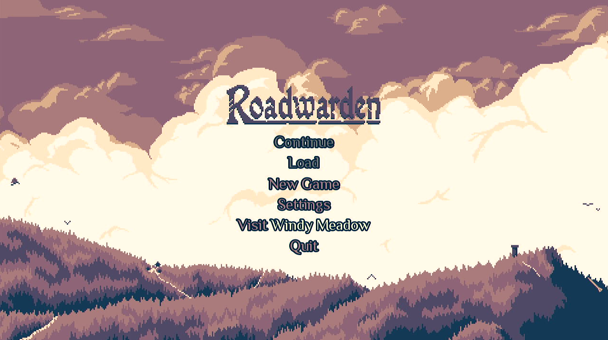
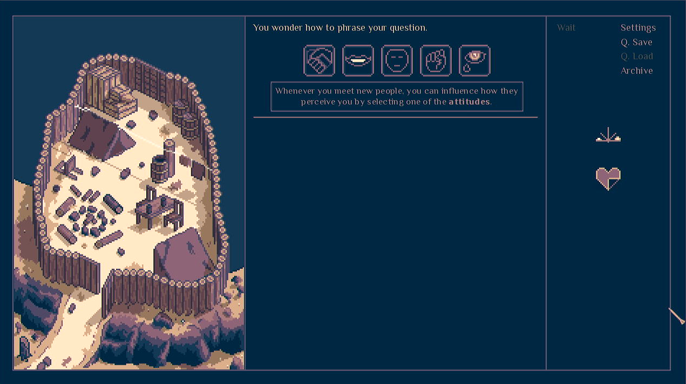

# Roadwarden

## Compatibility report

### Tested on

[Lichee Pi 4A](/docs/hardwares#lichee-pi-4a-soc-th1520)

### Box64 version (commit)

Box64 [ptitSeb/box64@69f49f79](https://github.com/ptitSeb/box64/tree/69f49f79)

### Game screenshot




### Game running log

```shell
[BOX64] Dynarec for rv64g_xtheadba_xtheadbb_xtheadbs_xtheadmempair_xtheadcondmov_xtheadmemidx_xthvector
[BOX64] Running on unknown riscv64 cpu with 4 cores, pagesize: 4096
[BOX64] Will use hardware counter measured at 3.0 MHz emulating 3.0 GHz
[BOX64] Using bash "/home/sipeed/ourstorybegin/box64/box64_/tests/box64-bash"
[BOX64] Box64 with Dynarec v0.3.3 69f49f79 built on Feb  6 2025 13:52:28
[BOX64] Didn't detect 48bits of address space, considering it's 39bits
[BOX64] Counted 41 Env var
[BOX64] BOX64 LIB PATH: 
[BOX64] BOX64 BIN PATH: ./:bin/:/home/sipeed/ourstorybegin/wine/wine-9.22-amd64-wow64/bin/:/usr/local/bin/:/usr/bin/:/bin/:/usr/local/games/:/usr/games/
[BOX64] Looking for ./start.sh
[BOX64] BOX64ENV: Variables overridden via env and/or RC file:
        BOX64_BASH=/home/sipeed/ourstorybegin/box64/box64_/tests/box64-bash
[BOX64] Not an ELF file (sign=#!/b)
[BOX64] Error: Reading elf header of /home/sipeed/games/GOG Games/Roadwarden/start.sh, Try to launch using bash instead
[BOX64] Dynarec for rv64g_xtheadba_xtheadbb_xtheadbs_xtheadmempair_xtheadcondmov_xtheadmemidx_xthvector
[BOX64] Running on unknown riscv64 cpu with 4 cores, pagesize: 4096
[BOX64] Will use hardware counter measured at 3.0 MHz emulating 3.0 GHz
[BOX64] Using bash "/home/sipeed/ourstorybegin/box64/box64_/tests/box64-bash"
[BOX64] Box64 with Dynarec v0.3.3 69f49f79 built on Feb  6 2025 13:52:28
[BOX64] Didn't detect 48bits of address space, considering it's 39bits
[BOX64] Counted 41 Env var
[BOX64] BOX64 LIB PATH: 
[BOX64] BOX64 BIN PATH: ./:bin/:/home/sipeed/ourstorybegin/wine/wine-9.22-amd64-wow64/bin/:/usr/local/bin/:/usr/bin/:/bin/:/usr/local/games/:/usr/games/
[BOX64] Looking for /home/sipeed/ourstorybegin/box64/box64_/tests/box64-bash
[BOX64] Bash detected, disabling banner
[BOX64] BOX64ENV: Variables overridden via env and/or RC file:
        BOX64_BASH=/home/sipeed/ourstorybegin/box64/box64_/tests/box64-bash
[BOX64] argv[1]="./start.sh"
[BOX64] Rename process to "box64-bash"
[BOX64] Using native(wrapped) libtinfo.so.6
[BOX64] Using native(wrapped) libdl.so.2
[BOX64] Using native(wrapped) libc.so.6
[BOX64] Using native(wrapped) ld-linux-x86-64.so.2
[BOX64] Using native(wrapped) libpthread.so.0
[BOX64] Using native(wrapped) libutil.so.1
[BOX64] Using native(wrapped) librt.so.1
[BOX64] Using native(wrapped) libbsd.so.0
[BOX64] Warning, of_unconvert(...) left over 0x8000, converted 0x8000
Running Roadwarden
[BOX64] Dynarec for rv64g_xtheadba_xtheadbb_xtheadbs_xtheadmempair_xtheadcondmov_xtheadmemidx_xthvector
[BOX64] Running on unknown riscv64 cpu with 4 cores, pagesize: 4096
[BOX64] Will use hardware counter measured at 3.0 MHz emulating 3.0 GHz
[BOX64] Using bash "/home/sipeed/ourstorybegin/box64/box64_/tests/box64-bash"
[BOX64] Box64 with Dynarec v0.3.3 69f49f79 built on Feb  6 2025 13:52:28
[BOX64] Didn't detect 48bits of address space, considering it's 39bits
[BOX64] Counted 41 Env var
[BOX64] BOX64 LIB PATH: 
[BOX64] BOX64 BIN PATH: ./:bin/:/home/sipeed/ourstorybegin/wine/wine-9.22-amd64-wow64/bin/:/usr/local/bin/:/usr/bin/:/bin/:/usr/local/games/:/usr/games/
[BOX64] Looking for /home/sipeed/ourstorybegin/box64/box64_/tests/box64-bash
[BOX64] Bash detected, disabling banner
[BOX64] BOX64ENV: Variables overridden via env and/or RC file:
        BOX64_BASH=/home/sipeed/ourstorybegin/box64/box64_/tests/box64-bash
[BOX64] argv[1]="./Roadwarden.sh"
[BOX64] Rename process to "box64-bash"
[BOX64] Using native(wrapped) libtinfo.so.6
[BOX64] Using native(wrapped) libdl.so.2
[BOX64] Using native(wrapped) libc.so.6
[BOX64] Using native(wrapped) ld-linux-x86-64.so.2
[BOX64] Using native(wrapped) libpthread.so.0
[BOX64] Using native(wrapped) libutil.so.1
[BOX64] Using native(wrapped) librt.so.1
[BOX64] Using native(wrapped) libbsd.so.0
[BOX64] Warning, of_unconvert(...) left over 0x8000, converted 0x8000
[BOX64] Dynarec for rv64g_xtheadba_xtheadbb_xtheadbs_xtheadmempair_xtheadcondmov_xtheadmemidx_xthvector
[BOX64] Running on unknown riscv64 cpu with 4 cores, pagesize: 4096
[BOX64] Will use hardware counter measured at 3.0 MHz emulating 3.0 GHz
[BOX64] Using bash "/home/sipeed/ourstorybegin/box64/box64_/tests/box64-bash"
[BOX64] Box64 with Dynarec v0.3.3 69f49f79 built on Feb  6 2025 13:52:28
[BOX64] Didn't detect 48bits of address space, considering it's 39bits
[BOX64] Counted 40 Env var
[BOX64] BOX64 LIB PATH: 
[BOX64] BOX64 BIN PATH: ./:bin/:/home/sipeed/ourstorybegin/wine/wine-9.22-amd64-wow64/bin/:/usr/local/bin/:/usr/bin/:/bin/:/usr/local/games/:/usr/games/
[BOX64] Looking for /home/sipeed/games/GOG Games/Roadwarden/game/lib/py2-linux-x86_64/Roadwarden
[BOX64] BOX64ENV: Variables overridden via env and/or RC file:
        BOX64_BASH=/home/sipeed/ourstorybegin/box64/box64_/tests/box64-bash
[BOX64] Rename process to "Roadwarden"
[BOX64] Using emulated /home/sipeed/games/GOG Games/Roadwarden/game/lib/py2-linux-x86_64/librenpython.so
[BOX64] Using native(wrapped) libpthread.so.0
[BOX64] Using native(wrapped) libc.so.6
[BOX64] Using native(wrapped) ld-linux-x86-64.so.2
[BOX64] Using native(wrapped) libdl.so.2
[BOX64] Using native(wrapped) libutil.so.1
[BOX64] Using native(wrapped) librt.so.1
[BOX64] Using native(wrapped) libbsd.so.0
LIBGL: Initialising gl4es
LIBGL: v1.1.7 built on Feb  8 2025 20:56:51
LIBGL: Using GLES 2.0 backend
LIBGL: loaded: libGLESv2.so
LIBGL: loaded: libEGL.so
LIBGL: Using GLES 2.0 backend
LIBGL: Hardware Full NPOT detected and used
LIBGL: Extension GL_EXT_blend_minmax  detected and used
LIBGL: Extension GL_EXT_draw_buffers  detected and used
LIBGL: FBO are in core, and so used
LIBGL: PointSprite are in core, and so used
LIBGL: CubeMap are in core, and so used
LIBGL: BlendColor is in core, and so used
LIBGL: Blend Subtract is in core, and so used
LIBGL: Blend Function and Equation Separation is in core, and so used
LIBGL: Texture Mirrored Repeat is in core, and so used
LIBGL: Extension GL_OES_mapbuffer  detected
LIBGL: Extension GL_OES_element_index_uint  detected and used
LIBGL: Extension GL_OES_packed_depth_stencil  detected and used
LIBGL: Extension GL_OES_depth24  detected and used
LIBGL: Extension GL_OES_rgb8_rgba8  detected and used
LIBGL: Extension GL_EXT_multi_draw_arrays  detected
LIBGL: Extension GL_EXT_texture_format_BGRA8888  detected and used
LIBGL: Extension GL_OES_depth_texture  detected and used
LIBGL: Extension GL_OES_texture_stencil8  detected and used
LIBGL: Extension GL_EXT_texture_rg  detected and used
LIBGL: Extension GL_OES_texture_float  detected and used
LIBGL: Extension GL_OES_texture_half_float  detected and used
LIBGL: Extension GL_EXT_color_buffer_float  detected and used
LIBGL: Extension GL_EXT_color_buffer_half_float  detected and used
LIBGL: Extension GL_OES_fragment_precision_high  detected and used
LIBGL: Extension GL_EXT_shader_texture_lod detected and used
1429.932528 (1494) PVR:(Error): DoCompileShader:  Failed to compile shader [ shadercompile.c:10866 ]
LIBGL: Max vertex attrib: 16
LIBGL: Extension GL_OES_standard_derivatives  detected and used
LIBGL: Extension GL_OES_get_program_binary  detected and used
LIBGL: Number of supported Program Binary Format: 1
LIBGL: Max texture size: 8192
LIBGL: Max Varying Vector: 15
LIBGL: Texture Units: 16/16 (hardware: 16), Max lights: 8, Max planes: 6
LIBGL: Max Color Attachments: 8 / Draw buffers: 8
LIBGL: Hardware vendor is Imagination Technologies
1429.933341 (1494) PVR:(Error): DoCompileShader:  Failed to compile shader [ shadercompile.c:10866 ]
1429.933619 (1494) PVR:(Error): DoCompileShader:  Failed to compile shader [ shadercompile.c:10866 ]
1429.933885 (1494) PVR:(Error): DoCompileShader:  Failed to compile shader [ shadercompile.c:10866 ]
LIBGL: sRGB surface supported
LIBGL: EGLImage from Pixmap supported
LIBGL: EGLImage to Texture2D supported
LIBGL: EGLImage to RenderBuffer supported
LIBGL: Targeting OpenGL 2.1
LIBGL: Not trying to batch small subsequent glDrawXXXX
LIBGL: Trying to use VBO
LIBGL: FBO workaround for using binded texture enabled
LIBGL: Force texture for Attachment color0 on FBO
LIBGL: Hack to trigger a SwapBuffers when a Full Framebuffer Blit on default FBO is done
LIBGL: glX Will try to recycle EGL Surface
LIBGL: Current folder is:/home/sipeed/games/GOG Games/Roadwarden/game
LIBGL: Loaded a PSA with 2 Precompiled Programs
[BOX64] Using native(wrapped) libGL.so.1
[BOX64] Using native(wrapped) libm.so.6
[BOX64] Using native(wrapped) libdbus-1.so.3
[BOX64] Using native(wrapped) libX11.so.6
[BOX64] Using native(wrapped) libxcb.so.1
[BOX64] Using native(wrapped) libXau.so.6
[BOX64] Using native(wrapped) libXdmcp.so.6
[BOX64] Using native(wrapped) libXext.so.6
[BOX64] Using native(wrapped) libXcursor.so.1
[BOX64] Using native(wrapped) libXfixes.so.3
[BOX64] Using native(wrapped) libXrender.so.1
[BOX64] Using native(wrapped) libXinerama.so.1
[BOX64] Using native(wrapped) libXi.so.6
[BOX64] Using native(wrapped) libXrandr.so.2
[BOX64] Using native(wrapped) libXss.so.1
[BOX64] Using native(wrapped) libXxf86vm.so.1
[BOX64] Using emulated /home/sipeed/games/GOG Games/Roadwarden/game/lib/py2-linux-x86_64/libsteam_api.so
[S_API] SteamAPI_Init(): SteamAPI_IsSteamRunning() did not locate a running instance of Steam.
dlopen failed trying to load:
/home/sipeed/.steam/sdk64/steamclient.so
with error:
Cannot dlopen("/home/sipeed/.steam/sdk64/steamclient.so"/0x3f8e04fb90, 2)

[S_API] SteamAPI_Init(): Sys_LoadModule failed to load: /home/sipeed/.steam/sdk64/steamclient.so
[BOX64] Error loading needed lib nvdrs
[BOX64] Warning: Cannot dlopen("nvdrs"/0x60dcc1d4, 2)
[BOX64] Using native(wrapped) libpulse-simple.so.0
[BOX64] Using native(wrapped) libpulse.so.0
[BOX64] Using native(wrapped) libudev.so.1
./start.sh: line 16:  1494 Segmentation fault      ./"Roadwarden.sh"
```

### Rendering methods

```shell
OpenGL ES + gl4es
```

[Read more: What is OpenGL ES? »](/docs/faq#what-is-opengl-es)

[Read more: What is gl4es? »](/docs/faq#what-is-gl4es)

### Extra information

[Official Game Website](https://moralanxietystudio.com/)

[Steam](https://store.steampowered.com/app/1155970/Roadwarden/)

[PCGameWiki](https://www.pcgamingwiki.com/wiki/Roadwarden)

### Advanced Tips

> TBD
