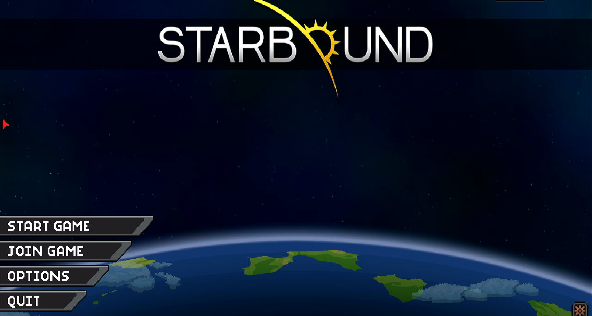
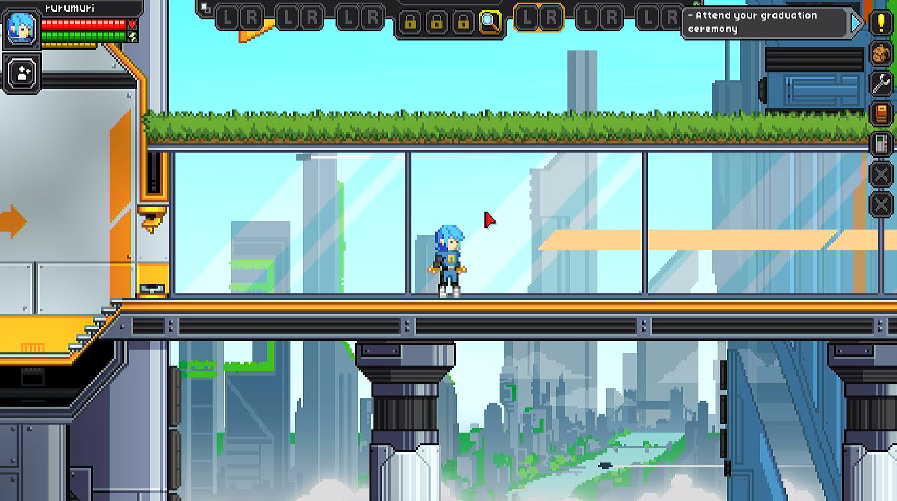
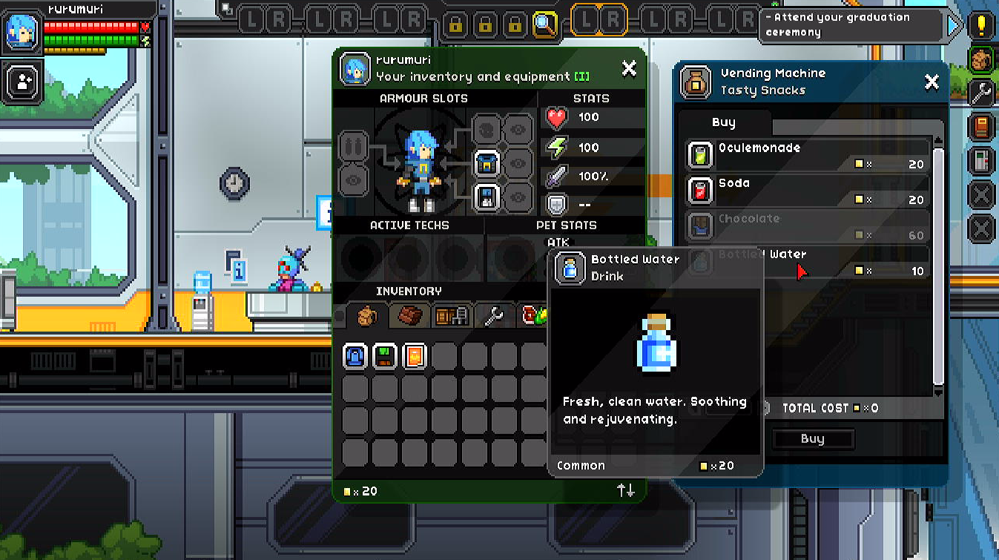
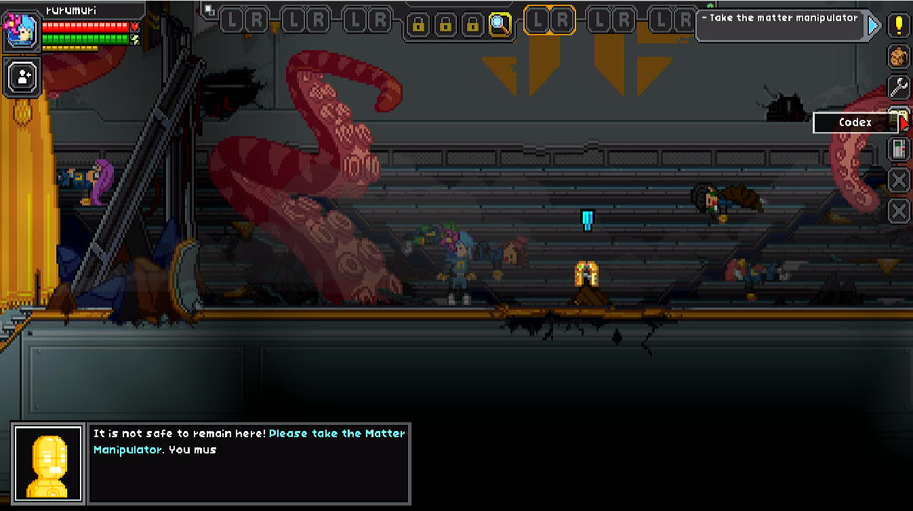

# Starbound

## Compatibility report

### Tested on

[Lichee Pi 4A](/docs/hardwares#lichee-pi-4a-soc-th1520)

### Box64 version (commit)

Box64 [ptitSeb/box64@69f49f79](https://github.com/ptitSeb/box64/tree/69f49f79)

### Game screenshot






### Game running log

```shell
[BOX64] Dynarec for rv64g_xtheadba_xtheadbb_xtheadbs_xtheadmempair_xtheadcondmov_xtheadmemidx_xthvector
[BOX64] Running on unknown riscv64 cpu with 4 cores, pagesize: 4096
[BOX64] Will use hardware counter measured at 3.0 MHz emulating 3.0 GHz
[BOX64] Using bash "/home/sipeed/ourstorybegin/box64/box64_/tests/box64-bash"
[BOX64] Box64 with Dynarec v0.3.3 69f49f79 built on Feb  6 2025 13:52:28
[BOX64] Didn't detect 48bits of address space, considering it's 39bits
[BOX64] Counted 41 Env var
[BOX64] BOX64 LIB PATH: 
[BOX64] BOX64 BIN PATH: ./:bin/:/home/sipeed/ourstorybegin/wine/wine-9.22-amd64-wow64/bin/:/usr/local/bin/:/usr/bin/:/bin/:/usr/local/games/:/usr/games/
[BOX64] Looking for ./start.sh
[BOX64] BOX64ENV: Variables overridden via env and/or RC file:
        BOX64_BASH=/home/sipeed/ourstorybegin/box64/box64_/tests/box64-bash
[BOX64] Not an ELF file (sign=#!/b)
[BOX64] Error: Reading elf header of /home/sipeed/games/GOG Games/Starbound/start.sh, Try to launch using bash instead
[BOX64] Dynarec for rv64g_xtheadba_xtheadbb_xtheadbs_xtheadmempair_xtheadcondmov_xtheadmemidx_xthvector
[BOX64] Running on unknown riscv64 cpu with 4 cores, pagesize: 4096
[BOX64] Will use hardware counter measured at 3.0 MHz emulating 3.0 GHz
[BOX64] Using bash "/home/sipeed/ourstorybegin/box64/box64_/tests/box64-bash"
[BOX64] Box64 with Dynarec v0.3.3 69f49f79 built on Feb  6 2025 13:52:28
[BOX64] Didn't detect 48bits of address space, considering it's 39bits
[BOX64] Counted 41 Env var
[BOX64] BOX64 LIB PATH: 
[BOX64] BOX64 BIN PATH: ./:bin/:/home/sipeed/ourstorybegin/wine/wine-9.22-amd64-wow64/bin/:/usr/local/bin/:/usr/bin/:/bin/:/usr/local/games/:/usr/games/
[BOX64] Looking for /home/sipeed/ourstorybegin/box64/box64_/tests/box64-bash
[BOX64] Bash detected, disabling banner
[BOX64] BOX64ENV: Variables overridden via env and/or RC file:
        BOX64_BASH=/home/sipeed/ourstorybegin/box64/box64_/tests/box64-bash
[BOX64] argv[1]="./start.sh"
[BOX64] Rename process to "box64-bash"
[BOX64] Using native(wrapped) libtinfo.so.6
[BOX64] Using native(wrapped) libdl.so.2
[BOX64] Using native(wrapped) libc.so.6
[BOX64] Using native(wrapped) ld-linux-x86-64.so.2
[BOX64] Using native(wrapped) libpthread.so.0
[BOX64] Using native(wrapped) libutil.so.1
[BOX64] Using native(wrapped) librt.so.1
[BOX64] Using native(wrapped) libbsd.so.0
[BOX64] Warning, of_unconvert(...) left over 0x8000, converted 0x8000
Running Starbound
[BOX64] Dynarec for rv64g_xtheadba_xtheadbb_xtheadbs_xtheadmempair_xtheadcondmov_xtheadmemidx_xthvector
[BOX64] Running on unknown riscv64 cpu with 4 cores, pagesize: 4096
[BOX64] Will use hardware counter measured at 3.0 MHz emulating 3.0 GHz
[BOX64] Using bash "/home/sipeed/ourstorybegin/box64/box64_/tests/box64-bash"
[BOX64] Box64 with Dynarec v0.3.3 69f49f79 built on Feb  6 2025 13:52:28
[BOX64] Didn't detect 48bits of address space, considering it's 39bits
[BOX64] Counted 41 Env var
[BOX64] BOX64 LIB PATH: 
[BOX64] BOX64 BIN PATH: ./:bin/:/home/sipeed/ourstorybegin/wine/wine-9.22-amd64-wow64/bin/:/usr/local/bin/:/usr/bin/:/bin/:/usr/local/games/:/usr/games/
[BOX64] Looking for /home/sipeed/ourstorybegin/box64/box64_/tests/box64-bash
[BOX64] Bash detected, disabling banner
[BOX64] BOX64ENV: Variables overridden via env and/or RC file:
        BOX64_BASH=/home/sipeed/ourstorybegin/box64/box64_/tests/box64-bash
[BOX64] argv[1]="./run-client.sh"
[BOX64] Rename process to "box64-bash"
[BOX64] Using native(wrapped) libtinfo.so.6
[BOX64] Using native(wrapped) libdl.so.2
[BOX64] Using native(wrapped) libc.so.6
[BOX64] Using native(wrapped) ld-linux-x86-64.so.2
[BOX64] Using native(wrapped) libpthread.so.0
[BOX64] Using native(wrapped) libutil.so.1
[BOX64] Using native(wrapped) librt.so.1
[BOX64] Using native(wrapped) libbsd.so.0
[BOX64] Warning, of_unconvert(...) left over 0x8000, converted 0x8000
[BOX64] Dynarec for rv64g_xtheadba_xtheadbb_xtheadbs_xtheadmempair_xtheadcondmov_xtheadmemidx_xthvector
[BOX64] Running on unknown riscv64 cpu with 4 cores, pagesize: 4096
[BOX64] Will use hardware counter measured at 3.0 MHz emulating 3.0 GHz
[BOX64] Using bash "/home/sipeed/ourstorybegin/box64/box64_/tests/box64-bash"
[BOX64] Box64 with Dynarec v0.3.3 69f49f79 built on Feb  6 2025 13:52:28
[BOX64] Didn't detect 48bits of address space, considering it's 39bits
[BOX64] Counted 41 Env var
[BOX64] BOX64 LIB PATH: 
[BOX64] BOX64 BIN PATH: ./:bin/:/home/sipeed/ourstorybegin/wine/wine-9.22-amd64-wow64/bin/:/usr/local/bin/:/usr/bin/:/bin/:/usr/local/games/:/usr/games/
[BOX64] Looking for ./starbound
[BOX64] BOX64ENV: Variables overridden via env and/or RC file:
        BOX64_BASH=/home/sipeed/ourstorybegin/box64/box64_/tests/box64-bash
[BOX64] Rename process to "starbound"
[BOX64] Using native(wrapped) libSDL2-2.0.so.0
[BOX64] Using native(wrapped) libdl.so.2
[BOX64] Using native(wrapped) libm.so.6
[BOX64] Using native(wrapped) librt.so.1
[BOX64] Using native(wrapped) libpthread.so.0
[BOX64] Using native(wrapped) libGLU.so.1
LIBGL: Initialising gl4es
LIBGL: v1.1.7 built on Feb  8 2025 20:56:51
LIBGL: Using GLES 2.0 backend
LIBGL: loaded: libGLESv2.so
LIBGL: loaded: libEGL.so
LIBGL: Using GLES 2.0 backend
LIBGL: Hardware Full NPOT detected and used
LIBGL: Extension GL_EXT_blend_minmax  detected and used
LIBGL: Extension GL_EXT_draw_buffers  detected and used
LIBGL: FBO are in core, and so used
LIBGL: PointSprite are in core, and so used
LIBGL: CubeMap are in core, and so used
LIBGL: BlendColor is in core, and so used
LIBGL: Blend Subtract is in core, and so used
LIBGL: Blend Function and Equation Separation is in core, and so used
LIBGL: Texture Mirrored Repeat is in core, and so used
LIBGL: Extension GL_OES_mapbuffer  detected
LIBGL: Extension GL_OES_element_index_uint  detected and used
LIBGL: Extension GL_OES_packed_depth_stencil  detected and used
LIBGL: Extension GL_OES_depth24  detected and used
LIBGL: Extension GL_OES_rgb8_rgba8  detected and used
LIBGL: Extension GL_EXT_multi_draw_arrays  detected
LIBGL: Extension GL_EXT_texture_format_BGRA8888  detected and used
LIBGL: Extension GL_OES_depth_texture  detected and used
LIBGL: Extension GL_OES_texture_stencil8  detected and used
LIBGL: Extension GL_EXT_texture_rg  detected and used
LIBGL: Extension GL_OES_texture_float  detected and used
LIBGL: Extension GL_OES_texture_half_float  detected and used
LIBGL: Extension GL_EXT_color_buffer_float  detected and used
LIBGL: Extension GL_EXT_color_buffer_half_float  detected and used
LIBGL: Extension GL_OES_fragment_precision_high  detected and used
LIBGL: Extension GL_EXT_shader_texture_lod detected and used
1008.151504 (1776) PVR:(Error): DoCompileShader:  Failed to compile shader [ shadercompile.c:10866 ]
LIBGL: Max vertex attrib: 16
LIBGL: Extension GL_OES_standard_derivatives  detected and used
LIBGL: Extension GL_OES_get_program_binary  detected and used
LIBGL: Number of supported Program Binary Format: 1
LIBGL: Max texture size: 8192
LIBGL: Max Varying Vector: 15
LIBGL: Texture Units: 16/16 (hardware: 16), Max lights: 8, Max planes: 6
LIBGL: Max Color Attachments: 8 / Draw buffers: 8
LIBGL: Hardware vendor is Imagination Technologies
1008.151868 (1776) PVR:(Error): DoCompileShader:  Failed to compile shader [ shadercompile.c:10866 ]
1008.152514 (1776) PVR:(Error): DoCompileShader:  Failed to compile shader [ shadercompile.c:10866 ]
1008.152776 (1776) PVR:(Error): DoCompileShader:  Failed to compile shader [ shadercompile.c:10866 ]
LIBGL: sRGB surface supported
LIBGL: EGLImage from Pixmap supported
LIBGL: EGLImage to Texture2D supported
LIBGL: EGLImage to RenderBuffer supported
LIBGL: Targeting OpenGL 2.1
LIBGL: Not trying to batch small subsequent glDrawXXXX
LIBGL: Trying to use VBO
LIBGL: FBO workaround for using binded texture enabled
LIBGL: Force texture for Attachment color0 on FBO
LIBGL: Hack to trigger a SwapBuffers when a Full Framebuffer Blit on default FBO is done
LIBGL: glX Will try to recycle EGL Surface
LIBGL: Current folder is:/home/sipeed/games/GOG Games/Starbound/game/linux
LIBGL: Loaded a PSA with 23 Precompiled Programs
[BOX64] Using native(wrapped) libGL.so.1
[BOX64] Using emulated libsteam_api.so
[BOX64] Using native(wrapped) libc.so.6
[BOX64] Using native(wrapped) ld-linux-x86-64.so.2
[BOX64] Using native(wrapped) libutil.so.1
[BOX64] Using native(wrapped) libbsd.so.0
[BOX64] Using emulated /usr/lib/box64-x86_64-linux-gnu/libstdc++.so.6
[BOX64] Using emulated /usr/lib/box64-x86_64-linux-gnu/libgcc_s.so.1
[Info] Application: Initializing SDL
[Info] Application: startup...
[Info] Root: Preparing Root...
[Info] Root: Done preparing Root.
[Info] Client Version 1.4.4 (linux x86_64) Source ID: 8cbe6faf22282659828a194e06a08999f213769e Protocol: 747
[Info] Root: Scanning for asset sources in directory '../assets/'
[Info] Root: Scanning for asset sources in directory '../mods/'
[Warn] Root: Unrecognized file in asset directory 'mods_go_here', skipping
[Info] Root: Detected asset source named 'base' at '../assets/packed.pak'
[Info] Root: Detected unnamed asset source at '../assets/user'
[Info] Loading assets from: '../assets/packed.pak'
[Info] Loading assets from: '../assets/user'
[Info] Assets digest is 531f0b8469832a566d23a0b9870ed717c63291164883670d0ee17086a100d3cd
[Info] Root: Loaded Assets in 15.8376 seconds
[Info] Application: Initializing SDL Video
[Info] Application: Initializing SDL Joystick
[Info] Application: Initializing SDL Sound
[S_API FAIL] SteamAPI_Init() failed; SteamAPI_IsSteamRunning() failed.
[S_API FAIL] SteamAPI_Init() failed; unable to locate a running instance of Steam, or a local steamclient.so.
[Info] Failed to initialize Steam platform services
[Info] Application: Creating SDL Window
[Info] Application: Enabling VSync with late swap tearing
[Info] Application: Enabling VSync late swap tearing failed, falling back to full VSync
[Info] Application: Opened default audio device with 44.1khz / 16 bit stereo audio, 2048 sample size buffer
[Info] OpenGL version: '2.1 gl4es wrapper 1.1.7' vendor: 'ptitSeb' renderer: 'GL4ES wrapper' shader: '1.20 via gl4es'
[Info] Application: initialization...
[Info] Root: no runtime config file, creating new default runtime config
[Info] Root: Loaded Configuration in 0.003847 seconds
[Info] Application: renderer initialization...
[Info] detected supported OpenGL texture size 8192, using atlasNumCells 128
[Info] Root: Loaded ImageMetadataDatabase in 0.000681667 seconds
[Info] Application: main update loop...
[Info] Root: Loaded NameGenerator in 0.246929 seconds
[Info] Root: Loaded PlantDatabase in 1.39003 seconds
[Info] Root: Loaded ObjectDatabase in 3.13983 seconds
[Info] Root: Loaded ProjectileDatabase in 1.73669 seconds
[Info] Root: Loaded NpcDatabase in 0.844464 seconds
[Info] Root: Loaded StagehandDatabase in 0.0306123 seconds
[Info] Root: Loaded VehicleDatabase in 0.0959173 seconds
[Info] Root: Loaded PlayerFactory in 0.161331 seconds
[Info] Root: Loaded MonsterDatabase in 1.75231 seconds
[Info] Root: Writing runtime configuration to '../storage/starbound.config'
[Info] Root: Loaded VersioningDatabase in 0.192625 seconds
[Info] Root: Loaded EntityFactory in 0.594288 seconds
[Info] Root: Loaded ParticleDatabase in 0.503143 seconds
[Info] Root: Loaded MaterialDatabase in 2.26887 seconds
[Info] Root: Loaded TerrainDatabase in 0.117107 seconds
[Info] Root: Loaded BiomeDatabase in 0.410431 seconds
[Info] Root: Loaded LiquidsDatabase in 0.0623317 seconds
[Info] Root: Loaded StatusEffectDatabase in 0.105476 seconds
[Info] Root: Loaded DamageDatabase in 3.27235 seconds
[Info] Root: Loaded EffectSourceDatabase in 0.106535 seconds
[Info] Root: Loaded FunctionDatabase in 0.104229 seconds
[Info] Root: Loaded TreasureDatabase in 0.394464 seconds
[Info] Root: Loaded DungeonDefinitions in 3.70091 seconds
[Info] Root: Loaded TilesetDatabase in 0.00472667 seconds
[Info] Root: Loaded StatisticsDatabase in 0.0505513 seconds
[Info] Root: Loaded EmoteProcessor in 0.0135857 seconds
[Info] Root: Loaded SpeciesDatabase in 0.182973 seconds
[Info] Root: Loaded QuestTemplateDatabase in 0.208173 seconds
[Info] Root: Loaded AiDatabase in 0.0912273 seconds
[Info] Root: Loaded TechDatabase in 0.039844 seconds
[Info] Root: Loaded CodexDatabase in 0.0873357 seconds
[Info] Root: Loaded BehaviorDatabase in 3.62369 seconds
[Info] Root: Loaded DanceDatabase in 0.08535 seconds
[Info] Root: Loaded SpawnTypeDatabase in 0.14381 seconds
[Info] Root: Loaded RadioMessageDatabase in 0.0823617 seconds
[Info] Root: Loaded ItemDatabase in 31.9921 seconds
[Info] Root: Loaded CollectionDatabase in 18.7722 seconds
[Info] Creating player storage directory
[Info] detected supported OpenGL texture size 8192, using atlasNumCells 256
[Info] UniverseServer: Creating universe storage directory
[Info] UniverseServer: Acquiring universe lock file
[Info] UniverseServer: Loading settings
[Info] UniverseServer: Starting UniverseServer with UUID: 8e908297c4bc73ee410068baef158eeb
[Info] UniverseServer: Logged in player 'rurumuri' locally
[Info] UniverseServer: Logged in account '<anonymous>' as player 'rurumuri' from address local
[Info] UniverseServer: Spawning player in intro instance protectorate
[Info] UniverseServer: Client 'rurumuri' <1> (local) connected
[Info] UniverseServer: Creating new client ship world ClientShipWorld:e98f0965de72b76bdfd6bb85d77f0b90
[Info] UniverseClient: Joined server as client 1
[Info] Protected dungeonIds for world set to (65524)
[Info] detected supported OpenGL texture size 8192, using atlasNumCells 256
[Info] detected supported OpenGL texture size 8192, using atlasNumCells 256
[Info] detected supported OpenGL texture size 8192, using atlasNumCells 256
[Info] UniverseServer: Creating temporary instance world 'InstanceWorld:protectorate:e98f0965de72b76bdfd6bb85d77f0b90:-' with expiry time 0
[Info] Protected dungeonIds for world set to (65524)
[Info] Placing dungeon protectorate
[Info] Placing dungeon at (0, 1000)
[Info] Flying ship for player 1 to new starter world
[Info] Searching for new randomized starter world
[Info] UniverseServer: Stopping idle world ClientShipWorld:e98f0965de72b76bdfd6bb85d77f0b90
[Warn] Failed to place dungeon object: protectoratesmokegen direction: 1 position: (687, 801)
[Warn] Failed to place dungeon object: protectoratesmokegen direction: 1 position: (717, 801)
[Warn] Failed to place dungeon object: protectoratefbannertorn1 direction: 1 position: (725, 802)
[Warn] Failed to place dungeon object: protectoratesmokegen direction: 1 position: (703, 826)
[Warn] Failed to place dungeon object: protectoratesmokegen direction: 1 position: (703, 827)
[Warn] Failed to place dungeon object: protectoratesmokegen direction: 1 position: (700, 828)
[Info] Protected dungeonIds for world set to (0, 65524)
[Info] UniverseServer: Found randomized starter world at 445239423:-842500266:-210265030:8
[Info] UniverseServer: Warping player 1 to InstanceWorld:protectorate:e98f0965de72b76bdfd6bb85d77f0b90:-
[Info] UniverseServer: Creating new system world at location (445239423, -842500266, -210265030)
[Info] UniverseServer: Creating celestial world 445239423:-842500266:-210265030:8
[Info] Protected dungeonIds for world set to (65524)
[Info] Placing dungeon naturalcave
[Info] Placing dungeon at (371, 675)
[Warn] Failed to place dungeon object: metalbarrel1 direction: 1 position: (222, 573)
[Warn] Failed to place dungeon object: metalbarrel1 direction: 0 position: (137, 590)
[Warn] Failed to place dungeon object: metalbarrel1 direction: 1 position: (397, 599)
[Warn] Failed to place dungeon object: metalbarrel1 direction: 1 position: (45, 651)
[Warn] Failed to place dungeon object: metalbarrel1 direction: 1 position: (77, 653)
[Warn] Failed to place dungeon object: metalbarrel1 direction: 1 position: (465, 675)
[Info] Placing dungeon gardengate
[Info] Placing dungeon at (1919, 675)
[Info] Protected dungeonIds for world set to (1, 65524)
[Info] Chat: <SAIL> Good morning graduate! You have overslept. Press A or D to get out of bed.
[Info] UniverseServer: Arriving ship for player 1 at 445239423:-842500266:-210265030:8
[Info] UniverseServer: Loading client ship world ClientShipWorld:e98f0965de72b76bdfd6bb85d77f0b90
[Info] Chat: <SAIL> To interact with a nearby person, door, or other object, you should hover over it with your cursor and press E, if you are awake enough to do so.
[Info] Protected dungeonIds for world set to (65524)
[Info] UniverseServer: Stopping idle world CelestialWorld:445239423:-842500266:-210265030:8
[Info] UniverseServer: Stopping idle world ClientShipWorld:e98f0965de72b76bdfd6bb85d77f0b90
[Info] Chat: <SAIL> Your uniform is available to collect from your personal locker... It is quite impressive that you can remain so serene when you are running so late. Well done you.
[Info] Chat: <SAIL> It is not safe to remain here! Please take the Matter Manipulator. You must proceed to the shuttle pad!
[Info] Chat: <SAIL> It appears the ceiling has collapsed. The Matter Manipulator can be used to clear this dirt. Press the R key to equip it, then click and hold on the pile of dirt to dig through it.
[Info] Chat: <SAIL> You can get past this dirt using your Matter Manipulator. Press the R key to equip it.
[Info] UniverseClient: Client disconnecting...
[Info] Client received world stop packet, leaving: Removed
[Info] UniverseServer: Client 'rurumuri' <1> (local) disconnected for reason: 
[Info] UniverseServer: Stopping idle world InstanceWorld:protectorate:e98f0965de72b76bdfd6bb85d77f0b90:-
[Info] UniverseServer: Expiring temporary world InstanceWorld:protectorate:e98f0965de72b76bdfd6bb85d77f0b90:-
[Info] UniverseServer: Stopping UniverseServer
[Info] Application: quit requested
[Info] Application: quitting...
[Info] Application: shutdown...
[Info] Root: Shutting down Root
[Info] Application: Destroying SDL Window
[Info] Application: stopped gracefully
LIBGL: Shutting down
```

### Rendering methods

```shell
OpenGL ES + gl4es
```

[Read more: What is OpenGL ES? »](/docs/faq#what-is-opengl-es)

[Read more: What is gl4es? »](/docs/faq#what-is-gl4es)

### Extra information

[Official Game Website](https://playstarbound.com/)

[Steam](https://store.steampowered.com/app/211820/Starbound/)

[PCGameWiki](https://www.pcgamingwiki.com/wiki/Starbound)

[Starbound Offical Wiki](https://starbounder.org/Starbound_Wiki)

### Advanced Tips

> TBD
