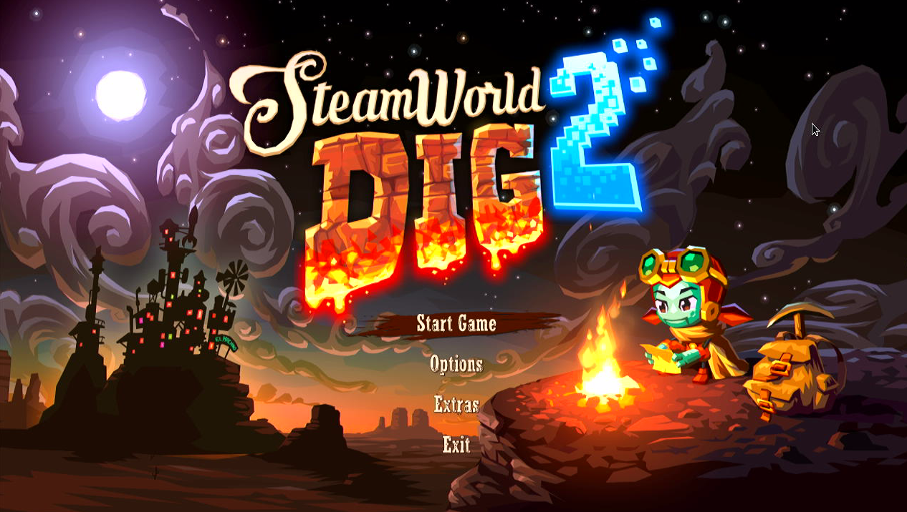
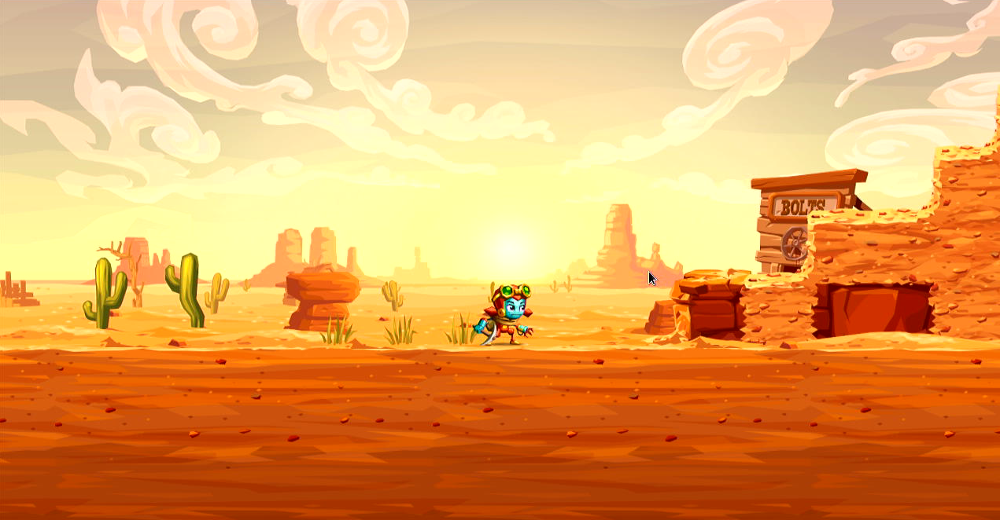
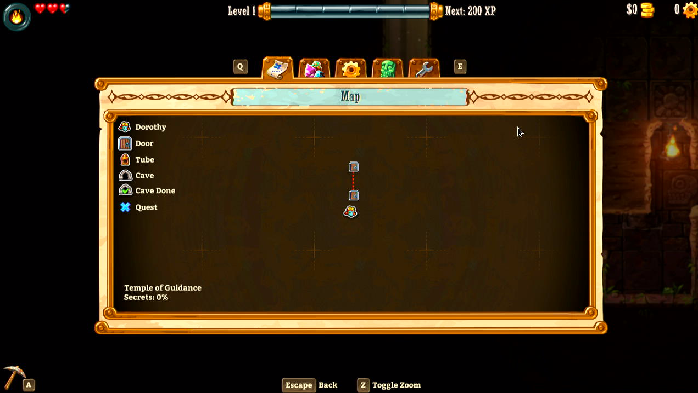
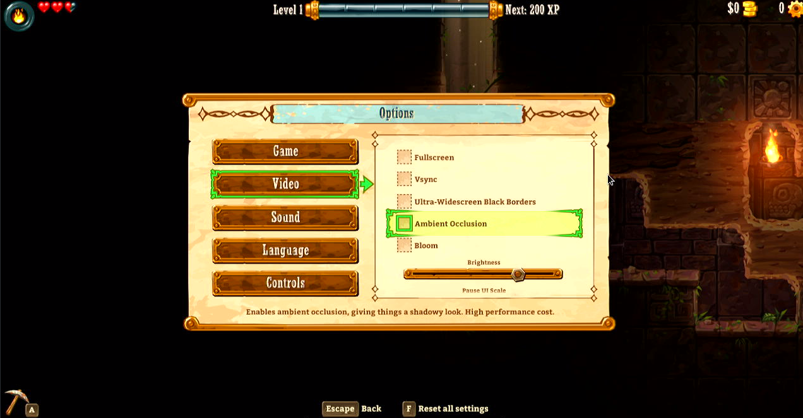

# SteamWorld Dig 2

## Compatibility report

### Tested on

[Lichee Pi 4A](/docs/hardwares#lichee-pi-4a-soc-th1520)

### Box64 version (commit)

Box64 [ptitSeb/box64@69f49f79](https://github.com/ptitSeb/box64/tree/69f49f79)

### Game screenshot





### Game running log

```shell
[BOX64] Dynarec for rv64g_xtheadba_xtheadbb_xtheadbs_xtheadmempair_xtheadcondmov_xtheadmemidx_xthvector
[BOX64] Running on unknown riscv64 cpu with 4 cores, pagesize: 4096
[BOX64] Will use hardware counter measured at 3.0 MHz emulating 3.0 GHz
[BOX64] Using bash "/home/sipeed/ourstorybegin/box64/box64_/tests/box64-bash"
[BOX64] Box64 with Dynarec v0.3.3 69f49f79 built on Feb  6 2025 13:52:28
[BOX64] Didn't detect 48bits of address space, considering it's 39bits
[BOX64] Counted 41 Env var
[BOX64] BOX64 LIB PATH: 
[BOX64] BOX64 BIN PATH: ./:bin/:/home/sipeed/ourstorybegin/wine/wine-9.22-amd64-wow64/bin/:/usr/local/bin/:/usr/bin/:/bin/:/usr/local/games/:/usr/games/
[BOX64] Looking for ./start.sh
[BOX64] BOX64ENV: Variables overridden via env and/or RC file:
        BOX64_BASH=/home/sipeed/ourstorybegin/box64/box64_/tests/box64-bash
[BOX64] Not an ELF file (sign=#!/b)
[BOX64] Error: Reading elf header of /home/sipeed/games/GOG Games/SteamWorld Dig 2/start.sh, Try to launch using bash instead
[BOX64] Dynarec for rv64g_xtheadba_xtheadbb_xtheadbs_xtheadmempair_xtheadcondmov_xtheadmemidx_xthvector
[BOX64] Running on unknown riscv64 cpu with 4 cores, pagesize: 4096
[BOX64] Will use hardware counter measured at 3.0 MHz emulating 3.0 GHz
[BOX64] Using bash "/home/sipeed/ourstorybegin/box64/box64_/tests/box64-bash"
[BOX64] Box64 with Dynarec v0.3.3 69f49f79 built on Feb  6 2025 13:52:28
[BOX64] Didn't detect 48bits of address space, considering it's 39bits
[BOX64] Counted 41 Env var
[BOX64] BOX64 LIB PATH: 
[BOX64] BOX64 BIN PATH: ./:bin/:/home/sipeed/ourstorybegin/wine/wine-9.22-amd64-wow64/bin/:/usr/local/bin/:/usr/bin/:/bin/:/usr/local/games/:/usr/games/
[BOX64] Looking for /home/sipeed/ourstorybegin/box64/box64_/tests/box64-bash
[BOX64] Bash detected, disabling banner
[BOX64] BOX64ENV: Variables overridden via env and/or RC file:
        BOX64_BASH=/home/sipeed/ourstorybegin/box64/box64_/tests/box64-bash
[BOX64] argv[1]="./start.sh"
[BOX64] Rename process to "box64-bash"
[BOX64] Using native(wrapped) libtinfo.so.6
[BOX64] Using native(wrapped) libdl.so.2
[BOX64] Using native(wrapped) libc.so.6
[BOX64] Using native(wrapped) ld-linux-x86-64.so.2
[BOX64] Using native(wrapped) libpthread.so.0
[BOX64] Using native(wrapped) libutil.so.1
[BOX64] Using native(wrapped) librt.so.1
[BOX64] Using native(wrapped) libbsd.so.0
[BOX64] Warning, of_unconvert(...) left over 0x8000, converted 0x8000
Running SteamWorld Dig 2
[BOX64] Dynarec for rv64g_xtheadba_xtheadbb_xtheadbs_xtheadmempair_xtheadcondmov_xtheadmemidx_xthvector
[BOX64] Running on unknown riscv64 cpu with 4 cores, pagesize: 4096
[BOX64] Will use hardware counter measured at 3.0 MHz emulating 3.0 GHz
[BOX64] Using bash "/home/sipeed/ourstorybegin/box64/box64_/tests/box64-bash"
[BOX64] Box64 with Dynarec v0.3.3 69f49f79 built on Feb  6 2025 13:52:28
[BOX64] Didn't detect 48bits of address space, considering it's 39bits
[BOX64] Counted 41 Env var
[BOX64] BOX64 LIB PATH: 
[BOX64] BOX64 BIN PATH: ./:bin/:/home/sipeed/ourstorybegin/wine/wine-9.22-amd64-wow64/bin/:/usr/local/bin/:/usr/bin/:/bin/:/usr/local/games/:/usr/games/
[BOX64] Looking for ./Dig2
[BOX64] BOX64ENV: Variables overridden via env and/or RC file:
        BOX64_BASH=/home/sipeed/ourstorybegin/box64/box64_/tests/box64-bash
[BOX64] Rename process to "Dig2"
[BOX64] Using native(wrapped) libopenal.so.1
[BOX64] Using native(wrapped) libpthread.so.0
[BOX64] Using native(wrapped) libSDL2-2.0.so.0
[BOX64] Using native(wrapped) libdl.so.2
[BOX64] Using native(wrapped) libm.so.6
[BOX64] Using native(wrapped) librt.so.1
LIBGL: Initialising gl4es
LIBGL: v1.1.7 built on Feb  8 2025 20:56:51
LIBGL: Using GLES 2.0 backend
LIBGL: loaded: libGLESv2.so
LIBGL: loaded: libEGL.so
LIBGL: Using GLES 2.0 backend
LIBGL: Hardware Full NPOT detected and used
LIBGL: Extension GL_EXT_blend_minmax  detected and used
LIBGL: Extension GL_EXT_draw_buffers  detected and used
LIBGL: FBO are in core, and so used
LIBGL: PointSprite are in core, and so used
LIBGL: CubeMap are in core, and so used
LIBGL: BlendColor is in core, and so used
LIBGL: Blend Subtract is in core, and so used
LIBGL: Blend Function and Equation Separation is in core, and so used
LIBGL: Texture Mirrored Repeat is in core, and so used
LIBGL: Extension GL_OES_mapbuffer  detected
LIBGL: Extension GL_OES_element_index_uint  detected and used
LIBGL: Extension GL_OES_packed_depth_stencil  detected and used
LIBGL: Extension GL_OES_depth24  detected and used
LIBGL: Extension GL_OES_rgb8_rgba8  detected and used
LIBGL: Extension GL_EXT_multi_draw_arrays  detected
LIBGL: Extension GL_EXT_texture_format_BGRA8888  detected and used
LIBGL: Extension GL_OES_depth_texture  detected and used
LIBGL: Extension GL_OES_texture_stencil8  detected and used
LIBGL: Extension GL_EXT_texture_rg  detected and used
LIBGL: Extension GL_OES_texture_float  detected and used
LIBGL: Extension GL_OES_texture_half_float  detected and used
LIBGL: Extension GL_EXT_color_buffer_float  detected and used
LIBGL: Extension GL_EXT_color_buffer_half_float  detected and used
LIBGL: Extension GL_OES_fragment_precision_high  detected and used
LIBGL: Extension GL_EXT_shader_texture_lod detected and used
123.325336 ( 970) PVR:(Error): DoCompileShader:  Failed to compile shader [ shadercompile.c:10866 ]
LIBGL: Max vertex attrib: 16
LIBGL: Extension GL_OES_standard_derivatives  detected and used
LIBGL: Extension GL_OES_get_program_binary  detected and used
LIBGL: Number of supported Program Binary Format: 1
LIBGL: Max texture size: 8192
LIBGL: Max Varying Vector: 15
LIBGL: Texture Units: 16/16 (hardware: 16), Max lights: 8, Max planes: 6
LIBGL: Max Color Attachments: 8 / Draw buffers: 8
LIBGL: Hardware vendor is Imagination Technologies
123.326719 ( 970) PVR:(Error): DoCompileShader:  Failed to compile shader [ shadercompile.c:10866 ]
123.326933 ( 970) PVR:(Error): DoCompileShader:  Failed to compile shader [ shadercompile.c:10866 ]
123.327141 ( 970) PVR:(Error): DoCompileShader:  Failed to compile shader [ shadercompile.c:10866 ]
LIBGL: sRGB surface supported
LIBGL: EGLImage from Pixmap supported
LIBGL: EGLImage to Texture2D supported
LIBGL: EGLImage to RenderBuffer supported
LIBGL: Targeting OpenGL 2.1
LIBGL: Not trying to batch small subsequent glDrawXXXX
LIBGL: Trying to use VBO
LIBGL: FBO workaround for using binded texture enabled
LIBGL: Force texture for Attachment color0 on FBO
LIBGL: Hack to trigger a SwapBuffers when a Full Framebuffer Blit on default FBO is done
LIBGL: glX Will try to recycle EGL Surface
LIBGL: Current folder is:/home/sipeed/games/GOG Games/SteamWorld Dig 2/game
LIBGL: Loaded a PSA with 21 Precompiled Programs
[BOX64] Using native(wrapped) libGL.so.1
[BOX64] Using emulated /usr/lib/box64-x86_64-linux-gnu/libstdc++.so.6
[BOX64] Using emulated /usr/lib/box64-x86_64-linux-gnu/libgcc_s.so.1
[BOX64] Using native(wrapped) libc.so.6
[BOX64] Using native(wrapped) ld-linux-x86-64.so.2
[BOX64] Using native(wrapped) libutil.so.1
[BOX64] Using native(wrapped) libbsd.so.0
           System.cpp:808    INFO: Log initialized.
            Thread.cpp:67    INFO: CPU Count: 4
           System.cpp:813    INFO: Date: 2025-01-24, time: 12:20:38
           FileLog.cpp:51    INFO: FileLog created: /home/sipeed/.local/share/SteamWorld Dig 2/log.txt
  SettingsHandler.cpp:281    INFO: Loaded 35 setting definitions in 0.045s
  SettingsHandler.cpp:281    INFO: Loaded 3 setting definitions in 0s
  SettingsHandler.cpp:113    INFO: Loaded stored settings in 0.022s
             main.cpp:348    INFO: Created window, actual res 1280;669, on display 0
             main.cpp:517    INFO: OpenGL Info:
OpenGL vendor: ptitSeb
OpenGL renderer: GL4ES wrapper
OpenGL version: 2.1 gl4es wrapper 1.1.7
GLSL version: 1.20 via gl4es
Max texture size: 8192
GL_ARB_framebuffer_object supported: Yes
GL_EXT_framebuffer_object supported: Yes
libpng warning: iCCP: known incorrect sRGB profile
   AudioDefinition.cpp:85    INFO: Loaded 10 audio source groups.
  AudioDefinition.cpp:162    INFO: Loaded 270 audio cue definitions in 0.056s
            OpenAL.cpp:57    INFO: Sucessfully opened OpenAL device: Default
        OGLShader.cpp:131    INFO: Successfully compiled and linked BasicEffect_ColorTexture.vert and BasicEffect_ColorTexture.frag. Attributes: 3, Uniforms: 3.
        OGLShader.cpp:131    INFO: Successfully compiled and linked BasicEffect_Color.vert and BasicEffect_Color.frag. Attributes: 2, Uniforms: 2.
   DefinitionTable.cpp:66    INFO: Loaded 34 (+ 0) AchievementDefinitions from 1 files in 0.043s
   DefinitionTable.cpp:66    INFO: Loaded 9 (+ 1) AchievementDefinitions from 1 files in 0.01s
   DefinitionTable.cpp:66    INFO: Loaded 1 (+ 0) FrameworkConstants from 2 files in 0.014s
   DefinitionTable.cpp:66    INFO: Loaded 6 (+ 0) LanguageDefinitions from 1 files in 0.006s
   DefinitionTable.cpp:66    INFO: Loaded 43 (+ 0) RumbleDefinitions from 1 files in 0.011s
   DefinitionTable.cpp:66    INFO: Loaded 21 (+ 0) TextFormatDefinitions from 1 files in 0.006s
   DefinitionTable.cpp:66    INFO: Loaded 56 (+ 2) TextItemDefinitions from 1 files in 0.007s
   DefinitionTable.cpp:66    INFO: Loaded 54 (+ 1) TextSettingsDefinitions from 1 files in 0.004s
   DefinitionTable.cpp:66    INFO: Loaded 12 (+ 0) AssetSets from 1 files in 0.007s
   DefinitionTable.cpp:66    INFO: Loaded 2 (+ 0) CutsceneDefinitions from 1 files in 0.021s
   DefinitionTable.cpp:66    INFO: Loaded 1 (+ 0) MenuDefinitions from 2 files in 0.017s
           FontSet.cpp:36    INFO: Loaded 18 fonts in set Fonts in 0.987s
LocalizationHandler.c:378    INFO: Trying to load language "en" at Language/en.csv
LocalizationHandler.c:400    INFO: - Success (uses space word wrap? 1)
           System.cpp:937    INFO: Randomizer seed: 90908747
 LeaderboardSystem.cpp:54    INFO: Loaded 2 leaderboards.
           System.cpp:959    INFO: All base systems initialized.
128.098185 ( 970) PVR:(Error): DoCompileShader:  Failed to compile shader [ shadercompile.c:10866 ]
        OGLShader.cpp:202   ERROR: Shaders/ColorTextureBlur.frag:
Compile failed.
ERROR: 0:64: '*' : Wrong operand types. No operation '*' exists that takes a left-hand operand of type 'uniform 2-component vector of float' and a right operand of type 'int' (and there is no acceptable conversion)
ERROR: 0:65: '*' : Wrong operand types. No operation '*' exists that takes a left-hand operand of type 'uniform 2-component vector of float' and a right operand of type 'int' (and there is no acceptable conversion)
ERROR: 0:67: '/=' : Wrong operand types. No operation '/=' exists that takes a left-hand operand of type '4-component vector of float' and a right operand of type 'const int' (and there is no acceptable conversion)
WARNING: 0:64: Calls to any function that may require a gradient calculation inside a conditional block may return undefined results
WARNING: 0:65: Calls to any function that may require a gradient calculation inside a conditional block may return undefined results
2 compilation warnings.

3 compilation errors. No code generated.


         OGLShader.cpp:51   ERROR: Failed to compile vertex shader.
128.124612 ( 970) PVR:(Error): DoCompileShader:  Failed to compile shader [ shadercompile.c:10866 ]
        OGLShader.cpp:202   ERROR: Shaders/ColorTextureRescaleColor.frag:
Compile failed.
ERROR: 0:24: '-' : Wrong operand types. No operation '-' exists that takes a left-hand operand of type 'const int' and a right operand of type 'uniform float' (and there is no acceptable conversion)
ERROR: 0:24: '/' : Wrong operand types. No operation '/' exists that takes a left-hand operand of type '3-component vector of float' and a right operand of type 'int' (and there is no acceptable conversion)
ERROR: 0:24: '-' : Wrong operand types. No operation '-' exists that takes a left-hand operand of type 'const int' and a right operand of type 'uniform float' (and there is no acceptable conversion)
ERROR: 0:24: '/' : Wrong operand types. No operation '/' exists that takes a left-hand operand of type '3-component vector of float' and a right operand of type 'int' (and there is no acceptable conversion)
4 compilation errors. No code generated.


         OGLShader.cpp:51   ERROR: Failed to compile vertex shader.
128.150822 ( 970) PVR:(Error): DoCompileShader:  Failed to compile shader [ shadercompile.c:10866 ]
        OGLShader.cpp:202   ERROR: Shaders/ColorTextureBloomBlend.frag:
Compile failed.
ERROR: 0:70: '+' : Wrong operand types. No operation '+' exists that takes a left-hand operand of type 'const int' and a right operand of type 'uniform float' (and there is no acceptable conversion)
ERROR: 0:70: '*' : Wrong operand types. No operation '*' exists that takes a left-hand operand of type '4-component vector of float' and a right operand of type 'int' (and there is no acceptable conversion)
ERROR: 0:70: '-' : Wrong operand types. No operation '-' exists that takes a left-hand operand of type 'const int' and a right operand of type '4-component vector of float' (and there is no acceptable conversion)
ERROR: 0:70: '*' : Wrong operand types. No operation '*' exists that takes a left-hand operand of type 'int' and a right operand of type 'uniform float' (and there is no acceptable conversion)
ERROR: 0:70: '+' : Wrong operand types. No operation '+' exists that takes a left-hand operand of type 'uniform float' and a right operand of type 'int' (and there is no acceptable conversion)
5 compilation errors. No code generated.


         OGLShader.cpp:51   ERROR: Failed to compile vertex shader.
        OGLShader.cpp:131    INFO: Successfully compiled and linked BasicEffect_ColorTexture.vert and BasicEffect_ColorTextureUVClamp.frag. Attributes: 3, Uniforms: 4.
        OGLShader.cpp:131    INFO: Successfully compiled and linked BasicEffect_ColorTexture.vert and ColorTextureGamma.frag. Attributes: 3, Uniforms: 4.
             main.cpp:595    INFO: Done...
        ConfigFile.cpp:78    INFO: Loading config from controls.cfg
        ConfigFile.cpp:78    INFO: Loading config from gamepads.cfg
Stubbed glGetTexLevelParameteriv(GL_TEXTURE_2D, 0, 0x8067, 0x3fc768b880)
Stubbed glGetTexLevelParameteriv(GL_TEXTURE_2D, 0, 0x8067, 0x3fc768b880)
Stubbed glGetTexLevelParameteriv(GL_TEXTURE_2D, 0, 0x8067, 0x3fc768b880)
Stubbed glGetTexLevelParameteriv(GL_TEXTURE_2D, 0, 0x8067, 0x3fc768b880)
Stubbed glGetTexLevelParameteriv(GL_TEXTURE_2D, 0, 0x8067, 0x3fc768b880)
Stubbed glGetTexLevelParameteriv(GL_TEXTURE_2D, 0, 0x8067, 0x3fc768b880)
Stubbed glGetTexLevelParameteriv(GL_TEXTURE_2D, 0, 0x8067, 0x3fc768b880)
Stubbed glGetTexLevelParameteriv(GL_TEXTURE_2D, 0, 0x8067, 0x3fc768b880)
Stubbed glGetTexLevelParameteriv(GL_TEXTURE_2D, 0, 0x8067, 0x3fc768b880)
Stubbed glGetTexLevelParameteriv(GL_TEXTURE_2D, 0, 0x8067, 0x3fc768b880)
Stubbed glGetTexLevelParameteriv(GL_TEXTURE_2D, 0, 0x8067, 0x3fc768b880)
Stubbed glGetTexLevelParameteriv(GL_TEXTURE_2D, 0, 0x8067, 0x3fc768b880)
Stubbed glGetTexLevelParameteriv(GL_TEXTURE_2D, 0, 0x8067, 0x3fc768b880)
Stubbed glGetTexLevelParameteriv(GL_TEXTURE_2D, 0, 0x8067, 0x3fc768b880)
Stubbed glGetTexLevelParameteriv(GL_TEXTURE_2D, 0, 0x8067, 0x3fc768b880)
Stubbed glGetTexLevelParameteriv(GL_TEXTURE_2D, 0, 0x8067, 0x3fc768b880)
Stubbed glGetTexLevelParameteriv(GL_TEXTURE_2D, 0, 0x8067, 0x3fc768b880)
Stubbed glGetTexLevelParameteriv(GL_TEXTURE_2D, 0, 0x8067, 0x3fc768b880)
Stubbed glGetTexLevelParameteriv(GL_TEXTURE_2D, 0, 0x8067, 0x3fc768b880)
Stubbed glGetTexLevelParameteriv(GL_TEXTURE_2D, 0, 0x8067, 0x3fc768b880)
Stubbed glGetTexLevelParameteriv(GL_TEXTURE_2D, 0, 0x8067, 0x3fc768b880)
           System.cpp:666    INFO: Entering new system state: 0
Stubbed glGetTexLevelParameteriv(GL_TEXTURE_2D, 0, 0x8067, 0x3fc768b880)
Stubbed glGetTexLevelParameteriv(GL_TEXTURE_2D, 0, 0x8067, 0x3fc768b880)
           System.cpp:666    INFO: Entering new system state: 1
Stubbed glGetTexLevelParameteriv(GL_TEXTURE_2D, 0, 0x8067, 0x3fc768b880)
           System.cpp:666    INFO: Entering new system state: 2
Stubbed glGetTexLevelParameteriv(GL_TEXTURE_2D, 0, 0x8067, 0x3fc768b880)
           System.cpp:666    INFO: Entering new system state: 3
Stubbed glGetTexLevelParameteriv(GL_TEXTURE_2D, 0, 0x8067, 0x3fc768b880)
Stubbed glGetTexLevelParameteriv(GL_TEXTURE_2D, 0, 0x8067, 0x3fc768b880)
Stubbed glGetTexLevelParameteriv(GL_TEXTURE_2D, 0, 0x8067, 0x3fc768b880)
Stubbed glGetTexLevelParameteriv(GL_TEXTURE_2D, 0, 0x8067, 0x3fc768b880)
Stubbed glGetTexLevelParameteriv(GL_TEXTURE_2D, 0, 0x8067, 0x3fc768b880)
Stubbed glGetTexLevelParameteriv(GL_TEXTURE_2D, 0, 0x8067, 0x3fc768b880)
Stubbed glGetTexLevelParameteriv(GL_TEXTURE_2D, 0, 0x8067, 0x3fc768b880)
Stubbed glGetTexLevelParameteriv(GL_TEXTURE_2D, 0, 0x8067, 0x3fc768b880)
Stubbed glGetTexLevelParameteriv(GL_TEXTURE_2D, 0, 0x8067, 0x3fc768b880)
Stubbed glGetTexLevelParameteriv(GL_TEXTURE_2D, 0, 0x8067, 0x3fc768b880)
Stubbed glGetTexLevelParameteriv(GL_TEXTURE_2D, 0, 0x8067, 0x3fc768b880)
Stubbed glGetTexLevelParameteriv(GL_TEXTURE_2D, 0, 0x8067, 0x3fc768b880)
Stubbed glGetTexLevelParameteriv(GL_TEXTURE_2D, 0, 0x8067, 0x3fc768b880)
   DefinitionTable.cpp:66    INFO: Loaded 1 (+ 0) Constants from 2 files in 0.091s
   DefinitionTable.cpp:66    INFO: Loaded 399 (+ 0) ParticleEffectDefinitions from 1 files in 0.017s
Stubbed glGetTexLevelParameteriv(GL_TEXTURE_2D, 0, 0x8067, 0x3fc768b880)
      MusicPlayer.cpp:128    INFO: Loading music: main_menu_theme
      MusicPlayer.cpp:141    INFO: Playing music: main_menu_theme
      MusicPlayer.cpp:112    INFO: Fading out music: 
Stubbed glGetTexLevelParameteriv(GL_TEXTURE_2D, 0, 0x8067, 0x3fc768b880)
   OALMusicDriver.cpp:123    INFO: Open new music: Audio/Music/main_menu_theme
Stubbed glGetTexLevelParameteriv(GL_TEXTURE_2D, 0, 0x8067, 0x3fc768b880)
Stubbed glGetTexLevelParameteriv(GL_TEXTURE_2D, 0, 0x8067, 0x3fc768b880)
Stubbed glGetTexLevelParameteriv(GL_TEXTURE_2D, 0, 0x8067, 0x3fc768b880)
      MusicPlayer.cpp:117    INFO: Stopping music: 
            Menus.cpp:630    INFO: StartMainMenu
      MusicPlayer.cpp:112    INFO: Fading out music: main_menu_theme
      MusicPlayer.cpp:112    INFO: Fading out music: 
      MusicPlayer.cpp:117    INFO: Stopping music: main_menu_theme
      MusicPlayer.cpp:117    INFO: Stopping music: 
      MusicPlayer.cpp:117    INFO: Stopping music: main_menu_theme
      MusicPlayer.cpp:117    INFO: Stopping music: 
           System.cpp:666    INFO: Entering new system state: 4
Stubbed glGetTexLevelParameteriv(GL_TEXTURE_2D, 0, 0x8067, 0x3fc768b880)
Stubbed glGetTexLevelParameteriv(GL_TEXTURE_2D, 0, 0x8067, 0x3fc768b880)
Stubbed glGetTexLevelParameteriv(GL_TEXTURE_2D, 0, 0x8067, 0x3fc768b880)
Stubbed glGetTexLevelParameteriv(GL_TEXTURE_2D, 0, 0x8067, 0x3fc768b880)
Stubbed glGetTexLevelParameteriv(GL_TEXTURE_2D, 0, 0x8067, 0x3fc768b880)
Stubbed glGetTexLevelParameteriv(GL_TEXTURE_2D, 0, 0x8067, 0x3fc768b880)
Stubbed glGetTexLevelParameteriv(GL_TEXTURE_2D, 0, 0x8067, 0x3fc768b880)
Stubbed glGetTexLevelParameteriv(GL_TEXTURE_2D, 0, 0x8067, 0x3fc768b880)
Stubbed glGetTexLevelParameteriv(GL_TEXTURE_2D, 0, 0x8067, 0x3fc768b880)
Stubbed glGetTexLevelParameteriv(GL_TEXTURE_2D, 0, 0x8067, 0x3fc768b880)
Stubbed glGetTexLevelParameteriv(GL_TEXTURE_2D, 0, 0x8067, 0x3fc768b880)
Stubbed glGetTexLevelParameteriv(GL_TEXTURE_2D, 0, 0x8067, 0x3fc768b880)
Stubbed glGetTexLevelParameteriv(GL_TEXTURE_2D, 0, 0x8067, 0x3fc768b880)
Stubbed glGetTexLevelParameteriv(GL_TEXTURE_2D, 0, 0x8067, 0x3fc768b880)
Stubbed glGetTexLevelParameteriv(GL_TEXTURE_2D, 0, 0x8067, 0x3fc768b880)
Stubbed glGetTexLevelParameteriv(GL_TEXTURE_2D, 0, 0x8067, 0x3fc768b880)
Stubbed glGetTexLevelParameteriv(GL_TEXTURE_2D, 0, 0x8067, 0x3fc768b880)
Stubbed glGetTexLevelParameteriv(GL_TEXTURE_2D, 0, 0x8067, 0x3fc768b880)
Stubbed glGetTexLevelParameteriv(GL_TEXTURE_2D, 0, 0x8067, 0x3fc768b880)
Stubbed glGetTexLevelParameteriv(GL_TEXTURE_2D, 0, 0x8067, 0x3fc768b880)
Stubbed glGetTexLevelParameteriv(GL_TEXTURE_2D, 0, 0x8067, 0x3fc768b880)
Stubbed glGetTexLevelParameteriv(GL_TEXTURE_2D, 0, 0x8067, 0x3fc768b880)
Stubbed glGetTexLevelParameteriv(GL_TEXTURE_2D, 0, 0x8067, 0x3fc768b880)
   DefinitionTable.cpp:66    INFO: Loaded 38 (+ 0) Animations from 2 files in 0.092s
   DefinitionTable.cpp:66    INFO: Loaded 28 (+ 0) BehaviorDefinitions from 1 files in 0.191s
   DefinitionTable.cpp:66    INFO: Loaded 1 (+ 0) CollectorDefinitions from 1 files in 0.008s
   DefinitionTable.cpp:66    INFO: Loaded 33 (+ 0) EnvironmentDefinitions from 1 files in 0.032s
   DefinitionTable.cpp:66    INFO: Loaded 4 (+ 0) PriceLists from 1 files in 0.006s
   DefinitionTable.cpp:66    INFO: Loaded 574 (+ 50) EntityDefinitions from 12 files in 0.693s
   DefinitionTable.cpp:66    INFO: Loaded 4 (+ 1) AbilityIconDefinitions from 1 files in 0.003s
   DefinitionTable.cpp:66    INFO: Loaded 11 (+ 1) Banners from 1 files in 0.01s
   DefinitionTable.cpp:66    INFO: Loaded 43 (+ 0) CollectibleDefinitions from 1 files in 0.007s
   DefinitionTable.cpp:66    INFO: Loaded 1 (+ 0) CollectibleDefinitions from 1 files in 0.006s
   DefinitionTable.cpp:66    INFO: Loaded 123 (+ 0) Conversations from 1 files in 0.132s
   DefinitionTable.cpp:66    INFO: Loaded 15 (+ 0) DamageTypes from 1 files in 0.009s
   DefinitionTable.cpp:66    INFO: Loaded 47 (+ 1) EarthquakeDefinitions from 1 files in 0.01s
   DefinitionTable.cpp:66    INFO: Loaded 43 (+ 0) EditorPickups from 1 files in 0.003s
   DefinitionTable.cpp:66    INFO: Loaded 1 (+ 0) ExperienceDefinitions from 1 files in 0.01s
   DefinitionTable.cpp:66    INFO: Loaded 3 (+ 0) ForegroundLiquids from 1 files in 0.003s
   DefinitionTable.cpp:66    INFO: Loaded 270 (+ 0) /Sounds/AudioCues from 1 files in 0.011s
   DefinitionTable.cpp:66    INFO: Loaded 108 (+ 15) LevelDefinitions from 1 files in 0.093s
   DefinitionTable.cpp:66    INFO: Loaded 4 (+ 1) LiquidDefinitions from 1 files in 0.008s
   DefinitionTable.cpp:66    INFO: Loaded 14 (+ 1) MaterialDefinitions from 1 files in 0.065s
   DefinitionTable.cpp:66    INFO: Loaded 32 (+ 1) OutsetDefinitions from 1 files in 0.044s
   DefinitionTable.cpp:66    INFO: Loaded 12 (+ 2) PointerDefinitions from 1 files in 0.024s
   DefinitionTable.cpp:66    INFO: Loaded 77 (+ 3) QuestDefinitions from 1 files in 0.029s
   DefinitionTable.cpp:66    INFO: Loaded 34 (+ 5) ResourceDefinitions from 1 files in 0.007s
   DefinitionTable.cpp:66    INFO: Loaded 2 (+ 0) ResourceTableDefinitions from 1 files in 0.014s
   DefinitionTable.cpp:66    INFO: Loaded 9 (+ 0) RespawnDefinitions from 1 files in 0.008s
   DefinitionTable.cpp:66    INFO: Loaded 8 (+ 0) ScreenFlashes from 1 files in 0.004s
   DefinitionTable.cpp:66    INFO: Loaded 2 (+ 0) ScreenTutorials from 1 files in 0.011s
   DefinitionTable.cpp:66    INFO: Loaded 34 (+ 2) SpeakingStyleDefinitions from 1 files in 0.01s
   DefinitionTable.cpp:66    INFO: Loaded 3 (+ 0) TimeEffectDefinitions from 1 files in 0.009s
   DefinitionTable.cpp:66    INFO: Loaded 28 (+ 0) TutorialIndicators from 1 files in 0.013s
   DefinitionTable.cpp:66    INFO: Loaded 78 (+ 0) UpgradeDefinitions from 1 files in 0.05s
   DefinitionTable.cpp:66    INFO: Loaded 5 (+ 0) VectronMessageDefinitions from 1 files in 0.01s
   DefinitionTable.cpp:66    INFO: Loaded 27 (+ 5) WeaponDefinitions from 1 files in 0.016s
   DefinitionTable.cpp:66    INFO: Loaded 1 (+ 0) WorldMapDefinitions from 1 files in 0.022s
   DefinitionTable.cpp:66    INFO: Loaded 1 (+ 0) WorldMapDefinitions from 1 files in 0.015s
    LevelGenerator.cpp:86    INFO: Loading level west_desert...
   LevelGenerator.cpp:609    INFO: Rule active: (quest: , status: locked, Enable: 0)
   LevelGenerator.cpp:609    INFO: Rule active: (quest: , status: locked, Enable: 1)
   LevelGenerator.cpp:299    INFO: Disabled layer: filter_after_earthquake
        CellSystem.cpp:78    INFO: Starting cell system. Area: 0;0;30600;7320, Cell Size: 480;480, Cells: 1024
Stubbed glGetTexLevelParameteriv(GL_TEXTURE_2D, 0, 0x8067, 0x3fc768b880)
Stubbed glGetTexLevelParameteriv(GL_TEXTURE_2D, 0, 0x8067, 0x3fc768b880)
Stubbed glGetTexLevelParameteriv(GL_TEXTURE_2D, 0, 0x8067, 0x3fc768b880)
Stubbed glGetTexLevelParameteriv(GL_TEXTURE_2D, 0, 0x8067, 0x3fc768b880)
Stubbed glGetTexLevelParameteriv(GL_TEXTURE_2D, 0, 0x8067, 0x3fc768b880)
Stubbed glGetTexLevelParameteriv(GL_TEXTURE_2D, 0, 0x8067, 0x3fc768b880)
        OGLShader.cpp:131    INFO: Successfully compiled and linked LightOverlayEffect2.vert and LightOverlayEffect2.frag. Attributes: 3, Uniforms: 5.
        OGLShader.cpp:131    INFO: Successfully compiled and linked LightOverlayEffect2.vert and LightOverlayEffect2.frag. Attributes: 3, Uniforms: 3.
456.146927 ( 970) PVR:(Error): DoCompileShader:  Failed to compile shader [ shadercompile.c:10866 ]
        OGLShader.cpp:202   ERROR: Shaders/LightOverlayEffect2.frag:
Compile failed.
ERROR: 0:41: 'array type' : requires language version 300
ERROR: main() function is missing.
2 compilation errors. No code generated.


         OGLShader.cpp:51   ERROR: Failed to compile vertex shader.
      MusicPlayer.cpp:128    INFO: Loading music: western_desert
   OALMusicDriver.cpp:123    INFO: Open new music: Audio/Music/western_desert
      MusicPlayer.cpp:141    INFO: Playing music: western_desert
           Ingame.cpp:711    INFO: Saved checkpoint in 0.347s
      MusicPlayer.cpp:112    INFO: Fading out music: main_menu_theme
      MusicPlayer.cpp:112    INFO: Fading out music: western_desert
      MusicPlayer.cpp:128    INFO: Loading music: anfang_into_adventure
      MusicPlayer.cpp:141    INFO: Playing music: anfang_into_adventure
   OALMusicDriver.cpp:123    INFO: Open new music: Audio/Music/anfang_into_adventure
      MusicPlayer.cpp:112    INFO: Fading out music: main_menu_theme
      MusicPlayer.cpp:117    INFO: Stopping music: main_menu_theme
  CameraSimulator.cpp:346    INFO: Target camera activated. Source: 2470.5;5023, target: 2470.5;6080
Stubbed glGetTexLevelParameteriv(GL_TEXTURE_2D, 0, 0x8067, 0x3fc768b880)
      MusicPlayer.cpp:128    INFO: Loading music: western_desert
      MusicPlayer.cpp:141    INFO: Playing music: western_desert
   OALMusicDriver.cpp:123    INFO: Open new music: Audio/Music/western_desert
      MusicPlayer.cpp:117    INFO: Stopping music: anfang_into_adventure
  CameraSimulator.cpp:346    INFO: Target camera activated. Source: 2470.5;6080, target: 2471;6080
  CameraSimulator.cpp:346    INFO: Target camera activated. Source: 2471;6080, target: 2470.5;6080
525.572337 ( 970) PVR:(Error): DoCompileShader:  Failed to compile shader [ shadercompile.c:10866 ]
        OGLShader.cpp:202   ERROR: Shaders/ColorTextureOverlayFakeNearest.frag:
Compile failed.
ERROR: 0:23: '*' : Wrong operand types. No operation '*' exists that takes a left-hand operand of type 'in invalid float' and a right operand of type 'const int' (and there is no acceptable conversion)
ERROR: 0:25: '*' : Wrong operand types. No operation '*' exists that takes a left-hand operand of type 'in invalid float' and a right operand of type 'const int' (and there is no acceptable conversion)
ERROR: 0:25: '-' : Wrong operand types. No operation '-' exists that takes a left-hand operand of type 'const int' and a right operand of type 'in invalid float' (and there is no acceptable conversion)
ERROR: 0:25: '>' : Wrong operand types. No operation '>' exists that takes a left-hand operand of type 'float' and a right operand of type 'int' (and there is no acceptable conversion)
ERROR: 0:26: '-' : Wrong operand types. No operation '-' exists that takes a left-hand operand of type 'const int' and a right operand of type 'in invalid float' (and there is no acceptable conversion)
ERROR: 0:26: '/' : Wrong operand types. No operation '/' exists that takes a left-hand operand of type 'int' and a right operand of type 'in invalid float' (and there is no acceptable conversion)
ERROR: 0:26: 'return' : type does not match function's return type
7 compilation errors. No code generated.


         OGLShader.cpp:51   ERROR: Failed to compile vertex shader.
  SettingsHandler.cpp:193    INFO: Saved settings in 0.039s
   ScriptNodesMisc.cpp:26    INFO: once
   QuestSimulator.cpp:719    INFO: Automatically completing quest=quest_earthquake
   QuestSimulator.cpp:751    INFO: Autostarting quest=quest_enter_temple
      MusicPlayer.cpp:112    INFO: Fading out music: western_desert
      MusicPlayer.cpp:112    INFO: Fading out music: anfang_into_adventure
    LevelGenerator.cpp:86    INFO: Loading level temple_of_guidance...
   LevelGenerator.cpp:609    INFO: Rule active: (quest: , status: locked, Enable: 0)
   LevelGenerator.cpp:609    INFO: Rule active: (quest: , status: locked, Enable: 1)
   LevelGenerator.cpp:609    INFO: Rule active: (quest: , status: locked, Enable: 0)
   LevelGenerator.cpp:299    INFO: Disabled layer: filter_secondtime_temple
   LevelGenerator.cpp:299    INFO: Disabled layer: filter_demo
        CellSystem.cpp:78    INFO: Starting cell system. Area: 0;0;17040;15000, Cell Size: 480;480, Cells: 1152
Stubbed glGetTexLevelParameteriv(GL_TEXTURE_2D, 0, 0x8067, 0x3fc768b880)
Stubbed glGetTexLevelParameteriv(GL_TEXTURE_2D, 0, 0x8067, 0x3fc768b880)
Stubbed glGetTexLevelParameteriv(GL_TEXTURE_2D, 0, 0x8067, 0x3fc768b880)
EmbeddedGenerator.cpp:122    INFO: Spawning 0 embeddeds in depth 1. Patch: temple_of_guidance, density: 0, tiles: 11
EmbeddedGenerator.cpp:122    INFO: Spawning 0 embeddeds in depth 0. Patch: temple_of_guidance, density: 0, tiles: 226
EmbeddedGenerator.cpp:122    INFO: Spawning 0 embeddeds in depth 12. Patch: temple_of_guidance_2, density: 0, tiles: 97
EmbeddedGenerator.cpp:122    INFO: Spawning 0 embeddeds in depth 11. Patch: temple_of_guidance_2, density: 0, tiles: 19
EmbeddedGenerator.cpp:249    INFO: ResourceGenerator done in 0.021 seconds.
      MusicPlayer.cpp:117    INFO: Stopping music: western_desert
      MusicPlayer.cpp:117    INFO: Stopping music: anfang_into_adventure
      MusicPlayer.cpp:128    INFO: Loading music: tutorial_temple
      MusicPlayer.cpp:141    INFO: Playing music: tutorial_temple
   OALMusicDriver.cpp:123    INFO: Open new music: Audio/Music/tutorial_temple
      MusicPlayer.cpp:117    INFO: Stopping music: western_desert
   QuestSimulator.cpp:719    INFO: Automatically completing quest=quest_enter_temple
           Ingame.cpp:711    INFO: Saved checkpoint in 0.034s
  CameraSimulator.cpp:346    INFO: Target camera activated. Source: 3540;2000, target: 3540;2000
   QuestSimulator.cpp:751    INFO: Autostarting quest=quest_get_run_boots
  SettingsHandler.cpp:193    INFO: Saved settings in 0.002s
      MusicPlayer.cpp:117    INFO: Stopping music: western_desert
      MusicPlayer.cpp:117    INFO: Stopping music: tutorial_temple
           System.cpp:666    INFO: Entering new system state: 3
Stubbed glGetTexLevelParameteriv(GL_TEXTURE_2D, 0, 0x8067, 0x3fc768b880)
      MusicPlayer.cpp:128    INFO: Loading music: main_menu_theme
      MusicPlayer.cpp:141    INFO: Playing music: main_menu_theme
      MusicPlayer.cpp:112    INFO: Fading out music: tutorial_temple
Stubbed glGetTexLevelParameteriv(GL_TEXTURE_2D, 0, 0x8067, 0x3fc768b880)
   OALMusicDriver.cpp:123    INFO: Open new music: Audio/Music/main_menu_theme
Stubbed glGetTexLevelParameteriv(GL_TEXTURE_2D, 0, 0x8067, 0x3fc768b880)
      MusicPlayer.cpp:117    INFO: Stopping music: tutorial_temple
            Menus.cpp:630    INFO: StartMainMenu
           System.cpp:971    INFO: Deinitializing systems.
          System.cpp:1008    INFO: Deinitializing base systems.
          System.cpp:1019    INFO: Deinitializing log.
LIBGL: Shutting down
```

### Rendering methods

```shell
OpenGL ES + gl4es
```

[Read more: What is OpenGL ES? »](/docs/faq#what-is-opengl-es)

[Read more: What is gl4es? »](/docs/faq#what-is-gl4es)

### Extra information

[Steam](https://store.steampowered.com/app/571310/SteamWorld_Dig_2/)

[PCGameWiki](https://www.pcgamingwiki.com/wiki/SteamWorld_Dig_2)

### Advanced Tips

You may need to lower the graphics effect settings in the `options - video` to avoid some rendering errors.

