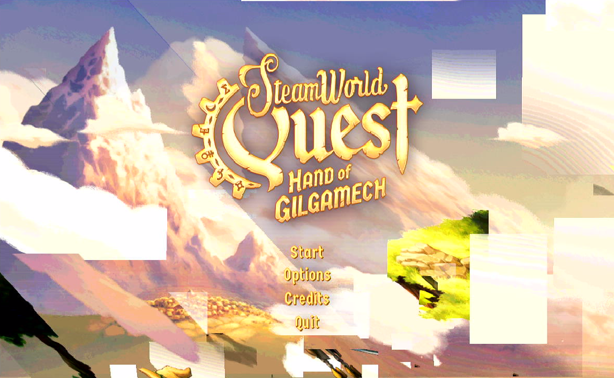
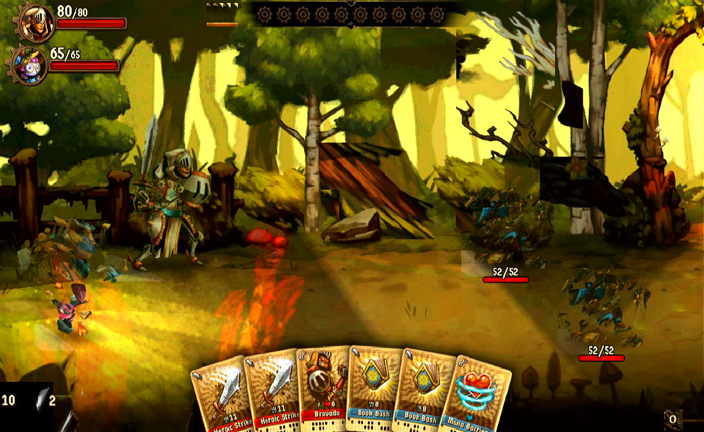
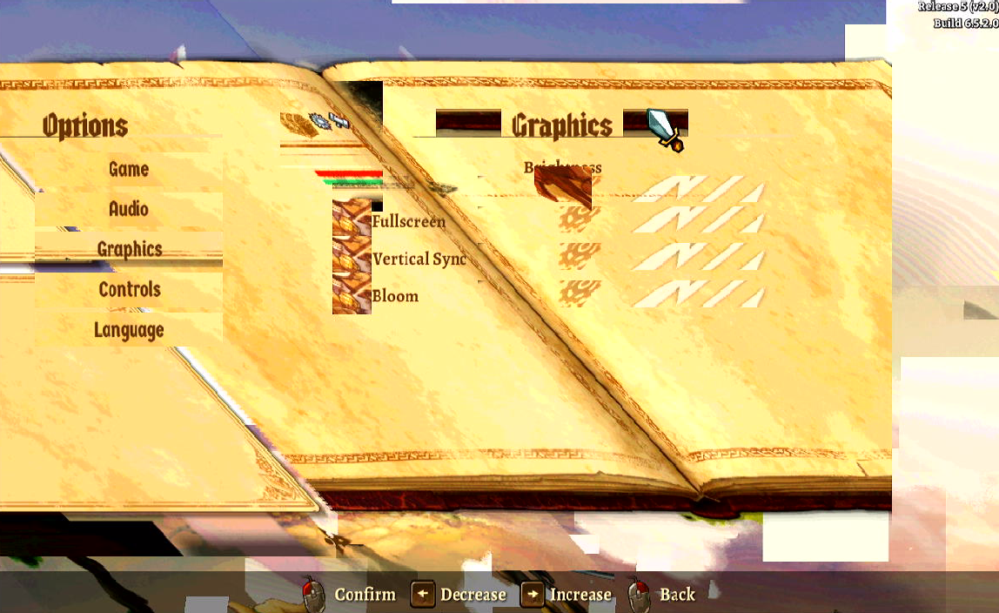

# SteamWorld Quest: Hand of Gilgamech

## Compatibility report

### Tested on

[Lichee Pi 4A](/docs/hardwares#lichee-pi-4a-soc-th1520)

### Box64 version (commit)

Box64 [ptitSeb/box64@69f49f79](https://github.com/ptitSeb/box64/tree/69f49f79)

### Game screenshot




### Game running log

```shell
[BOX64] Dynarec for rv64g_xtheadba_xtheadbb_xtheadbs_xtheadmempair_xtheadcondmov_xtheadmemidx_xthvector
[BOX64] Running on unknown riscv64 cpu with 4 cores, pagesize: 4096
[BOX64] Will use hardware counter measured at 3.0 MHz emulating 3.0 GHz
[BOX64] Using bash "/home/sipeed/ourstorybegin/box64/box64_/tests/box64-bash"
[BOX64] Box64 with Dynarec v0.3.3 69f49f79 built on Feb  6 2025 13:52:28
[BOX64] Didn't detect 48bits of address space, considering it's 39bits
[BOX64] Counted 41 Env var
[BOX64] BOX64 LIB PATH: 
[BOX64] BOX64 BIN PATH: ./:bin/:/home/sipeed/ourstorybegin/wine/wine-9.22-amd64-wow64/bin/:/usr/local/bin/:/usr/bin/:/bin/:/usr/local/games/:/usr/games/
[BOX64] Looking for ./start.sh
[BOX64] BOX64ENV: Variables overridden via env and/or RC file:
        BOX64_BASH=/home/sipeed/ourstorybegin/box64/box64_/tests/box64-bash
[BOX64] Not an ELF file (sign=#!/b)
[BOX64] Error: Reading elf header of /home/sipeed/games/GOG Games/SteamWorld Quest Hand of Gilgamech/start.sh, Try to launch using bash instead
[BOX64] Dynarec for rv64g_xtheadba_xtheadbb_xtheadbs_xtheadmempair_xtheadcondmov_xtheadmemidx_xthvector
[BOX64] Running on unknown riscv64 cpu with 4 cores, pagesize: 4096
[BOX64] Will use hardware counter measured at 3.0 MHz emulating 3.0 GHz
[BOX64] Using bash "/home/sipeed/ourstorybegin/box64/box64_/tests/box64-bash"
[BOX64] Box64 with Dynarec v0.3.3 69f49f79 built on Feb  6 2025 13:52:28
[BOX64] Didn't detect 48bits of address space, considering it's 39bits
[BOX64] Counted 41 Env var
[BOX64] BOX64 LIB PATH: 
[BOX64] BOX64 BIN PATH: ./:bin/:/home/sipeed/ourstorybegin/wine/wine-9.22-amd64-wow64/bin/:/usr/local/bin/:/usr/bin/:/bin/:/usr/local/games/:/usr/games/
[BOX64] Looking for /home/sipeed/ourstorybegin/box64/box64_/tests/box64-bash
[BOX64] Bash detected, disabling banner
[BOX64] BOX64ENV: Variables overridden via env and/or RC file:
        BOX64_BASH=/home/sipeed/ourstorybegin/box64/box64_/tests/box64-bash
[BOX64] argv[1]="./start.sh"
[BOX64] Rename process to "box64-bash"
[BOX64] Using native(wrapped) libtinfo.so.6
[BOX64] Using native(wrapped) libdl.so.2
[BOX64] Using native(wrapped) libc.so.6
[BOX64] Using native(wrapped) ld-linux-x86-64.so.2
[BOX64] Using native(wrapped) libpthread.so.0
[BOX64] Using native(wrapped) libutil.so.1
[BOX64] Using native(wrapped) librt.so.1
[BOX64] Using native(wrapped) libbsd.so.0
[BOX64] Warning, of_unconvert(...) left over 0x8000, converted 0x8000
Running SteamWorld Quest: Hand of Gilgamech
[BOX64] Dynarec for rv64g_xtheadba_xtheadbb_xtheadbs_xtheadmempair_xtheadcondmov_xtheadmemidx_xthvector
[BOX64] Running on unknown riscv64 cpu with 4 cores, pagesize: 4096
[BOX64] Will use hardware counter measured at 3.0 MHz emulating 3.0 GHz
[BOX64] Using bash "/home/sipeed/ourstorybegin/box64/box64_/tests/box64-bash"
[BOX64] Box64 with Dynarec v0.3.3 69f49f79 built on Feb  6 2025 13:52:28
[BOX64] Didn't detect 48bits of address space, considering it's 39bits
[BOX64] Counted 41 Env var
[BOX64] BOX64 LIB PATH: 
[BOX64] BOX64 BIN PATH: ./:bin/:/home/sipeed/ourstorybegin/wine/wine-9.22-amd64-wow64/bin/:/usr/local/bin/:/usr/bin/:/bin/:/usr/local/games/:/usr/games/
[BOX64] Looking for ./Quest
[BOX64] BOX64ENV: Variables overridden via env and/or RC file:
        BOX64_BASH=/home/sipeed/ourstorybegin/box64/box64_/tests/box64-bash
[BOX64] Rename process to "Quest"
[BOX64] Using native(wrapped) libopenal.so.1
[BOX64] Using native(wrapped) libpthread.so.0
[BOX64] Using native(wrapped) libSDL2-2.0.so.0
[BOX64] Using native(wrapped) libdl.so.2
[BOX64] Using native(wrapped) libm.so.6
[BOX64] Using native(wrapped) librt.so.1
LIBGL: Initialising gl4es
LIBGL: v1.1.7 built on Feb  8 2025 20:56:51
LIBGL: Using GLES 2.0 backend
LIBGL: loaded: libGLESv2.so
LIBGL: loaded: libEGL.so
LIBGL: Using GLES 2.0 backend
LIBGL: Hardware Full NPOT detected and used
LIBGL: Extension GL_EXT_blend_minmax  detected and used
LIBGL: Extension GL_EXT_draw_buffers  detected and used
LIBGL: FBO are in core, and so used
LIBGL: PointSprite are in core, and so used
LIBGL: CubeMap are in core, and so used
LIBGL: BlendColor is in core, and so used
LIBGL: Blend Subtract is in core, and so used
LIBGL: Blend Function and Equation Separation is in core, and so used
LIBGL: Texture Mirrored Repeat is in core, and so used
LIBGL: Extension GL_OES_mapbuffer  detected
LIBGL: Extension GL_OES_element_index_uint  detected and used
LIBGL: Extension GL_OES_packed_depth_stencil  detected and used
LIBGL: Extension GL_OES_depth24  detected and used
LIBGL: Extension GL_OES_rgb8_rgba8  detected and used
LIBGL: Extension GL_EXT_multi_draw_arrays  detected
LIBGL: Extension GL_EXT_texture_format_BGRA8888  detected and used
LIBGL: Extension GL_OES_depth_texture  detected and used
LIBGL: Extension GL_OES_texture_stencil8  detected and used
LIBGL: Extension GL_EXT_texture_rg  detected and used
LIBGL: Extension GL_OES_texture_float  detected and used
LIBGL: Extension GL_OES_texture_half_float  detected and used
LIBGL: Extension GL_EXT_color_buffer_float  detected and used
LIBGL: Extension GL_EXT_color_buffer_half_float  detected and used
LIBGL: Extension GL_OES_fragment_precision_high  detected and used
LIBGL: Extension GL_EXT_shader_texture_lod detected and used
3211.479176 (50610) PVR:(Error): DoCompileShader:  Failed to compile shader [ shadercompile.c:10866 ]
LIBGL: Max vertex attrib: 16
LIBGL: Extension GL_OES_standard_derivatives  detected and used
LIBGL: Extension GL_OES_get_program_binary  detected and used
LIBGL: Number of supported Program Binary Format: 1
LIBGL: Max texture size: 8192
LIBGL: Max Varying Vector: 15
LIBGL: Texture Units: 16/16 (hardware: 16), Max lights: 8, Max planes: 6
LIBGL: Max Color Attachments: 8 / Draw buffers: 8
LIBGL: Hardware vendor is Imagination Technologies
3211.480003 (50610) PVR:(Error): DoCompileShader:  Failed to compile shader [ shadercompile.c:10866 ]
3211.480272 (50610) PVR:(Error): DoCompileShader:  Failed to compile shader [ shadercompile.c:10866 ]
3211.480532 (50610) PVR:(Error): DoCompileShader:  Failed to compile shader [ shadercompile.c:10866 ]
LIBGL: sRGB surface supported
LIBGL: EGLImage from Pixmap supported
LIBGL: EGLImage to Texture2D supported
LIBGL: EGLImage to RenderBuffer supported
LIBGL: Targeting OpenGL 2.1
LIBGL: Not trying to batch small subsequent glDrawXXXX
LIBGL: Trying to use VBO
LIBGL: FBO workaround for using binded texture enabled
LIBGL: Force texture for Attachment color0 on FBO
LIBGL: Hack to trigger a SwapBuffers when a Full Framebuffer Blit on default FBO is done
LIBGL: glX Will try to recycle EGL Surface
LIBGL: Current folder is:/home/sipeed/games/GOG Games/SteamWorld Quest Hand of Gilgamech/game
LIBGL: Loaded a PSA with 21 Precompiled Programs
[BOX64] Using native(wrapped) libGL.so.1
[BOX64] Using emulated /usr/lib/box64-x86_64-linux-gnu/libstdc++.so.6
[BOX64] Using emulated /usr/lib/box64-x86_64-linux-gnu/libgcc_s.so.1
[BOX64] Using native(wrapped) libc.so.6
[BOX64] Using native(wrapped) ld-linux-x86-64.so.2
[BOX64] Using native(wrapped) libutil.so.1
[BOX64] Using native(wrapped) libbsd.so.0
           System.cpp:739    INFO: Log initialized.
            Thread.cpp:67    INFO: CPU Count: 4
           System.cpp:744    INFO: Date: 2025-01-22, time: 00:32:47
  SettingsHandler.cpp:281    INFO: Loaded 43 setting definitions in 0.036s
  SettingsHandler.cpp:281    INFO: Loaded 2 setting definitions in 0.001s
  SettingsHandler.cpp:121    INFO: Settings file not found.
             main.cpp:368    INFO: Created window, actual res 960;540, on display 0
             main.cpp:527    INFO: OpenGL Info:
OpenGL vendor: ptitSeb
OpenGL renderer: GL4ES wrapper
OpenGL version: 2.1 gl4es wrapper 1.1.7
GLSL version: 1.20 via gl4es
Max texture size: 8192
GL_ARB_framebuffer_object supported: Yes
GL_EXT_framebuffer_object supported: Yes
GL_EXT_texture_compression_s3tc supported: Yes
   AudioDefinition.cpp:90    INFO: Loaded 6 audio source groups.
  AudioDefinition.cpp:172    INFO: Loaded 530 audio cue definitions in 0.106s (1794 samples specified).
            OpenAL.cpp:57    INFO: Sucessfully opened OpenAL device: Default
        OGLShader.cpp:131    INFO: Successfully compiled and linked BasicEffect_ColorTexture.vert and BasicEffect_ColorTexture.frag. Attributes: 3, Uniforms: 2.
        OGLShader.cpp:131    INFO: Successfully compiled and linked BasicEffect_Color.vert and BasicEffect_Color.frag. Attributes: 2, Uniforms: 1.
   DefinitionTable.cpp:66    INFO: Loaded 0 (+ 1) TextSettingsDefinitions from 1 files in 0.031s
   DefinitionTable.cpp:66    INFO: Loaded 44 (+ 0) AchievementDefinitions from 1 files in 0.016s
   DefinitionTable.cpp:66    INFO: Loaded 14 (+ 0) AchievementDefinitions from 1 files in 0.005s
   DefinitionTable.cpp:66    INFO: Loaded 5 (+ 0) TextFormatDefinitions from 1 files in 0.027s
   DefinitionTable.cpp:66    INFO: Loaded 230 (+ 3) TextItemDefinitions from 1 files in 0.048s
   DefinitionTable.cpp:66    INFO: Loaded 25 (+ 0) RumbleDefinitions from 1 files in 0.008s
   DefinitionTable.cpp:66    INFO: Loaded 1 (+ 0) FrameworkConstants from 2 files in 0.013s
   DefinitionTable.cpp:66    INFO: Loaded 6 (+ 0) MouseCursors from 1 files in 0.004s
   DefinitionTable.cpp:66    INFO: Loaded 6 (+ 0) LanguageDefinitions from 1 files in 0.007s
   DefinitionTable.cpp:66    INFO: Loaded 31 (+ 0) AssetSets from 1 files in 0.012s
           FontSet.cpp:37    INFO: Loaded 34 fonts in set Fonts in 0.755s
LocalizationHandler.c:379    INFO: Trying to load language "en" at Language/en.csv
LocalizationHandler.c:401    INFO: - Success (uses space word wrap? 1)
           System.cpp:869    INFO: Randomizer seed: 69381579
AchievementSystem.cpp:176    INFO: Achievements progress file not found, probably first run.
 LeaderboardSystem.cpp:54    INFO: Loaded 0 leaderboards.
           System.cpp:895    INFO: All base systems initialized.
3215.055669 (50610) PVR:(Error): DoCompileShader:  Failed to compile shader [ shadercompile.c:10866 ]
        OGLShader.cpp:202   ERROR: Shaders/ColorTextureBlur.frag:
Compile failed.
ERROR: 0:64: '*' : Wrong operand types. No operation '*' exists that takes a left-hand operand of type 'uniform 2-component vector of float' and a right operand of type 'int' (and there is no acceptable conversion)
ERROR: 0:65: '*' : Wrong operand types. No operation '*' exists that takes a left-hand operand of type 'uniform 2-component vector of float' and a right operand of type 'int' (and there is no acceptable conversion)
ERROR: 0:67: '/=' : Wrong operand types. No operation '/=' exists that takes a left-hand operand of type '4-component vector of float' and a right operand of type 'const int' (and there is no acceptable conversion)
WARNING: 0:64: Calls to any function that may require a gradient calculation inside a conditional block may return undefined results
WARNING: 0:65: Calls to any function that may require a gradient calculation inside a conditional block may return undefined results
2 compilation warnings.

3 compilation errors. No code generated.


         OGLShader.cpp:51   ERROR: Failed to compile vertex shader.
3215.077767 (50610) PVR:(Error): DoCompileShader:  Failed to compile shader [ shadercompile.c:10866 ]
        OGLShader.cpp:202   ERROR: Shaders/ColorTextureRescaleColor.frag:
Compile failed.
ERROR: 0:24: '-' : Wrong operand types. No operation '-' exists that takes a left-hand operand of type 'const int' and a right operand of type 'uniform float' (and there is no acceptable conversion)
ERROR: 0:24: '/' : Wrong operand types. No operation '/' exists that takes a left-hand operand of type '3-component vector of float' and a right operand of type 'int' (and there is no acceptable conversion)
ERROR: 0:24: '-' : Wrong operand types. No operation '-' exists that takes a left-hand operand of type 'const int' and a right operand of type 'uniform float' (and there is no acceptable conversion)
ERROR: 0:24: '/' : Wrong operand types. No operation '/' exists that takes a left-hand operand of type '3-component vector of float' and a right operand of type 'int' (and there is no acceptable conversion)
4 compilation errors. No code generated.


         OGLShader.cpp:51   ERROR: Failed to compile vertex shader.
3215.105634 (50610) PVR:(Error): DoCompileShader:  Failed to compile shader [ shadercompile.c:10866 ]
        OGLShader.cpp:202   ERROR: Shaders/ColorTextureBloomBlend.frag:
Compile failed.
ERROR: 0:70: '+' : Wrong operand types. No operation '+' exists that takes a left-hand operand of type 'const int' and a right operand of type 'uniform float' (and there is no acceptable conversion)
ERROR: 0:70: '*' : Wrong operand types. No operation '*' exists that takes a left-hand operand of type '4-component vector of float' and a right operand of type 'int' (and there is no acceptable conversion)
ERROR: 0:70: '-' : Wrong operand types. No operation '-' exists that takes a left-hand operand of type 'const int' and a right operand of type '4-component vector of float' (and there is no acceptable conversion)
ERROR: 0:70: '*' : Wrong operand types. No operation '*' exists that takes a left-hand operand of type 'int' and a right operand of type 'uniform float' (and there is no acceptable conversion)
ERROR: 0:70: '+' : Wrong operand types. No operation '+' exists that takes a left-hand operand of type 'uniform float' and a right operand of type 'int' (and there is no acceptable conversion)
5 compilation errors. No code generated.


         OGLShader.cpp:51   ERROR: Failed to compile vertex shader.
        OGLShader.cpp:131    INFO: Successfully compiled and linked BasicEffect_ColorTexture.vert and BasicEffect_ColorTextureUVClamp.frag. Attributes: 3, Uniforms: 3.
libpng warning: iCCP: known incorrect sRGB profile
libpng warning: iCCP: known incorrect sRGB profile
libpng warning: iCCP: known incorrect sRGB profile
libpng warning: iCCP: known incorrect sRGB profile
libpng warning: iCCP: known incorrect sRGB profile
libpng warning: iCCP: known incorrect sRGB profile
        OGLShader.cpp:131    INFO: Successfully compiled and linked BasicEffect_ColorTexture.vert and ColorTextureGamma.frag. Attributes: 3, Uniforms: 3.
             main.cpp:607    INFO: Done...
        ConfigFile.cpp:78    INFO: Loading config from controls.cfg
        ConfigFile.cpp:82    INFO: Could not load config, reverting to default.
        ConfigFile.cpp:78    INFO: Loading config from gamepads.cfg
        ConfigFile.cpp:82    INFO: Could not load config, reverting to default.
Stubbed glGetTexLevelParameteriv(GL_TEXTURE_2D, 0, 0x8067, 0x3fd0c75860)
Stubbed glGetTexLevelParameteriv(GL_TEXTURE_2D, 0, 0x8067, 0x3fd0c75860)
Stubbed glGetTexLevelParameteriv(GL_TEXTURE_2D, 0, 0x8067, 0x3fd0c75860)
Stubbed glGetTexLevelParameteriv(GL_TEXTURE_2D, 0, 0x8067, 0x3fd0c75860)
Stubbed glGetTexLevelParameteriv(GL_TEXTURE_2D, 0, 0x8067, 0x3fd0c75860)
Stubbed glGetTexLevelParameteriv(GL_TEXTURE_2D, 0, 0x8067, 0x3fd0c75860)
Stubbed glGetTexLevelParameteriv(GL_TEXTURE_2D, 0, 0x8067, 0x3fd0c75860)
Stubbed glGetTexLevelParameteriv(GL_TEXTURE_2D, 0, 0x8067, 0x3fd0c75860)
Stubbed glGetTexLevelParameteriv(GL_TEXTURE_2D, 0, 0x8067, 0x3fd0c75860)
Stubbed glGetTexLevelParameteriv(GL_TEXTURE_2D, 0, 0x8067, 0x3fd0c75860)
Stubbed glGetTexLevelParameteriv(GL_TEXTURE_2D, 0, 0x8067, 0x3fd0c75860)
Stubbed glGetTexLevelParameteriv(GL_TEXTURE_2D, 0, 0x8067, 0x3fd0c75860)
Stubbed glGetTexLevelParameteriv(GL_TEXTURE_2D, 0, 0x8067, 0x3fd0c75860)
Stubbed glGetTexLevelParameteriv(GL_TEXTURE_2D, 0, 0x8067, 0x3fd0c75860)
Stubbed glGetTexLevelParameteriv(GL_TEXTURE_2D, 0, 0x8067, 0x3fd0c75860)
Stubbed glGetTexLevelParameteriv(GL_TEXTURE_2D, 0, 0x8067, 0x3fd0c75860)
Stubbed glGetTexLevelParameteriv(GL_TEXTURE_2D, 0, 0x8067, 0x3fd0c75860)
Stubbed glGetTexLevelParameteriv(GL_TEXTURE_2D, 0, 0x8067, 0x3fd0c75860)
Stubbed glGetTexLevelParameteriv(GL_TEXTURE_2D, 0, 0x8067, 0x3fd0c75860)
Stubbed glGetTexLevelParameteriv(GL_TEXTURE_2D, 0, 0x8067, 0x3fd0c75860)
Stubbed glGetTexLevelParameteriv(GL_TEXTURE_2D, 0, 0x8067, 0x3fd0c75860)
Stubbed glGetTexLevelParameteriv(GL_TEXTURE_2D, 0, 0x8067, 0x3fd0c75860)
Stubbed glGetTexLevelParameteriv(GL_TEXTURE_2D, 0, 0x8067, 0x3fd0c75860)
Stubbed glGetTexLevelParameteriv(GL_TEXTURE_2D, 0, 0x8067, 0x3fd0c75860)
Stubbed glGetTexLevelParameteriv(GL_TEXTURE_2D, 0, 0x8067, 0x3fd0c75860)
Stubbed glGetTexLevelParameteriv(GL_TEXTURE_2D, 0, 0x8067, 0x3fd0c75860)
Stubbed glGetTexLevelParameteriv(GL_TEXTURE_2D, 0, 0x8067, 0x3fd0c75860)
Stubbed glGetTexLevelParameteriv(GL_TEXTURE_2D, 0, 0x8067, 0x3fd0c75860)
Stubbed glGetTexLevelParameteriv(GL_TEXTURE_2D, 0, 0x8067, 0x3fd0c75860)
Stubbed glGetTexLevelParameteriv(GL_TEXTURE_2D, 0, 0x8067, 0x3fd0c75860)
Stubbed glGetTexLevelParameteriv(GL_TEXTURE_2D, 0, 0x8067, 0x3fd0c75860)
Stubbed glGetTexLevelParameteriv(GL_TEXTURE_2D, 0, 0x8067, 0x3fd0c75860)
Stubbed glGetTexLevelParameteriv(GL_TEXTURE_2D, 0, 0x8067, 0x3fd0c75860)
Stubbed glGetTexLevelParameteriv(GL_TEXTURE_2D, 0, 0x8067, 0x3fd0c75860)
Stubbed glGetTexLevelParameteriv(GL_TEXTURE_2D, 0, 0x8067, 0x3fd0c75860)
Stubbed glGetTexLevelParameteriv(GL_TEXTURE_2D, 0, 0x8067, 0x3fd0c75860)
           System.cpp:664    INFO: Entering new system state N3imf10LogosStateE
      MoviePlayer.cpp:313    INFO: VP9
      MoviePlayer.cpp:355    INFO: A_VORBIS
        OGLShader.cpp:131    INFO: Successfully compiled and linked BasicEffect_ColorTexture.vert and ColorYUVTextures.frag. Attributes: 3, Uniforms: 4.
      MoviePlayer.cpp:313    INFO: VP9
      MoviePlayer.cpp:355    INFO: A_VORBIS
      MoviePlayer.cpp:869 WARNING: Audio not playing, increase amount of buffering
Stubbed glGetTexLevelParameteriv(GL_TEXTURE_2D, 0, 0x8067, 0x3fd0c75860)
           System.cpp:664    INFO: Entering new system state N3imf13MainMenuStateE
   DefinitionTable.cpp:66    INFO: Loaded 21 (+ 3) ScreenShakes from 1 files in 0.031s
   DefinitionTable.cpp:66    INFO: Loaded 203 (+ 7) WindObjectDefinitions from 1 files in 0.015s
   DefinitionTable.cpp:66    INFO: Loaded 10 (+ 0) Colosseum from 1 files in 0.033s
   DefinitionTable.cpp:66    INFO: Loaded 459 (+ 10) Cards from 3 files in 0.169s
   DefinitionTable.cpp:66    INFO: Loaded 21 (+ 0) Outsets from 1 files in 0.059s
   DefinitionTable.cpp:66    INFO: Loaded 115 (+ 6) Equipment from 1 files in 0.027s
   DefinitionTable.cpp:66    INFO: Loaded 608 (+ 0) SpecialEffects from 1 files in 0.043s
   DefinitionTable.cpp:66    INFO: Loaded 1 (+ 0) ExperienceDefinitions from 1 files in 0.016s
   DefinitionTable.cpp:66    INFO: Loaded 335 (+ 32) Scenarios from 1 files in 0.045s
   DefinitionTable.cpp:66    INFO: Loaded 31 (+ 0) EnvironmentDefinitions from 1 files in 0.08s
   DefinitionTable.cpp:66    INFO: Loaded 607 (+ 0) ParticleEffectDefinitions from 1 files in 0.025s
   DefinitionTable.cpp:66    INFO: Loaded 5 (+ 1) TitleScenes from 1 files in 0.018s
   DefinitionTable.cpp:66    INFO: Loaded 36 (+ 7) BreakableDecalDefinitions from 1 files in 0.011s
   DefinitionTable.cpp:66    INFO: Loaded 1 (+ 0) Constants from 1 files in 0.022s
   DefinitionTable.cpp:66    INFO: Loaded 34 (+ 0) JukeboxSongs from 1 files in 0.004s
   DefinitionTable.cpp:66    INFO: Loaded 28 (+ 0) Tutorials from 2 files in 0.015s
   DefinitionTable.cpp:66    INFO: Loaded 10 (+ 2) Materials from 1 files in 0.003s
   DefinitionTable.cpp:66    INFO: Loaded 20 (+ 5) Areas from 1 files in 0.027s
   DefinitionTable.cpp:66    INFO: Loaded 4 (+ 0) Difficulties from 1 files in 0.005s
   DefinitionTable.cpp:66    INFO: Loaded 151 (+ 0) Flags from 1 files in 0.008s
    HeroDefinition.cpp:43    INFO: BASE levelup table:
    HeroDefinition.cpp:43    INFO: red levelup table:
    HeroDefinition.cpp:43    INFO: blue levelup table:
    HeroDefinition.cpp:43    INFO: green levelup table:
    HeroDefinition.cpp:43    INFO: yellow levelup table:
    HeroDefinition.cpp:43    INFO: yellow_maskless levelup table:
    HeroDefinition.cpp:43    INFO: purple levelup table:
   DefinitionTable.cpp:66    INFO: Loaded 6 (+ 1) Heroes from 1 files in 0.065s
   DefinitionTable.cpp:66    INFO: Loaded 7 (+ 0) Consumables from 1 files in 0.006s
Stubbed glGetTexLevelParameteriv(GL_TEXTURE_2D, 0, 0x8067, 0x3fd0c75860)
Stubbed glGetTexLevelParameteriv(GL_TEXTURE_2D, 0, 0x8067, 0x3fd0c75860)
Stubbed glGetTexLevelParameteriv(GL_TEXTURE_2D, 0, 0x8067, 0x3fd0c75860)
Stubbed glGetTexLevelParameteriv(GL_TEXTURE_2D, 0, 0x8067, 0x3fd0c75860)
Stubbed glGetTexLevelParameteriv(GL_TEXTURE_2D, 0, 0x8067, 0x3fd0c75860)
Stubbed glGetTexLevelParameteriv(GL_TEXTURE_2D, 0, 0x8067, 0x3fd0c75860)
Stubbed glGetTexLevelParameteriv(GL_TEXTURE_2D, 0, 0x8067, 0x3fd0c75860)
ParticleDefinitionTab:115    INFO: Loaded particle table 'Effects/*.pe' with 644 effects from 4 files in 2.033s
Stubbed glGetTexLevelParameteriv(GL_TEXTURE_2D, 0, 0x8067, 0x3fd0c75860)
Stubbed glGetTexLevelParameteriv(GL_TEXTURE_2D, 0, 0x8067, 0x3fd0c75860)
Stubbed glGetTexLevelParameteriv(GL_TEXTURE_2D, 0, 0x8067, 0x3fd0c75860)
Stubbed glGetTexLevelParameteriv(GL_TEXTURE_2D, 0, 0x8067, 0x3fd0c75860)
Stubbed glGetTexLevelParameteriv(GL_TEXTURE_2D, 0, 0x8067, 0x3fd0c75860)
Stubbed glGetTexLevelParameteriv(GL_TEXTURE_2D, 0, 0x8067, 0x3fd0c75860)
Stubbed glGetTexLevelParameteriv(GL_TEXTURE_2D, 0, 0x8067, 0x3fd0c75860)
Stubbed glGetTexLevelParameteriv(GL_TEXTURE_2D, 0, 0x8067, 0x3fd0c75860)
Stubbed glGetTexLevelParameteriv(GL_TEXTURE_2D, 0, 0x8067, 0x3fd0c75860)
Stubbed glGetTexLevelParameteriv(GL_TEXTURE_2D, 0, 0x8067, 0x3fd0c75860)
Stubbed glGetTexLevelParameteriv(GL_TEXTURE_2D, 0, 0x8067, 0x3fd0c75860)
Stubbed glGetTexLevelParameteriv(GL_TEXTURE_2D, 0, 0x8067, 0x3fd0c75860)
Stubbed glGetTexLevelParameteriv(GL_TEXTURE_2D, 0, 0x8067, 0x3fd0c75860)
         JukeboxUI.cpp:55    INFO: title_screen_loop
         JukeboxUI.cpp:55    INFO: chapter_loop
         JukeboxUI.cpp:55    INFO: forest_loop
         JukeboxUI.cpp:55    INFO: regular_battle_loop
         JukeboxUI.cpp:55    INFO: boss_battle_loop
         JukeboxUI.cpp:55    INFO: world_map
         JukeboxUI.cpp:55    INFO: village_tense_loop
         JukeboxUI.cpp:55    INFO: village_loop
         JukeboxUI.cpp:55    INFO: merchant_loop
         JukeboxUI.cpp:55    INFO: playful_chat
         JukeboxUI.cpp:55    INFO: preparation_chat
         JukeboxUI.cpp:55    INFO: cave_loop
         JukeboxUI.cpp:55    INFO: concerned_chat
         JukeboxUI.cpp:55    INFO: alchemy_forest_loop
         JukeboxUI.cpp:55    INFO: innocent_chat
         JukeboxUI.cpp:55    INFO: alchemy_battle_loop
         JukeboxUI.cpp:55    INFO: alchemy_college_loop
         JukeboxUI.cpp:55    INFO: alchemy_boss_battle_loop
         JukeboxUI.cpp:55    INFO: haunted_forest_loop
         JukeboxUI.cpp:55    INFO: spooky_battle_loop
         JukeboxUI.cpp:55    INFO: spooky_loop
         JukeboxUI.cpp:55    INFO: cursed_boss_battle_loop
         JukeboxUI.cpp:55    INFO: necronomicog_loop
         JukeboxUI.cpp:55    INFO: gilgamech_chat
         JukeboxUI.cpp:55    INFO: sad_chat
         JukeboxUI.cpp:55    INFO: mountain_loop
         JukeboxUI.cpp:55    INFO: gilga_loop
         JukeboxUI.cpp:55    INFO: gilgafortress_battle_loop
         JukeboxUI.cpp:55    INFO: gilga_a_battle_loop
         JukeboxUI.cpp:55    INFO: behemoth_01_loop
         JukeboxUI.cpp:55    INFO: behemoth_02_loop
         JukeboxUI.cpp:55    INFO: behemoth_03_loop
         JukeboxUI.cpp:55    INFO: conclusion_loop
         JukeboxUI.cpp:55    INFO: credits_roll
  TilemapGenerator.cpp:83    INFO: Loading tilemap default...
        OGLShader.cpp:131    INFO: Successfully compiled and linked LightOverlayEffect2.vert and LightOverlayEffect2.frag. Attributes: 3, Uniforms: 5.
        OGLShader.cpp:131    INFO: Successfully compiled and linked SkinnedCharacterLightOverlay2.vert and LightOverlayEffect2.frag. Attributes: 4, Uniforms: 7.
        OGLShader.cpp:131    INFO: Successfully compiled and linked SkinnedCharacterShader.vert and ColorTextureOverbright.frag. Attributes: 4, Uniforms: 5.
        OGLShader.cpp:131    INFO: Successfully compiled and linked SkinnedCharacterLightOverlay2.vert and LightOverlayEffect2.frag. Attributes: 4, Uniforms: 8.
        OGLShader.cpp:131    INFO: Successfully compiled and linked SkinnedCharacterShader.vert and BasicEffect_ColorTexture.frag. Attributes: 4, Uniforms: 4.
      MusicPlayer.cpp:130    INFO: Loading music: Ambience/Ambience_IntroForestWind
      MusicPlayer.cpp:145    INFO: Playing music: Ambience/Ambience_IntroForestWind
      MusicPlayer.cpp:130    INFO: Loading music: title_screen_loop
      MusicPlayer.cpp:145    INFO: Playing music: title_screen_loop
   OALMusicDriver.cpp:123    INFO: Open new music: Audio/Music/Ambience/Ambience_IntroForestWind
   OALMusicDriver.cpp:123    INFO: Open new music: Audio/Music/title_screen_loop
Stubbed glGetTexLevelParameteriv(GL_TEXTURE_2D, 0, 0x8067, 0x3fd0c75860)
Stubbed glGetTexLevelParameteriv(GL_TEXTURE_2D, 0, 0x8067, 0x3fd0c75860)
Stubbed glGetTexLevelParameteriv(GL_TEXTURE_2D, 0, 0x8067, 0x3fd0c75860)
    MainMenuState.cpp:346    INFO: Starting new game with difficulty=easy
      MusicPlayer.cpp:114    INFO: Fading out music: Ambience/Ambience_IntroForestWind
      MusicPlayer.cpp:114    INFO: Fading out music: title_screen_loop
           System.cpp:664    INFO: Entering new system state N3imf14AreaIntroStateE
      MusicPlayer.cpp:119    INFO: Stopping music: title_screen_loop
      MusicPlayer.cpp:119    INFO: Stopping music: Ambience/Ambience_IntroForestWind
      MoviePlayer.cpp:313    INFO: VP9
      MoviePlayer.cpp:355    INFO: A_VORBIS
Stubbed glGetTexLevelParameteriv(GL_TEXTURE_2D, 0, 0x8067, 0x3fd0c75860)
Stubbed glGetTexLevelParameteriv(GL_TEXTURE_2D, 0, 0x8067, 0x3fd0c75860)
      MoviePlayer.cpp:869 WARNING: Audio not playing, increase amount of buffering
      MoviePlayer.cpp:869 WARNING: Audio not playing, increase amount of buffering
      MoviePlayer.cpp:869 WARNING: Audio not playing, increase amount of buffering
      MoviePlayer.cpp:869 WARNING: Audio not playing, increase amount of buffering
      MoviePlayer.cpp:869 WARNING: Audio not playing, increase amount of buffering
      MoviePlayer.cpp:869 WARNING: Audio not playing, increase amount of buffering
      MoviePlayer.cpp:869 WARNING: Audio not playing, increase amount of buffering
      MoviePlayer.cpp:869 WARNING: Audio not playing, increase amount of buffering
      MusicPlayer.cpp:130    INFO: Loading music: chapter_loop
      MusicPlayer.cpp:145    INFO: Playing music: chapter_loop
   OALMusicDriver.cpp:123    INFO: Open new music: Audio/Music/chapter_loop
      MusicPlayer.cpp:130    INFO: Loading music: Ambience/Ambience_Forest
      MusicPlayer.cpp:145    INFO: Playing music: Ambience/Ambience_Forest
   OALMusicDriver.cpp:123    INFO: Open new music: Audio/Music/Ambience/Ambience_Forest
      MusicPlayer.cpp:130    INFO: Loading music: Intro/Narrator_Chapter1_Title
      MusicPlayer.cpp:145    INFO: Playing music: Intro/Narrator_Chapter1_Title
   OALMusicDriver.cpp:123    INFO: Open new music: Audio/Music/Intro/Narrator_Chapter1_Title
      MusicPlayer.cpp:114    INFO: Fading out music: Intro/Narrator_Chapter1_Title
   AreaIntroState.cpp:275    INFO: Reset area experience counter
           System.cpp:664    INFO: Entering new system state N3imf13ScenarioStateE
   DefinitionTable.cpp:66    INFO: Loaded 18 (+ 0) Animations from 2 files in 0.118s
   DefinitionTable.cpp:66    INFO: Loaded 0 (+ 0) EntityDefinitions from 1 files in 0.002s
      MusicPlayer.cpp:119    INFO: Stopping music: Intro/Narrator_Chapter1_Title
   DefinitionTable.cpp:66    INFO: Loaded 1 (+ 0) WorldMaps from 1 files in 0.004s
   DefinitionTable.cpp:66    INFO: Loaded 18 (+ 1) ShopDefinitions from 1 files in 0.013s
   DefinitionTable.cpp:66    INFO: Loaded 1 (+ 0) PlotFlagTranslations from 1 files in 0.006s
   DefinitionTable.cpp:66    INFO: Loaded 3 (+ 1) VisualCards from 1 files in 0.05s
   DefinitionTable.cpp:66    INFO: Loaded 530 (+ 0) /Sounds/AudioCues from 1 files in 0.024s
   DefinitionTable.cpp:66    INFO: Loaded 134 (+ 14) Monsters from 1 files in 0.108s
   DefinitionTable.cpp:66    INFO: Loaded 49 (+ 1) SpeakerDefinitions from 1 files in 0.022s
   DefinitionTable.cpp:66    INFO: Loaded 229 (+ 21) Encounters from 1 files in 0.033s
   DefinitionTable.cpp:66    INFO: Loaded 352 (+ 0) Conversations from 1 files in 0.155s
   DefinitionTable.cpp:66    INFO: Loaded 229 (+ 0) LootDefinitions from 1 files in 0.031s
   DefinitionTable.cpp:66    INFO: Loaded 306 (+ 3) ModifierDefinitions from 1 files in 0.107s
   DefinitionTable.cpp:66    INFO: Loaded 28 (+ 3) WorldTextDefinitions from 1 files in 0.012s
   DefinitionTable.cpp:66    INFO: Loaded 18 (+ 0) Projectiles from 1 files in 0.006s
   DefinitionTable.cpp:66    INFO: Loaded 28 (+ 0) UnitFormations from 1 files in 0.006s
   DefinitionTable.cpp:66    INFO: Loaded 74 (+ 8) Interactables from 1 files in 0.025s
Stubbed glGetTexLevelParameteriv(GL_TEXTURE_2D, 0, 0x8067, 0x3fd0c75860)
Stubbed glGetTexLevelParameteriv(GL_TEXTURE_2D, 0, 0x8067, 0x3fd0c75860)
Stubbed glGetTexLevelParameteriv(GL_TEXTURE_2D, 0, 0x8067, 0x3fd0c75860)
Stubbed glGetTexLevelParameteriv(GL_TEXTURE_2D, 0, 0x8067, 0x3fd0c75860)
Stubbed glGetTexLevelParameteriv(GL_TEXTURE_2D, 0, 0x8067, 0x3fd0c75860)
Stubbed glGetTexLevelParameteriv(GL_TEXTURE_2D, 0, 0x8067, 0x3fd0c75860)
Stubbed glGetTexLevelParameteriv(GL_TEXTURE_2D, 0, 0x8067, 0x3fd0c75860)
Stubbed glGetTexLevelParameteriv(GL_TEXTURE_2D, 0, 0x8067, 0x3fd0c75860)
  TilemapGenerator.cpp:83    INFO: Loading tilemap 01_mushroom...
Stubbed glGetTexLevelParameteriv(GL_TEXTURE_2D, 0, 0x8067, 0x3fd0c75860)
Stubbed glGetTexLevelParameteriv(GL_TEXTURE_2D, 0, 0x8067, 0x3fd0c75860)
Stubbed glGetTexLevelParameteriv(GL_TEXTURE_2D, 0, 0x8067, 0x3fd0c75860)
Stubbed glGetTexLevelParameteriv(GL_TEXTURE_2D, 0, 0x8067, 0x3fd0c75860)
Stubbed glGetTexLevelParameteriv(GL_TEXTURE_2D, 0, 0x8067, 0x3fd0c75860)
Stubbed glGetTexLevelParameteriv(GL_TEXTURE_2D, 0, 0x8067, 0x3fd0c75860)
Stubbed glGetTexLevelParameteriv(GL_TEXTURE_2D, 0, 0x8067, 0x3fd0c75860)
Stubbed glGetTexLevelParameteriv(GL_TEXTURE_2D, 0, 0x8067, 0x3fd0c75860)
Stubbed glGetTexLevelParameteriv(GL_TEXTURE_2D, 0, 0x8067, 0x3fd0c75860)
Stubbed glGetTexLevelParameteriv(GL_TEXTURE_2D, 0, 0x8067, 0x3fd0c75860)
Stubbed glGetTexLevelParameteriv(GL_TEXTURE_2D, 0, 0x8067, 0x3fd0c75860)
Stubbed glGetTexLevelParameteriv(GL_TEXTURE_2D, 0, 0x8067, 0x3fd0c75860)
Stubbed glGetTexLevelParameteriv(GL_TEXTURE_2D, 0, 0x8067, 0x3fd0c75860)
Stubbed glGetTexLevelParameteriv(GL_TEXTURE_2D, 0, 0x8067, 0x3fd0c75860)
Stubbed glGetTexLevelParameteriv(GL_TEXTURE_2D, 0, 0x8067, 0x3fd0c75860)
Stubbed glGetTexLevelParameteriv(GL_TEXTURE_2D, 0, 0x8067, 0x3fd0c75860)
Stubbed glGetTexLevelParameteriv(GL_TEXTURE_2D, 0, 0x8067, 0x3fd0c75860)
Stubbed glGetTexLevelParameteriv(GL_TEXTURE_2D, 0, 0x8067, 0x3fd0c75860)
Stubbed glGetTexLevelParameteriv(GL_TEXTURE_2D, 0, 0x8067, 0x3fd0c75860)
Stubbed glGetTexLevelParameteriv(GL_TEXTURE_2D, 0, 0x8067, 0x3fd0c75860)
Stubbed glGetTexLevelParameteriv(GL_TEXTURE_2D, 0, 0x8067, 0x3fd0c75860)
Stubbed glGetTexLevelParameteriv(GL_TEXTURE_2D, 0, 0x8067, 0x3fd0c75860)
Stubbed glGetTexLevelParameteriv(GL_TEXTURE_2D, 0, 0x8067, 0x3fd0c75860)
Stubbed glGetTexLevelParameteriv(GL_TEXTURE_2D, 0, 0x8067, 0x3fd0c75860)
Stubbed glGetTexLevelParameteriv(GL_TEXTURE_2D, 0, 0x8067, 0x3fd0c75860)
Stubbed glGetTexLevelParameteriv(GL_TEXTURE_2D, 0, 0x8067, 0x3fd0c75860)
Stubbed glGetTexLevelParameteriv(GL_TEXTURE_2D, 0, 0x8067, 0x3fd0c75860)
Stubbed glGetTexLevelParameteriv(GL_TEXTURE_2D, 0, 0x8067, 0x3fd0c75860)
Stubbed glGetTexLevelParameteriv(GL_TEXTURE_2D, 0, 0x8067, 0x3fd0c75860)
Stubbed glGetTexLevelParameteriv(GL_TEXTURE_2D, 0, 0x8067, 0x3fd0c75860)
Stubbed glGetTexLevelParameteriv(GL_TEXTURE_2D, 0, 0x8067, 0x3fd0c75860)
Stubbed glGetTexLevelParameteriv(GL_TEXTURE_2D, 0, 0x8067, 0x3fd0c75860)
Stubbed glGetTexLevelParameteriv(GL_TEXTURE_2D, 0, 0x8067, 0x3fd0c75860)
Stubbed glGetTexLevelParameteriv(GL_TEXTURE_2D, 0, 0x8067, 0x3fd0c75860)
Stubbed glGetTexLevelParameteriv(GL_TEXTURE_2D, 0, 0x8067, 0x3fd0c75860)
Stubbed glGetTexLevelParameteriv(GL_TEXTURE_2D, 0, 0x8067, 0x3fd0c75860)
Stubbed glGetTexLevelParameteriv(GL_TEXTURE_2D, 0, 0x8067, 0x3fd0c75860)
Stubbed glGetTexLevelParameteriv(GL_TEXTURE_2D, 0, 0x8067, 0x3fd0c75860)
Stubbed glGetTexLevelParameteriv(GL_TEXTURE_2D, 0, 0x8067, 0x3fd0c75860)
Stubbed glGetTexLevelParameteriv(GL_TEXTURE_2D, 0, 0x8067, 0x3fd0c75860)
Stubbed glGetTexLevelParameteriv(GL_TEXTURE_2D, 0, 0x8067, 0x3fd0c75860)
Stubbed glGetTexLevelParameteriv(GL_TEXTURE_2D, 0, 0x8067, 0x3fd0c75860)
Stubbed glGetTexLevelParameteriv(GL_TEXTURE_2D, 0, 0x8067, 0x3fd0c75860)
Stubbed glGetTexLevelParameteriv(GL_TEXTURE_2D, 0, 0x8067, 0x3fd0c75860)
Stubbed glGetTexLevelParameteriv(GL_TEXTURE_2D, 0, 0x8067, 0x3fd0c75860)
Stubbed glGetTexLevelParameteriv(GL_TEXTURE_2D, 0, 0x8067, 0x3fd0c75860)
Stubbed glGetTexLevelParameteriv(GL_TEXTURE_2D, 0, 0x8067, 0x3fd0c75860)
Stubbed glGetTexLevelParameteriv(GL_TEXTURE_2D, 0, 0x8067, 0x3fd0c75860)
Stubbed glGetTexLevelParameteriv(GL_TEXTURE_2D, 0, 0x8067, 0x3fd0c75860)
Stubbed glGetTexLevelParameteriv(GL_TEXTURE_2D, 0, 0x8067, 0x3fd0c75860)
Stubbed glGetTexLevelParameteriv(GL_TEXTURE_2D, 0, 0x8067, 0x3fd0c75860)
Stubbed glGetTexLevelParameteriv(GL_TEXTURE_2D, 0, 0x8067, 0x3fd0c75860)
Stubbed glGetTexLevelParameteriv(GL_TEXTURE_2D, 0, 0x8067, 0x3fd0c75860)
Stubbed glGetTexLevelParameteriv(GL_TEXTURE_2D, 0, 0x8067, 0x3fd0c75860)
Stubbed glGetTexLevelParameteriv(GL_TEXTURE_2D, 0, 0x8067, 0x3fd0c75860)
Stubbed glGetTexLevelParameteriv(GL_TEXTURE_2D, 0, 0x8067, 0x3fd0c75860)
Stubbed glGetTexLevelParameteriv(GL_TEXTURE_2D, 0, 0x8067, 0x3fd0c75860)
Stubbed glGetTexLevelParameteriv(GL_TEXTURE_2D, 0, 0x8067, 0x3fd0c75860)
Stubbed glGetTexLevelParameteriv(GL_TEXTURE_2D, 0, 0x8067, 0x3fd0c75860)
Stubbed glGetTexLevelParameteriv(GL_TEXTURE_2D, 0, 0x8067, 0x3fd0c75860)
Stubbed glGetTexLevelParameteriv(GL_TEXTURE_2D, 0, 0x8067, 0x3fd0c75860)
Stubbed glGetTexLevelParameteriv(GL_TEXTURE_2D, 0, 0x8067, 0x3fd0c75860)
Stubbed glGetTexLevelParameteriv(GL_TEXTURE_2D, 0, 0x8067, 0x3fd0c75860)
Stubbed glGetTexLevelParameteriv(GL_TEXTURE_2D, 0, 0x8067, 0x3fd0c75860)
Stubbed glGetTexLevelParameteriv(GL_TEXTURE_2D, 0, 0x8067, 0x3fd0c75860)
Stubbed glGetTexLevelParameteriv(GL_TEXTURE_2D, 0, 0x8067, 0x3fd0c75860)
Stubbed glGetTexLevelParameteriv(GL_TEXTURE_2D, 0, 0x8067, 0x3fd0c75860)
Stubbed glGetTexLevelParameteriv(GL_TEXTURE_2D, 0, 0x8067, 0x3fd0c75860)
Stubbed glGetTexLevelParameteriv(GL_TEXTURE_2D, 0, 0x8067, 0x3fd0c75860)
Stubbed glGetTexLevelParameteriv(GL_TEXTURE_2D, 0, 0x8067, 0x3fd0c75860)
Stubbed glGetTexLevelParameteriv(GL_TEXTURE_2D, 0, 0x8067, 0x3fd0c75860)
Stubbed glGetTexLevelParameteriv(GL_TEXTURE_2D, 0, 0x8067, 0x3fd0c75860)
Stubbed glGetTexLevelParameteriv(GL_TEXTURE_2D, 0, 0x8067, 0x3fd0c75860)
Stubbed glGetTexLevelParameteriv(GL_TEXTURE_2D, 0, 0x8067, 0x3fd0c75860)
Stubbed glGetTexLevelParameteriv(GL_TEXTURE_2D, 0, 0x8067, 0x3fd0c75860)
Stubbed glGetTexLevelParameteriv(GL_TEXTURE_2D, 0, 0x8067, 0x3fd0c75860)
Stubbed glGetTexLevelParameteriv(GL_TEXTURE_2D, 0, 0x8067, 0x3fd0c75860)
Stubbed glGetTexLevelParameteriv(GL_TEXTURE_2D, 0, 0x8067, 0x3fd0c75860)
Stubbed glGetTexLevelParameteriv(GL_TEXTURE_2D, 0, 0x8067, 0x3fd0c75860)
Stubbed glGetTexLevelParameteriv(GL_TEXTURE_2D, 0, 0x8067, 0x3fd0c75860)
Stubbed glGetTexLevelParameteriv(GL_TEXTURE_2D, 0, 0x8067, 0x3fd0c75860)
Stubbed glGetTexLevelParameteriv(GL_TEXTURE_2D, 0, 0x8067, 0x3fd0c75860)
Stubbed glGetTexLevelParameteriv(GL_TEXTURE_2D, 0, 0x8067, 0x3fd0c75860)
Stubbed glGetTexLevelParameteriv(GL_TEXTURE_2D, 0, 0x8067, 0x3fd0c75860)
Stubbed glGetTexLevelParameteriv(GL_TEXTURE_2D, 0, 0x8067, 0x3fd0c75860)
Stubbed glGetTexLevelParameteriv(GL_TEXTURE_2D, 0, 0x8067, 0x3fd0c75860)
Stubbed glGetTexLevelParameteriv(GL_TEXTURE_2D, 0, 0x8067, 0x3fd0c75860)
Stubbed glGetTexLevelParameteriv(GL_TEXTURE_2D, 0, 0x8067, 0x3fd0c75860)
Stubbed glGetTexLevelParameteriv(GL_TEXTURE_2D, 0, 0x8067, 0x3fd0c75860)
Stubbed glGetTexLevelParameteriv(GL_TEXTURE_2D, 0, 0x8067, 0x3fd0c75860)
Stubbed glGetTexLevelParameteriv(GL_TEXTURE_2D, 0, 0x8067, 0x3fd0c75860)
Stubbed glGetTexLevelParameteriv(GL_TEXTURE_2D, 0, 0x8067, 0x3fd0c75860)
Stubbed glGetTexLevelParameteriv(GL_TEXTURE_2D, 0, 0x8067, 0x3fd0c75860)
Stubbed glGetTexLevelParameteriv(GL_TEXTURE_2D, 0, 0x8067, 0x3fd0c75860)
Stubbed glGetTexLevelParameteriv(GL_TEXTURE_2D, 0, 0x8067, 0x3fd0c75860)
Stubbed glGetTexLevelParameteriv(GL_TEXTURE_2D, 0, 0x8067, 0x3fd0c75860)
Stubbed glGetTexLevelParameteriv(GL_TEXTURE_2D, 0, 0x8067, 0x3fd0c75860)
Stubbed glGetTexLevelParameteriv(GL_TEXTURE_2D, 0, 0x8067, 0x3fd0c75860)
Stubbed glGetTexLevelParameteriv(GL_TEXTURE_2D, 0, 0x8067, 0x3fd0c75860)
Stubbed glGetTexLevelParameteriv(GL_TEXTURE_2D, 0, 0x8067, 0x3fd0c75860)
Stubbed glGetTexLevelParameteriv(GL_TEXTURE_2D, 0, 0x8067, 0x3fd0c75860)
Stubbed glGetTexLevelParameteriv(GL_TEXTURE_2D, 0, 0x8067, 0x3fd0c75860)
Stubbed glGetTexLevelParameteriv(GL_TEXTURE_2D, 0, 0x8067, 0x3fd0c75860)
Stubbed glGetTexLevelParameteriv(GL_TEXTURE_2D, 0, 0x8067, 0x3fd0c75860)
Stubbed glGetTexLevelParameteriv(GL_TEXTURE_2D, 0, 0x8067, 0x3fd0c75860)
Stubbed glGetTexLevelParameteriv(GL_TEXTURE_2D, 0, 0x8067, 0x3fd0c75860)
Stubbed glGetTexLevelParameteriv(GL_TEXTURE_2D, 0, 0x8067, 0x3fd0c75860)
Stubbed glGetTexLevelParameteriv(GL_TEXTURE_2D, 0, 0x8067, 0x3fd0c75860)
Stubbed glGetTexLevelParameteriv(GL_TEXTURE_2D, 0, 0x8067, 0x3fd0c75860)
Stubbed glGetTexLevelParameteriv(GL_TEXTURE_2D, 0, 0x8067, 0x3fd0c75860)
Stubbed glGetTexLevelParameteriv(GL_TEXTURE_2D, 0, 0x8067, 0x3fd0c75860)
Stubbed glGetTexLevelParameteriv(GL_TEXTURE_2D, 0, 0x8067, 0x3fd0c75860)
Stubbed glGetTexLevelParameteriv(GL_TEXTURE_2D, 0, 0x8067, 0x3fd0c75860)
Stubbed glGetTexLevelParameteriv(GL_TEXTURE_2D, 0, 0x8067, 0x3fd0c75860)
Stubbed glGetTexLevelParameteriv(GL_TEXTURE_2D, 0, 0x8067, 0x3fd0c75860)
Stubbed glGetTexLevelParameteriv(GL_TEXTURE_2D, 0, 0x8067, 0x3fd0c75860)
Stubbed glGetTexLevelParameteriv(GL_TEXTURE_2D, 0, 0x8067, 0x3fd0c75860)
Stubbed glGetTexLevelParameteriv(GL_TEXTURE_2D, 0, 0x8067, 0x3fd0c75860)
Stubbed glGetTexLevelParameteriv(GL_TEXTURE_2D, 0, 0x8067, 0x3fd0c75860)
Stubbed glGetTexLevelParameteriv(GL_TEXTURE_2D, 0, 0x8067, 0x3fd0c75860)
Stubbed glGetTexLevelParameteriv(GL_TEXTURE_2D, 0, 0x8067, 0x3fd0c75860)
Stubbed glGetTexLevelParameteriv(GL_TEXTURE_2D, 0, 0x8067, 0x3fd0c75860)
Stubbed glGetTexLevelParameteriv(GL_TEXTURE_2D, 0, 0x8067, 0x3fd0c75860)
Stubbed glGetTexLevelParameteriv(GL_TEXTURE_2D, 0, 0x8067, 0x3fd0c75860)
Stubbed glGetTexLevelParameteriv(GL_TEXTURE_2D, 0, 0x8067, 0x3fd0c75860)
Stubbed glGetTexLevelParameteriv(GL_TEXTURE_2D, 0, 0x8067, 0x3fd0c75860)
Stubbed glGetTexLevelParameteriv(GL_TEXTURE_2D, 0, 0x8067, 0x3fd0c75860)
Stubbed glGetTexLevelParameteriv(GL_TEXTURE_2D, 0, 0x8067, 0x3fd0c75860)
Stubbed glGetTexLevelParameteriv(GL_TEXTURE_2D, 0, 0x8067, 0x3fd0c75860)
Stubbed glGetTexLevelParameteriv(GL_TEXTURE_2D, 0, 0x8067, 0x3fd0c75860)
Stubbed glGetTexLevelParameteriv(GL_TEXTURE_2D, 0, 0x8067, 0x3fd0c75860)
Stubbed glGetTexLevelParameteriv(GL_TEXTURE_2D, 0, 0x8067, 0x3fd0c75860)
Stubbed glGetTexLevelParameteriv(GL_TEXTURE_2D, 0, 0x8067, 0x3fd0c75860)
Stubbed glGetTexLevelParameteriv(GL_TEXTURE_2D, 0, 0x8067, 0x3fd0c75860)
Stubbed glGetTexLevelParameteriv(GL_TEXTURE_2D, 0, 0x8067, 0x3fd0c75860)
Stubbed glGetTexLevelParameteriv(GL_TEXTURE_2D, 0, 0x8067, 0x3fd0c75860)
Stubbed glGetTexLevelParameteriv(GL_TEXTURE_2D, 0, 0x8067, 0x3fd0c75860)
Stubbed glGetTexLevelParameteriv(GL_TEXTURE_2D, 0, 0x8067, 0x3fd0c75860)
Stubbed glGetTexLevelParameteriv(GL_TEXTURE_2D, 0, 0x8067, 0x3fd0c75860)
Stubbed glGetTexLevelParameteriv(GL_TEXTURE_2D, 0, 0x8067, 0x3fd0c75860)
Stubbed glGetTexLevelParameteriv(GL_TEXTURE_2D, 0, 0x8067, 0x3fd0c75860)
Stubbed glGetTexLevelParameteriv(GL_TEXTURE_2D, 0, 0x8067, 0x3fd0c75860)
Stubbed glGetTexLevelParameteriv(GL_TEXTURE_2D, 0, 0x8067, 0x3fd0c75860)
Stubbed glGetTexLevelParameteriv(GL_TEXTURE_2D, 0, 0x8067, 0x3fd0c75860)
Stubbed glGetTexLevelParameteriv(GL_TEXTURE_2D, 0, 0x8067, 0x3fd0c75860)
Stubbed glGetTexLevelParameteriv(GL_TEXTURE_2D, 0, 0x8067, 0x3fd0c75860)
Stubbed glGetTexLevelParameteriv(GL_TEXTURE_2D, 0, 0x8067, 0x3fd0c75860)
Stubbed glGetTexLevelParameteriv(GL_TEXTURE_2D, 0, 0x8067, 0x3fd0c75860)
Stubbed glGetTexLevelParameteriv(GL_TEXTURE_2D, 0, 0x8067, 0x3fd0c75860)
Stubbed glGetTexLevelParameteriv(GL_TEXTURE_2D, 0, 0x8067, 0x3fd0c75860)
Stubbed glGetTexLevelParameteriv(GL_TEXTURE_2D, 0, 0x8067, 0x3fd0c75860)
Stubbed glGetTexLevelParameteriv(GL_TEXTURE_2D, 0, 0x8067, 0x3fd0c75860)
Stubbed glGetTexLevelParameteriv(GL_TEXTURE_2D, 0, 0x8067, 0x3fd0c75860)
Stubbed glGetTexLevelParameteriv(GL_TEXTURE_2D, 0, 0x8067, 0x3fd0c75860)
Stubbed glGetTexLevelParameteriv(GL_TEXTURE_2D, 0, 0x8067, 0x3fd0c75860)
Stubbed glGetTexLevelParameteriv(GL_TEXTURE_2D, 0, 0x8067, 0x3fd0c75860)
Stubbed glGetTexLevelParameteriv(GL_TEXTURE_2D, 0, 0x8067, 0x3fd0c75860)
Stubbed glGetTexLevelParameteriv(GL_TEXTURE_2D, 0, 0x8067, 0x3fd0c75860)
Stubbed glGetTexLevelParameteriv(GL_TEXTURE_2D, 0, 0x8067, 0x3fd0c75860)
Stubbed glGetTexLevelParameteriv(GL_TEXTURE_2D, 0, 0x8067, 0x3fd0c75860)
Stubbed glGetTexLevelParameteriv(GL_TEXTURE_2D, 0, 0x8067, 0x3fd0c75860)
Stubbed glGetTexLevelParameteriv(GL_TEXTURE_2D, 0, 0x8067, 0x3fd0c75860)
Stubbed glGetTexLevelParameteriv(GL_TEXTURE_2D, 0, 0x8067, 0x3fd0c75860)
Stubbed glGetTexLevelParameteriv(GL_TEXTURE_2D, 0, 0x8067, 0x3fd0c75860)
Stubbed glGetTexLevelParameteriv(GL_TEXTURE_2D, 0, 0x8067, 0x3fd0c75860)
Stubbed glGetTexLevelParameteriv(GL_TEXTURE_2D, 0, 0x8067, 0x3fd0c75860)
      MusicPlayer.cpp:114    INFO: Fading out music: chapter_loop
  scenario_system.lua:132     LUA: Creating hero "red" as actor "red"
  scenario_system.lua:132     LUA: Creating hero "blue" as actor "blue"
Stubbed glGetTexLevelParameteriv(GL_TEXTURE_2D, 0, 0x8067, 0x3fd0c75860)
        OGLShader.cpp:131    INFO: Successfully compiled and linked ColorTextureOverlay.vert and ColorTextureOverlay.frag. Attributes: 3, Uniforms: 4.
Stubbed glGetTexLevelParameteriv(GL_TEXTURE_2D, 0, 0x8067, 0x3fd0c75860)
Stubbed glGetTexLevelParameteriv(GL_TEXTURE_2D, 0, 0x8067, 0x3fd0c75860)
Stubbed glGetTexLevelParameteriv(GL_TEXTURE_2D, 0, 0x8067, 0x3fd0c75860)
Stubbed glGetTexLevelParameteriv(GL_TEXTURE_2D, 0, 0x8067, 0x3fd0c75860)
Stubbed glGetTexLevelParameteriv(GL_TEXTURE_2D, 0, 0x8067, 0x3fd0c75860)
Stubbed glGetTexLevelParameteriv(GL_TEXTURE_2D, 0, 0x8067, 0x3fd0c75860)
Stubbed glGetTexLevelParameteriv(GL_TEXTURE_2D, 0, 0x8067, 0x3fd0c75860)
Stubbed glGetTexLevelParameteriv(GL_TEXTURE_2D, 0, 0x8067, 0x3fd0c75860)
Stubbed glGetTexLevelParameteriv(GL_TEXTURE_2D, 0, 0x8067, 0x3fd0c75860)
Stubbed glGetTexLevelParameteriv(GL_TEXTURE_2D, 0, 0x8067, 0x3fd0c75860)
Stubbed glGetTexLevelParameteriv(GL_TEXTURE_2D, 0, 0x8067, 0x3fd0c75860)
Stubbed glGetTexLevelParameteriv(GL_TEXTURE_2D, 0, 0x8067, 0x3fd0c75860)
Stubbed glGetTexLevelParameteriv(GL_TEXTURE_2D, 0, 0x8067, 0x3fd0c75860)
Stubbed glGetTexLevelParameteriv(GL_TEXTURE_2D, 0, 0x8067, 0x3fd0c75860)
Stubbed glGetTexLevelParameteriv(GL_TEXTURE_2D, 0, 0x8067, 0x3fd0c75860)
      MusicPlayer.cpp:119    INFO: Stopping music: chapter_loop
      MusicPlayer.cpp:130    INFO: Loading music: forest_loop
   OALMusicDriver.cpp:123    INFO: Open new music: Audio/Music/forest_loop
      MusicPlayer.cpp:145    INFO: Playing music: forest_loop
      MusicPlayer.cpp:114    INFO: Fading out music: Intro/Narrator_Chapter1_Title
           System.cpp:664    INFO: Entering new system state N3imf13ScenarioStateE
      MusicPlayer.cpp:119    INFO: Stopping music: Intro/Narrator_Chapter1_Title
  TilemapGenerator.cpp:83    INFO: Loading tilemap 09_mushroom...
  SettingsHandler.cpp:193    INFO: Saved settings in 0.039s
LocalizationHandler.c:379    INFO: Trying to load language "de" at Language/de.csv
LocalizationHandler.c:401    INFO: - Success (uses space word wrap? 1)
  SettingsHandler.cpp:193    INFO: Saved settings in 0.003s
LocalizationHandler.c:379    INFO: Trying to load language "en" at Language/en.csv
LocalizationHandler.c:401    INFO: - Success (uses space word wrap? 1)
  SettingsHandler.cpp:193    INFO: Saved settings in 0.004s
      MusicPlayer.cpp:114    INFO: Fading out music: forest_loop
      MusicPlayer.cpp:114    INFO: Fading out music: Intro/Narrator_Chapter1_Title
      MusicPlayer.cpp:114    INFO: Fading out music: Ambience/Ambience_Forest
      MusicPlayer.cpp:114    INFO: Fading out music: forest_loop
      MusicPlayer.cpp:114    INFO: Fading out music: Intro/Narrator_Chapter1_Title
      MusicPlayer.cpp:119    INFO: Stopping music: Ambience/Ambience_Forest
           System.cpp:664    INFO: Entering new system state N3imf13MainMenuStateE
         JukeboxUI.cpp:55    INFO: title_screen_loop
         JukeboxUI.cpp:55    INFO: chapter_loop
         JukeboxUI.cpp:55    INFO: forest_loop
         JukeboxUI.cpp:55    INFO: regular_battle_loop
         JukeboxUI.cpp:55    INFO: boss_battle_loop
         JukeboxUI.cpp:55    INFO: world_map
         JukeboxUI.cpp:55    INFO: village_tense_loop
         JukeboxUI.cpp:55    INFO: village_loop
         JukeboxUI.cpp:55    INFO: merchant_loop
         JukeboxUI.cpp:55    INFO: playful_chat
         JukeboxUI.cpp:55    INFO: preparation_chat
         JukeboxUI.cpp:55    INFO: cave_loop
         JukeboxUI.cpp:55    INFO: concerned_chat
         JukeboxUI.cpp:55    INFO: alchemy_forest_loop
         JukeboxUI.cpp:55    INFO: innocent_chat
         JukeboxUI.cpp:55    INFO: alchemy_battle_loop
         JukeboxUI.cpp:55    INFO: alchemy_college_loop
         JukeboxUI.cpp:55    INFO: alchemy_boss_battle_loop
         JukeboxUI.cpp:55    INFO: haunted_forest_loop
         JukeboxUI.cpp:55    INFO: spooky_battle_loop
         JukeboxUI.cpp:55    INFO: spooky_loop
         JukeboxUI.cpp:55    INFO: cursed_boss_battle_loop
         JukeboxUI.cpp:55    INFO: necronomicog_loop
         JukeboxUI.cpp:55    INFO: gilgamech_chat
         JukeboxUI.cpp:55    INFO: sad_chat
         JukeboxUI.cpp:55    INFO: mountain_loop
         JukeboxUI.cpp:55    INFO: gilga_loop
         JukeboxUI.cpp:55    INFO: gilgafortress_battle_loop
         JukeboxUI.cpp:55    INFO: gilga_a_battle_loop
         JukeboxUI.cpp:55    INFO: behemoth_01_loop
         JukeboxUI.cpp:55    INFO: behemoth_02_loop
         JukeboxUI.cpp:55    INFO: behemoth_03_loop
         JukeboxUI.cpp:55    INFO: conclusion_loop
         JukeboxUI.cpp:55    INFO: credits_roll
  TilemapGenerator.cpp:83    INFO: Loading tilemap default...
      PatchHandler.cpp:29    INFO: Patchset already loaded: TitleScreen/title_screen
Stubbed glGetTexLevelParameteriv(GL_TEXTURE_2D, 0, 0x8067, 0x3fd0c75860)
Stubbed glGetTexLevelParameteriv(GL_TEXTURE_2D, 0, 0x8067, 0x3fd0c75860)
Stubbed glGetTexLevelParameteriv(GL_TEXTURE_2D, 0, 0x8067, 0x3fd0c75860)
      MusicPlayer.cpp:130    INFO: Loading music: Ambience/Ambience_IntroForestWind
      MusicPlayer.cpp:145    INFO: Playing music: Ambience/Ambience_IntroForestWind
Stubbed glGetTexLevelParameteriv(GL_TEXTURE_2D, 0, 0x8067, 0x3fd0c75860)
   OALMusicDriver.cpp:123    INFO: Open new music: Audio/Music/Ambience/Ambience_IntroForestWind
Stubbed glGetTexLevelParameteriv(GL_TEXTURE_2D, 0, 0x8067, 0x3fd0c75860)
Stubbed glGetTexLevelParameteriv(GL_TEXTURE_2D, 0, 0x8067, 0x3fd0c75860)
Stubbed glGetTexLevelParameteriv(GL_TEXTURE_2D, 0, 0x8067, 0x3fd0c75860)
Stubbed glGetTexLevelParameteriv(GL_TEXTURE_2D, 0, 0x8067, 0x3fd0c75860)
Stubbed glGetTexLevelParameteriv(GL_TEXTURE_2D, 0, 0x8067, 0x3fd0c75860)
Stubbed glGetTexLevelParameteriv(GL_TEXTURE_2D, 0, 0x8067, 0x3fd0c75860)
Stubbed glGetTexLevelParameteriv(GL_TEXTURE_2D, 0, 0x8067, 0x3fd0c75860)
      MusicPlayer.cpp:119    INFO: Stopping music: forest_loop
      MusicPlayer.cpp:130    INFO: Loading music: title_screen_loop
      MusicPlayer.cpp:145    INFO: Playing music: title_screen_loop
   OALMusicDriver.cpp:123    INFO: Open new music: Audio/Music/title_screen_loop
      MusicPlayer.cpp:119    INFO: Stopping music: Intro/Narrator_Chapter1_Title
  SettingsHandler.cpp:193    INFO: Saved settings in 0.003s
    MainMenuState.cpp:340    INFO: Loading game
  SettingsHandler.cpp:193    INFO: Saved settings in 0.003s
      MusicPlayer.cpp:114    INFO: Fading out music: Ambience/Ambience_IntroForestWind
      MusicPlayer.cpp:114    INFO: Fading out music: Intro/Narrator_Chapter1_Title
           System.cpp:664    INFO: Entering new system state N3imf13ScenarioStateE
Stubbed glGetTexLevelParameteriv(GL_TEXTURE_2D, 0, 0x8067, 0x3fd0c75860)
Stubbed glGetTexLevelParameteriv(GL_TEXTURE_2D, 0, 0x8067, 0x3fd0c75860)
      MusicPlayer.cpp:119    INFO: Stopping music: Intro/Narrator_Chapter1_Title
      MusicPlayer.cpp:119    INFO: Stopping music: Ambience/Ambience_IntroForestWind
Stubbed glGetTexLevelParameteriv(GL_TEXTURE_2D, 0, 0x8067, 0x3fd0c75860)
Stubbed glGetTexLevelParameteriv(GL_TEXTURE_2D, 0, 0x8067, 0x3fd0c75860)
Stubbed glGetTexLevelParameteriv(GL_TEXTURE_2D, 0, 0x8067, 0x3fd0c75860)
  TilemapGenerator.cpp:83    INFO: Loading tilemap 09_mushroom...
      PatchHandler.cpp:29    INFO: Patchset already loaded: Scenario/Act_1/Mushroom_scenario/09_mushroom
Stubbed glGetTexLevelParameteriv(GL_TEXTURE_2D, 0, 0x8067, 0x3fd0c75860)
      MusicPlayer.cpp:114    INFO: Fading out music: title_screen_loop
      MusicPlayer.cpp:130    INFO: Loading music: Ambience/Ambience_Forest
      MusicPlayer.cpp:145    INFO: Playing music: Ambience/Ambience_Forest
   OALMusicDriver.cpp:123    INFO: Open new music: Audio/Music/Ambience/Ambience_Forest
Stubbed glGetTexLevelParameteriv(GL_TEXTURE_2D, 0, 0x8067, 0x3fd0c75860)
Stubbed glGetTexLevelParameteriv(GL_TEXTURE_2D, 0, 0x8067, 0x3fd0c75860)
Stubbed glGetTexLevelParameteriv(GL_TEXTURE_2D, 0, 0x8067, 0x3fd0c75860)
Stubbed glGetTexLevelParameteriv(GL_TEXTURE_2D, 0, 0x8067, 0x3fd0c75860)
Stubbed glGetTexLevelParameteriv(GL_TEXTURE_2D, 0, 0x8067, 0x3fd0c75860)
Stubbed glGetTexLevelParameteriv(GL_TEXTURE_2D, 0, 0x8067, 0x3fd0c75860)
Stubbed glGetTexLevelParameteriv(GL_TEXTURE_2D, 0, 0x8067, 0x3fd0c75860)
Stubbed glGetTexLevelParameteriv(GL_TEXTURE_2D, 0, 0x8067, 0x3fd0c75860)
Stubbed glGetTexLevelParameteriv(GL_TEXTURE_2D, 0, 0x8067, 0x3fd0c75860)
      MusicPlayer.cpp:119    INFO: Stopping music: title_screen_loop
      MusicPlayer.cpp:130    INFO: Loading music: forest_loop
      MusicPlayer.cpp:145    INFO: Playing music: forest_loop
   OALMusicDriver.cpp:123    INFO: Open new music: Audio/Music/forest_loop
      MusicPlayer.cpp:114    INFO: Fading out music: Intro/Narrator_Chapter1_Title
           System.cpp:664    INFO: Entering new system state N3imf13ScenarioStateE
      MusicPlayer.cpp:119    INFO: Stopping music: Intro/Narrator_Chapter1_Title
  TilemapGenerator.cpp:83    INFO: Loading tilemap 02_mushroom...
ScenarioUnitSimulator:424    INFO: Created monster of overridden level 1
ScenarioUnitSimulator:424    INFO: Created monster of overridden level 1
ScenarioUnitSimulator:424    INFO: Created monster of overridden level 1
  scenario_system.lua:132     LUA: Creating hero "blue" as actor "blue"
  scenario_system.lua:132     LUA: Creating hero "red" as actor "red"
  scenario_system.lua:135     LUA: Creating monster "goblinA" as actor "coglin_right"
ScenarioUnitSimulator:424    INFO: Created monster of overridden level 1
  scenario_system.lua:135     LUA: Creating monster "goblinA" as actor "coglin_left"
ScenarioUnitSimulator:424    INFO: Created monster of overridden level 1
      MusicPlayer.cpp:130    INFO: Loading music: regular_battle_loop
      MusicPlayer.cpp:145    INFO: Playing music: regular_battle_loop
   OALMusicDriver.cpp:123    INFO: Open new music: Audio/Music/regular_battle_loop
CardBattleSimulator.:2065    INFO: Gained 2 monsters worth of XP; total for this area is now 2
      MusicPlayer.cpp:114    INFO: Fading out music: regular_battle_loop
      MusicPlayer.cpp:119    INFO: Stopping music: regular_battle_loop
  SettingsHandler.cpp:193    INFO: Saved settings in 0.002s
      MusicPlayer.cpp:114    INFO: Fading out music: regular_battle_loop
           System.cpp:664    INFO: Entering new system state N3imf13ScenarioStateE
      MusicPlayer.cpp:119    INFO: Stopping music: regular_battle_loop
  TilemapGenerator.cpp:83    INFO: Loading tilemap 03_mushroom...
      MusicPlayer.cpp:114    INFO: Fading out music: forest_loop
      MusicPlayer.cpp:114    INFO: Fading out music: regular_battle_loop
      MusicPlayer.cpp:114    INFO: Fading out music: Ambience/Ambience_Forest
      MusicPlayer.cpp:114    INFO: Fading out music: forest_loop
      MusicPlayer.cpp:119    INFO: Stopping music: regular_battle_loop
      MusicPlayer.cpp:119    INFO: Stopping music: Ambience/Ambience_Forest
           System.cpp:664    INFO: Entering new system state N3imf13MainMenuStateE
Stubbed glGetTexLevelParameteriv(GL_TEXTURE_2D, 0, 0x8067, 0x3fd0c75860)
         JukeboxUI.cpp:55    INFO: title_screen_loop
         JukeboxUI.cpp:55    INFO: chapter_loop
         JukeboxUI.cpp:55    INFO: forest_loop
         JukeboxUI.cpp:55    INFO: regular_battle_loop
         JukeboxUI.cpp:55    INFO: boss_battle_loop
         JukeboxUI.cpp:55    INFO: world_map
         JukeboxUI.cpp:55    INFO: village_tense_loop
         JukeboxUI.cpp:55    INFO: village_loop
         JukeboxUI.cpp:55    INFO: merchant_loop
         JukeboxUI.cpp:55    INFO: playful_chat
         JukeboxUI.cpp:55    INFO: preparation_chat
         JukeboxUI.cpp:55    INFO: cave_loop
         JukeboxUI.cpp:55    INFO: concerned_chat
         JukeboxUI.cpp:55    INFO: alchemy_forest_loop
         JukeboxUI.cpp:55    INFO: innocent_chat
         JukeboxUI.cpp:55    INFO: alchemy_battle_loop
         JukeboxUI.cpp:55    INFO: alchemy_college_loop
         JukeboxUI.cpp:55    INFO: alchemy_boss_battle_loop
         JukeboxUI.cpp:55    INFO: haunted_forest_loop
         JukeboxUI.cpp:55    INFO: spooky_battle_loop
         JukeboxUI.cpp:55    INFO: spooky_loop
         JukeboxUI.cpp:55    INFO: cursed_boss_battle_loop
         JukeboxUI.cpp:55    INFO: necronomicog_loop
         JukeboxUI.cpp:55    INFO: gilgamech_chat
         JukeboxUI.cpp:55    INFO: sad_chat
         JukeboxUI.cpp:55    INFO: mountain_loop
         JukeboxUI.cpp:55    INFO: gilga_loop
         JukeboxUI.cpp:55    INFO: gilgafortress_battle_loop
         JukeboxUI.cpp:55    INFO: gilga_a_battle_loop
         JukeboxUI.cpp:55    INFO: behemoth_01_loop
         JukeboxUI.cpp:55    INFO: behemoth_02_loop
         JukeboxUI.cpp:55    INFO: behemoth_03_loop
         JukeboxUI.cpp:55    INFO: conclusion_loop
         JukeboxUI.cpp:55    INFO: credits_roll
  TilemapGenerator.cpp:83    INFO: Loading tilemap default...
      PatchHandler.cpp:29    INFO: Patchset already loaded: TitleScreen/title_screen
Stubbed glGetTexLevelParameteriv(GL_TEXTURE_2D, 0, 0x8067, 0x3fd0c75860)
Stubbed glGetTexLevelParameteriv(GL_TEXTURE_2D, 0, 0x8067, 0x3fd0c75860)
      MusicPlayer.cpp:119    INFO: Stopping music: regular_battle_loop
      MusicPlayer.cpp:119    INFO: Stopping music: Ambience/Ambience_Forest
Stubbed glGetTexLevelParameteriv(GL_TEXTURE_2D, 0, 0x8067, 0x3fd0c75860)
Stubbed glGetTexLevelParameteriv(GL_TEXTURE_2D, 0, 0x8067, 0x3fd0c75860)
Stubbed glGetTexLevelParameteriv(GL_TEXTURE_2D, 0, 0x8067, 0x3fd0c75860)
      MusicPlayer.cpp:130    INFO: Loading music: Ambience/Ambience_IntroForestWind
      MusicPlayer.cpp:145    INFO: Playing music: Ambience/Ambience_IntroForestWind
Stubbed glGetTexLevelParameteriv(GL_TEXTURE_2D, 0, 0x8067, 0x3fd0c75860)
   OALMusicDriver.cpp:123    INFO: Open new music: Audio/Music/Ambience/Ambience_IntroForestWind
Stubbed glGetTexLevelParameteriv(GL_TEXTURE_2D, 0, 0x8067, 0x3fd0c75860)
Stubbed glGetTexLevelParameteriv(GL_TEXTURE_2D, 0, 0x8067, 0x3fd0c75860)
Stubbed glGetTexLevelParameteriv(GL_TEXTURE_2D, 0, 0x8067, 0x3fd0c75860)
Stubbed glGetTexLevelParameteriv(GL_TEXTURE_2D, 0, 0x8067, 0x3fd0c75860)
      MusicPlayer.cpp:119    INFO: Stopping music: forest_loop
      MusicPlayer.cpp:130    INFO: Loading music: title_screen_loop
      MusicPlayer.cpp:145    INFO: Playing music: title_screen_loop
   OALMusicDriver.cpp:123    INFO: Open new music: Audio/Music/title_screen_loop
      MusicPlayer.cpp:114    INFO: Fading out music: title_screen_loop
      MusicPlayer.cpp:114    INFO: Fading out music: regular_battle_loop
      MusicPlayer.cpp:119    INFO: Stopping music: Ambience/Ambience_IntroForestWind
           System.cpp:907    INFO: Deinitializing systems.
           System.cpp:943    INFO: Deinitializing base systems.
           System.cpp:954    INFO: Deinitializing log.
LIBGL: Shutting down

```

### Rendering methods

```shell
OpenGL ES + gl4es
```

[Read more: What is OpenGL ES? »](/docs/faq#what-is-opengl-es)

[Read more: What is gl4es? »](/docs/faq#what-is-gl4es)

### Extra information

[Steam](https://store.steampowered.com/app/804010/SteamWorld_Quest_Hand_of_Gilgamech/)

[PCGameWiki](https://www.pcgamingwiki.com/wiki/SteamWorld_Quest:_Hand_of_Gilgamech)

### Advanced Tips

You may need to turn off `Bloom` in the `options - graphics` to avoid some rendering errors.


