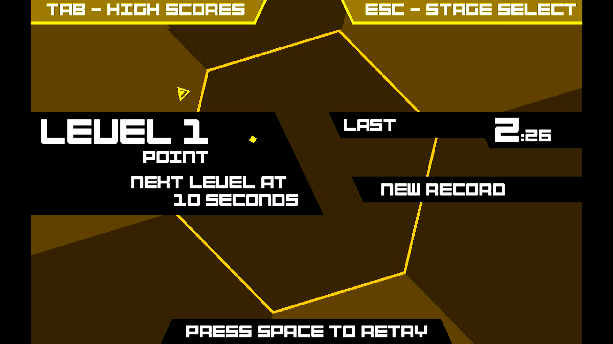

# Super Hexagon

## Compatibility report

### Tested on

[Lichee Pi 4A](/docs/hardwares#lichee-pi-4a-soc-th1520)

### Box64 version (commit)

Box64 [ptitSeb/box64@e6d2c127](https://github.com/ptitSeb/box64/tree/e6d2c127)

### Game screenshot



### Game running log

```shell
debian@revyos-lpi4a:~/GOG Games/Super Hexagon$ box64 ./start.sh 
[BOX64] Dynarec for rv64g_xtheadba_xtheadbb_xtheadbs_xtheadmempair_xtheadcondmov_xtheadmemidx_xthvector
[BOX64] Running on unknown riscv64 cpu with 4 cores, pagesize: 4096
[BOX64] Will use hardware counter measured at 3.0 MHz emulating 3.0 GHz
[BOX64] Box64 with Dynarec v0.3.3 e6d2c127 built on Jan 27 2025 02:29:17
[BOX64] Didn't detect 48bits of address space, considering it's 39bits
[BOX64] Counted 38 Env var
[BOX64] BOX64 LIB PATH: 
[BOX64] BOX64 BIN PATH: ./:bin/:/home/debian/wine-9.22-amd64-wow64/bin/:/usr/local/bin/:/usr/bin/:/bin/:/usr/local/games/:/usr/games/
[BOX64] Looking for ./start.sh
[BOX64] Not an ELF file (sign=#!/b)
[BOX64] Error: Reading elf header of /home/debian/GOG Games/Super Hexagon/start.sh, Try to launch using bash instead
[BOX64] Dynarec for rv64g_xtheadba_xtheadbb_xtheadbs_xtheadmempair_xtheadcondmov_xtheadmemidx_xthvector
[BOX64] Running on unknown riscv64 cpu with 4 cores, pagesize: 4096
[BOX64] Will use hardware counter measured at 3.0 MHz emulating 3.0 GHz
[BOX64] Box64 with Dynarec v0.3.3 e6d2c127 built on Jan 27 2025 02:29:17
[BOX64] Didn't detect 48bits of address space, considering it's 39bits
[BOX64] Counted 38 Env var
[BOX64] BOX64 LIB PATH: 
[BOX64] BOX64 BIN PATH: ./:bin/:/home/debian/wine-9.22-amd64-wow64/bin/:/usr/local/bin/:/usr/bin/:/bin/:/usr/local/games/:/usr/games/
[BOX64] Looking for /usr/local/bin/box64-bash
[BOX64] Bash detected, disabling banner
[BOX64] Warning, of_unconvert(...) left over 0x8000, converted 0x8000
Running Super Hexagon
[BOX64] Dynarec for rv64g_xtheadba_xtheadbb_xtheadbs_xtheadmempair_xtheadcondmov_xtheadmemidx_xthvector
[BOX64] Running on unknown riscv64 cpu with 4 cores, pagesize: 4096
[BOX64] Will use hardware counter measured at 3.0 MHz emulating 3.0 GHz
[BOX64] Box64 with Dynarec v0.3.3 e6d2c127 built on Jan 27 2025 02:29:17
[BOX64] Didn't detect 48bits of address space, considering it's 39bits
[BOX64] Counted 39 Env var
[BOX64] BOX64 LIB PATH: 
[BOX64] BOX64 BIN PATH: ./:bin/:/home/debian/wine-9.22-amd64-wow64/bin/:/usr/local/bin/:/usr/bin/:/bin/:/usr/local/games/:/usr/games/
[BOX64] Looking for /usr/local/bin/box64-bash
[BOX64] Bash detected, disabling banner
[BOX64] Warning, of_unconvert(...) left over 0x8000, converted 0x8000
[BOX64] Dynarec for rv64g_xtheadba_xtheadbb_xtheadbs_xtheadmempair_xtheadcondmov_xtheadmemidx_xthvector
[BOX64] Running on unknown riscv64 cpu with 4 cores, pagesize: 4096
[BOX64] Will use hardware counter measured at 3.0 MHz emulating 3.0 GHz
[BOX64] Box64 with Dynarec v0.3.3 e6d2c127 built on Jan 27 2025 02:29:17
[BOX64] Didn't detect 48bits of address space, considering it's 39bits
[BOX64] Counted 39 Env var
[BOX64] BOX64 LIB PATH: 
[BOX64] BOX64 BIN PATH: ./:bin/:/home/debian/wine-9.22-amd64-wow64/bin/:/usr/local/bin/:/usr/bin/:/bin/:/usr/local/games/:/usr/games/
[BOX64] Looking for ./x86_64/superhexagon.x86_64
[BOX64] Rename process to "superhexagon.x86_64"
LIBGL: Initialising gl4es
LIBGL: v1.1.7 built on Jan 27 2025 04:07:03
LIBGL: Using GLES 2.0 backend
LIBGL: loaded: libGLESv2.so
LIBGL: loaded: libEGL.so
LIBGL: Using GLES 2.0 backend
LIBGL: Hardware Full NPOT detected and used
LIBGL: Extension GL_EXT_blend_minmax  detected and used
LIBGL: Extension GL_EXT_draw_buffers  detected and used
LIBGL: FBO are in core, and so used
LIBGL: PointSprite are in core, and so used
LIBGL: CubeMap are in core, and so used
LIBGL: BlendColor is in core, and so used
LIBGL: Blend Subtract is in core, and so used
LIBGL: Blend Function and Equation Separation is in core, and so used
LIBGL: Texture Mirrored Repeat is in core, and so used
LIBGL: Extension GL_OES_mapbuffer  detected
LIBGL: Extension GL_OES_element_index_uint  detected and used
LIBGL: Extension GL_OES_packed_depth_stencil  detected and used
LIBGL: Extension GL_OES_depth24  detected and used
LIBGL: Extension GL_OES_rgb8_rgba8  detected and used
LIBGL: Extension GL_EXT_multi_draw_arrays  detected
LIBGL: Extension GL_EXT_texture_format_BGRA8888  detected and used
LIBGL: Extension GL_OES_depth_texture  detected and used
LIBGL: Extension GL_OES_texture_stencil8  detected and used
LIBGL: Extension GL_EXT_texture_rg  detected and used
LIBGL: Extension GL_OES_texture_float  detected and used
LIBGL: Extension GL_OES_texture_half_float  detected and used
LIBGL: Extension GL_EXT_color_buffer_float  detected and used
LIBGL: Extension GL_EXT_color_buffer_half_float  detected and used
LIBGL: Extension GL_OES_fragment_precision_high  detected and used
LIBGL: Extension GL_EXT_shader_texture_lod detected and used
1715.159451 (11144) PVR:(Error): DoCompileShader:  Failed to compile shader [ shadercompile.c:10866 ]
LIBGL: Max vertex attrib: 16
LIBGL: Extension GL_OES_standard_derivatives  detected and used
LIBGL: Extension GL_OES_get_program_binary  detected and used
LIBGL: Number of supported Program Binary Format: 1
LIBGL: Max texture size: 8192
LIBGL: Max Varying Vector: 15
LIBGL: Texture Units: 16/16 (hardware: 16), Max lights: 8, Max planes: 6
LIBGL: Max Color Attachments: 8 / Draw buffers: 8
LIBGL: Hardware vendor is Imagination Technologies
1715.160340 (11144) PVR:(Error): DoCompileShader:  Failed to compile shader [ shadercompile.c:10866 ]
1715.160616 (11144) PVR:(Error): DoCompileShader:  Failed to compile shader [ shadercompile.c:10866 ]
1715.160872 (11144) PVR:(Error): DoCompileShader:  Failed to compile shader [ shadercompile.c:10866 ]
LIBGL: sRGB surface supported
LIBGL: EGLImage from Pixmap supported
LIBGL: EGLImage to Texture2D supported
LIBGL: EGLImage to RenderBuffer supported
LIBGL: Targeting OpenGL 2.1
LIBGL: Not trying to batch small subsequent glDrawXXXX
LIBGL: Trying to use VBO
LIBGL: FBO workaround for using binded texture enabled
LIBGL: Force texture for Attachment color0 on FBO
LIBGL: Hack to trigger a SwapBuffers when a Full Framebuffer Blit on default FBO is done
LIBGL: glX Will try to recycle EGL Surface
LIBGL: Current folder is:/home/debian/GOG Games/Super Hexagon/game
LIBGL: Loaded a PSA with 2 Precompiled Programs
[BOX64] Using native(wrapped) libGL.so.1
[BOX64] Using native(wrapped) libGLU.so.1
[BOX64] Using native(wrapped) libSDL2-2.0.so.0
[BOX64] Using native(wrapped) libdl.so.2
[BOX64] Using native(wrapped) libm.so.6
[BOX64] Using native(wrapped) librt.so.1
[BOX64] Using native(wrapped) libpthread.so.0
[BOX64] Using emulated ./x86_64/libGLEW.so.1.6
[BOX64] Using native(wrapped) libopenal.so.1
[BOX64] Using native(wrapped) libvorbisfile.so.3
[BOX64] Using emulated /usr/lib/box64-x86_64-linux-gnu/libstdc++.so.6
[BOX64] Using emulated /usr/lib/box64-x86_64-linux-gnu/libgcc_s.so.1
[BOX64] Using native(wrapped) libc.so.6
[BOX64] Using native(wrapped) ld-linux-x86-64.so.2
[BOX64] Using native(wrapped) libutil.so.1
[BOX64] Using native(wrapped) libbsd.so.0
[BOX64] Using native(wrapped) libX11.so.6
[BOX64] Using native(wrapped) libxcb.so.1
[BOX64] Using native(wrapped) libXau.so.6
[BOX64] Using native(wrapped) libXdmcp.so.6
[scoreid:notice] init
thread started
Couldn't find XDG_DATA_HOME.
Fall back to hardcoded ~/.local/share/SuperHexagon/.
[notice] prepareGame()
[notice] loadFont
[notice] loadFont - done
[notice] loadFont
[notice] loadFont - done
[notice] windowResized(1280, 720)
[scoreid:notice] reportScore: t=0, tim=146
[scoreid:notice] getleaderboard: 0
ofxHttpUtils::post: /api/createScore
ofxHttpUtils error--
Not found: Date
ofxHttpUtils: (thread running) form submitted (post): 
ofxHttpUtils::post: /api/getBestScores
ofxHttpUtils error--
Not found: Date
ofxHttpUtils: (thread running) form submitted (post): 
[scoreid:notice] reportScore: t=0, tim=146
ofxHttpUtils::post: /api/createScore
ofxHttpUtils error--
Not found: Date
ofxHttpUtils: (thread running) form submitted (post): 
LIBGL: Shutting down
debian@revyos-lpi4a:~/GOG Games/Super Hexagon$ 
```

### Rendering methods

```shell
OpenGL ES + gl4es
```

[Read more: What is OpenGL ES? »](/docs/faq#what-is-opengl-es)

[Read more: What is gl4es? »](/docs/faq#what-is-gl4es)

### Extra information

[Official Game Website](https://superhexagon.com/)

[Steam](https://store.steampowered.com/app/221640/Super_Hexagon/)

[PCGameWiki](https://www.pcgamingwiki.com/wiki/Super_Hexagon)

### Advanced Tips

> TBD
