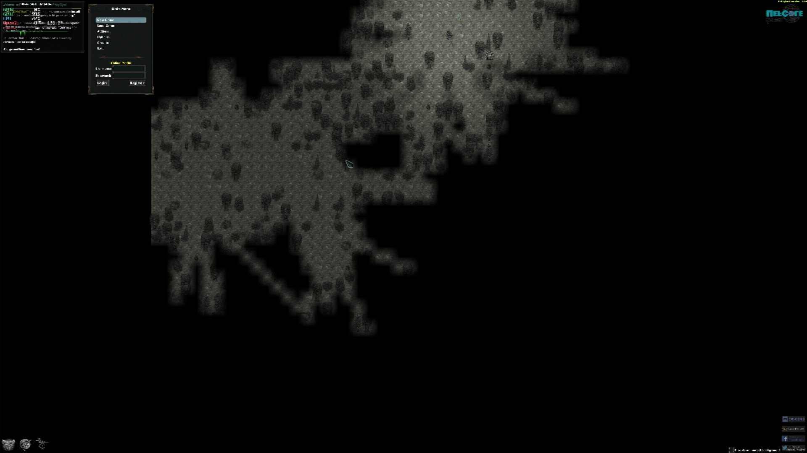

# Tales of MajEyal

## Compatibility report

### Tested on

[Milk-V Jupiter](/docs/hardwares#milk-v-jupiter-soc-spacemit-m1)
 with AMD Radeon RX 550

### Box64 version (commit)

Box64 [ptitSeb/box64@6d7af867](https://github.com/ptitSeb/box64/tree/6d7af867)

### Game screenshot



### Game running log

```shell
[BOX64] Box64 with Dynarec v0.3.5 6d7af867 built on Apr  6 2025 20:28:41
[BOX64] Dynarec for rv64gv_zba_zbb_zbc_zbs_zvl256
[BOX64] Running on Spacemit(R) X60 with 8 cores, pagesize: 4096
[BOX64] Will use hardware counter measured at 24.0 MHz emulating 3.0 GHz
[BOX64] Using bash "/home/rurumuri/ourstorybegin/box64/tests/box64-bash"
[BOX64] Didn't detect 48bits of address space, considering it's 39bits
[BOX64] Counted 49 Env var
[BOX64] BOX64 trying to Preload /usr/local/$LIB/mangohud/libMangoHud_shim.so 
[BOX64] Library search path: 
[BOX64] Binary search path: ./:bin/:/home/rurumuri/ourstorybegin/wine/wine-10.3-amd64-wow64/bin/:/home/rurumuri/ourstorybegin/wine/wine-10.3-amd64-wow64/bin/:/usr/local/bin/:/usr/bin/:/bin/:/usr/local/sbin/:/usr/lib/jvm/default/bin/:/usr/bin/site_perl/:/usr/bin/vendor_perl/:/usr/bin/core_perl/:/usr/lib/rustup/bin/
[BOX64] Looking for ./start.sh
[BOX64] BOX64ENV: Variables overridden via env and/or RC file:
        BOX64_BASH=/home/rurumuri/ourstorybegin/box64/tests/box64-bash
[BOX64] Not an ELF file (sign=#!/b)
[BOX64] Error: Reading elf header of /home/rurumuri/GOG Games/Tales of MajEyal/start.sh, Try to launch using bash instead
[BOX64] Box64 with Dynarec v0.3.5 6d7af867 built on Apr  6 2025 20:28:41
[BOX64] Dynarec for rv64gv_zba_zbb_zbc_zbs_zvl256
[BOX64] Running on Spacemit(R) X60 with 8 cores, pagesize: 4096
[BOX64] Will use hardware counter measured at 24.0 MHz emulating 3.0 GHz
[BOX64] Using bash "/home/rurumuri/ourstorybegin/box64/tests/box64-bash"
[BOX64] Didn't detect 48bits of address space, considering it's 39bits
[BOX64] Counted 49 Env var
[BOX64] BOX64 trying to Preload /usr/local/$LIB/mangohud/libMangoHud_shim.so 
[BOX64] Library search path: 
[BOX64] Binary search path: ./:bin/:/home/rurumuri/ourstorybegin/wine/wine-10.3-amd64-wow64/bin/:/home/rurumuri/ourstorybegin/wine/wine-10.3-amd64-wow64/bin/:/usr/local/bin/:/usr/bin/:/bin/:/usr/local/sbin/:/usr/lib/jvm/default/bin/:/usr/bin/site_perl/:/usr/bin/vendor_perl/:/usr/bin/core_perl/:/usr/lib/rustup/bin/
[BOX64] Looking for /home/rurumuri/ourstorybegin/box64/tests/box64-bash
[BOX64] Bash detected, disabling banner
[BOX64] BOX64ENV: Variables overridden via env and/or RC file:
        BOX64_BASH=/home/rurumuri/ourstorybegin/box64/tests/box64-bash
[BOX64] argv[1]="./start.sh"
[BOX64] Rename process to "box64-bash"
[BOX64] Warning, cannot pre-load /usr/local/$LIB/mangohud/libMangoHud_shim.so
[BOX64] Using native(wrapped) libtinfo.so.6
[BOX64] Using native(wrapped) libdl.so.2
[BOX64] Using native(wrapped) libc.so.6
[BOX64] Using native(wrapped) ld-linux-x86-64.so.2
[BOX64] Using native(wrapped) libpthread.so.0
[BOX64] Using native(wrapped) libutil.so.1
[BOX64] Using native(wrapped) librt.so.1
[BOX64] Using native(wrapped) libbsd.so.0
[BOX64] Warning, of_unconvert(...) left over 0x8000, converted 0x8000
Running Tales of Maj'Eyal
[BOX64] Box64 with Dynarec v0.3.5 6d7af867 built on Apr  6 2025 20:28:41
[BOX64] Dynarec for rv64gv_zba_zbb_zbc_zbs_zvl256
[BOX64] Running on Spacemit(R) X60 with 8 cores, pagesize: 4096
[BOX64] Will use hardware counter measured at 24.0 MHz emulating 3.0 GHz
[BOX64] Using bash "/home/rurumuri/ourstorybegin/box64/tests/box64-bash"
[BOX64] Didn't detect 48bits of address space, considering it's 39bits
[BOX64] Counted 50 Env var
[BOX64] BOX64 trying to Preload /usr/local/$LIB/mangohud/libMangoHud_shim.so 
[BOX64] Library search path: 
[BOX64] Binary search path: ./:bin/:/home/rurumuri/ourstorybegin/wine/wine-10.3-amd64-wow64/bin/:/home/rurumuri/ourstorybegin/wine/wine-10.3-amd64-wow64/bin/:/usr/local/bin/:/usr/bin/:/bin/:/usr/local/sbin/:/usr/lib/jvm/default/bin/:/usr/bin/site_perl/:/usr/bin/vendor_perl/:/usr/bin/core_perl/:/usr/lib/rustup/bin/
[BOX64] Looking for ./t-engine64
[BOX64] BOX64ENV: Variables overridden via env and/or RC file:
        BOX64_BASH=/home/rurumuri/ourstorybegin/box64/tests/box64-bash
[BOX64] Rename process to "t-engine64"
[BOX64] Warning, cannot pre-load /usr/local/$LIB/mangohud/libMangoHud_shim.so
[BOX64] Using native(wrapped) libm.so.6
[BOX64] Using emulated /home/rurumuri/ourstorybegin/box64/x64lib/libstdc++.so.6
[BOX64] Using native(wrapped) libdl.so.2
[BOX64] Using native(wrapped) libSDL2-2.0.so.0
[BOX64] Using native(wrapped) librt.so.1
[BOX64] Using native(wrapped) libpthread.so.0
[BOX64] Error initializing native libSDL2_ttf-2.0.so.0 (last dlerror is libSDL2_ttf-2.0.so.0: cannot open shared object file: No such file or directory)
[BOX64] Using emulated /home/rurumuri/GOG Games/Tales of MajEyal/game/lib64/libSDL2_ttf-2.0.so.0
[BOX64] Error initializing native libSDL2_image-2.0.so.0 (last dlerror is libSvtAv1Enc.so.2: cannot open shared object file: No such file or directory)
[BOX64] Using emulated /home/rurumuri/GOG Games/Tales of MajEyal/game/lib64/libSDL2_image-2.0.so.0
[BOX64] Using native(wrapped) libpng16.so.16
[BOX64] Using native(wrapped) libopenal.so.1
[BOX64] Using native(wrapped) libvorbisfile.so.3
[BOX64] Using native(wrapped) libGL.so.1
[BOX64] Using native(wrapped) libGLU.so.1
[BOX64] Using emulated /home/rurumuri/ourstorybegin/box64/x64lib/libgcc_s.so.1
[BOX64] Using native(wrapped) libc.so.6
[BOX64] Using native(wrapped) ld-linux-x86-64.so.2
[BOX64] Using native(wrapped) libutil.so.1
[BOX64] Using native(wrapped) libbsd.so.0
[BOX64] Using native(wrapped) libz.so.1
[BOX64] Using native(wrapped) libfreetype.so.6
[BOX64] Using emulated /home/rurumuri/GOG Games/Tales of MajEyal/game/lib64/libte4-web.so
[BOX64] Using emulated /home/rurumuri/GOG Games/Tales of MajEyal/game/lib64/libcef.so
[BOX64] libcef detected, using malloc_hack_2
[BOX64] Redirecting overridden malloc from symtab function for /home/rurumuri/GOG Games/Tales of MajEyal/game/lib64/libcef.so
[BOX64] Using native(wrapped) libudev.so.1
[BOX64] Using native(wrapped) libX11.so.6
[BOX64] Using native(wrapped) libxcb.so.1
[BOX64] Using native(wrapped) libXau.so.6
[BOX64] Using native(wrapped) libXdmcp.so.6
[BOX64] Using native(wrapped) libXrender.so.1
[BOX64] Using native(wrapped) libXcomposite.so.1
[BOX64] Using native(wrapped) libgobject-2.0.so.0
[BOX64] Using native(wrapped) libglib-2.0.so.0
[BOX64] Using native(wrapped) libgtk-x11-2.0.so.0
[BOX64] Using native(wrapped) libgdk-x11-2.0.so.0
[BOX64] Using native(wrapped) libgio-2.0.so.0
[BOX64] Using native(wrapped) libgmodule-2.0.so.0
[BOX64] Using native(wrapped) libgdk_pixbuf-2.0.so.0
[BOX64] Using native(wrapped) libpangocairo-1.0.so.0
[BOX64] Using native(wrapped) libpango-1.0.so.0
[BOX64] Using native(wrapped) libatk-1.0.so.0
[BOX64] Using native(wrapped) libcairo.so.2
[BOX64] Using native(wrapped) libfontconfig.so.1
[BOX64] Using native(wrapped) libexpat.so.1
[BOX64] Using native(wrapped) libXi.so.6
[BOX64] Using native(wrapped) libXext.so.6
[BOX64] Using native(wrapped) libasound.so.2
[BOX64] Using native(wrapped) libXdamage.so.1
[BOX64] Using native(wrapped) libXfixes.so.3
[BOX64] Using native(wrapped) libnss3.so
[BOX64] Using native(wrapped) libnssutil3.so
[BOX64] Using native(wrapped) libsmime3.so
[BOX64] Using native(wrapped) libplc4.so
[BOX64] Using native(wrapped) libnspr4.so
[BOX64] Error initializing native libgconf-2.so.4 (last dlerror is libgconf-2.so.4: cannot open shared object file: No such file or directory)
[BOX64] Error loading needed lib libgconf-2.so.4
[BOX64] Using native(wrapped) libcups.so.2
[BOX64] Using emulated /home/rurumuri/GOG Games/Tales of MajEyal/game/lib64/libgcrypt.so.11
[BOX64] Using native(wrapped) libdbus-1.so.3
[BOX64] Error loading one of needed lib
[BOX64] Error initializing needed lib libc.so.6
[BOX64] Error loading one of needed lib
[BOX64] Error initializing needed lib /home/rurumuri/GOG Games/Tales of MajEyal/game/lib64/libte4-web.so
WebCore config: library(/home/rurumuri/GOG Games/Tales of MajEyal/game/lib64/libte4-web.so) spawn(/home/rurumuri/GOG Games/Tales of MajEyal/game/cef3spawn64)
Loading WebCore: 
[BOX64] Box64 with Dynarec v0.3.5 6d7af867 built on Apr  6 2025 20:28:41
[BOX64] Dynarec for rv64gv_zba_zbb_zbc_zbs_zvl256
[BOX64] Running on Spacemit(R) X60 with 8 cores, pagesize: 4096
[BOX64] Will use hardware counter measured at 24.0 MHz emulating 3.0 GHz
[BOX64] Using bash "/home/rurumuri/ourstorybegin/box64/tests/box64-bash"
[BOX64] Didn't detect 48bits of address space, considering it's 39bits
[BOX64] Counted 52 Env var
[BOX64] BOX64 trying to Preload /usr/local/$LIB/mangohud/libMangoHud_shim.so 
[BOX64] Library search path: 
[BOX64] Binary search path: ./:bin/:/home/rurumuri/ourstorybegin/wine/wine-10.3-amd64-wow64/bin/:/home/rurumuri/ourstorybegin/wine/wine-10.3-amd64-wow64/bin/:/usr/local/bin/:/usr/bin/:/bin/:/usr/local/sbin/:/usr/lib/jvm/default/bin/:/usr/bin/site_perl/:/usr/bin/vendor_perl/:/usr/bin/core_perl/:/usr/lib/rustup/bin/
[BOX64] Looking for /home/rurumuri/GOG Games/Tales of MajEyal/game/t-engine64
[BOX64] BOX64ENV: Variables overridden via env and/or RC file:
        BOX64_BASH=/home/rurumuri/ourstorybegin/box64/tests/box64-bash
[BOX64] argv[1]="--no-web"
[BOX64] Rename process to "t-engine64"
[BOX64] Warning, cannot pre-load /usr/local/$LIB/mangohud/libMangoHud_shim.so
[BOX64] Using native(wrapped) libm.so.6
[BOX64] Using emulated /home/rurumuri/ourstorybegin/box64/x64lib/libstdc++.so.6
[BOX64] Using native(wrapped) libdl.so.2
[BOX64] Using native(wrapped) libSDL2-2.0.so.0
[BOX64] Using native(wrapped) librt.so.1
[BOX64] Using native(wrapped) libpthread.so.0
[BOX64] Error initializing native libSDL2_ttf-2.0.so.0 (last dlerror is libSDL2_ttf-2.0.so.0: cannot open shared object file: No such file or directory)
[BOX64] Using emulated /home/rurumuri/GOG Games/Tales of MajEyal/game/lib64/libSDL2_ttf-2.0.so.0
[BOX64] Error initializing native libSDL2_image-2.0.so.0 (last dlerror is libSvtAv1Enc.so.2: cannot open shared object file: No such file or directory)
[BOX64] Using emulated /home/rurumuri/GOG Games/Tales of MajEyal/game/lib64/libSDL2_image-2.0.so.0
[BOX64] Using native(wrapped) libpng16.so.16
[BOX64] Using native(wrapped) libopenal.so.1
[BOX64] Using native(wrapped) libvorbisfile.so.3
[BOX64] Using native(wrapped) libGL.so.1
[BOX64] Using native(wrapped) libGLU.so.1
[BOX64] Using emulated /home/rurumuri/ourstorybegin/box64/x64lib/libgcc_s.so.1
[BOX64] Using native(wrapped) libc.so.6
[BOX64] Using native(wrapped) ld-linux-x86-64.so.2
[BOX64] Using native(wrapped) libutil.so.1
[BOX64] Using native(wrapped) libbsd.so.0
[BOX64] Using native(wrapped) libz.so.1
[BOX64] Using native(wrapped) libfreetype.so.6
[CPU] Detected 8 CPUs
OpenAL device available: OpenAL Soft (default OpenAL Soft)
Available video driver: wayland
Available video driver: x11
Available video driver: KMSDRM
Available video driver: offscreen
Available video driver: dummy
Available video driver: evdev
NO SELFEXE: bootstrapping from CWD
Creating save thread
[BOX64] Using emulated /home/rurumuri/GOG Games/Tales of MajEyal/game/lib64/libdiscord-rpc.so
Loading discord rpc: library(/home/rurumuri/GOG Games/Tales of MajEyal/game/lib64/libdiscord-rpc.so) => loaded
===top 0
Booting T-Engine from: /home/rurumuri/GOG Games/Tales of MajEyal/game/t-engine64
SelfExe gave us app directory of:       /home/rurumuri/GOG Games/Tales of MajEyal/game/
LuaVM:  LuaJIT 2.0.2    x64
Creating particles thread 0
Creating particles thread 1
Creating particles thread 2
Creating particles thread 3
Creating particles thread 4
Creating particles thread 5
Creating particles thread 6
[DO RESIZE] Requested: 800x600 (0, 0); zoom 100%
LuaVM:  LuaJIT 2.0.2    x64
LuaVM:  LuaJIT 2.0.2    x64
LuaVM:  LuaJIT 2.0.2    x64
LuaVM:  LuaJIT 2.0.2    x64
LuaVM:  LuaJIT 2.0.2    x64
LuaVM:  LuaJIT 2.0.2    x64
LuaVM:  LuaJIT 2.0.2    x64
[2025-04-15 13:36:26.919] [MANGOHUD] [error] [cpu.cpp:552] Could not find cpu temp sensor location
[2025-04-15 13:36:28.201] [MANGOHUD] [error] [inject_glx.cpp:49] Failed to get function 'glXGetCurrentReadDrawableSGI'
[2025-04-15 13:36:28.201] [MANGOHUD] [error] [inject_glx.cpp:49] Failed to get function 'glXMakeCurrentReadSGI'
[GAMMA] Getting desktop gamma of 1.000000
[DO RESIZE] Got: 800x600 (0, 0)
OpenGL max texture size: 16384
OpenGL max texture size: 16384
Upgrading black texture to size 64
Running lua loader code...
Reboot using    te4     LATEST  boot    player  false
[ENGINE LOADER] available from teae:    te4-1.7.6
[ENGINE LOADER] found engines   te4={[1]={[1]=1.000000 , [2]=7.000000 , [3]=6.000000 , [4]="te4" , [5]=17.000000 , ["load_teae"]="/engines/te4-1.7.6.teae" , } , } __byname={["te4-1.7.6"]=true , } 
[ENGINE LOADER] looked in:
        /home/rurumuri//.t-engine/4.0
        /home/rurumuri/GOG Games/Tales of MajEyal/game//game/thirdparty
        /home/rurumuri/GOG Games/Tales of MajEyal/game//game
[ENGINE LOADER] sorted: te4     1       7       6
[ENGINE LOADER] loading engine: 1       7       6       te4
[ENGINE LOADER] using archived engine:  /engines/te4-1.7.6.teae
Available resolutions: 3840x2160x32
Available resolutions: 2560x1440x32
Available resolutions: 1920x2160x32
Available resolutions: 1920x1200x32
Available resolutions: 1920x1080x32
Available resolutions: 1680x1050x32
Available resolutions: 1600x1200x32
Available resolutions: 1440x900x32
Available resolutions: 1280x1024x32
Available resolutions: 1280x960x32
Available resolutions: 1280x800x32
Available resolutions: 1280x720x32
Available resolutions: 1024x768x32
Available resolutions: 832x624x32
Available resolutions: 800x600x32
Available resolutions: 720x576x32
Available resolutions: 720x480x32
Available resolutions: 720x400x32
Available resolutions: 640x480x32
FROM    /mod/addons/dgo/superload/engine/PlayerProfile.lua      loading previous!
0==WRITEPATH==allowed== /home/rurumuri/GOG Games/Tales of MajEyal/game/game/addons/
1==WRITEPATH==allowed== /home/rurumuri/GOG Games/Tales of MajEyal/game/game/modules/
2==WRITEPATH==allowed== /home/rurumuri/.t-engine/4.0/
3==WRITEPATH==allowed== /home/rurumuri/GOG Games/Tales of MajEyal/game/game/addons/
4==WRITEPATH==allowed== /home/rurumuri/GOG Games/Tales of MajEyal/game/game/modules/
0==READPATH==allowed== /home/rurumuri/GOG Games/Tales of MajEyal/game/game/
1==READPATH==allowed== /home/rurumuri/GOG Games/Tales of MajEyal/game/game/engines/
2==READPATH==allowed== /home/rurumuri/GOG Games/Tales of MajEyal/game/game/thirdparty/
3==READPATH==allowed== /home/rurumuri/GOG Games/Tales of MajEyal/game/game/addons/
4==READPATH==allowed== /home/rurumuri/GOG Games/Tales of MajEyal/game/game/modules/
5==READPATH==allowed== /home/rurumuri/.t-engine/4.0/
6==READPATH==allowed== /home/rurumuri/GOG Games/Tales of MajEyal/game/game/addons/
7==READPATH==allowed== /home/rurumuri/GOG Games/Tales of MajEyal/game/game/modules/
8==READPATH==allowed== /home/rurumuri/GOG Games/Tales of MajEyal/game/game/engines/te4-1.7.6.teae/
9==READPATH==allowed== /home/rurumuri/GOG Games/Tales of MajEyal/game/game/thirdparty/
10==READPATH==allowed== /home/rurumuri/GOG Games/Tales of MajEyal/game/game/
[KEYBINDER] Loaded keybinds: move
[KEYBINDER] Loaded keybinds: hotkeys
[KEYBINDER] Loaded keybinds: inventory
[KEYBINDER] Loaded keybinds: actions
[KEYBINDER] Loaded keybinds: interface
[KEYBINDER] Loaded keybinds: debug
setResolution: switching resolution to  3840x2160 Fullscreen    3840    2160    true    nil     (forced)
Setting resolution to 3840x2160 (fullscreen, with borders)
[DO RESIZE] Requested: 3840x2160 (1, 0); zoom 100%
[DO RESIZE] Got: 3840x2160 (1, 0)
OpenGL max texture size: 16384
setResolution: performing onResolutionChange...

onResolutionChange: resolution changed to       3840    2160    from    nil     nil
onResolutionChange: no game yet!
Creating profile thread
[ONLINE PROFILE] fun facts      nil
[PROFILE] mounted       online  on /current-profile
[PROFILE] unmounted     online  from /current-profile
[ENGINE] Setting requested FPS to 30 (33 ms)
LuaVM:  LuaJIT 2.0.2    x64
TE4Online starting...
[ENGINE] Switching to turn based
[SAVEFILE PIPE] force waiting
Creating module boot-te4-1.7.6.team     :: (as dir)     false   :: (as team)    15
Module mismatch engine version boot-1.0.0 using engine te4-1.0.1
Loaded module definition for boot-1.0.0 using engine te4-1.0.1
Creating module example :: (as dir)     true    :: (as team)    nil
Module mismatch engine version example-1.1.5 using engine te4-1.1.5
Loaded module definition for example-1.1.5 using engine te4-1.1.5
Creating module example_realtime        :: (as dir)     true    :: (as team)    nil
Module mismatch engine version example_realtime-1.1.5 using engine te4-1.1.5
Loaded module definition for example_realtime-1.1.5 using engine te4-1.1.5
Creating module tome-1.7.6-gfx.team     :: (as dir)     false   :: (as team)    15
Creating module tome-1.7.6-music.team   :: (as dir)     false   :: (as team)    17
Creating module tome-1.7.6.team :: (as dir)     false   :: (as team)    11
Loaded module definition for tome-1.7.6 using engine te4-1.7.6
* Module: tome
 ** 1.7.6
* Module: boot
 ** 1.0.0
* Module: example
 ** 1.1.5
* Module: example_realtime
 ** 1.1.5
After fs.reset
[1] = {
  [path] = /home/rurumuri/GOG Games/Tales of MajEyal/game//game/engines/te4-1.7.6.teae
}
[MODULE] booting module version boot-1.0.0
[ENGINE] Switching to turn based
Loading savefile        /save//
Loading savefile        /save/player/
Upgrading black texture to size 32768
Make wait background texture 7 : 4096x4096 (0, 0)
Upgrading black texture to size 1048576
Upgrading black texture to size 16777216
table: 0x30504708       normal
table: 0x30504798       normal
Checking addon  boot-gog.teaa   :: (as dir)     false   :: (as teaa)    9
Binding addon   GOG License Key /addons/boot-gog.teaa   boot-gog-1.0.0
 * with superload
 * with overload
[MODULE LOADER] computing addon md5 from        /home/rurumuri/GOG Games/Tales of MajEyal/game/game/addons/boot-gog.teaa
[1] = /loaded-addons/gog/init.lua:33b86ccb7ef4e27edcd1806caed1eaa5
[2] = /loaded-addons/gog/overload/mod/dialogs/LicenseRegister.lua:516957568f8d9ae5aaa6d45383fc0962
[3] = /loaded-addons/gog/superload/mod/class/Game.lua:af98709cd8807720dcbb8d11789f5e51
[4] = /loaded-addons/gog/superload/mod/dialogs/MainMenu.lua:64bafa1685e475e9838c87d1c487846b
[MODULE LOADER] addon   gog      MD5    c4915895fffb3b25c31ecb19fa04ca47        computed in     34      nil
Post-processing hooks.
[MODULE] All hashes validation:         nil     no online profile active
[PROFILE] mounted       online  on /current-profile
[PROFILE] unmounted     online  from /current-profile
table: 0x30504798       normal
Using cached font       /data/font/Salsa-Regular.ttf    16
table: 0x30504b40       normal
Using cached font       /data/font/Salsa-Regular.ttf    16
table: 0x30504bd0       normal
[ActorResource] Defined Resource:       power
[ENGINE] Switching to realtime, interval 125 ms
FROM    /mod/addons/gog/superload/mod/class/Game.lua    loading previous!
FROM    /mod/addons/gog/superload/mod/dialogs/MainMenu.lua      loading previous!
[MODULE LOADER] loading module  Tales of Maj'Eyal Main Menu     [mod.load]      ::      nil     nil
[GAMMA] Not setting gamma correction yet, no fullscreen shader found    1.2
table: 0x30504798       normal
Using cached font       /data/font/Salsa-Regular.ttf    16
table: 0x30504798       normal
Using cached font       /data/font/Salsa-Regular.ttf    14
[ENGINE] Switching to realtime, interval 125 ms
[GAMMA] Not setting gamma correction yet, no fullscreen shader found    1.2
[Discord] updating state: "Main Menu" / "Thinking about which character to die with!" / default / --
Loading savefile        /save/player/
table: 0x30504cf0       normal
Using cached font       /data/font/Salsa-Regular.ttf    14
[MAP] Reseting tiles caches
Using cached font       /data/font/DroidSansMono.ttf    22
Using cached font       /data/font/DroidSansMono.ttf    22
Using cached font       /data/font/DroidSansMono.ttf    22
Using cached font       /data/font/DroidSansMono.ttf    22
Using cached font       /data/font/DroidSansMono.ttf    22
Using cached font       /data/font/DroidSansMono.ttf    22
Using cached font       /data/font/DroidSansMono.ttf    22
[SHADER] Loading from /data/gfx/shaders/main_fbo.lua
[SHADER] Loaded shader with totalname   main_fbo[]
New GL Shader program 4
New GL Shader 5 of type 35632
[SHADER] created fragment shader from /data/gfx/shaders/main_fbo.frag
*p 4: Uniform: 0: 1406 hp_warning
*p 4: Uniform: 1: 1406 motionblur
*p 4: Uniform: 2: 1406 blur
*p 4: Uniform: 3: 1406 tick
*p 4: Uniform: 4: 8B5E noisevol
*p 4: Uniform: 5: 8B50 texSize
*p 4: Uniform: 6: 8B5E tex
*p 4: Uniform: 7: 8B52 colorize
[SHADER] Loading from /data/gfx/shaders/full_fbo.lua
[SHADER] Loaded shader with totalname   full_fbo[]
New GL Shader program 6
New GL Shader 7 of type 35632
[SHADER] created fragment shader from /data/gfx/shaders/full_fbo.frag
*p 6: Uniform: 0: 8B5E sceneBuffer
*p 6: Uniform: 1: 1406 gamma
[GAMMA] Setting gamma correction using fullscreen shader        1.2
Loading savefile        /save/player/
Loading entities file from file /data/zones/dungeon/npcs.lua
Loading entities file from file /data/general/npcs/skeleton.lua
Loading entities file from file /data/general/npcs/canine.lua
Loading entities file from file /data/general/npcs/troll.lua
Loading entities file from file /data/zones/dungeon/grids.lua
Loading entities file from file /data/general/grids/basic.lua
Loading entities file from file /data/general/grids/forest.lua
Loading entities file from file /data/general/grids/water.lua
Loading entities file from file /data/general/grids/underground.lua
Loading entities file from file /data/zones/dungeon/objects.lua
Loading entities file from file /data/zones/dungeon/traps.lua
Initiated zone  Forest  with base_level 1
Creating level  dungeon 3
[Zone:newLevel] dungeon beginning level generation, count:      1
C Map size 80:45 :: 3600
C Map seens texture: 54 (60x60)
Generating cavern
Floodfill group 1       652
Floodfill group 17      28
Floodfill group 18      6
Floodfill group 88      43
Floodfill group 348     349
Floodfill group 545     3
Floodfill group 846     8
Floodfill group 866     20
Floodfill group 986     13
Floodfill group 1060    21
Floodfill group 1065    57
Floodfill group 1090    21
Ok floodfill
Loading tile    terrain/crystal_floor1.png
Loading tile    terrain/crystal_alpha3.png
Loading tile    terrain/crystal_alpha2.png
Loading tile    terrain/crystal_alpha1.png
Loading tile    terrain/crystal_alpha4.png
Loading tile    terrain/crystal_alpha6.png
Loading tile    terrain/crystal_alpha5.png
Loading tile    terrain/crystal_floor1.png
Loading tile    npc/troll_f.png
Loading tile    npc/skeleton_warrior.png
Loading tile    npc/degenerated_skeleton_warrior.png
Loading tile    npc/troll_c.png
Loading tile    npc/skeleton_mage.png
Loading tile    npc/troll_s.png
Loading tile    npc/troll_mt.png
Loading tile    npc/canine_w.png
Loading tile    npc/canine_fox.png
Loading tile    npc/troll_m.png
Loading tile    terrain/crystal_floor5.png
Loading tile    terrain/crystal_floor3.png
Loading tile    terrain/crystal_floor6.png
Loading tile    terrain/crystal_floor4.png
Loading tile    terrain/crystal_floor7.png
Loading tile    terrain/crystal_floor2.png
Loading tile    terrain/crystal_floor8.png
Loading tile    player/humanoid_dwarf_dwarven_summoner.png
table: 0x30504798       normal
table: 0x30504798       normal
Using cached font       /data/font/Salsa-Regular.ttf    16
[KEYBINDER] Loaded keybinds: chat
[MUSIC] loading The saga begins.ogg     sound "/data/music/The saga begins.ogg" : <static>
[MUSIC] playing The saga begins.ogg     sound "/data/music/The saga begins.ogg" : <static>
[COROUTINE] registering getnews thread: 0x3077ec70
[ENGINE] Setting requested FPS to 30 (33 ms)
[MODULE LOADER] done loading module     Tales of Maj'Eyal Main Menu
[PROFILE] mounted       online  on /current-profile
[PROFILE] unmounted     online  from /current-profile
Wait finished, counted 808, 8448 ticks
Command line:   --no-web
SDL_WINDOWEVENT_MOVED: ignored due to fullscreen
[ONLINE PROFILE] get news
Selecting waypoint      9       20      ::      degenerated skeleton warrior
[dumb_talented AI] chooses for  333     mountain troll thunderer        T_LIGHTNING
[dumb_talented AI] chooses for  333     mountain troll thunderer        T_LIGHTNING
[SOUND] loading from    /data/sound/ui/subtle_button_sound.ogg  :=:     sound "/data/sound/ui/subtle_button_sound.ogg" : <static>
[PROFILE] mounted       online  on /current-profile
[PROFILE] unmounted     online  from /current-profile
[ENGINE] Switching to turn based
[SAVEFILE PIPE] force waiting
[PROFILE] mounted       online  on /current-profile
[PROFILE] unmounted     online  from /current-profile
[MAIN] rebooting lua state:     nil     nil     nil     nil     nil
[ENGINE] Switching to turn based
Deleting shader 6 (is clone 0)
Deleting shader 4 (is clone 0)
NO SELFEXE: bootstrapping from CWD
===top 0
Booting T-Engine from: /home/rurumuri/GOG Games/Tales of MajEyal/game/t-engine64
SelfExe gave us app directory of:       /home/rurumuri/GOG Games/Tales of MajEyal/game/
LuaVM:  LuaJIT 2.0.2    x64
Destroying particle thread 0 (waiting for mutex)
Destroying particle thread 0
Destroying particle thread 0 (waiting for thread 36ebae70)
Cleaning up particle thread 0
Cleaned up particle thread 0
Destroyed particle thread 0 (0)
Destroying particle thread 1 (waiting for mutex)
Destroying particle thread 1
Cleaning up particle thread 1
Cleaned up particle thread 1
Destroying particle thread 1 (waiting for thread 36ea0960)
Destroyed particle thread 1 (0)
Destroying particle thread 2 (waiting for mutex)
Destroying particle thread 2
Destroying particle thread 2 (waiting for thread 36e8b910)
Cleaning up particle thread 2
Cleaned up particle thread 2
Destroyed particle thread 2 (0)
Destroying particle thread 3 (waiting for mutex)
Destroying particle thread 3
Cleaning up particle thread 3
Destroying particle thread 3 (waiting for thread 36e9b810)
Cleaned up particle thread 3
Destroyed particle thread 3 (0)
Destroying particle thread 4 (waiting for mutex)
Destroying particle thread 4
Cleaning up particle thread 4
Cleaned up particle thread 4
Destroying particle thread 4 (waiting for thread 36e9b960)
Destroyed particle thread 4 (0)
Destroying particle thread 5 (waiting for mutex)
Destroying particle thread 5
Destroying particle thread 5 (waiting for thread 36ebf610)
Cleaning up particle thread 5
Cleaned up particle thread 5
Destroyed particle thread 5 (0)
Destroying particle thread 6 (waiting for mutex)
Destroying particle thread 6
Destroying particle thread 6 (waiting for thread 36e7cf20)
Cleaning up particle thread 6
Cleaned up particle thread 6
Destroyed particle thread 6 (0)
Creating particles thread 0
Creating particles thread 1
Creating particles thread 2
Creating particles thread 3
Creating particles thread 4
Creating particles thread 5
Creating particles thread 6
Running lua loader code...
LuaVM:  LuaJIT 2.0.2    x64
LuaVM:  LuaJIT 2.0.2    x64
LuaVM:  LuaJIT 2.0.2    x64
LuaVM:  LuaJIT 2.0.2    x64
===
Reboot using    te4     LATEST  boot    player  false
LuaVM:  LuaJIT 2.0.2    x64
LuaVM:  LuaJIT 2.0.2    x64
LuaVM:  LuaJIT 2.0.2    x64
[ENGINE LOADER] available from teae:    te4-1.7.6
[ENGINE LOADER] found engines   te4={[1]={[1]=1.000000 , [2]=7.000000 , [3]=6.000000 , [4]="te4" , [5]=17.000000 , ["load_teae"]="/engines/te4-1.7.6.teae" , } , } __byname={["te4-1.7.6"]=true , } 
[ENGINE LOADER] looked in:
        /home/rurumuri//.t-engine/4.0
        /home/rurumuri/GOG Games/Tales of MajEyal/game//game/thirdparty
        /home/rurumuri/GOG Games/Tales of MajEyal/game//game
[ENGINE LOADER] sorted: te4     1       7       6
[ENGINE LOADER] loading engine: 1       7       6       te4
[ENGINE LOADER] using archived engine:  /engines/te4-1.7.6.teae
Available resolutions: 3840x2160x32
Available resolutions: 2560x1440x32
Available resolutions: 1920x2160x32
Available resolutions: 1920x1200x32
Available resolutions: 1920x1080x32
Available resolutions: 1680x1050x32
Available resolutions: 1600x1200x32
Available resolutions: 1440x900x32
Available resolutions: 1280x1024x32
Available resolutions: 1280x960x32
Available resolutions: 1280x800x32
Available resolutions: 1280x720x32
Available resolutions: 1024x768x32
Available resolutions: 832x624x32
Available resolutions: 800x600x32
Available resolutions: 720x576x32
Available resolutions: 720x480x32
Available resolutions: 720x400x32
Available resolutions: 640x480x32
FROM    /mod/addons/dgo/superload/engine/PlayerProfile.lua      loading previous!
0==WRITEPATH==allowed== /home/rurumuri/GOG Games/Tales of MajEyal/game/game/addons/
1==WRITEPATH==allowed== /home/rurumuri/GOG Games/Tales of MajEyal/game/game/modules/
2==WRITEPATH==allowed== /home/rurumuri/.t-engine/4.0/
3==WRITEPATH==allowed== /home/rurumuri/GOG Games/Tales of MajEyal/game/game/addons/
4==WRITEPATH==allowed== /home/rurumuri/GOG Games/Tales of MajEyal/game/game/modules/
0==READPATH==allowed== /home/rurumuri/GOG Games/Tales of MajEyal/game/game/
1==READPATH==allowed== /home/rurumuri/GOG Games/Tales of MajEyal/game/game/engines/
2==READPATH==allowed== /home/rurumuri/GOG Games/Tales of MajEyal/game/game/thirdparty/
3==READPATH==allowed== /home/rurumuri/GOG Games/Tales of MajEyal/game/game/addons/
4==READPATH==allowed== /home/rurumuri/GOG Games/Tales of MajEyal/game/game/modules/
5==READPATH==allowed== /home/rurumuri/.t-engine/4.0/
6==READPATH==allowed== /home/rurumuri/GOG Games/Tales of MajEyal/game/game/addons/
7==READPATH==allowed== /home/rurumuri/GOG Games/Tales of MajEyal/game/game/modules/
8==READPATH==allowed== /home/rurumuri/GOG Games/Tales of MajEyal/game/game/engines/te4-1.7.6.teae/
9==READPATH==allowed== /home/rurumuri/GOG Games/Tales of MajEyal/game/game/thirdparty/
10==READPATH==allowed== /home/rurumuri/GOG Games/Tales of MajEyal/game/game/
[KEYBINDER] Loaded keybinds: move
[KEYBINDER] Loaded keybinds: hotkeys
[KEYBINDER] Loaded keybinds: inventory
[KEYBINDER] Loaded keybinds: actions
[KEYBINDER] Loaded keybinds: interface
[KEYBINDER] Loaded keybinds: debug
setResolution: switching resolution to  3840x2160 Fullscreen    3840    2160    true    nil     (forced)
Setting resolution to 3840x2160 (fullscreen, with borders)
[DO RESIZE] Requested: 3840x2160 (1, 0); zoom 100%
[DO RESIZE] Got: 3840x2160 (1, 0)
OpenGL max texture size: 16384
setResolution: performing onResolutionChange...

onResolutionChange: resolution changed to       3840    2160    from    nil     nil
onResolutionChange: no game yet!
[ONLINE PROFILE] fun facts      nil
[PROFILE] mounted       online  on /current-profile
[PROFILE] unmounted     online  from /current-profile
[ENGINE] Setting requested FPS to 30 (33 ms)
[ENGINE] Switching to turn based
[SAVEFILE PIPE] force waiting
Creating module boot-te4-1.7.6.team     :: (as dir)     false   :: (as team)    15
Module mismatch engine version boot-1.0.0 using engine te4-1.0.1
Loaded module definition for boot-1.0.0 using engine te4-1.0.1
Creating module example :: (as dir)     true    :: (as team)    nil
Module mismatch engine version example-1.1.5 using engine te4-1.1.5
Loaded module definition for example-1.1.5 using engine te4-1.1.5
Creating module example_realtime        :: (as dir)     true    :: (as team)    nil
Module mismatch engine version example_realtime-1.1.5 using engine te4-1.1.5
Loaded module definition for example_realtime-1.1.5 using engine te4-1.1.5
Creating module tome-1.7.6-gfx.team     :: (as dir)     false   :: (as team)    15
Creating module tome-1.7.6-music.team   :: (as dir)     false   :: (as team)    17
Creating module tome-1.7.6.team :: (as dir)     false   :: (as team)    11
Loaded module definition for tome-1.7.6 using engine te4-1.7.6
* Module: tome
 ** 1.7.6
* Module: boot
 ** 1.0.0
* Module: example
 ** 1.1.5
* Module: example_realtime
 ** 1.1.5
After fs.reset
[1] = {
  [path] = /home/rurumuri/GOG Games/Tales of MajEyal/game//game/engines/te4-1.7.6.teae
}
[MODULE] booting module version boot-1.0.0
[ENGINE] Switching to turn based
Loading savefile        /save//
Loading savefile        /save/player/
Make wait background texture 317 : 4096x4096 (0, 0)
table: 0x3030e2c0       normal
table: 0x3030dbb8       normal
Checking addon  boot-gog.teaa   :: (as dir)     false   :: (as teaa)    9
Binding addon   GOG License Key /addons/boot-gog.teaa   boot-gog-1.0.0
 * with superload
 * with overload
[MODULE LOADER] computing addon md5 from        /home/rurumuri/GOG Games/Tales of MajEyal/game/game/addons/boot-gog.teaa
[1] = /loaded-addons/gog/init.lua:33b86ccb7ef4e27edcd1806caed1eaa5
[2] = /loaded-addons/gog/overload/mod/dialogs/LicenseRegister.lua:516957568f8d9ae5aaa6d45383fc0962
[3] = /loaded-addons/gog/superload/mod/class/Game.lua:af98709cd8807720dcbb8d11789f5e51
[4] = /loaded-addons/gog/superload/mod/dialogs/MainMenu.lua:64bafa1685e475e9838c87d1c487846b
[MODULE LOADER] addon   gog      MD5    c4915895fffb3b25c31ecb19fa04ca47        computed in     8       nil
Post-processing hooks.
[MODULE] All hashes validation:         nil     no online profile active
[PROFILE] mounted       online  on /current-profile
[PROFILE] unmounted     online  from /current-profile
table: 0x3030dbb8       normal
Using cached font       /data/font/Salsa-Regular.ttf    16
table: 0x3030dc48       normal
Using cached font       /data/font/Salsa-Regular.ttf    16
table: 0x3030dcd8       normal
[ActorResource] Defined Resource:       power
[ENGINE] Switching to realtime, interval 125 ms
FROM    /mod/addons/gog/superload/mod/class/Game.lua    loading previous!
FROM    /mod/addons/gog/superload/mod/dialogs/MainMenu.lua      loading previous!
[MODULE LOADER] loading module  Tales of Maj'Eyal Main Menu     [mod.load]      ::      nil     nil
[GAMMA] Not setting gamma correction yet, no fullscreen shader found    1.2
table: 0x3030dbb8       normal
Using cached font       /data/font/Salsa-Regular.ttf    16
table: 0x3030dbb8       normal
Using cached font       /data/font/Salsa-Regular.ttf    14
[ENGINE] Switching to realtime, interval 125 ms
[GAMMA] Not setting gamma correction yet, no fullscreen shader found    1.2
[Discord] updating state: "Main Menu" / "Thinking about which character to die with!" / default / --
Loading savefile        /save/player/
table: 0x3030dae0       normal
Using cached font       /data/font/Salsa-Regular.ttf    14
[MAP] Reseting tiles caches
Using cached font       /data/font/DroidSansMono.ttf    22
Using cached font       /data/font/DroidSansMono.ttf    22
Using cached font       /data/font/DroidSansMono.ttf    22
Using cached font       /data/font/DroidSansMono.ttf    22
Using cached font       /data/font/DroidSansMono.ttf    22
Using cached font       /data/font/DroidSansMono.ttf    22
Using cached font       /data/font/DroidSansMono.ttf    22
[SHADER] Loading from /data/gfx/shaders/main_fbo.lua
[SHADER] Loaded shader with totalname   main_fbo[]
New GL Shader program 8
New GL Shader 9 of type 35632
[SHADER] created fragment shader from /data/gfx/shaders/main_fbo.frag
*p 8: Uniform: 0: 1406 hp_warning
*p 8: Uniform: 1: 1406 motionblur
*p 8: Uniform: 2: 1406 blur
*p 8: Uniform: 3: 1406 tick
*p 8: Uniform: 4: 8B5E noisevol
*p 8: Uniform: 5: 8B50 texSize
*p 8: Uniform: 6: 8B5E tex
*p 8: Uniform: 7: 8B52 colorize
[SHADER] Loading from /data/gfx/shaders/full_fbo.lua
[SHADER] Loaded shader with totalname   full_fbo[]
New GL Shader program 10
New GL Shader 11 of type 35632
[SHADER] created fragment shader from /data/gfx/shaders/full_fbo.frag
*p 10: Uniform: 0: 8B5E sceneBuffer
*p 10: Uniform: 1: 1406 gamma
[GAMMA] Setting gamma correction using fullscreen shader        1.2
Loading savefile        /save/player/
Loading entities file from file /data/zones/dungeon/npcs.lua
Loading entities file from file /data/general/npcs/skeleton.lua
Loading entities file from file /data/general/npcs/canine.lua
Loading entities file from file /data/general/npcs/troll.lua
Loading entities file from file /data/zones/dungeon/grids.lua
Loading entities file from file /data/general/grids/basic.lua
Loading entities file from file /data/general/grids/forest.lua
Loading entities file from file /data/general/grids/water.lua
Loading entities file from file /data/general/grids/underground.lua
Loading entities file from file /data/zones/dungeon/objects.lua
Loading entities file from file /data/zones/dungeon/traps.lua
Initiated zone  Forest  with base_level 1
Creating level  dungeon 1
[Zone:newLevel] dungeon beginning level generation, count:      1
C Map size 80:45 :: 3600
C Map seens texture: 365 (60x60)
[Forest] generating map:        0       rooms
End Room:       nil
[Forest] placed 0       rooms
Loading tile    terrain/grass.png
Loading tile    terrain/tree.png
Loading tile    terrain/flower.png
Loading tile    npc/troll_m.png
Loading tile    npc/troll_s.png
Loading tile    npc/canine_fox.png
Loading tile    npc/skeleton_warrior.png
Loading tile    npc/troll_f.png
Loading tile    npc/skeleton_mage.png
Loading tile    npc/canine_ww.png
Loading tile    npc/canine_w.png
Loading tile    npc/troll_c.png
Loading tile    npc/degenerated_skeleton_warrior.png
Loading tile    npc/troll_mt.png
Loading tile    npc/canine_warg.png
Loading tile    terrain/grass/grass_main_13.png
Loading tile    invis.png
Loading tile    terrain/trees/elm_shadow.png
Loading tile    terrain/trees/elm_trunk.png
Loading tile    terrain/trees/small_oak_shadow.png
Loading tile    terrain/trees/small_oak_trunk_01.png
Loading tile    terrain/trees/elm_foliage_summer.png
[SHADER] Loading from /data/gfx/shaders/tree.lua
[SHADER] Loaded shader with totalname   tree[]
New GL Shader program 12
New GL Shader 13 of type 35632
[SHADER] created fragment shader from /data/gfx/shaders/tree.frag
*p 12: Uniform: 0: 8B5E tex
*p 12: Uniform: 1: 1406 tick
*p 12: Uniform: 2: 8B50 mapCoord
*p 12: Uniform: 3: 8B52 texCoord
*p 12: Uniform: 4: 1406 attenuation
Loading tile    terrain/trees/small_oak_foliage_summer_01.png
Loading tile    terrain/grass/grass_main_05.png
Loading tile    terrain/grass/grass_main_01.png
Loading tile    terrain/grass/grass_main_03.png
Loading tile    terrain/trees/light_pine_shadow.png
Loading tile    terrain/trees/light_pine_trunk.png
Loading tile    terrain/trees/light_pine_foliage_01.png
Loading tile    terrain/grass/grass_main_08.png
Loading tile    terrain/grass/grass_main_11.png
Loading tile    terrain/trees/tiny_cypress_shadow.png
Loading tile    terrain/trees/tiny_cypress_trunk.png
Loading tile    terrain/trees/tiny_cypress_foliage_02.png
Loading tile    terrain/trees/small_oak_trunk_02.png
Loading tile    terrain/trees/small_elm_shadow.png
Loading tile    terrain/trees/small_elm_trunk.png
Loading tile    terrain/trees/light_pine_foliage_04.png
Loading tile    terrain/trees/small_oak_foliage_summer_03.png
Loading tile    terrain/trees/small_elm_foliage_summer.png
Loading tile    terrain/grass/grass_main_14.png
Loading tile    terrain/grass.png
Loading tile    terrain/flower_02.png
Loading tile    terrain/trees/small_cypress_shadow.png
Loading tile    terrain/trees/small_cypress_trunk.png
Loading tile    terrain/trees/small_cypress_foliage_04.png
Loading tile    terrain/grass/grass_main_04.png
Loading tile    terrain/grass/grass_main_10.png
Loading tile    terrain/grass/grass_main_12.png
Loading tile    terrain/trees/cypress_shadow.png
Loading tile    terrain/trees/cypress_trunk.png
Loading tile    terrain/trees/oak_shadow.png
Loading tile    terrain/trees/oak_trunk_02.png
Loading tile    terrain/trees/cypress_foliage_04.png
Loading tile    terrain/trees/oak_foliage_summer_03.png
Loading tile    terrain/trees/tiny_cypress_foliage_03.png
Loading tile    terrain/grass/grass_main_07.png
Loading tile    terrain/trees/oak_foliage_summer_04.png
Loading tile    terrain/trees/small_oak_foliage_summer_02.png
Loading tile    terrain/trees/oak_trunk_01.png
Loading tile    terrain/trees/oak_foliage_summer_02.png
Loading tile    terrain/grass/grass_main_06.png
Loading tile    terrain/trees/oak_foliage_summer_01.png
Loading tile    terrain/flower_05.png
Loading tile    terrain/flower_03.png
Loading tile    terrain/trees/small_cypress_foliage_03.png
Loading tile    terrain/trees/small_oak_foliage_summer_04.png
Loading tile    terrain/trees/cypress_foliage_02.png
Loading tile    terrain/grass/grass_main_09.png
Loading tile    terrain/trees/light_small_wider_pine_shadow.png
Loading tile    terrain/trees/light_small_wider_pine_trunk.png
Loading tile    terrain/trees/light_small_wider_pine_foliage_03.png
Loading tile    terrain/trees/light_small_wider_pine_foliage_02.png
Loading tile    terrain/trees/light_small_narrow_pine_shadow.png
Loading tile    terrain/trees/light_small_narrow_pine_trunk.png
Loading tile    terrain/trees/light_small_narrow_pine_foliage_02.png
Loading tile    terrain/grass/grass_main_02.png
Loading tile    terrain/trees/light_small_narrow_pine_foliage_01.png
Loading tile    terrain/trees/light_small_narrow_pine_foliage_03.png
Loading tile    terrain/mushroom_01.png
Loading tile    terrain/trees/cypress_foliage_03.png
Loading tile    terrain/mushroom_06.png
Loading tile    terrain/mushroom_04.png
Loading tile    terrain/flower_04.png
Loading tile    terrain/mushroom_02.png
Loading tile    terrain/mushroom_07.png
Loading tile    terrain/mushroom_05.png
Loading tile    terrain/flower_01.png
Loading tile    terrain/flower_06.png
Loading tile    terrain/mushroom_03.png
Loading tile    player/humanoid_halfling_protector_myssil.png
table: 0x3030dbb8       normal
table: 0x3030dbb8       normal
Using cached font       /data/font/Salsa-Regular.ttf    16
[KEYBINDER] Loaded keybinds: chat
[MUSIC] loading The saga begins.ogg     sound "/data/music/The saga begins.ogg" : <static>
[MUSIC] playing The saga begins.ogg     sound "/data/music/The saga begins.ogg" : <static>
[COROUTINE] registering getnews thread: 0x30842ca0
[ENGINE] Setting requested FPS to 30 (33 ms)
[MODULE LOADER] done loading module     Tales of Maj'Eyal Main Menu
[PROFILE] mounted       online  on /current-profile
[PROFILE] unmounted     online  from /current-profile
Wait finished, counted 1416, 10985 ticks
[ONLINE PROFILE] get news
[dumb_talented AI] chooses for  1       player  T_FLAME
Selecting waypoint      21      8       ::      forest troll
[dumb_talented AI] chooses for  1       player  T_FLAMESHOCK
Selecting waypoint      43      6       ::      forest troll
[SOUND] loading from    /data/sound/ui/subtle_button_sound.ogg  :=:     sound "/data/sound/ui/subtle_button_sound.ogg" : <static>
[dumb_talented AI] chooses for  1       player  T_FIREFLASH
Adding entity   402     after   1
[dumb_talented AI] chooses for  1       player  T_SUNSHIELD
[dumb_talented AI] chooses for  1       player  T_LIGHTNING
table: 0x3030dbb8       normal
Using cached font       /data/font/Salsa-Regular.ttf    10
table: 0x3030dbb8       normal
Using cached font       /data/font/Salsa-Regular.ttf    16
Selecting waypoint      25      20      ::      stone troll
[dumb_talented AI] chooses for  329     mountain troll thunderer        T_LIGHTNING
[dumb_talented AI] chooses for  329     mountain troll thunderer        T_LIGHTNING
[dumb_talented AI] chooses for  1       player  T_LIGHTNING
[dumb_talented AI] chooses for  1       player  T_MANATHRUST
[dumb_talented AI] chooses for  319     skeleton mage   T_MANATHRUST
[dumb_talented AI] chooses for  319     skeleton mage   T_FLAME
[dumb_talented AI] chooses for  1       player  T_FIREFLASH
Adding entity   407     after   1
setResolution: switching resolution to  1920x1080 Fullscreen    1920    1080    true    nil     (forced)
Setting resolution to 1920x1080 (fullscreen, with borders)
[DO RESIZE] Requested: 1920x1080 (1, 0); zoom 100%
[DO RESIZE] Got: 3840x2160 (1, 0)
OpenGL max texture size: 16384
setResolution: performing onResolutionChange...

onResolutionChange: saving current resolution for potential revert.
onResolutionChange: resolution changed to       3840    2160    from    3840    2160
onResolutionChange: no actual resize, no confirm dialog.
SDL_WINDOWEVENT_RESIZED: ignored due to fullscreen
[dumb_talented AI] chooses for  1       player  T_MANATHRUST
[dumb_talented AI] chooses for  1       player  T_MANATHRUST
Selecting waypoint      3       48      ::      stone troll
setResolution: switching resolution to  1920x1080 Fullscreen    1920    1080    true    nil     (forced)
Setting resolution to 1920x1080 (fullscreen, with borders)
[DO RESIZE] Requested: 1920x1080 (1, 0); zoom 100%
[DO RESIZE] Got: 3840x2160 (1, 0)
OpenGL max texture size: 16384
setResolution: performing onResolutionChange...

onResolutionChange: resolution changed to       3840    2160    from    3840    2160
onResolutionChange: no actual resize, no confirm dialog.
[dumb_talented AI] chooses for  1       player  T_FLAME
[dumb_talented AI] chooses for  1       player  T_FIREFLASH
Adding entity   415     after   1
Selecting waypoint      49      48      ::      white wolf
Selecting waypoint      3       25      ::      wolf
[dumb_talented AI] chooses for  399     skeleton mage   T_MANATHRUST
[dumb_talented AI] chooses for  399     skeleton mage   T_FLAME
[dumb_talented AI] chooses for  1       player  T_SUNSHIELD
[dumb_talented AI] chooses for  1       player  T_FLAME
Selecting waypoint      32      47      ::      mountain troll
[dumb_talented AI] chooses for  1       player  T_FLAMESHOCK
[dumb_talented AI] chooses for  1       player  T_MANATHRUST
[dumb_talented AI] chooses for  1       player  T_FIREFLASH
Adding entity   424     after   1
[dumb_talented AI] chooses for  1       player  T_LIGHTNING
[dumb_talented AI] chooses for  1       player  T_FLAME
[dumb_talented AI] chooses for  1       player  T_FLAMESHOCK
Selecting waypoint      35      32      ::      skeleton warrior
[dumb_talented AI] chooses for  335     mountain troll thunderer        T_LIGHTNING
setResolution: switching resolution to  1920x1080 Windowed      1920    1080    false   false   (forced)
Setting resolution to 1920x1080 (windowed, with borders)
[DO RESIZE] Requested: 1920x1080 (0, 0); zoom 150%
[DO RESIZE]: pushed fullscreen compensation event
[DO RESIZE] Got: 3840x2160 (0, 0)
OpenGL max texture size: 16384
setResolution: performing onResolutionChange...

onResolutionChange: resolution changed to       3840    2160    from    3840    2160
C Map size 53:30 :: 1590
C Map seens texture: 1274 (60x60)
onResolutionChange: (Would have) created popup.
SDL_WINDOWEVENT_RESIZED: 1920 x 1080
[DO RESIZE] Requested: 1920x1080 (0, 0); zoom 150%
[DO RESIZE] Got: 3840x2160 (0, 0)
OpenGL max texture size: 16384
onResolutionChange: resolution changed to       3840    2160    from    2560    1440
onResolutionChange: no actual resize, no confirm dialog.
move 453 x 224
move 785 x 385
[dumb_talented AI] chooses for  335     mountain troll thunderer        T_LIGHTNING
move 787 x 387
move 794 x 394
[dumb_talented AI] chooses for  1       player  T_FIREFLASH
Adding entity   429     after   1
[dumb_talented AI] chooses for  1       player  T_FLAMESHOCK
Selecting waypoint      46      31      ::      skeleton mage
[dumb_talented AI] chooses for  334     skeleton mage   T_MANATHRUST
[dumb_talented AI] chooses for  334     skeleton mage   T_FLAME
[dumb_talented AI] chooses for  433     skeleton mage   T_FLAME
[dumb_talented AI] chooses for  1       player  T_FLAME
[dumb_talented AI] chooses for  433     skeleton mage   T_MANATHRUST
[ENGINE] Setting requested FPS to 2 (500 ms)
[dumb_talented AI] chooses for  1       player  T_FLAMESHOCK
Selecting waypoint      44      0       ::      white wolf
[dumb_talented AI] chooses for  1       player  T_FLAMESHOCK
[dumb_talented AI] chooses for  1       player  T_FIREFLASH
Adding entity   442     after   1
[dumb_talented AI] chooses for  1       player  T_MANATHRUST
[dumb_talented AI] chooses for  1       player  T_SUNSHIELD
[dumb_talented AI] chooses for  426     skeleton mage   T_FLAME
[dumb_talented AI] chooses for  426     skeleton mage   T_MANATHRUST
[dumb_talented AI] chooses for  426     skeleton mage   T_MANATHRUST
[dumb_talented AI] chooses for  426     skeleton mage   T_FLAME
[dumb_talented AI] chooses for  1       player  T_LIGHTNING
[dumb_talented AI] chooses for  1       player  T_LIGHTNING
Selecting waypoint      10      19      ::      skeleton warrior
[dumb_talented AI] chooses for  1       player  T_FLAMESHOCK
[ENGINE] Setting requested FPS to 30 (33 ms)
move 263 x 265
move 59 x 164
Creating level  dungeon 2
Make wait background texture 1696 : 4096x4096 (0, 0)
[Zone:newLevel] dungeon beginning level generation, count:      1
C Map size 53:30 :: 1590
C Map seens texture: 1701 (60x60)
loaded room generator   random_room     function: 0x30905a98
[RoomsLoader:init] loaded room: random_room     function: 0x30905a98
[PROFILE] Thread connecting to profiles.te4.org on ports        2257    2258
[roomGen] room generator        function: 0x30905a98    is making a room
loaded room     oval    10      14
[roomGen] generated room        oval
placed room     oval    at      36      4       with center     40      10
[roomGen] room generator        function: 0x30905a98    is making a room
loaded room     xroads  7       7
[roomGen] generated room        xroads
placed room     xroads  at      2       40      with center     5       43
[roomGen] room generator        function: 0x30905a98    is making a room
loaded room generator   simple  function: 0x306fa2b8
[roomGen] generated room        simple12x6
placed room     simple12x6      at      21      9       with center     26      11
[roomGen] room generator        function: 0x30905a98    is making a room
[roomGen] generated room        simple8x7
placed room     simple8x7       at      30      31      with center     33      34
[roomGen] room generator        function: 0x30905a98    is making a room
loaded room     cells   13      13
[roomGen] generated room        cells
placed room     cells   at      21      14      with center     27      20
[roomGen] room generator        function: 0x30905a98    is making a room
[roomGen] generated room        simple5x6
placed room     simple5x6       at      12      23      with center     14      25
[roomGen] room generator        function: 0x30905a98    is making a room
loaded room     s       10      10
[roomGen] generated room        s
placed room     s       at      5       10      with center     9       14
[roomGen] room generator        function: 0x30905a98    is making a room
loaded room     cells10 11      7
[roomGen] generated room        cells10
placed room     cells10 at      26      40      with center     31      43
[roomGen] room generator        function: 0x30905a98    is making a room
[roomGen] generated room        simple8x10
placed room     simple8x10      at      2       29      with center     5       33
[roomGen] room generator        function: 0x30905a98    is making a room
loaded room     inner_cross     10      10
[roomGen] generated room        inner_cross
placed room     inner_cross     at      14      33      with center     18      37
Loading tile    terrain/granite_wall1.png
Loading tile    terrain/marble_floor.png
Loading tile    terrain/granite_door1.png
Wait finished, counted 1027, 5949 ticks
Loading tile    terrain/granite_wall1_2.png
Loading tile    terrain/granite_wall1_1.png
Loading tile    terrain/granite_wall1_3.png
Loading tile    terrain/granite_wall1_4.png
Loading tile    terrain/granite_wall1_5.png
Loading tile    terrain/granite_wall2.png
Loading tile    terrain/granite_wall3.png
Loading tile    terrain/marble_floor.png
Loading tile    terrain/granite_wall_pillar_3.png
Loading tile    terrain/granite_wall_pillar_9.png
Loading tile    terrain/granite_wall_pillar_2.png
Loading tile    terrain/granite_wall_pillar_8.png
Loading tile    terrain/granite_wall2_4.png
Loading tile    terrain/granite_wall2_13.png
```

### Rendering methods

```shell
OpenGL
```

### Extra information

[Steam](https://store.steampowered.com/app/259680/Tales_of_MajEyal/)

[PCGameWiki](https://www.pcgamingwiki.com/wiki/Tales_of_Maj%27Eyal)

### Advanced Tips

> TBD