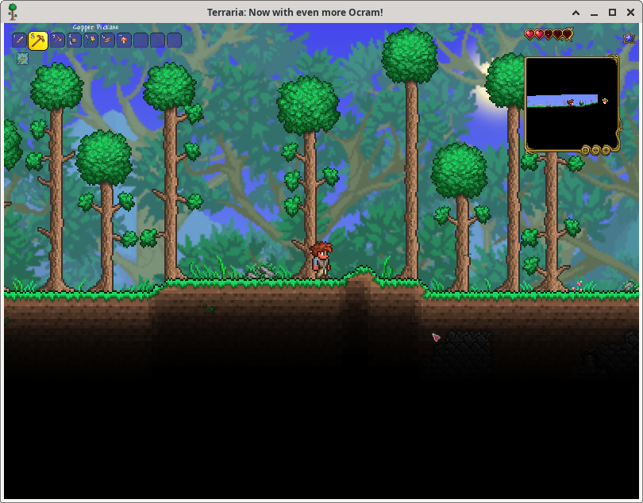

# Terraria

## Compatibility report

### Tested on

[Lichee Pi 4A](/docs/hardwares#lichee-pi-4a-soc-th1520)

### Box64 version (commit)

Box64 [ptitSeb/box64@69f49f79](https://github.com/ptitSeb/box64/tree/69f49f79)

### Game screenshot




### Game running log


```shell
[BOX64] Dynarec for rv64g_xtheadba_xtheadbb_xtheadbs_xtheadmempair_xtheadcondmov_xtheadmemidx_xthvector
[BOX64] Running on unknown riscv64 cpu with 4 cores, pagesize: 4096
[BOX64] Will use hardware counter measured at 3.0 MHz emulating 3.0 GHz
[BOX64] Box64 with Dynarec v0.3.3 49cba432 built on Feb 19 2025 13:36:05
[BOX64] Didn't detect 48bits of address space, considering it's 39bits
[BOX64] Counted 40 Env var
[BOX64] BOX64 LIB PATH: 
[BOX64] BOX64 BIN PATH: ./:bin/:/usr/bin/:/bin/:/usr/local/bin/:/home/debian/Desktop/environment/wine-10.1-amd64-wow64/bin/:/home/debian/Desktop/environment/gl4es-master/lib/
[BOX64] Looking for start.sh
[BOX64] Not an ELF file (sign=#!/b)
[BOX64] Error: Reading elf header of /home/debian/GOG Games/Terraria/start.sh, Try to launch using bash instead
[BOX64] Dynarec for rv64g_xtheadba_xtheadbb_xtheadbs_xtheadmempair_xtheadcondmov_xtheadmemidx_xthvector
[BOX64] Running on unknown riscv64 cpu with 4 cores, pagesize: 4096
[BOX64] Will use hardware counter measured at 3.0 MHz emulating 3.0 GHz
[BOX64] Box64 with Dynarec v0.3.3 49cba432 built on Feb 19 2025 13:36:05
[BOX64] Didn't detect 48bits of address space, considering it's 39bits
[BOX64] Counted 40 Env var
[BOX64] BOX64 LIB PATH: 
[BOX64] BOX64 BIN PATH: ./:bin/:/usr/bin/:/bin/:/usr/local/bin/:/home/debian/Desktop/environment/wine-10.1-amd64-wow64/bin/:/home/debian/Desktop/environment/gl4es-master/lib/
[BOX64] Looking for /usr/local/bin/box64-bash
[BOX64] Bash detected, disabling banner
[BOX64] Warning, of_unconvert(...) left over 0x8000, converted 0x8000
Running Terraria
[BOX64] Dynarec for rv64g_xtheadba_xtheadbb_xtheadbs_xtheadmempair_xtheadcondmov_xtheadmemidx_xthvector
[BOX64] Running on unknown riscv64 cpu with 4 cores, pagesize: 4096
[BOX64] Will use hardware counter measured at 3.0 MHz emulating 3.0 GHz
[BOX64] Box64 with Dynarec v0.3.3 49cba432 built on Feb 19 2025 13:36:05
[BOX64] Didn't detect 48bits of address space, considering it's 39bits
[BOX64] Counted 40 Env var
[BOX64] BOX64 LIB PATH: 
[BOX64] BOX64 BIN PATH: ./:bin/:/usr/bin/:/bin/:/usr/local/bin/:/home/debian/Desktop/environment/wine-10.1-amd64-wow64/bin/:/home/debian/Desktop/environment/gl4es-master/lib/
[BOX64] Looking for /usr/local/bin/box64-bash
[BOX64] Bash detected, disabling banner
[BOX64] Warning, of_unconvert(...) left over 0x8000, converted 0x8000
[BOX64] Dynarec for rv64g_xtheadba_xtheadbb_xtheadbs_xtheadmempair_xtheadcondmov_xtheadmemidx_xthvector
[BOX64] Running on unknown riscv64 cpu with 4 cores, pagesize: 4096
[BOX64] Will use hardware counter measured at 3.0 MHz emulating 3.0 GHz
[BOX64] Box64 with Dynarec v0.3.3 49cba432 built on Feb 19 2025 13:36:05
[BOX64] Didn't detect 48bits of address space, considering it's 39bits
[BOX64] Counted 41 Env var
[BOX64] BOX64 LIB PATH: 
[BOX64] BOX64 BIN PATH: ./:bin/:/usr/bin/:/bin/:/usr/local/bin/:/home/debian/Desktop/environment/wine-10.1-amd64-wow64/bin/:/home/debian/Desktop/environment/gl4es-master/lib/
[BOX64] Looking for ./Terraria.bin.x86_64
[BOX64] Rename process to "Terraria.bin.x86_64"
[BOX64] Using native(wrapped) libm.so.6
[BOX64] Using native(wrapped) librt.so.1
[BOX64] Using native(wrapped) libdl.so.2
[BOX64] Using native(wrapped) libpthread.so.0
[BOX64] Using emulated /usr/lib/box64-x86_64-linux-gnu/libgcc_s.so.1
[BOX64] Using native(wrapped) libc.so.6
[BOX64] Using native(wrapped) ld-linux-x86-64.so.2
[BOX64] Using native(wrapped) libutil.so.1
[BOX64] Using native(wrapped) libbsd.so.0
[BOX64] Error loading needed lib data-0x3fa4356010.so
[BOX64] Warning: Cannot dlopen("data-0x3fa4356010.so"/0x67075810, 101)
Error Logging Enabled.
[BOX64] Error loading needed lib data-0x3f9fef0010.so
[BOX64] Warning: Cannot dlopen("data-0x3f9fef0010.so"/0x671a3a40, 101)
[BOX64] Using native(wrapped) libSDL2-2.0.so.0
[BOX64] Using emulated /home/debian/GOG Games/Terraria/game/lib64/libFNA3D.so.0
[BOX64] Using native(wrapped) libFAudio.so.0
[BOX64] Using native(wrapped) libGL.so.1
FNA3D Driver: OpenGL
OpenGL Renderer: PowerVR B-Series BXM-4-64
OpenGL Driver: OpenGL ES 3.2 build 1.17@6210866
OpenGL Vendor: Imagination Technologies
1891.076396 (3801) PVR:(Error): GetRenderableInternalFormatInfoEntry: Unsupported renderable internal format 33777 [ fbo.c:388 ]
1891.076588 (3801) PVR:(Error): GetRenderableInternalFormatInfoEntry: Unsupported renderable internal format 33778 [ fbo.c:388 ]
1891.076655 (3801) PVR:(Error): GetRenderableInternalFormatInfoEntry: Unsupported renderable internal format 33779 [ fbo.c:388 ]
1891.076716 (3801) PVR:(Error): GetRenderableInternalFormatInfoEntry: Unsupported renderable internal format 33324 [ fbo.c:388 ]
1891.076766 (3801) PVR:(Error): GetRenderableInternalFormatInfoEntry: Unsupported renderable internal format 32859 [ fbo.c:388 ]
1891.076815 (3801) PVR:(Error): GetRenderableInternalFormatInfoEntry: Unsupported renderable internal format 6406 [ fbo.c:388 ]
MojoShader Profile: glsles
Resolution changed to: 1024x768.
[BOX64] Error loading needed lib data-0x3f9c635a70.so
[BOX64] Warning: Cannot dlopen("data-0x3f9c635a70.so"/0x3f9c618a50, 101)
[BOX64] Error loading needed lib nfd
[BOX64] Warning: Cannot dlopen("nfd"/0x3f4c099de0, 101)
[BOX64] Using emulated /home/debian/GOG Games/Terraria/game/lib64/libnfd.so
[BOX64] Error loading needed lib user32.dll
[BOX64] Warning: Cannot dlopen("user32.dll"/0x3f4c463b70, 101)
[BOX64] Error loading needed lib libuser32.dll.so
[BOX64] Warning: Cannot dlopen("libuser32.dll.so"/0x3f4c463b70, 101)
[BOX64] Error loading needed lib libuser32.dll.so
[BOX64] Warning: Cannot dlopen("libuser32.dll.so"/0x3f4c463b70, 101)
[BOX64] Error loading needed lib user32.dll
[BOX64] Warning: Cannot dlopen("user32.dll"/0x3f4c463370, 101)
[BOX64] Error loading needed lib user32
[BOX64] Warning: Cannot dlopen("user32"/0x3f4c463d30, 101)
[BOX64] Error loading needed lib libuser32.so
[BOX64] Warning: Cannot dlopen("libuser32.so"/0x3f4c463d30, 101)
[BOX64] Error loading needed lib libuser32.so
[BOX64] Warning: Cannot dlopen("libuser32.so"/0x3f4c463d30, 101)
[BOX64] Error loading needed lib user32
[BOX64] Warning: Cannot dlopen("user32"/0x3f4c463370, 101)
[BOX64] Error loading needed lib libuser32.dll
[BOX64] Warning: Cannot dlopen("libuser32.dll"/0x3f4c217840, 101)
[BOX64] Error loading needed lib libuser32.dll.so
[BOX64] Warning: Cannot dlopen("libuser32.dll.so"/0x3f4c217840, 101)
[BOX64] Error loading needed lib libuser32.dll.so
[BOX64] Warning: Cannot dlopen("libuser32.dll.so"/0x3f4c217840, 101)
[BOX64] Error loading needed lib libuser32.dll
[BOX64] Warning: Cannot dlopen("libuser32.dll"/0x3f4c463370, 101)
[BOX64] Error loading needed lib libMonoSupportW.so
[BOX64] Warning: Cannot dlopen("libMonoSupportW.so"/0x3f4c4123c0, 101)
[BOX64] Error loading needed lib libMonoSupportW.so
[BOX64] Warning: Cannot dlopen("libMonoSupportW.so"/0x3f4c4123c0, 101)
[BOX64] Error loading needed lib libMonoSupportW.so
[BOX64] Warning: Cannot dlopen("libMonoSupportW.so"/0x3f4c4123c0, 101)
[BOX64] Error loading needed lib libMonoSupportW.so
[BOX64] Warning: Cannot dlopen("libMonoSupportW.so"/0x3f4c463370, 101)
[BOX64] Error loading needed lib user32.dll
[BOX64] Warning: Cannot dlopen("user32.dll"/0x3f4c449e50, 101)
[BOX64] Error loading needed lib libuser32.dll.so
[BOX64] Warning: Cannot dlopen("libuser32.dll.so"/0x3f4c449e50, 101)
[BOX64] Error loading needed lib libuser32.dll.so
[BOX64] Warning: Cannot dlopen("libuser32.dll.so"/0x3f4c449e50, 101)
[BOX64] Error loading needed lib user32.dll
[BOX64] Warning: Cannot dlopen("user32.dll"/0x3f4c4123c0, 101)
[BOX64] Error loading needed lib user32
[BOX64] Warning: Cannot dlopen("user32"/0x3f4c674720, 101)
[BOX64] Error loading needed lib libuser32.so
[BOX64] Warning: Cannot dlopen("libuser32.so"/0x3f4c674720, 101)
[BOX64] Error loading needed lib libuser32.so
[BOX64] Warning: Cannot dlopen("libuser32.so"/0x3f4c674720, 101)
[BOX64] Error loading needed lib user32
[BOX64] Warning: Cannot dlopen("user32"/0x3f4c4123c0, 101)
[BOX64] Error loading needed lib libuser32.dll
[BOX64] Warning: Cannot dlopen("libuser32.dll"/0x3f4c69c100, 101)
[BOX64] Error loading needed lib libuser32.dll.so
[BOX64] Warning: Cannot dlopen("libuser32.dll.so"/0x3f4c69c100, 101)
[BOX64] Error loading needed lib libuser32.dll.so
[BOX64] Warning: Cannot dlopen("libuser32.dll.so"/0x3f4c69c100, 101)
[BOX64] Error loading needed lib libuser32.dll
[BOX64] Warning: Cannot dlopen("libuser32.dll"/0x3f4c4123c0, 101)
[BOX64] Error loading needed lib libMonoSupportW.so
[BOX64] Warning: Cannot dlopen("libMonoSupportW.so"/0x3f4c592c00, 101)
[BOX64] Error loading needed lib libMonoSupportW.so
[BOX64] Warning: Cannot dlopen("libMonoSupportW.so"/0x3f4c592c00, 101)
[BOX64] Error loading needed lib libMonoSupportW.so
[BOX64] Warning: Cannot dlopen("libMonoSupportW.so"/0x3f4c592c00, 101)
[BOX64] Error loading needed lib libMonoSupportW.so
[BOX64] Warning: Cannot dlopen("libMonoSupportW.so"/0x3f4c4123c0, 101)
[BOX64] Error loading needed lib data-0x3f4ca9b380.so
[BOX64] Warning: Cannot dlopen("data-0x3f4ca9b380.so"/0x3f4c1c2d80, 101)
[BOX64] Error loading needed lib data-0x3f4ce92c20.so
[BOX64] Warning: Cannot dlopen("data-0x3f4ce92c20.so"/0x3f4ceec0e0, 101)
[BOX64] Error loading needed lib data-0x3f0cece0f0.so
[BOX64] Warning: Cannot dlopen("data-0x3f0cece0f0.so"/0x3f4c46d140, 101)
[BOX64] Using native(wrapped) libSDL2_image-2.0.so.0
[BOX64] Error loading needed lib steam_api
[BOX64] Warning: Cannot dlopen("steam_api"/0x3f4d0783e0, 101)
[BOX64] Error loading needed lib libsteam_api.so
[BOX64] Warning: Cannot dlopen("libsteam_api.so"/0x3f4d0783e0, 101)
[BOX64] Error loading needed lib libsteam_api.so
[BOX64] Warning: Cannot dlopen("libsteam_api.so"/0x3f4d0783e0, 101)
[BOX64] Error loading needed lib steam_api
[BOX64] Warning: Cannot dlopen("steam_api"/0x3f4d078060, 101)
[BOX64] Error loading needed lib libsteam_api
[BOX64] Warning: Cannot dlopen("libsteam_api"/0x3f4c0d8690, 101)
[BOX64] Error loading needed lib libsteam_api.so
[BOX64] Warning: Cannot dlopen("libsteam_api.so"/0x3f4c0d8690, 101)
[BOX64] Error loading needed lib libsteam_api.so
[BOX64] Warning: Cannot dlopen("libsteam_api.so"/0x3f4c0d8690, 101)
[BOX64] Error loading needed lib libsteam_api
[BOX64] Warning: Cannot dlopen("libsteam_api"/0x3f4d078060, 101)
[BOX64] Error loading needed lib data-0x3f4c98a7c0.so
[BOX64] Warning: Cannot dlopen("data-0x3f4c98a7c0.so"/0x3f4dd5f150, 101)
[BOX64] Error loading needed lib data-0x3f4c2fed40.so
[BOX64] Warning: Cannot dlopen("data-0x3f4c2fed40.so"/0x3f4c19b150, 101)
[BOX64] Error loading needed lib User32
[BOX64] Warning: Cannot dlopen("User32"/0x3eeed638e0, 101)
[BOX64] Error loading needed lib libUser32.so
[BOX64] Warning: Cannot dlopen("libUser32.so"/0x3eeed638e0, 101)
[BOX64] Error loading needed lib libUser32.so
[BOX64] Warning: Cannot dlopen("libUser32.so"/0x3eeed638e0, 101)
[BOX64] Error loading needed lib User32
[BOX64] Warning: Cannot dlopen("User32"/0x3f8517c050, 101)
[BOX64] Error loading needed lib libUser32
[BOX64] Warning: Cannot dlopen("libUser32"/0x3eeed6c880, 101)
[BOX64] Error loading needed lib libUser32.so
[BOX64] Warning: Cannot dlopen("libUser32.so"/0x3eeed6c880, 101)
[BOX64] Error loading needed lib libUser32.so
[BOX64] Warning: Cannot dlopen("libUser32.so"/0x3eeed6c880, 101)
[BOX64] Error loading needed lib libUser32
[BOX64] Warning: Cannot dlopen("libUser32"/0x3f8517c050, 101)
[BOX64] Error loading needed lib libMonoSupportW.so
[BOX64] Warning: Cannot dlopen("libMonoSupportW.so"/0x3eeed8ab50, 101)
[BOX64] Error loading needed lib libMonoSupportW.so
[BOX64] Warning: Cannot dlopen("libMonoSupportW.so"/0x3eeed8ab50, 101)
[BOX64] Error loading needed lib libMonoSupportW.so
[BOX64] Warning: Cannot dlopen("libMonoSupportW.so"/0x3eeed8ab50, 101)
[BOX64] Error loading needed lib libMonoSupportW.so
[BOX64] Warning: Cannot dlopen("libMonoSupportW.so"/0x3f8517c050, 101)
[BOX64] Error loading needed lib User32
[BOX64] Warning: Cannot dlopen("User32"/0x3eeed92180, 101)
[BOX64] Error loading needed lib libUser32.so
[BOX64] Warning: Cannot dlopen("libUser32.so"/0x3eeed92180, 101)
[BOX64] Error loading needed lib libUser32.so
[BOX64] Warning: Cannot dlopen("libUser32.so"/0x3eeed92180, 101)
[BOX64] Error loading needed lib User32
[BOX64] Warning: Cannot dlopen("User32"/0x3eeed84c50, 101)
[BOX64] Error loading needed lib libUser32
[BOX64] Warning: Cannot dlopen("libUser32"/0x3eeed6f680, 101)
[BOX64] Error loading needed lib libUser32.so
[BOX64] Warning: Cannot dlopen("libUser32.so"/0x3eeed6f680, 101)
[BOX64] Error loading needed lib libUser32.so
[BOX64] Warning: Cannot dlopen("libUser32.so"/0x3eeed6f680, 101)
[BOX64] Error loading needed lib libUser32
[BOX64] Warning: Cannot dlopen("libUser32"/0x3eeed84c50, 101)
[BOX64] Error loading needed lib libMonoSupportW.so
[BOX64] Warning: Cannot dlopen("libMonoSupportW.so"/0x3eeed59180, 101)
[BOX64] Error loading needed lib libMonoSupportW.so
[BOX64] Warning: Cannot dlopen("libMonoSupportW.so"/0x3eeed59180, 101)
[BOX64] Error loading needed lib libMonoSupportW.so
[BOX64] Warning: Cannot dlopen("libMonoSupportW.so"/0x3eeed59180, 101)
[BOX64] Error loading needed lib libMonoSupportW.so
[BOX64] Warning: Cannot dlopen("libMonoSupportW.so"/0x3eeed84c50, 101)
[BOX64] Error loading needed lib User32
[BOX64] Warning: Cannot dlopen("User32"/0x3eeed56090, 101)
[BOX64] Error loading needed lib libUser32.so
[BOX64] Warning: Cannot dlopen("libUser32.so"/0x3eeed56090, 101)
[BOX64] Error loading needed lib libUser32.so
[BOX64] Warning: Cannot dlopen("libUser32.so"/0x3eeed56090, 101)
[BOX64] Error loading needed lib User32
[BOX64] Warning: Cannot dlopen("User32"/0x3eeeda6c50, 101)
[BOX64] Error loading needed lib libUser32
[BOX64] Warning: Cannot dlopen("libUser32"/0x3eeeda74f0, 101)
[BOX64] Error loading needed lib libUser32.so
[BOX64] Warning: Cannot dlopen("libUser32.so"/0x3eeeda74f0, 101)
[BOX64] Error loading needed lib libUser32.so
[BOX64] Warning: Cannot dlopen("libUser32.so"/0x3eeeda74f0, 101)
[BOX64] Error loading needed lib libUser32
[BOX64] Warning: Cannot dlopen("libUser32"/0x3eeeda6c50, 101)
[BOX64] Error loading needed lib libMonoSupportW.so
[BOX64] Warning: Cannot dlopen("libMonoSupportW.so"/0x3eeedbb9e0, 101)
[BOX64] Error loading needed lib libMonoSupportW.so
[BOX64] Warning: Cannot dlopen("libMonoSupportW.so"/0x3eeedbb9e0, 101)
[BOX64] Error loading needed lib libMonoSupportW.so
[BOX64] Warning: Cannot dlopen("libMonoSupportW.so"/0x3eeedbb9e0, 101)
[BOX64] Error loading needed lib libMonoSupportW.so
[BOX64] Warning: Cannot dlopen("libMonoSupportW.so"/0x3eeeda6c50, 101)

```

### Rendering methods

```shell
 OpenGL ES
```

[Read more: What is OpenGL ES? »](/docs/faq#what-is-opengl-es)

### Extra information

[Official Game Website](https://www.terraria.org/)

[Steam](https://store.steampowered.com/app/105600/Terraria/)

[PCGameWiki](https://www.pcgamingwiki.com/wiki/Terraria)

### Advanced Tips

> TBD
