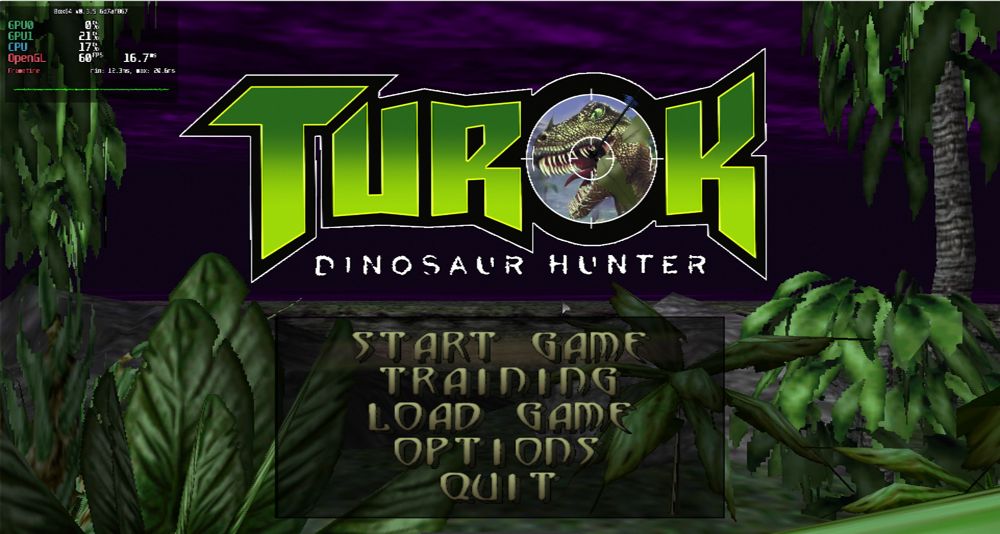
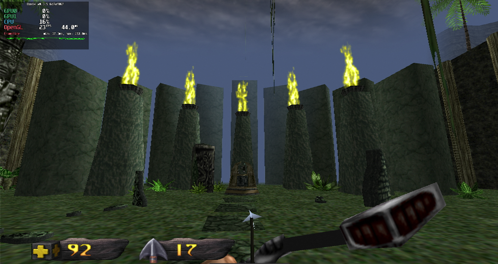
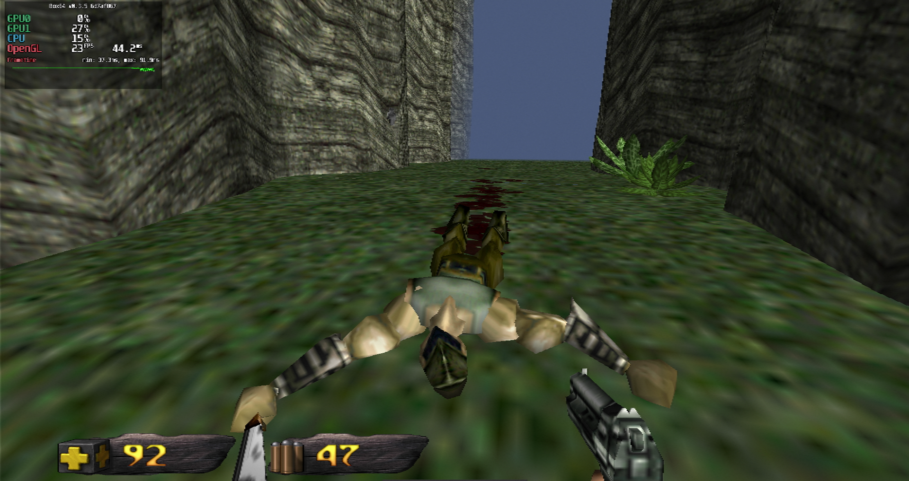

# Turok

## Compatibility report

### Tested on

[Milk-V Jupiter](/docs/hardwares#milk-v-jupiter-soc-spacemit-m1)
 with AMD Radeon RX 550

### Box64 version (commit)

Box64 [ptitSeb/box64@6d7af867](https://github.com/ptitSeb/box64/tree/6d7af867)

### Game screenshot





### Game running log

```shell
[BOX64] Box64 with Dynarec v0.3.5 6d7af867 built on Apr  6 2025 20:28:41
[BOX64] Dynarec for rv64gv_zba_zbb_zbc_zbs_zvl256
[BOX64] Running on Spacemit(R) X60 with 8 cores, pagesize: 4096
[BOX64] Will use hardware counter measured at 24.0 MHz emulating 3.0 GHz
[BOX64] Using bash "/home/rurumuri/ourstorybegin/box64/tests/box64-bash"
[BOX64] Didn't detect 48bits of address space, considering it's 39bits
[BOX64] Counted 49 Env var
[BOX64] BOX64 trying to Preload /usr/local/$LIB/mangohud/libMangoHud_shim.so 
[BOX64] Library search path: 
[BOX64] Binary search path: ./:bin/:/home/rurumuri/ourstorybegin/wine/wine-10.3-amd64-wow64/bin/:/home/rurumuri/ourstorybegin/wine/wine-10.3-amd64-wow64/bin/:/usr/local/bin/:/usr/bin/:/bin/:/usr/local/sbin/:/usr/lib/jvm/default/bin/:/usr/bin/site_perl/:/usr/bin/vendor_perl/:/usr/bin/core_perl/:/usr/lib/rustup/bin/
[BOX64] Looking for ./start.sh
[BOX64] BOX64ENV: Variables overridden via env and/or RC file:
        BOX64_BASH=/home/rurumuri/ourstorybegin/box64/tests/box64-bash
[BOX64] Not an ELF file (sign=#!/b)
[BOX64] Error: Reading elf header of /home/rurumuri/GOG Games/Turok/start.sh, Try to launch using bash instead
[BOX64] Box64 with Dynarec v0.3.5 6d7af867 built on Apr  6 2025 20:28:41
[BOX64] Dynarec for rv64gv_zba_zbb_zbc_zbs_zvl256
[BOX64] Running on Spacemit(R) X60 with 8 cores, pagesize: 4096
[BOX64] Will use hardware counter measured at 24.0 MHz emulating 3.0 GHz
[BOX64] Using bash "/home/rurumuri/ourstorybegin/box64/tests/box64-bash"
[BOX64] Didn't detect 48bits of address space, considering it's 39bits
[BOX64] Counted 49 Env var
[BOX64] BOX64 trying to Preload /usr/local/$LIB/mangohud/libMangoHud_shim.so 
[BOX64] Library search path: 
[BOX64] Binary search path: ./:bin/:/home/rurumuri/ourstorybegin/wine/wine-10.3-amd64-wow64/bin/:/home/rurumuri/ourstorybegin/wine/wine-10.3-amd64-wow64/bin/:/usr/local/bin/:/usr/bin/:/bin/:/usr/local/sbin/:/usr/lib/jvm/default/bin/:/usr/bin/site_perl/:/usr/bin/vendor_perl/:/usr/bin/core_perl/:/usr/lib/rustup/bin/
[BOX64] Looking for /home/rurumuri/ourstorybegin/box64/tests/box64-bash
[BOX64] Bash detected, disabling banner
[BOX64] BOX64ENV: Variables overridden via env and/or RC file:
        BOX64_BASH=/home/rurumuri/ourstorybegin/box64/tests/box64-bash
[BOX64] argv[1]="./start.sh"
[BOX64] Rename process to "box64-bash"
[BOX64] Warning, cannot pre-load /usr/local/$LIB/mangohud/libMangoHud_shim.so
[BOX64] Using native(wrapped) libtinfo.so.6
[BOX64] Using native(wrapped) libdl.so.2
[BOX64] Using native(wrapped) libc.so.6
[BOX64] Using native(wrapped) ld-linux-x86-64.so.2
[BOX64] Using native(wrapped) libpthread.so.0
[BOX64] Using native(wrapped) libutil.so.1
[BOX64] Using native(wrapped) librt.so.1
[BOX64] Using native(wrapped) libbsd.so.0
[BOX64] Warning, of_unconvert(...) left over 0x8000, converted 0x8000
Running Turok
[BOX64] Box64 with Dynarec v0.3.5 6d7af867 built on Apr  6 2025 20:28:41
[BOX64] Dynarec for rv64gv_zba_zbb_zbc_zbs_zvl256
[BOX64] Running on Spacemit(R) X60 with 8 cores, pagesize: 4096
[BOX64] Will use hardware counter measured at 24.0 MHz emulating 3.0 GHz
[BOX64] Using bash "/home/rurumuri/ourstorybegin/box64/tests/box64-bash"
[BOX64] Didn't detect 48bits of address space, considering it's 39bits
[BOX64] Counted 50 Env var
[BOX64] BOX64 trying to Preload /usr/local/$LIB/mangohud/libMangoHud_shim.so 
[BOX64] Library search path: 
[BOX64] Binary search path: ./:bin/:/home/rurumuri/ourstorybegin/wine/wine-10.3-amd64-wow64/bin/:/home/rurumuri/ourstorybegin/wine/wine-10.3-amd64-wow64/bin/:/usr/local/bin/:/usr/bin/:/bin/:/usr/local/sbin/:/usr/lib/jvm/default/bin/:/usr/bin/site_perl/:/usr/bin/vendor_perl/:/usr/bin/core_perl/:/usr/lib/rustup/bin/
[BOX64] Looking for ./TurokEx
[BOX64] BOX64ENV: Variables overridden via env and/or RC file:
        BOX64_BASH=/home/rurumuri/ourstorybegin/box64/tests/box64-bash
[BOX64] Rename process to "TurokEx"
[BOX64] Warning, cannot pre-load /usr/local/$LIB/mangohud/libMangoHud_shim.so
[BOX64] Using native(wrapped) libpthread.so.0
[BOX64] Using native(wrapped) libopenal.so.1
[BOX64] Using native(wrapped) libz.so.1
[BOX64] Using native(wrapped) libSDL2-2.0.so.0
[BOX64] Using native(wrapped) libdl.so.2
[BOX64] Using native(wrapped) libm.so.6
[BOX64] Using native(wrapped) librt.so.1
[BOX64] Using emulated /home/rurumuri/ourstorybegin/box64/x64lib/libstdc++.so.6
[BOX64] Using emulated /home/rurumuri/ourstorybegin/box64/x64lib/libgcc_s.so.1
[BOX64] Using native(wrapped) libc.so.6
[BOX64] Using native(wrapped) ld-linux-x86-64.so.2
[BOX64] Using native(wrapped) libutil.so.1
[BOX64] Using native(wrapped) libbsd.so.0
[03/15/2025 13:54:23] SDL Initialized
[2025-04-15 13:54:24.019] [MANGOHUD] [error] [cpu.cpp:552] Could not find cpu temp sensor location
[03/15/2025 13:54:24] Cvar System Initialized
[03/15/2025 13:54:24] Runtime Object Initialized
[03/15/2025 13:54:24] File System Initialized
[03/15/2025 13:54:24] Warning: config.cfg not found
[03/15/2025 13:54:24] kexPakFileLocal::LoadZipFile: Loading /home/rurumuri/GOG Games/Turok/game//game.kpf
[03/15/2025 13:54:25] Cvar_Set: variable snd_samplerate not found
[03/15/2025 13:54:25] Cvar_Set: variable snd_maxslicetime_ms not found
[03/15/2025 13:54:25] Cvar_Set: variable fixedtime not found
[03/15/2025 13:54:25] Cvar_Set: variable r_finish not found
[03/15/2025 13:54:25] Input Initialized
[03/15/2025 13:54:25] Max Worker Threads: 4
[03/15/2025 13:54:25] Max Logical CPU Cores: 8
[03/15/2025 13:54:25] Parallel Job Manager Initialized
[03/15/2025 13:54:25] Sound System Initialized (OpenAL Soft)
[03/15/2025 13:54:26] Available video displays: 1
[03/15/2025 13:54:26] Display monitor: U27N3R 27"
[03/15/2025 13:54:26] Video Initialized
[03/15/2025 13:54:26] Initializing Rendering Hardware Interface
[BOX64] Using native(wrapped) libGL.so.1
[03/15/2025 13:54:26] GL_VENDOR: AMD
[03/15/2025 13:54:26] GL_RENDERER: AMD Radeon RX 550 Series (radeonsi, polaris11, LLVM 19.1.7, DRM 3.49, 6.1.15+)
[03/15/2025 13:54:26] GL_VERSION: 4.6 (Core Profile) Mesa 24.3.4-arch1.1
[03/15/2025 13:54:26] GL_MAX_TEXTURE_SIZE: 16384
[03/15/2025 13:54:26] GL_MAX_TEXTURE_UNITS_ARB: 8
[03/15/2025 13:54:26] GL_MAX_COLOR_ATTACHMENTS: 8
[03/15/2025 13:54:26] GL_MAX_UNIFORM_BUFFER_BINDINGS: 90
[03/15/2025 13:54:26] GL_MAX_UNIFORM_BLOCK_SIZE: 1073741824
[03/15/2025 13:54:26] GL_MAX_VERTEX_UNIFORM_BLOCKS: 15
[03/15/2025 13:54:26] GL_MAX_FRAGMENT_UNIFORM_BLOCKS: 15
[03/15/2025 13:54:26] GL_MAX_GEOMETRY_UNIFORM_BLOCKS: 15
[03/15/2025 13:54:26] GL_MAX_SAMPLES: 8
[03/15/2025 13:54:26] GL_MAX_TEXTURE_BUFFER_SIZE: 268435455
[03/15/2025 13:54:26] GL_MAX_ARRAY_TEXTURE_LAYERS: 2048
[03/15/2025 13:54:26] GL_ARB_timer_query = 0
[03/15/2025 13:54:26] GL_ARB_uniform_buffer_object = 0
[03/15/2025 13:54:26] GL_ARB_occlusion_query = 0
[03/15/2025 13:54:26] GL_NVX_gpu_memory_info = 0
[03/15/2025 13:54:26] GL_ATI_meminfo = 0
[03/15/2025 13:54:26] Cvar_Set: variable r_finish not found
[03/15/2025 13:54:26] OpenGL Initialized
[03/15/2025 13:54:26] GL_SHADING_LANGUAGE_VERSION: 4.60
libpng warning: iCCP: known incorrect sRGB profile
libpng warning: iCCP: known incorrect sRGB profile
[03/15/2025 13:54:28] Running game session
libpng warning: iCCP: known incorrect sRGB profile
[03/15/2025 13:54:56] Initilizing script system
[03/15/2025 13:54:56] Compiling core module...
[03/15/2025 13:55:06] Script System Initialized
libpng warning: iCCP: known incorrect sRGB profile
libpng warning: Interlace handling should be turned on when using png_read_image
libpng warning: iCCP: known incorrect sRGB profile
libpng warning: iCCP: known incorrect sRGB profile
libpng warning: iCCP: known incorrect sRGB profile
libpng warning: iCCP: known incorrect sRGB profile
```

### Rendering methods

```shell
OpenGL
```

### Extra information

[Steam](https://store.steampowered.com/app/405820/Turok/)

[PCGameWiki](https://www.pcgamingwiki.com/wiki/Turok:_Dinosaur_Hunter)

### Advanced Tips

> TBD