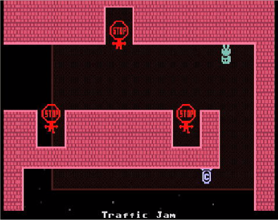

# VVVVVV

## Compatibility report

### Tested on

[Lichee Pi 4A](/docs/hardwares#lichee-pi-4a-soc-th1520)

### Box64 version (commit)

Box64 [ptitSeb/box64@69f49f79](https://github.com/ptitSeb/box64/tree/69f49f79)

### Game screenshot



### Game running log

```shell
[BOX64] Dynarec for rv64g_xtheadba_xtheadbb_xtheadbs_xtheadmempair_xtheadcondmov_xtheadmemidx_xthvector
[BOX64] Running on unknown riscv64 cpu with 4 cores, pagesize: 4096
[BOX64] Will use hardware counter measured at 3.0 MHz emulating 3.0 GHz
[BOX64] Using bash "/home/sipeed/ourstorybegin/box64/box64_/tests/box64-bash"
[BOX64] Box64 with Dynarec v0.3.3 69f49f79 built on Feb  6 2025 13:52:28
[BOX64] Didn't detect 48bits of address space, considering it's 39bits
[BOX64] Counted 41 Env var
[BOX64] BOX64 LIB PATH: 
[BOX64] BOX64 BIN PATH: ./:bin/:/home/sipeed/ourstorybegin/wine/wine-9.22-amd64-wow64/bin/:/usr/local/bin/:/usr/bin/:/bin/:/usr/local/games/:/usr/games/
[BOX64] Looking for ./start.sh
[BOX64] BOX64ENV: Variables overridden via env and/or RC file:
        BOX64_BASH=/home/sipeed/ourstorybegin/box64/box64_/tests/box64-bash
[BOX64] Not an ELF file (sign=#!/b)
[BOX64] Error: Reading elf header of /home/sipeed/games/GOG Games/VVVVVV/start.sh, Try to launch using bash instead
[BOX64] Dynarec for rv64g_xtheadba_xtheadbb_xtheadbs_xtheadmempair_xtheadcondmov_xtheadmemidx_xthvector
[BOX64] Running on unknown riscv64 cpu with 4 cores, pagesize: 4096
[BOX64] Will use hardware counter measured at 3.0 MHz emulating 3.0 GHz
[BOX64] Using bash "/home/sipeed/ourstorybegin/box64/box64_/tests/box64-bash"
[BOX64] Box64 with Dynarec v0.3.3 69f49f79 built on Feb  6 2025 13:52:28
[BOX64] Didn't detect 48bits of address space, considering it's 39bits
[BOX64] Counted 41 Env var
[BOX64] BOX64 LIB PATH: 
[BOX64] BOX64 BIN PATH: ./:bin/:/home/sipeed/ourstorybegin/wine/wine-9.22-amd64-wow64/bin/:/usr/local/bin/:/usr/bin/:/bin/:/usr/local/games/:/usr/games/
[BOX64] Looking for /home/sipeed/ourstorybegin/box64/box64_/tests/box64-bash
[BOX64] Bash detected, disabling banner
[BOX64] BOX64ENV: Variables overridden via env and/or RC file:
        BOX64_BASH=/home/sipeed/ourstorybegin/box64/box64_/tests/box64-bash
[BOX64] argv[1]="./start.sh"
[BOX64] Rename process to "box64-bash"
[BOX64] Using native(wrapped) libtinfo.so.6
[BOX64] Using native(wrapped) libdl.so.2
[BOX64] Using native(wrapped) libc.so.6
[BOX64] Using native(wrapped) ld-linux-x86-64.so.2
[BOX64] Using native(wrapped) libpthread.so.0
[BOX64] Using native(wrapped) libutil.so.1
[BOX64] Using native(wrapped) librt.so.1
[BOX64] Using native(wrapped) libbsd.so.0
[BOX64] Warning, of_unconvert(...) left over 0x8000, converted 0x8000
Running VVVVVV
[BOX64] Dynarec for rv64g_xtheadba_xtheadbb_xtheadbs_xtheadmempair_xtheadcondmov_xtheadmemidx_xthvector
[BOX64] Running on unknown riscv64 cpu with 4 cores, pagesize: 4096
[BOX64] Will use hardware counter measured at 3.0 MHz emulating 3.0 GHz
[BOX64] Using bash "/home/sipeed/ourstorybegin/box64/box64_/tests/box64-bash"
[BOX64] Box64 with Dynarec v0.3.3 69f49f79 built on Feb  6 2025 13:52:28
[BOX64] Didn't detect 48bits of address space, considering it's 39bits
[BOX64] Counted 41 Env var
[BOX64] BOX64 LIB PATH: 
[BOX64] BOX64 BIN PATH: ./:bin/:/home/sipeed/ourstorybegin/wine/wine-9.22-amd64-wow64/bin/:/usr/local/bin/:/usr/bin/:/bin/:/usr/local/games/:/usr/games/
[BOX64] Looking for ./VVVVVV
[BOX64] BOX64ENV: Variables overridden via env and/or RC file:
        BOX64_BASH=/home/sipeed/ourstorybegin/box64/box64_/tests/box64-bash
[BOX64] Rename process to "VVVVVV"
[BOX64] Using native(wrapped) libSDL2-2.0.so.0
[BOX64] Using native(wrapped) libdl.so.2
[BOX64] Using native(wrapped) libm.so.6
[BOX64] Using native(wrapped) librt.so.1
[BOX64] Using native(wrapped) libpthread.so.0
[BOX64] Error initializing native libSDL2_mixer-2.0.so.0 (last dlerror is libSDL2_mixer-2.0.so.0: cannot open shared object file: No such file or directory)
[BOX64] Using emulated /home/sipeed/games/GOG Games/VVVVVV/game/lib64/libSDL2_mixer-2.0.so.0
[BOX64] Using emulated /usr/lib/box64-x86_64-linux-gnu/libstdc++.so.6
[BOX64] Using emulated /usr/lib/box64-x86_64-linux-gnu/libgcc_s.so.1
[BOX64] Using native(wrapped) libc.so.6
[BOX64] Using native(wrapped) ld-linux-x86-64.so.2
[BOX64] Using native(wrapped) libutil.so.1
[BOX64] Using native(wrapped) libbsd.so.0
Base directory: /home/sipeed/.local/share/VVVVVV/
Save directory: /home/sipeed/.local/share/VVVVVV/saves/
Level directory: /home/sipeed/.local/share/VVVVVV/levels/
gamecontrollerdb.txt not found!
[BOX64] Error loading needed lib libsteam_api.so
[BOX64] Warning: Cannot dlopen("libsteam_api.so"/0x5fc914, 0)
libsteam_api.so not found!


                       VVVVVV


                  8888888888888888  
                88888888888888888888
                888888    8888    88
                888888    8888    88
                88888888888888888888
                88888888888888888888
                888888            88
                88888888        8888
                  8888888888888888  
                      88888888      
                  8888888888888888  
                88888888888888888888
                88888888888888888888
                88888888888888888888
                8888  88888888  8888
                8888  88888888  8888
                    888888888888    
                    8888    8888    
                  888888    888888  
                  888888    888888  
                  888888    888888  


Quick Save Not Found
Teleporter Save Not Found
Unable to open file mmmmmm.vvv
The complete reloaded file size: 61651755
data/music/0levelcomplete.ogg unpacked
data/music/1pushingonwards.ogg unpacked
data/music/2positiveforce.ogg unpacked
data/music/3potentialforanything.ogg unpacked
data/music/4passionforexploring.ogg unpacked
data/music/5intermission.ogg unpacked
data/music/6presentingvvvvvv.ogg unpacked
data/music/7gamecomplete.ogg unpacked
data/music/8predestinedfate.ogg unpacked
data/music/9positiveforcereversed.ogg unpacked
data/music/10popularpotpourri.ogg unpacked
data/music/11pipedream.ogg unpacked
data/music/12pressurecooker.ogg unpacked
data/music/13pacedenergy.ogg unpacked
data/music/14piercingthesky.ogg unpacked
data/music/predestinedfatefinallevel.ogg unpacked
[BOX64] Using native(wrapped) libvorbisfile.so.3
[BOX64] Warning, of_unconvert(...) left over 0x8000, converted 0x8001
[BOX64] Warning, of_unconvert(...) left over 0x8000, converted 0x8001
```

### Rendering methods

```shell
OpenGL ES
```

[Read more: What is OpenGL ES? »](/docs/faq#what-is-opengl-es)

### Extra information

[Game source code](https://github.com/TerryCavanagh/VVVVVV)

[Steam](https://store.steampowered.com/app/70300/VVVVVV/)

[PCGameWiki](https://www.pcgamingwiki.com/wiki/VVVVVV)

### Advanced Tips

> TBD
