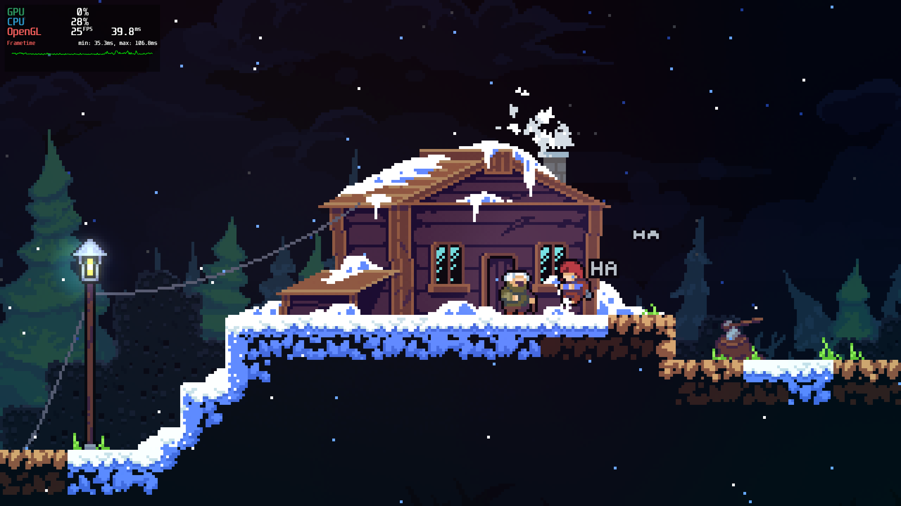

# Celeste on Milk-V Jupiter

## Requirements
- Hardware: [Milk-V Jupiter](/docs/hardwares#milk-v-jupiter-soc-spacemit-m1)
- Grab the game (https://www.celestegame.com/).

## Install Box64
Follow the steps at [Install Box64](/docs/box64).

## Launch Celeste
You can launch Celeste directly by double-clicking the executable, or run it via the shell if you prefer:

```shell
cd Game/Celeste
box64 ./Celeste.bin.x86_64
# or
./Celeste.bin.x86_64 # binfmt will automatically invoke Box64
```

[Read more: Why does binfmt automatically invoke Box64? »](/docs/faq#why-does-binfmt-automatically-invoke-box64)

## Monitor Game Performance with MangoHud

### Install MangoHud

Follow the steps at [Install Mangohud](/docs/mangohud).

### Using MangoHud

```shell
mangohud --dlsym ./Celeste.bin.x86_64
```


