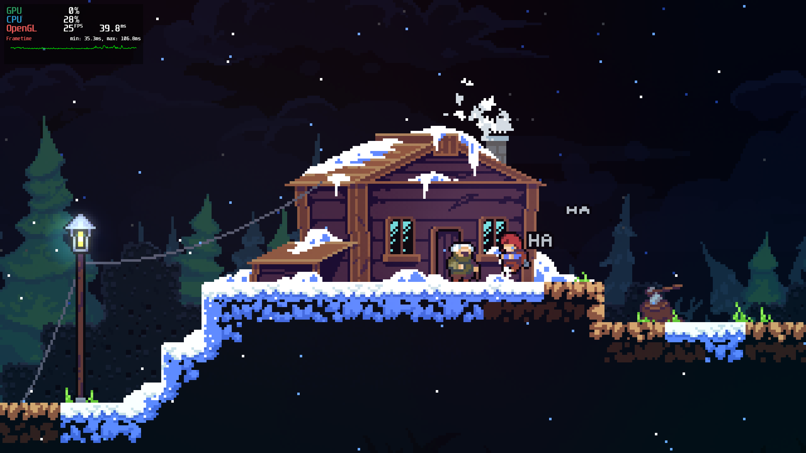

# Celeste on Milk-V Jupiter [Linux] – Quick Start

## Requirements
- A Milk-V Jupiter board (SoC: SPACEMIT M1, 16GB LPDDR4X). This guide uses Bianbu 2.0.4 riscv64.
- A 400W ATX power supply or another supported power source with at least 20W.
- An HDMI monitor (1920x1080 recommended).
- A keyboard and mouse.
- Network access to GitHub and the official repository at https://archive.spacemit.com/.
- An official Celeste installation package from (https://www.celestegame.com/).

```shell
➜  ~ neofetch
       #####             sydg@Milk-V-M1--Jupiter
      #######            -----------------------
      ##O#O##            OS: Bianbu 2.0.4 riscv64
      #######            Host: Milk-V(M1) Jupiter
    ###########          Kernel: 6.6.36
   #############         Uptime: 35 mins
  ###############        Packages: 2202 (dpkg)
  ################       Shell: zsh 5.9
 #################       Resolution: 1536x864
###################      Theme: Flat-Remix-GTK-Light-Solid [GTK3]
###################      Icons: Flat-Remix-Green-Dark [GTK3]
 #################       Terminal: /dev/pts/1
                         CPU: Spacemit X60 (8) @ 1.600GHz
                         Memory: 1040MiB / 15886MiB
```

## Install Box64
Follow the steps at [Install Box64](/docs/box64).

## Download and Launch Celeste from Official Sources
You can launch Celeste directly by double-clicking the executable, or run it via the shell if you prefer:

```shell
cd Game/Celeste
box64 ./Celeste.bin.x86_64
# or
./Celeste.bin.x86_64 # binfmt will automatically invoke Box64
```

[Read more: Why does binfmt automatically invoke Box64? »](/docs/faq#why-does-binfmt-automatically-invoke-box64)

## Monitor Game Performance with MangoHud

### Install MangoHud

Follow the steps at [Install Mangohud](/docs/mangohud).

### Using MangoHud

```shell
mangohud --dlsym ./Celeste.bin.x86_64
```


