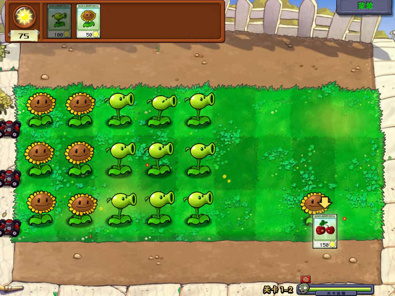

# Plants Vs. Zombies on Lichee Pi 4A

## Requirements
- Hardware: [Lichee Pi 4A](/docs/hardwares#lichee-pi-4a-soc-th1520)
- Grab the game (https://www.ea.com/zh-cn/games/plants-vs-zombies/plants-vs-zombies).

## Install Box64
Follow the steps at [Install Box64](/docs/box64).

## Install wine-wow64
Follow the steps at [Install Wine WOW64](/docs/wow64).

## Plants Vs. Zombies
Run it via the shell:

```shell
cd Game/Plants Vs. Zombies
box64 wine ./PlantsVsZombies.exe
# or
wine ./PlantsVsZombies.exe # binfmt will automatically invoke Box64
```

[Read more: Why does binfmt automatically invoke Box64? »](/docs/faq#why-does-binfmt-automatically-invoke-box64)


